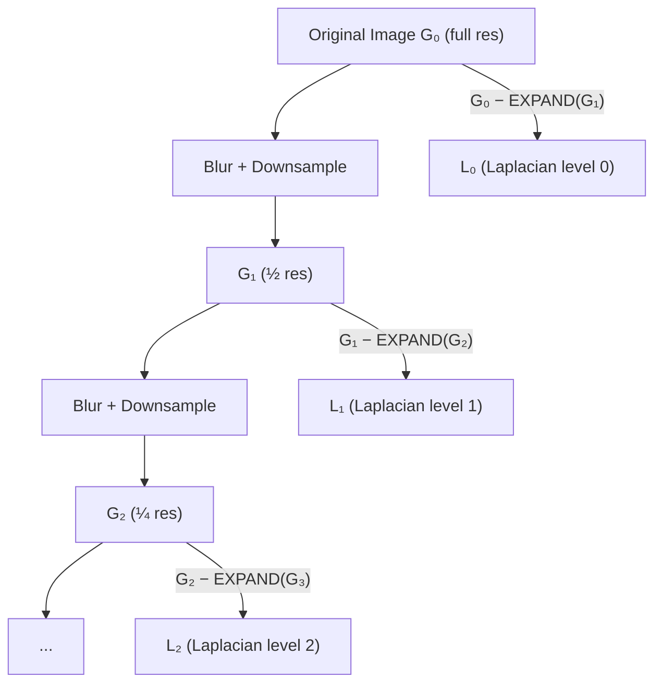

# Image Processing: Filtering, Edges, Frequency, and Pyramids

> **Last Updated:** June 2026
> **Level:** Foundational
> **Related Sections:** [Feature Engineering](./03_feature_engineering.md) · [Image Formation](./01_image_formation.md) · [CV Overview](./00_overview.md) · [Classical Geometry](./04_classical_geometry.md)

---

## Overview

Image processing encompasses the family of operations that transform a discrete 2D signal — the raw pixel array — into a form more amenable to higher-level analysis. These operations range from noise suppression (Gaussian smoothing) and structural enhancement (sharpening, equalization) to structural detection (edge detection) and multi-scale representation (pyramids). Understanding them at the level of linear systems theory, frequency-domain analysis, and discrete mathematics is essential for interpreting what modern deep networks implicitly learn: the first layers of convolutional networks reproduce Gabor-like filters, Sobel-like edge detectors, and center-surround patterns that classical image processing derived analytically.

The mathematical backbone of classical image processing is **linear systems theory**, specifically the convolution theorem. A linear, shift-invariant (LSI) system is fully characterised by its **impulse response** (in the spatial domain) or equivalently its **transfer function** (in the frequency domain). This duality is exploited in all frequency-domain methods: Gaussian smoothing is low-pass filtering; edge detection is high-pass filtering; Laplacian of Gaussian (LoG) is a band-pass operator. The frequency domain also explains *why* aliasing occurs, *why* you must smooth before subsampling (the Nyquist constraint), and *why* gradient operators amplify noise.

Beyond linear filtering, the field includes nonlinear operations — median filtering for salt-and-pepper noise, morphological operators for binary structure analysis, histogram operations for global intensity normalisation — and multi-scale representations (Gaussian and Laplacian pyramids, wavelets) that serve as the conceptual precursors to the feature pyramid networks and multi-scale attention mechanisms in modern deep architectures.

---

## Convolution and Linear Filtering

### Continuous and Discrete Convolution

The 2D continuous convolution of an image $f$ with a kernel $h$ is:

```latex
(f * h)(x, y) = \int_{-\infty}^{\infty} \int_{-\infty}^{\infty} f(u, v) \, h(x - u, y - v) \, du \, dv
```

In the discrete setting (pixel arrays), this becomes:

```latex
(I * k)[i, j] = \sum_{m=-M}^{M} \sum_{n=-N}^{N} I[i - m, \, j - n] \cdot k[m, n]
```

where $k$ is a $(2M+1) \times (2N+1)$ filter kernel. Correlation (cross-correlation) differs only in that the kernel is *not* flipped; many frameworks (e.g., PyTorch `F.conv2d`) implement correlation and call it convolution — a common source of confusion.

### Gaussian Filter

The Gaussian kernel is the canonical low-pass filter, uniquely characterised by the property that it is simultaneously optimal in space and frequency (Heisenberg uncertainty minimum):

```latex
G_\sigma(x, y) = \frac{1}{2\pi\sigma^2} \exp\!\left(-\frac{x^2 + y^2}{2\sigma^2}\right)
```

Key properties:
- **Separable**: $G_\sigma(x,y) = G_\sigma(x) \cdot G_\sigma(y)$, so 2D convolution reduces to two 1D passes — $O(k)$ rather than $O(k^2)$ per pixel.
- **Cascade property**: $G_{\sigma_1} * G_{\sigma_2} = G_{\sqrt{\sigma_1^2 + \sigma_2^2}}$
- **Scale-space axioms** (Lindeberg 1994): the Gaussian is the unique kernel satisfying causality, isotropy, linearity, and semi-group property.

Discrete approximation: a $5 \times 5$ kernel for $\sigma = 1$ is often given as:

```latex
\frac{1}{273}
\begin{pmatrix}
1 & 4  & 7  & 4  & 1 \\
4 & 16 & 26 & 16 & 4 \\
7 & 26 & 41 & 26 & 7 \\
4 & 16 & 26 & 16 & 4 \\
1 & 4  & 7  & 4  & 1
\end{pmatrix}
```

### Derivative Filters

First-order derivative approximations detect gradients. The **Sobel** operator uses $3 \times 3$ kernels that simultaneously differentiate and smooth:

```latex
\mathbf{S}_x = \begin{pmatrix}
-1 & 0 & 1 \\
-2 & 0 & 2 \\
-1 & 0 & 1
\end{pmatrix}, \quad
\mathbf{S}_y = \begin{pmatrix}
-1 & -2 & -1 \\
 0 &  0 &  0 \\
 1 &  2 &  1
\end{pmatrix}
```

Gradient magnitude and direction are then:

```latex
|\nabla I| = \sqrt{(I * S_x)^2 + (I * S_y)^2}, \quad
\theta = \arctan\!\left(\frac{I * S_y}{I * S_x}\right)
```

The **Prewitt** operator uses weights of $\pm 1$ (no central weighting), making it slightly noisier than Sobel. The **Laplacian** $\nabla^2 I = \frac{\partial^2 I}{\partial x^2} + \frac{\partial^2 I}{\partial y^2}$ detects second-order intensity changes and is approximated by:

```latex
\nabla^2 \approx \begin{pmatrix}
0 & 1 & 0 \\ 1 & -4 & 1 \\ 0 & 1 & 0
\end{pmatrix}
```

---

## Edge Detection: Canny Algorithm

The **Canny edge detector** (John Canny, IEEE PAMI, 1986) remains the benchmark classical edge detector, derived from three optimality criteria:
1. **Good detection**: minimise false positives and false negatives.
2. **Good localisation**: detected edge positions should be as close as possible to true edges.
3. **Single response**: one response per edge (suppress streaking).

### Algorithm Steps

```
1. Gaussian smoothing:     I_s = I * G_σ
2. Gradient computation:   G_x = I_s * S_x,  G_y = I_s * S_y
                           |G| = sqrt(Gx² + Gy²),  θ = atan2(Gy, Gx)
3. Non-maximum suppression: thin ridges by zeroing pixels not local maxima
                            in the gradient direction (interpolated)
4. Double thresholding:    strong edges: |G| > T_high
                           weak edges:   T_low < |G| ≤ T_high
                           suppressed:   |G| ≤ T_low
5. Edge tracking by hysteresis: retain weak edges connected to strong edges
```

The optimal 1D detector for a step edge under Gaussian noise is well-approximated by the first derivative of a Gaussian, explaining why pre-smoothing with $G_\sigma$ before differentiation is theoretically justified. The Canny detector's response to a step edge of width $\Delta$ in the presence of Gaussian noise $\sigma_n$ has SNR:

```latex
\text{SNR} = \frac{\Delta}{\sigma_n} \cdot \frac{\|h'\|}{\|h\|_2}
```

where $h$ is the smoothing kernel.

---

## Fourier/Frequency Domain Analysis

### 2D Discrete Fourier Transform

```latex
\hat{I}(u, v) = \sum_{m=0}^{M-1} \sum_{n=0}^{N-1} I(m, n) \, e^{-2\pi i (um/M + vn/N)}
```

Inverse transform:

```latex
I(m, n) = \frac{1}{MN} \sum_{u=0}^{M-1} \sum_{v=0}^{N-1} \hat{I}(u, v) \, e^{2\pi i (um/M + vn/N)}
```

### Convolution Theorem

The fundamental result linking spatial and frequency domains:

```latex
\mathcal{F}\{f * g\} = \mathcal{F}\{f\} \cdot \mathcal{F}\{g\}
```

Convolution in the spatial domain equals pointwise multiplication in the frequency domain — the basis of efficient filtering via FFT in $O(N^2 \log N)$ rather than $O(N^2 k^2)$ for large kernels.

### Filtering in the Frequency Domain

| Filter type | Effect | Frequency-domain mask |
|-------------|--------|----------------------|
| Gaussian | Smoothing (low-pass) | $H(u,v) = e^{-2\pi^2\sigma^2(u^2+v^2)}$ |
| Ideal high-pass | Edge enhancement | $H = 1 - H_{\text{LP}}$ |
| Band-pass | Texture extraction at scale | $H_{\sigma_1} - H_{\sigma_2}$ |
| Laplacian of Gaussian (LoG) | Blob/edge detection | $H = -(u^2+v^2)e^{-2\pi^2\sigma^2(u^2+v^2)}$ |

The **Difference of Gaussians (DoG)** is a computationally efficient approximation to the LoG:

```latex
\text{DoG}_\sigma = G_{k\sigma} - G_\sigma \approx (k-1)\sigma^2 \nabla^2 G_\sigma
```

This approximation, with $k \approx 1.6$ (the value Lowe used in SIFT), forms the basis of scale-space blob detection.

---

## Morphological Operations

Binary morphological operations treat the image as a set and apply set-theoretic operations using a structuring element $B$:

**Erosion** (shrinks foreground, removes small protrusions):
```latex
A \ominus B = \{z \mid B_z \subseteq A\}
```

**Dilation** (expands foreground, fills small holes):
```latex
A \oplus B = \{z \mid \hat{B}_z \cap A \neq \emptyset\}
```

**Opening** ($A \circ B = (A \ominus B) \oplus B$): erosion followed by dilation — removes small objects, smooths contours.

**Closing** ($A \bullet B = (A \oplus B) \ominus B$): dilation followed by erosion — fills holes, connects nearby objects.

**Morphological gradient** (detects edges in binary images):
```latex
\text{Gradient}(A) = (A \oplus B) - (A \ominus B)
```

Grayscale morphology replaces set operations with local min/max; the grayscale dilation computes the local maximum over the structuring element neighbourhood.

---

## Histogram Operations

### Histogram Equalization

Histogram equalisation redistributes pixel intensities to achieve a (approximately) uniform histogram, enhancing global contrast. For an 8-bit image with normalised histogram $p(k) = n_k / N$:

```latex
T(k) = \lfloor (L-1) \sum_{j=0}^{k} p(j) \rceil
```

where $L = 256$ and $T$ is the mapping function (the CDF of the histogram).

**CLAHE** (Contrast Limited Adaptive Histogram Equalization) applies equalisation locally to tiles and clips the histogram before equalization to prevent over-amplification of noise in near-uniform regions. It is standard in medical imaging (chest X-ray, retinal images) preprocessing.

### Histogram Normalisation for Matching

Colour histograms can serve as image descriptors for retrieval (Swain & Ballard, 1991, *histogram intersection* method); however, they are sensitive to illumination changes unless using HSV or normalised representations.

---

## Image Pyramids

### Gaussian Pyramid

The Gaussian pyramid $\{G_0, G_1, \ldots, G_N\}$ is constructed by alternating Gaussian blurring and downsampling (reduce operation):

```latex
G_{l+1}[i,j] = \sum_{m=-2}^{2}\sum_{n=-2}^{2} w[m,n] \, G_l[2i+m, \, 2j+n]
```

where $w$ is a separable binomial approximation to the Gaussian (Burt & Adelson, 1983). Each level halves the spatial resolution; the pyramid contains $O(4/3 \cdot N^2)$ total pixels — only 33% overhead.

### Laplacian Pyramid

The **Laplacian pyramid** (Burt & Adelson, IEEE Trans. Commun., 1983) encodes band-pass residuals:

```latex
L_l = G_l - \text{EXPAND}(G_{l+1})
```

where EXPAND upsamples $G_{l+1}$ by inserting zeros and convolving with $2w$. The Laplacian pyramid is a compact, overcomplete image representation with exact reconstruction: $G_0 = L_0 + \text{EXPAND}(L_1 + \text{EXPAND}(\cdots))$. Applications include image blending (seamless compositing), texture analysis, and compression.

### Scale Space

The continuous Gaussian scale-space $L(x, y; \sigma)$ satisfies the linear heat equation:

```latex
\frac{\partial L}{\partial \sigma^2} = \frac{1}{2}\nabla^2 L, \quad L(x,y;0) = I(x,y)
```

Lindeberg (1994) proved that under causality constraints (no new extrema created as scale increases), the Gaussian is the unique scale-space kernel. SIFT's keypoint detection operates directly in scale-space by finding extrema in the DoG pyramid.



---

## Interpolation

Image resampling (resizing, geometric warping) requires interpolating values at non-integer pixel locations. Common methods:

| Method | Kernel | Continuity | Notes |
|--------|--------|-----------|-------|
| Nearest neighbour | Box | $C^{-1}$ | Fastest; introduces blocking |
| Bilinear | Tent (hat) | $C^0$ | Smooth but blurry; standard default |
| Bicubic | Cubic B-spline | $C^1$ | Good quality; slight ringing |
| Lanczos | Windowed sinc | $C^1$ | Best quality; more expensive |

The bicubic kernel with parameter $a = -0.5$ (Keys, 1989):

```latex
W(x) = \begin{cases}
(a+2)|x|^3 - (a+3)|x|^2 + 1 & 0 \leq |x| < 1 \\
a|x|^3 - 5a|x|^2 + 8a|x| - 4a & 1 \leq |x| < 2 \\
0 & |x| \geq 2
\end{cases}
```

---

## Key Papers

| Paper | Authors | Year | Venue | Key Contribution |
|-------|---------|------|-------|-----------------|
| "A Computational Approach to Edge Detection" | J. Canny | 1986 | IEEE PAMI 8(6) | Three-criterion optimal edge detector; hysteresis thresholding |
| "The Laplacian Pyramid as a Compact Image Code" | P. J. Burt, E. H. Adelson | 1983 | IEEE Trans. Commun. | Multi-scale pyramid for compression and image blending |
| "A Multiresolution Spline with Application to Image Mosaics" | P. J. Burt, E. H. Adelson | 1983 | ACM Trans. Graphics | Laplacian pyramid blending; seamless mosaics |
| "Scale-Space Theory in Computer Vision" | T. Lindeberg | 1994 | Kluwer (book) | Axiomatic derivation of Gaussian scale-space |
| "Histogram Intersection for Object Recognition" | M. Swain, D. Ballard | 1991 | IJCV 7(1) | Color histogram matching for 3D object recognition |
| "Beyond a Gaussian Denoiser: Residual Learning of Deep CNN for Image Denoising" (DnCNN) | K. Zhang et al. | 2017 | IEEE TIP | State-of-the-art blind denoising via residual deep CNN |
| "BM3D: Image Denoising by Sparse 3D Transform-Domain Collaborative Filtering" | K. Dabov et al. | 2007 | IEEE TIP | Long-standing SOTA classical denoising algorithm |

---

## Benchmark Performance

| Method | BSD68 PSNR (σ=25) | BSD68 PSNR (σ=50) | Notes |
|--------|------------------|--------------------|-------|
| Gaussian filter | ~28 dB | ~25 dB | Baseline; blurs detail |
| BM3D (2007) | 31.73 dB | 29.05 dB | Long-standing classical SOTA |
| DnCNN (2017) | 31.73 dB | 29.22 dB | Matched BM3D at publication |
| FFDNet (2018) | 31.63 dB | 29.19 dB | Handles spatially varying noise |
| DRUNet (2021) | 31.91 dB | 29.48 dB | Plug-and-play prior |

PSNR = $10 \log_{10}(255^2 / \text{MSE})$. Numbers from published benchmarks; BSD68 is 68 natural images from the Berkeley Segmentation Dataset.

---

## Pros & Cons

| Technique | Pros | Cons |
|-----------|------|------|
| Gaussian filter | Theoretically optimal low-pass; separable; no ringing | Blurs edges; kernel size must be chosen |
| Median filter | Removes salt-and-pepper noise; edge-preserving | Nonlinear; slow for large windows; not LSI |
| Canny edge detector | Near-optimal detection/localisation; well-studied | Two thresholds require tuning; slow at scale |
| Histogram equalisation | Global contrast enhancement; simple | Can over-amplify noise; washes out local detail |
| Laplacian pyramid | Exact reconstruction; efficient blending | Overcomplete; not shift-invariant |
| Bilateral filter | Edge-preserving smoothing | Non-linear; $O(k^2)$ per pixel without acceleration |

---

## Open Problems & Research Gaps

- **Joint denoising and demosaicing.** In camera pipelines, noise must be removed before or during demosaicing; classical sequential approaches are suboptimal, and end-to-end learned ISP pipelines that handle the full chain are an active research area.
- **Texture vs. structure separation.** Reliably decomposing an image into geometric structure (edges, contours) and stochastic texture components at multiple scales remains difficult, especially for learned methods.
- **Efficient learned filtering.** Deep denoising networks outperform classical methods but are orders of magnitude slower; efficient architectures for edge/mobile deployment are needed.
- **Non-Gaussian and heavy-tailed noise.** Many real sensors (CMOS under very low light, SAR, medical ultrasound) produce non-Gaussian noise (Poisson, Rician, speckle); classical algorithms assume Gaussian and fail, and learned models trained on Gaussian noise generalise poorly.
- **Theoretical guarantees for learned operators.** Unlike classical filters whose properties are fully characterised analytically, learned convolutional layers lack similar theoretical guarantees on robustness, frequency response, or scale-space properties.
- **Morphological neural networks.** Differentiable morphological layers (dilation/erosion implemented as max/min pooling) remain underexplored compared to standard convolutions, despite theoretical advantages for shape analysis.
- **Pyramid structures in modern architectures.** Feature Pyramid Networks (Lin et al., 2017) and multi-scale attention in Swin Transformers echo classical pyramids; the formal connection between classical scale-space theory and these learned multi-scale representations is not fully established.

---

## Further Reading

- [Canny, J. (1986). A Computational Approach to Edge Detection. *IEEE PAMI*, 8(6), 679–698.](https://doi.org/10.1109/TPAMI.1986.4767851) — Original edge detection paper.
- [Burt, P. J. & Adelson, E. H. (1983). The Laplacian Pyramid as a Compact Image Code. *IEEE Trans. Commun.*, 31(4), 532–540.](https://doi.org/10.1109/TCOM.1983.1095851) — Foundational pyramid paper.
- [Gonzalez, R. C. & Woods, R. E. (2018). *Digital Image Processing*, 4th ed. Pearson.](https://www.pearson.com/en-us/subject-catalog/p/digital-image-processing/P200000003334) — Standard graduate textbook.
- [Lindeberg, T. (1994). *Scale-Space Theory in Computer Vision*. Kluwer.](https://www.springer.com/gp/book/9780792394570) — Rigorous scale-space axiomatic treatment.
- [Dabov, K. et al. (2007). Image Denoising by Sparse 3D Transform-Domain Collaborative Filtering. *IEEE TIP*, 16(8), 2080–2095.](https://doi.org/10.1109/TIP.2007.901238) — BM3D algorithm.
- [Szeliski, R. (2022). *Computer Vision: Algorithms and Applications*, Ch. 3.](https://szeliski.org/Book/) — Filtering and pyramids in the context of modern CV.
