# Computer Vision: A Comprehensive Historical Timeline

> **Last Updated:** June 2026
> **Level:** Foundational
> **Related Sections:** [Deep Learning Revolution](./02_deep_learning_revolution.md) | [CV Foundations Overview](../00_foundations/00_overview.md) | [CNN Architectures](../03_architectures/00_cnn_architectures.md) | [Foundation Model Era](./06_foundation_model_era.md)

---

## Overview

Computer vision as a scientific discipline spans nearly seven decades, evolving from hand-coded heuristics for interpreting line drawings to self-supervised foundation models that exhibit zero-shot generalisation across virtually every visual task. Understanding this trajectory is essential not merely as intellectual history but because architectural decisions, failure modes, and open research questions in 2026 are often best understood against the background of what was tried and abandoned — or tried, failed, and later revived with better inductive biases and more data.

The field's arc is punctuated by several phase transitions. The first, in the early 1960s–70s, established vision as a computational problem amenable to formal specification. The second, driven by David Marr's framework in 1982 and the subsequent proliferation of engineered feature detectors through the 1980s–2000s, produced a mature toolkit of hand-crafted representations — Canny edges, Hough transforms, SIFT, HOG — that plateaued around 2010. The third transition, inaugurated by AlexNet at ILSVRC 2012, placed convolutional neural networks at the centre of vision research and reduced benchmark error rates by factors that hand-crafted approaches had never achieved. The fourth transition, beginning roughly with the introduction of ViT in 2020 and accelerating through CLIP (2021), MAE (2022), SAM (2023), and the proliferation of vision-language-action (VLA) models from 2023 onward, has progressively dissolved the boundary between computer vision and natural language processing, giving rise to the foundation-model paradigm that now dominates industrial deployment and academic research alike.

This document provides a chronological narrative integrating milestone papers, conceptual inflection points, and benchmark results. Companion files cover individual eras in greater depth; references here use the [AuthorYear] convention with full citations in the Key Papers table below.

---

## The Prehistory and Perceptual Origins (1950s–1960s)

The intellectual roots of computer vision predate the field's naming. Frank Rosenblatt's Perceptron [Rosenblatt1958], introduced as a technical report at the Cornell Aeronautical Laboratory in 1957 and published formally in *Psychological Review* in 1958, proposed a biologically inspired model for pattern recognition based on weighted connections and threshold activation. Although the Perceptron addressed classification of simple patterns rather than natural images, it introduced the paradigm of learning from labelled examples that would dominate machine learning six decades later.

The first recognisably modern computer vision paper is Lawrence Roberts's 1963 MIT PhD thesis, *Machine Perception of Three-Dimensional Solids* [Roberts1963]. Roberts demonstrated that a program could recover the 3D structure of polyhedral objects from a single photograph by detecting edges, inferring corners, and matching against a database of known 3D object models. This *blocks-world* setting was deliberately constrained — objects were simple polyhedra under controlled lighting — but it established the representational vocabulary of edges, surfaces, and 3D inference that would persist.

The Summer Vision Project of 1966, proposed by Seymour Papert at the MIT AI Lab, famously assigned the problem of machine vision to a group of undergraduates as a summer exercise [Papert1966]. The project's ambition reflected an almost limitless optimism about the tractability of visual understanding. The students failed to solve it in a summer; many of the sub-problems they identified — segmentation, grouping, 3D inference — remain active research areas sixty years later.

---

## Computational Vision and the Age of Engineered Features (1970s–2000s)

The 1970s and early 1980s produced the first rigorous theoretical framework for understanding what computer vision was actually computing. David Marr's posthumously published monograph *Vision* [Marr1982] articulated the famous three-level decomposition — computational (what is being computed and why), algorithmic (how it is represented and what procedure achieves it), and implementational (how the algorithm is physically realised). Marr proposed a hierarchical processing pipeline moving from the primal sketch (edge and boundary detection), through the 2.5D sketch (viewer-centred surface orientation), to the full 3D object representation. This framework's influence on the field's self-understanding lasted for decades and continues to inform debates about what neural networks are computing.

The Hough transform, originally patented in 1962 by Paul Hough for detecting lines in bubble-chamber photographs and generalised by Duda and Hart [DudaHart1972], provided a robust method for detecting parameterised shapes in the presence of noise. John Canny's 1986 paper, *A Computational Approach to Edge Detection* [Canny1986], published in *IEEE Transactions on Pattern Analysis and Machine Intelligence* (Vol. 8, pp. 679–698), formalised the criteria for an optimal edge detector — good detection, good localisation, and a single response to a single edge — and produced the multi-scale gradient-based detector bearing his name that is still used as a preprocessing step in 2026.

The 1990s saw increasingly sophisticated feature representations. David Lowe's Scale-Invariant Feature Transform (SIFT) [Lowe2004], formalised in a 2004 *International Journal of Computer Vision* paper after a preliminary 1999 ICCV presentation, produced keypoint descriptors invariant to scale, rotation, and illumination changes by combining difference-of-Gaussian keypoint detection with gradient orientation histograms. SIFT enabled reliable feature matching across images with significant viewpoint and appearance variation and became the de facto standard for structure-from-motion and image retrieval pipelines.

Navneet Dalal and Bill Triggs introduced Histograms of Oriented Gradients (HOG) [DalalTriggs2005] at CVPR 2005, demonstrating that dense grids of local gradient orientation histograms substantially outperformed existing features for pedestrian detection when combined with a linear SVM classifier. HOG encoded mid-level texture information at a fixed scale without explicit feature localisation, making it complementary to SIFT's keypoint-centric design.

Paul Viola and Michael Jones' AdaBoost-based face detector [ViolaJones2001], presented at CVPR 2001, achieved real-time face detection by combining three ideas: an integral image for rapid computation of rectangular Haar-like features, AdaBoost for selecting discriminative features from thousands of candidates, and a cascade of increasingly complex classifiers that rejected non-face regions early. This was arguably the first real-time, high-accuracy detector for a natural-image category and found immediate commercial deployment in digital cameras.

The PASCAL Visual Object Classes (VOC) benchmark [Everingham2010], running from 2005 to 2012 and organised by Everingham, Van Gool, Williams, Winn, and Zisserman, provided the community with standardised datasets, evaluation protocols (mean average precision), and annual competition tracks. The benchmark grew from four classes in 2005 to twenty in 2007 and became the primary arena for comparing detectors through the DPM era. Pedro Felzenszwalb, Ross Girshick, David McAllester, and Deva Ramanan's Deformable Part Model (DPM) [Felzenszwalb2010], published in IEEE TPAMI in 2010, won VOC detection challenges in 2007, 2008, and 2009 by representing objects as mixtures of root and part filters connected by a spring-like spatial model trained with latent SVMs. DPM represented the pinnacle of hand-crafted feature pipelines.

---

## The Deep Learning Revolution (2012–2014)

On September 30, 2012, Alex Krizhevsky, Ilya Sutskever, and Geoffrey Hinton submitted a solution to the ILSVRC image classification challenge that achieved a top-5 error rate of 15.3%, compared to 26.2% for the second-place entry [Krizhevsky2012]. The gap was unprecedented in competitive machine learning benchmarks and immediately signalled a phase transition. AlexNet — as the architecture came to be known — combined GPU-parallel training of eight layers (five convolutional, three fully connected), ReLU activations to avoid vanishing gradients, dropout regularisation, and data augmentation. The paper was accepted at NeurIPS 2012 and has become one of the most cited papers in the history of computer science.

The years 2013–2014 saw rapid architectural refinement. Karen Simonyan and Andrew Zisserman's VGGNet [Simonyan2014], submitted as arXiv:1409.1556 and presented at ICLR 2015, showed that replacing large filters with stacks of 3×3 convolutions could increase depth to 16–19 layers while reducing parameters. GoogLeNet [Szegedy2015], the ILSVRC 2014 winner with a top-5 error of 6.67%, introduced the Inception module — parallel branches with 1×1, 3×3, and 5×5 convolutions — and demonstrated that depth could be increased efficiently through architectural redesign rather than simply adding layers.

---

## Detection and Segmentation Come of Age (2014–2017)

Ross Girshick's R-CNN [Girshick2014], presented at CVPR 2014, was the first method to apply deep convolutional features to region proposals, improving VOC 2012 mAP by over 30 percentage points relative to DPM. Girshick's Fast R-CNN (2015) inlined feature extraction into a shared backbone, and Shaoqing Ren, Kaiming He, Ross Girshick, and Jian Sun's Faster R-CNN [Ren2015], presented at NeurIPS 2015, replaced selective search with a learned Region Proposal Network (RPN) sharing the detection backbone, reducing proposal generation time from seconds to milliseconds.

Kaiming He, Xiangyu Zhang, Shaoqing Ren, and Jian Sun's Residual Networks [He2016], presented at CVPR 2016, addressed the degradation problem — deep networks trained with back-propagation performing worse than shallower counterparts — by introducing identity shortcut connections that allowed gradients to flow directly through layers. ResNet-152 achieved a top-5 error of 3.57% on ILSVRC 2015, and ensembles of residual networks won multiple tracks of that competition. ResNets became the default backbone for virtually every downstream vision task and remain widely deployed in 2026.

Jonathan Long, Evan Shelhamer, and Trevor Darrell's Fully Convolutional Networks (FCN) [LongShelhamer2015], presented at CVPR 2015, showed that classification CNNs could be converted to segmentation networks by replacing fully connected layers with convolutions and adding upsampling operations. Olaf Ronneberger, Philipp Fischer, and Thomas Brox's U-Net [Ronneberger2015], presented at MICCAI 2015, extended the FCN concept with skip connections between encoder and decoder, enabling precise localisation with limited training data; it became the dominant architecture in medical image segmentation. Joseph Redmon, Santosh Divvala, Ross Girshick, and Ali Farhadi's YOLO [Redmon2016], presented at CVPR 2016, reframed detection as a single regression problem solved by one pass through a network, achieving 45 fps at competitive accuracy.

Kaiming He, Georgia Gkioxari, Piotr Dollár, and Ross Girshick's Mask R-CNN [He2017], presented at ICCV 2017 (winning the Marr Prize), extended Faster R-CNN with a parallel mask prediction branch, achieving strong instance segmentation results on COCO with minimal additional computation.

---

## Generative Models and Self-Supervised Learning (2014–2020)

Ian Goodfellow, Jean Pouget-Abadie, Mehdi Mirza, Bing Xu, David Warde-Farley, Sherjil Ozair, Aaron Courville, and Yoshua Bengio introduced Generative Adversarial Networks [Goodfellow2014] at NeurIPS 2014 (Proceedings of the 27th NIPS Conference, Vol. 2, pp. 2672–2680). The adversarial minimax game between a generator and a discriminator provided a new framework for learning implicit generative models that avoided the blurriness of VAE-decoded images. DCGAN (2015), Pix2Pix [Isola2017] and CycleGAN [Zhu2017] (both ICCV/CVPR 2017) demonstrated conditional image synthesis and unpaired image-to-image translation. StyleGAN [Karras2019], presented at CVPR 2019, introduced a style-based generator with AdaIN-modulated intermediate latent space, producing photorealistic faces indistinguishable from photographs.

Jonathan Ho, Ajay Jain, and Pieter Abbeel's Denoising Diffusion Probabilistic Models (DDPM) [Ho2020], presented at NeurIPS 2020, established connections between diffusion processes and score matching, showing that a simple Gaussian noising-denoising procedure could produce image samples of quality competitive with GANs without adversarial training instability. Robin Rombach, Andreas Blattmann, Dominik Lorenz, Patrick Esser, and Björn Ommer's Latent Diffusion Models (LDMs) [Rombach2022], presented as an oral at CVPR 2022, moved the diffusion process into a compressed latent space via a pre-trained VQ-VAE encoder, dramatically reducing computational cost and enabling text-conditioned image synthesis at scale — this became *Stable Diffusion*, the first high-quality open-source text-to-image model.

---

## The Transformer Transition (2017–2022)

Ashish Vaswani, Noam Shazeer, Niki Parmar, Jakob Uszkoreit, Llion Jones, Aidan Gomez, Łukasz Kaiser, and Illia Polosukhin's Transformer [Vaswani2017], presented at NeurIPS 2017, introduced multi-head self-attention as the primary computational primitive for sequence modelling, replacing recurrent networks in NLP. Its application to vision was initially indirect (through BERT-inspired pre-training of image patch sequences), but Alexey Dosovitskiy and colleagues' ViT [Dosovitskiy2021], published as arXiv:2010.11929 (October 2020) and presented at ICLR 2021, showed that a pure Transformer applied to sequences of 16×16 image patches matched or exceeded CNNs when pre-trained on large datasets (JFT-300M).

Ze Liu, Yutong Lin, Yue Cao, Han Hu, Yixuan Wei, Zheng Zhang, Stephen Lin, and Baining Guo's Swin Transformer [Liu2021], presented at ICCV 2021 (Marr Prize winner), resolved ViT's lack of inductive biases for dense prediction by introducing hierarchical feature maps computed within shifted local windows — giving Transformers the same multi-scale processing that made CNNs effective for detection and segmentation.

Alec Radford, Jong Wook Kim, Chris Hallacy, and colleagues at OpenAI introduced CLIP [Radford2021] at ICML 2021, training image and text encoders jointly on 400 million web-scraped image–text pairs via a symmetric contrastive loss. The resulting representations support zero-shot image classification by comparing image embeddings with textual class descriptions, achieving competitive ImageNet accuracy without any task-specific fine-tuning. Kaiming He, Xinlei Chen, Saining Xie, Yanghao Li, Piotr Dollár, and Ross Girshick's MAE [He2022], presented at CVPR 2022, adapted the masked language modelling paradigm to vision by masking 75% of image patches and training a ViT encoder–decoder to reconstruct them, producing highly transferable features with minimal architectural complexity.

Mathilde Caron, Hugo Touvron, Ishan Misra, Hervé Jégou, Julien Mairal, Piotr Bojanowski, and Armand Joulin's DINO [Caron2021], presented at ICCV 2021, showed that self-supervised training of ViTs with a self-distillation objective (no labels, no contrastive negatives, just a student–teacher EMA scheme) produced features with explicit semantic segmentation structure emergent in the attention maps.

---

## Foundation Models and the 2023–2026 Paradigm

Alexander Kirillov, Eric Mintun, Nikhila Ravi, and colleagues at Meta AI introduced Segment Anything (SAM) [Kirillov2023], presented at ICCV 2023 (arXiv:2304.02643), along with the SA-1B dataset of over one billion segmentation masks. SAM's promptable architecture — accepting point, box, or mask prompts and returning valid segmentation masks — established the paradigm of task-agnostic visual foundation models.

DINOv2 [Oquab2023] (arXiv:2304.07193) scaled DINO-style self-supervised ViT training on a curated 142M-image dataset, producing features that serve as strong off-the-shelf backbones across depth estimation, segmentation, classification, and retrieval. Depth Anything [Yang2024], presented at CVPR 2024 (with V2 at NeurIPS 2024), combined 1.5M labelled depth images with 62M+ unlabelled images to produce a monocular depth foundation model.

The integration of vision with language at the level of large pretrained models (GPT-4V, Gemini 1.5, Claude 3) and the emergence of Vision-Language-Action (VLA) models such as Google DeepMind's RT-2 [Brohan2023] (July 2023) and Physical Intelligence's π0 represented the incorporation of robotic action as a modality, enabling generalised manipulation from natural language instructions. Google DeepMind's Genie [Bruce2024], introduced in March 2024, demonstrated a generative world model trained without action labels from internet videos at 11B parameters, spawning Genie 2 (December 2024) and Genie 3 (August 2025). NVIDIA's Cosmos (2025) and related projects pushed world-model capabilities toward physically accurate video prediction at scale.

By mid-2026, the dominant paradigm combines a large-scale pretrained vision encoder (typically ViT-based), a language decoder (typically an autoregressive LLM), and task-specific adaptation via instruction tuning or retrieval augmentation. Research frontiers include sample-efficient adaptation, compositionality, 3D scene understanding from monocular video, and physical simulation fidelity in generative world models.

---

## Mermaid Timeline

```mermaid
timeline
    title Computer Vision: Major Milestones
    section 1957–1969
        1957 : Rosenblatt Perceptron (Cornell Tech Report)
        1958 : Perceptron — Psychological Review paper
        1963 : Roberts Blocks World PhD thesis (MIT)
        1966 : MIT Summer Vision Project (Papert)
    section 1970s–1980s
        1972 : Hough Transform generalised (Duda & Hart)
        1980 : Fukushima Neocognitron
        1982 : Marr — Vision (MIT Press, posthumous)
        1986 : Canny Edge Detector — IEEE TPAMI
        1989 : LeCun ConvNet + backprop on MNIST
    section 1990s–2000s
        1998 : LeCun LeNet-5 — check reading system
        1999 : Lowe SIFT (preliminary ICCV)
        2001 : Viola-Jones Face Detector (CVPR)
        2004 : Lowe SIFT (IJCV full paper)
        2005 : Dalal & Triggs HOG (CVPR)
        2005 : PASCAL VOC challenge begins
    section 2010–2014
        2010 : Felzenszwalb DPM wins VOC (TPAMI)
        2012 : AlexNet — 15.3% top-5 ILSVRC (NeurIPS)
        2013 : Girshick R-CNN (CVPR 2014)
        2014 : GoogLeNet 6.67% top-5; Goodfellow GAN (NeurIPS)
        2014 : Simonyan VGGNet (arXiv)
    section 2015–2017
        2015 : ResNet 3.57% top-5 ILSVRC; Faster R-CNN (NeurIPS)
        2015 : FCN semantic segmentation (CVPR); U-Net (MICCAI)
        2016 : YOLO v1 — real-time detection (CVPR)
        2017 : Mask R-CNN ICCV Marr Prize; Vaswani Transformer (NeurIPS)
        2017 : pix2pix (CVPR); CycleGAN (ICCV)
    section 2018–2021
        2019 : StyleGAN (CVPR); EfficientNet (ICML)
        2020 : DDPM — diffusion models (NeurIPS); ViT arXiv Oct
        2021 : ViT (ICLR); CLIP (ICML); DINO (ICCV); Swin (ICCV Marr Prize)
        2021 : MAE (arXiv Nov → CVPR 2022)
    section 2022–2026
        2022 : Stable Diffusion / LDM (CVPR oral)
        2023 : SAM (ICCV); DINOv2 (arXiv); RT-2 VLA (Jul)
        2024 : Depth Anything (CVPR); Genie world model (Mar); GPT-4V widely deployed
        2025 : Genie 2 & 3; Cosmos; π0 robotics; SAM 2
        2026 : VLA foundation models; multimodal reasoning agents
```

---

## Key Papers

| Paper | Authors | Year | Venue | Key Contribution |
|---|---|---|---|---|
| The Perceptron: A Probabilistic Model | Frank Rosenblatt | 1958 | *Psychological Review* | First learning-based pattern recognition model; foundational neural network theory |
| Machine Perception of Three-Dimensional Solids | Lawrence Roberts | 1963 | MIT PhD Thesis | First 3D scene inference from 2D images; blocks-world paradigm |
| Vision | David Marr | 1982 | MIT Press (book) | Three-level framework (computational/algorithmic/implementational); primal sketch |
| A Computational Approach to Edge Detection | John Canny | 1986 | *IEEE TPAMI* 8:679–698 | Optimal edge detector criteria; Gaussian-smoothed gradient maxima with hysteresis |
| Rapid Object Detection Using a Boosted Cascade | Paul Viola & Michael Jones | 2001 | CVPR | Real-time face detection; integral images, AdaBoost cascades, Haar features |
| Distinctive Image Features from Scale-Invariant Keypoints | David Lowe | 2004 | *IJCV* 60(2):91–110 | SIFT keypoints and descriptors; scale/rotation/illumination invariance |
| Histograms of Oriented Gradients for Human Detection | Navneet Dalal & Bill Triggs | 2005 | CVPR | HOG descriptor for pedestrian detection; dense gradient orientation grids |
| Object Detection with Discriminatively Trained Part-Based Models | Felzenszwalb, Girshick, McAllester, Ramanan | 2010 | *IEEE TPAMI* | DPM: deformable part models with latent SVM; PASCAL VOC 2007–2009 winner |
| ImageNet Classification with Deep CNNs (AlexNet) | Krizhevsky, Sutskever, Hinton | 2012 | NeurIPS | GPU-trained deep CNN; 15.3% ILSVRC top-5 error; ReLU, dropout, data augmentation |
| Deep Residual Learning for Image Recognition (ResNet) | He, Zhang, Ren, Sun | 2016 | CVPR | Identity shortcut connections; 152-layer nets; 3.57% ILSVRC 2015 top-5 error |
| Generative Adversarial Nets | Goodfellow et al. | 2014 | NeurIPS | Adversarial minimax training of generator/discriminator; implicit generative modelling |
| Faster R-CNN | Ren, He, Girshick, Sun | 2015 | NeurIPS | Region Proposal Network integrated into detection backbone; end-to-end training |
| Attention Is All You Need | Vaswani et al. | 2017 | NeurIPS | Transformer: multi-head self-attention replaces recurrence; NLP backbone for LLMs |
| An Image is Worth 16×16 Words (ViT) | Dosovitskiy et al. | 2021 | ICLR | Pure Transformer on image patches; competes with CNNs at scale |
| Learning Transferable Visual Models from Natural Language (CLIP) | Radford et al. | 2021 | ICML | Contrastive image–text training on 400M pairs; zero-shot visual classification |
| Segment Anything (SAM) | Kirillov et al. | 2023 | ICCV | Promptable segmentation foundation model; SA-1B dataset with 1B+ masks |

---

## Impact & Limitations by Era

| Era | Peak Achievement | Fundamental Limitation |
|---|---|---|
| Perceptron / Early CV (1957–1969) | Formal learning model; 3D scene inference from line drawings | Only works on constrained, idealised scenes; no learned low-level features |
| Engineered Features (1970–2011) | Real-time face detection; reliable multi-scale feature matching | Brittle to domain shift; feature design requires expert knowledge; semantic gap |
| Deep CNN Supervised Era (2012–2017) | Sub-5% ImageNet top-5 error; real-time detection at high accuracy | Requires millions of labelled examples; limited generalisability across tasks |
| Transformer + SSL Era (2017–2022) | Strong zero-shot transfer; emergent segmentation structure in attention maps | Quadratic attention cost; requires large corpora; positional encoding fragile |
| Foundation Model Era (2023–2026) | Promptable segmentation; VLA robot control; generative world models | Hallucination and factual errors; high compute cost; 3D consistency not guaranteed |

---

## Open Problems & Research Gaps

- **Compositional generalisation**: Current vision models, including large VLMs, still fail systematically on novel combinations of known concepts (e.g., spatial relational reasoning in CLEVR-style evaluations), pointing to the absence of explicit compositional scene representations.
- **Data efficiency and few-shot adaptation**: Despite self-supervised pretraining, adapting foundation models to new domains (e.g., satellite imagery, endoscopy, electron microscopy) with fewer than 100 labelled examples remains unsolved at deployment quality.
- **3D scene consistency from monocular video**: Depth Anything and similar models produce per-frame depth but lack temporally consistent 3D representations, limiting applications in robotics and AR/VR.
- **Evaluation beyond closed-set benchmarks**: ImageNet, COCO, and PASCAL VOC measure accuracy on fixed label distributions; systematic evaluation of open-world recognition, out-of-distribution robustness, and failure modes under distribution shift is nascent.
- **Causal and physical understanding**: World models (Genie, Cosmos) simulate plausible visual dynamics but cannot reliably model counterfactuals or Newtonian mechanics, limiting their utility for physics-grounded prediction.
- **Ethical and societal dimensions**: Foundation models trained on web-scraped data inherit and amplify demographic biases; provenance, attribution, and copyright of training data remain legally and technically unresolved.
- **Grounding language in perception**: VLMs produce fluent descriptions of images but the representations linking language tokens to visual primitives are not well understood, raising questions about what "understanding" means in multimodal models.

---

## Further Reading

- [ImageNet Large Scale Visual Recognition Challenge (Russakovsky et al., 2015)](https://arxiv.org/abs/1409.0575) — canonical benchmark history through 2014
- [A Survey on Visual Transformer (Han et al., 2022)](https://arxiv.org/abs/2012.12556) — comprehensive review of ViT variants
- [Object Detection in 20 Years: A Survey (Zou et al., 2019)](https://arxiv.org/abs/1905.05055) — detection lineage from sliding window to Transformers
- [On the Opportunities and Risks of Foundation Models (Bommasani et al., 2022)](https://arxiv.org/abs/2108.07258) — Stanford CRFM report on foundation model implications
- [Thirty Years After Marr's Vision (Carandini, 2012)](https://www.researchgate.net/publication/273330363) — retrospective on Marr's framework from computational neuroscience
- [Segment Anything (Kirillov et al., 2023)](https://arxiv.org/abs/2304.02643) — SAM paper establishing the promptable foundation model paradigm
