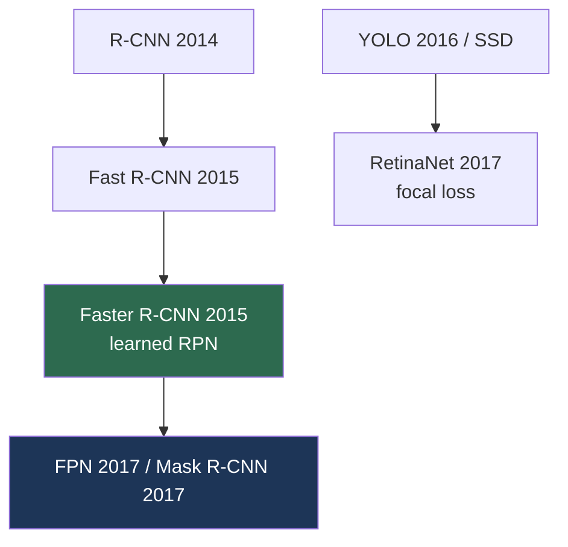

# The Detection & Segmentation Era (2013–2018)

> **Last Updated:** June 2026
> **Level:** Foundational
> **Related Sections:**
> - [Deep Learning Revolution](./02_deep_learning_revolution.md)
> - [Object Detection](../02_core_tasks/01_object_detection.md)
> - [Semantic Segmentation](../02_core_tasks/02_semantic_segmentation.md)
> - [Instance & Panoptic Segmentation](../02_core_tasks/03_instance_panoptic_segmentation.md)

---

## Overview

Once deep CNNs solved classification, the field's attention turned to *localization*: not just "what is in this image" but "what is where, and at what extent." This era—roughly 2013 to 2018—translated the representational power of CNN backbones into dense, spatially structured prediction, producing the detection and segmentation systems that underpin nearly every applied vision deployment today (autonomous driving, medical imaging, robotics perception). The intellectual arc moves from **region-proposal pipelines** (R-CNN's external proposals + CNN classification) toward **end-to-end learned detectors** (Faster R-CNN's learned region proposal network), and from coarse box prediction toward **pixel-precise masks** (FCN, U-Net, Mask R-CNN).

Two architectural tensions organized the period. The first is **two-stage versus one-stage detection**: two-stage methods (R-CNN lineage) propose-then-classify for accuracy; one-stage methods (YOLO, SSD, RetinaNet) predict directly for speed, with RetinaNet's focal loss closing much of the accuracy gap. The second is the **unification of segmentation tasks**: semantic segmentation (per-pixel class), instance segmentation (per-object mask), and panoptic segmentation (both) initially required distinct architectures, a fragmentation only resolved later by mask-classification transformers. This file narrates the lineage; the technical depth lives in [Object Detection](../02_core_tasks/01_object_detection.md), [Semantic Segmentation](../02_core_tasks/02_semantic_segmentation.md), and [Instance & Panoptic Segmentation](../02_core_tasks/03_instance_panoptic_segmentation.md).

---

## The Detection Lineage

**R-CNN** [Girshick2014] (CVPR 2014) applied a CNN to ~2000 selective-search region proposals per image—accurate but slow (each region forward-passed independently). **Fast R-CNN** [Girshick2015] (ICCV 2015) shared computation via RoI pooling over a single feature map. **Faster R-CNN** [Ren2015] (NeurIPS 2015) replaced selective search with a learned **Region Proposal Network (RPN)**, making detection nearly end-to-end and setting the two-stage template. **FPN** [Lin2017a] (CVPR 2017) added a feature pyramid for multi-scale detection.

In parallel, **one-stage** detectors prioritized speed: **YOLO** [Redmon2016] (CVPR 2016) framed detection as a single regression over a grid; **SSD** added multi-scale anchors. The accuracy gap was attributed to foreground-background class imbalance, which **RetinaNet** [Lin2017b] (ICCV 2017) addressed with **focal loss**:

```
FL(p_t) = -α_t (1 - p_t)^γ log(p_t)
# down-weights easy negatives (γ>0), focusing learning on hard examples
```

## The Segmentation Lineage

**FCN** [Long2015] (CVPR 2015) made segmentation fully convolutional, replacing FC layers with upsampling to produce dense per-pixel predictions. **U-Net** [Ronneberger2015] (MICCAI 2015) added symmetric encoder-decoder skip connections, becoming the dominant medical-imaging architecture (see [Medical Imaging](../08_medical_and_scientific_cv/00_medical_imaging.md)). The **DeepLab** family introduced atrous (dilated) convolutions and ASPP for multi-scale context. **Mask R-CNN** [He2017] (ICCV 2017) extended Faster R-CNN with a parallel mask head, unifying detection and instance segmentation in one model—the defining instance-segmentation system of the era.



---

## Key Papers

| Paper | Authors | Year | Venue | Key Contribution |
|-------|---------|------|-------|-----------------|
| R-CNN | Girshick, Donahue, Darrell, Malik | 2014 | CVPR | CNN features on region proposals |
| Faster R-CNN | Ren, He, Girshick, Sun | 2015 | NeurIPS | Learned RPN; near end-to-end two-stage |
| YOLO | Redmon, Divvala, Girshick, Farhadi | 2016 | CVPR | Real-time single-stage detection |
| RetinaNet (Focal Loss) | Lin, Goyal, Girshick, et al. | 2017 | ICCV | Focal loss closes one-stage accuracy gap |
| FCN | Long, Shelhamer, Darrell | 2015 | CVPR | Fully convolutional dense prediction |
| Mask R-CNN | He, Gkioxari, Dollár, Girshick | 2017 | ICCV | Unified detection + instance segmentation |

---

## Impact & Limitations

| Aspect | Impact | Limitation |
|--------|--------|------------|
| Two-stage detectors | High accuracy; applied standard | Slow; complex multi-stage training |
| One-stage detectors | Real-time deployment | Lower accuracy until focal loss |
| Dense segmentation | Pixel-precise perception | Heavy compute; boundary errors |
| Anchor-based design | Strong priors | Hyperparameter-sensitive; replaced by anchor-free/DETR later |

---

## Open Problems & Research Gaps (what this era left unsolved)

- **Hand-designed components.** NMS, anchors, and RoI operations are non-differentiable heuristics—removed only later by DETR's set prediction (see [Object Detection](../02_core_tasks/01_object_detection.md)).
- **Task fragmentation.** Semantic/instance/panoptic required separate models until mask-classification transformers unified them.
- **Closed vocabulary.** Detectors recognized only training classes; open-vocabulary detection came later (see [Open-Vocabulary Detection](../05_multimodal_vision_language/03_open_vocabulary_detection.md)).
- **Small-object and crowded-scene performance.** Persistent weak points despite FPN.
- **Annotation cost.** Dense mask labels are expensive, motivating promptable models like SAM.
- **Long-tail recognition.** Rare-class detection (LVIS) remained far behind common classes.

---

## Further Reading

- [Faster R-CNN (arXiv:1506.01497)](https://arxiv.org/abs/1506.01497) — region proposal networks
- [Mask R-CNN (arXiv:1703.06870)](https://arxiv.org/abs/1703.06870) — instance segmentation
- [Focal Loss / RetinaNet (arXiv:1708.02002)](https://arxiv.org/abs/1708.02002) — dense detection
- [FCN (arXiv:1411.4038)](https://arxiv.org/abs/1411.4038) — fully convolutional segmentation
- [U-Net (arXiv:1505.04597)](https://arxiv.org/abs/1505.04597) — biomedical segmentation
