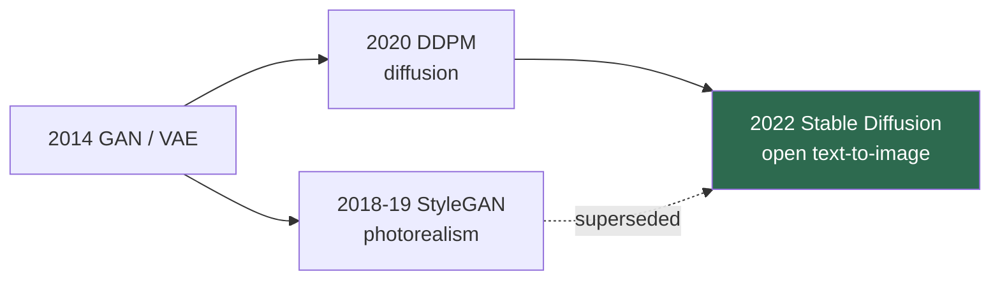

# The Generative Era (2014–2022)

> **Last Updated:** June 2026
> **Level:** Foundational
> **Related Sections:**
> - [Detection & Segmentation Era](./03_detection_segmentation_era.md)
> - [GANs & VAEs](../10_generative_vision/00_gans_and_vaes.md)
> - [Diffusion Models](../10_generative_vision/01_diffusion_models.md)
> - [Transformer Era](./05_transformer_era.md)

---

## Overview

The generative era runs from the 2014 invention of Generative Adversarial Networks to the 2022 mainstreaming of latent diffusion, and it reframed computer vision from a discriminative discipline (mapping images to labels) into a generative one (modeling and synthesizing the image distribution itself). This shift had profound consequences: generative models became both creative tools (text-to-image systems used by millions) and scientific instruments (learned priors for inverse problems, simulators for robot training, world models). The era is organized by a succession of generative paradigms—GANs, VAEs, autoregressive models, and diffusion—each trading off sample quality, diversity, training stability, and likelihood tractability differently.

The dominant narrative is the **rise and supersession of GANs**. From 2014 to ~2021, adversarial training produced the most photorealistic images (culminating in StyleGAN's near-perfect faces), but GANs were notoriously unstable to train and prone to mode collapse. Beginning with DDPM in 2020 and accelerating with Latent Diffusion in 2022, **diffusion models** overtook GANs by offering stable likelihood-based training, superior diversity and mode coverage, and natural conditioning—at the cost of slow iterative sampling. By 2022, Stable Diffusion's open release made high-quality text-to-image generation universally accessible, setting the stage for the foundation-model era. This file narrates the paradigm successions; technical depth lives in [GANs & VAEs](../10_generative_vision/00_gans_and_vaes.md) and [Diffusion Models](../10_generative_vision/01_diffusion_models.md).

---

## The GAN Lineage

**GANs** [Goodfellow2014] (NeurIPS 2014) framed generation as a minimax game between a generator `G` and discriminator `D`:

```
min_G max_D  E_{x~p_data}[log D(x)] + E_{z~p_z}[log(1 - D(G(z)))]
```

**DCGAN** stabilized this with convolutional architectures; **WGAN/WGAN-GP** improved stability via the Wasserstein distance; **Progressive GAN** and the **StyleGAN** family [Karras2019] produced unprecedented photorealism via a style-based generator with a disentangled latent space. **Conditional GANs** (pix2pix, CycleGAN) enabled paired and unpaired image-to-image translation. Yet training instability and mode collapse remained chronic.

## VAEs and Autoregressive Models

**VAEs** [Kingma2014] (ICLR 2014) offered a likelihood-based alternative, optimizing the evidence lower bound (ELBO):

```
L = E_q(z|x)[log p(x|z)] - D_KL(q(z|x) || p(z))
```

VAEs gave stable training and useful latent spaces but blurrier samples. **VQ-VAE/VQ-VAE-2** introduced discrete latents, and **VQGAN** combined them with adversarial and perceptual losses, enabling autoregressive transformers over image tokens—a bridge to the transformer era.

## The Diffusion Takeover

**DDPM** [Ho2020] (NeurIPS 2020) reframed generation as learning to reverse a gradual noising process, training a network to predict the added noise. **Latent Diffusion / Stable Diffusion** [Rombach2022] (CVPR 2022) moved diffusion into a compressed VAE latent space, drastically cutting compute and enabling high-resolution text-to-image synthesis. Its open release in 2022, alongside DALL·E 2 and Imagen, marked the moment generative vision became a mass technology.



---

## Key Papers

| Paper | Authors | Year | Venue | Key Contribution |
|-------|---------|------|-------|-----------------|
| GAN | Goodfellow, Pouget-Abadie, Mirza, et al. | 2014 | NeurIPS | Adversarial generative training |
| VAE | Kingma, Welling | 2014 | ICLR | Variational autoencoder; ELBO objective |
| StyleGAN | Karras, Laine, Aila | 2019 | CVPR | Style-based generator; photorealistic faces |
| DDPM | Ho, Jain, Abbeel | 2020 | NeurIPS | Denoising diffusion probabilistic models |
| Latent Diffusion (SD) | Rombach, Blattmann, Lorenz, et al. | 2022 | CVPR | Diffusion in VAE latent space; Stable Diffusion |
| VQGAN | Esser, Rombach, Ommer | 2021 | CVPR | Discrete tokens + transformer for image synthesis |

---

## Impact & Limitations

| Aspect | Impact | Limitation |
|--------|--------|------------|
| GANs | Photorealistic synthesis; image editing | Unstable training; mode collapse |
| VAEs | Stable, principled latents | Blurry samples |
| Diffusion | SOTA quality + diversity; controllable | Slow iterative sampling |
| Open release (SD) | Democratized generation | Misuse: deepfakes, copyright, bias |

---

## Open Problems & Research Gaps (what this era left unsolved)

- **Sampling speed.** Diffusion's iterative sampling motivated distillation and flow matching (see [Diffusion Models](../10_generative_vision/01_diffusion_models.md)).
- **Evaluation.** FID/IS imperfectly capture quality; faithful, compositional metrics remain open (see [Evaluation & Safety](../10_generative_vision/04_evaluation_and_safety.md)).
- **Controllability.** Precise spatial/structural control (ControlNet) was a later addition.
- **Safety and provenance.** Deepfakes, memorization, and copyright remain unresolved.
- **Compositional generation.** Binding attributes to objects correctly is still imperfect.
- **From images to world models.** Extending generation to physically consistent video/3D fed directly into the robotics frontier (see [World Models](../06_robotics_and_embodied_ai/02_world_models.md)).

---

## Further Reading

- [GAN (arXiv:1406.2661)](https://arxiv.org/abs/1406.2661) — generative adversarial networks
- [StyleGAN (arXiv:1812.04948)](https://arxiv.org/abs/1812.04948) — style-based generation
- [DDPM (arXiv:2006.11239)](https://arxiv.org/abs/2006.11239) — denoising diffusion
- [Latent Diffusion (arXiv:2112.10752)](https://arxiv.org/abs/2112.10752) — high-resolution synthesis
- [VAE (arXiv:1312.6114)](https://arxiv.org/abs/1312.6114) — auto-encoding variational Bayes
