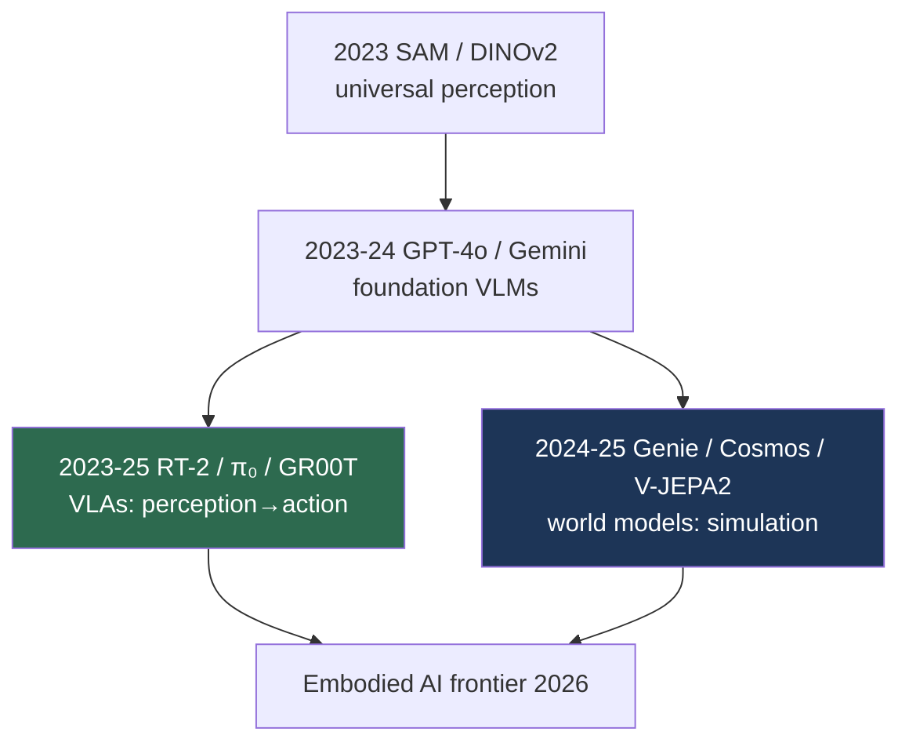

# The Foundation Model Era (2023–2026)

> **Last Updated:** June 2026
> **Level:** Foundational
> **Related Sections:**
> - [Transformer Era](./05_transformer_era.md)
> - [VLA Models](../06_robotics_and_embodied_ai/01_vla_models.md)
> - [Latest Developments](../12_research_frontier_2024_2026/00_overview_latest.md)
> - [The "Anything" Model Paradigm](../12_research_frontier_2024_2026/02_any_model_paradigm.md)

---

## Overview

The foundation model era is defined by a single organizing idea: instead of training task-specific models, train one large, broadly pretrained model that transfers—via prompting or light fine-tuning—to an open-ended range of tasks. In vision this manifested as **universal perceptual primitives** (SAM for segmentation, Depth Anything for depth, DINOv2 for features), **foundation vision-language models** (GPT-4V, Gemini, InternVL) that absorbed nearly all image-understanding tasks, and—most consequentially for the field's trajectory—the extension of foundation models from *perception* to *action* (VLAs) and *prediction* (world models). The era's center of gravity shifted from "recognize the world" to "act in and simulate the world," making robotics and embodied AI the frontier (see [VLA Models](../06_robotics_and_embodied_ai/01_vla_models.md) and [Latest Developments](../12_research_frontier_2024_2026/00_overview_latest.md)).

Three structural features distinguish this era. First, **promptability and zero-shot transfer**: SAM segments "anything" pointed at, decoupling the geometric task from semantics (see [The "Anything" Model Paradigm](../12_research_frontier_2024_2026/02_any_model_paradigm.md)). Second, **the data engine**: models and annotation co-evolve (SAM's SA-1B of 1.1B masks was bootstrapped model-in-the-loop), shifting the bottleneck from architecture to data. Third, **embodiment and convergence**: vision, language, and control collapsed into unified models (RT-2, π₀, Gemini Robotics), and generative video became a *world simulator* (Genie, Cosmos) for training agents. This file narrates the still-unfolding era as of mid-2026.

---

## Universal Perceptual Primitives

**SAM** [Kirillov2023] (ICCV 2023) introduced promptable segmentation trained on a billion-mask data engine, performing zero-shot on new distributions; **SAM 2** extended it to video. **Depth Anything V1/V2** [Yang2024] applied the same recipe to monocular depth via large-scale unlabeled data. **DINOv2** [Oquab2023] provided general-purpose visual features usable across tasks without fine-tuning. Together these became off-the-shelf perceptual building blocks for downstream systems, including robotics (see [Perception for Robotics](../06_robotics_and_embodied_ai/08_perception_for_robotics.md)).

## Foundation Vision-Language Models

Large multimodal models—**GPT-4V → GPT-4o**, **Gemini 1.5/2.0** (1M-token video context), **InternVL**, **Qwen-VL**—subsumed VQA, captioning, OCR, grounding, and reasoning into single prompt-driven systems, closing the open–closed gap by 2025 (see [Large Vision-Language Models](../05_multimodal_vision_language/02_large_vision_language_models.md)).

## From Perception to Action and Simulation

The defining move of the era was extending foundation models to embodiment. **RT-2** [Brohan2023] showed a web-pretrained VLM fine-tuned on robot data transfers Internet knowledge to control; **π₀** added flow-matching action heads for dexterity; **Gemini Robotics** and **GR00T N1** (2025) brought frontier-model capability and dual-system architectures to robots. In parallel, **world models**—**Genie** (playable worlds from video), **Cosmos** (NVIDIA's physical-AI world foundation model), **V-JEPA 2**—turned generative video into simulators and predictive engines for embodied learning (see [World Models](../06_robotics_and_embodied_ai/02_world_models.md)).

---

## Key Papers

| Paper | Authors | Year | Venue | Key Contribution |
|-------|---------|------|-------|-----------------|
| Segment Anything (SAM) | Kirillov, Mintun, Ravi, et al. | 2023 | ICCV | Promptable segmentation + billion-mask data engine |
| DINOv2 | Oquab, Darcet, Moutakanni, et al. | 2023 | TMLR | General-purpose self-supervised visual features |
| Depth Anything V2 | Yang, Kang, Huang, et al. | 2024 | NeurIPS | Foundation monocular depth |
| RT-2 | Brohan, Brown, Carbajal, et al. | 2023 | CoRL | VLA: web knowledge transfers to robot control |
| Genie | Bruce, Dennis, Edwards, et al. | 2024 | ICML | Generative interactive environments from video |
| Cosmos | NVIDIA | 2025 | arXiv | World foundation model for physical AI |

---

## Impact & Limitations

| Aspect | Impact | Limitation |
|--------|--------|------------|
| Promptable primitives | Zero-shot perception off-the-shelf | Geometric only (SAM); heavy encoders |
| Foundation VLMs | One model, all understanding tasks | Spatial reasoning, hallucination, compute |
| VLAs | Generalist robot control | Limited dexterity/long-horizon; replication |
| World models | Simulators & data engines for agents | Physical-plausibility evaluation immature |

---

## Open Problems & Research Gaps

- **Spatial intelligence.** Foundation models still fail at metric/relational spatial reasoning (see [Spatial Intelligence](../12_research_frontier_2024_2026/06_spatial_intelligence.md)).
- **Embodied generalization.** Level-5 compositional, long-horizon robot tasks remain unsolved (see [Pros, Cons & Roadmaps](../06_robotics_and_embodied_ai/07_pros_cons_roadmaps.md)).
- **The robot-data bottleneck.** Unlike text/images, action data is scarce and costly (see [Robot Data & Teleoperation](../06_robotics_and_embodied_ai/09_robot_data_and_teleoperation.md)).
- **Evaluation of world models** for control (physical plausibility, not just FVD).
- **Efficiency.** Running foundation VLAs on edge robots is open (see [Edge Deployment](../09_efficiency_and_deployment/03_edge_deployment.md)).
- **Safety & alignment** for physically embodied agents.
- **Open vs. closed.** Tension between open-source momentum and frontier-lab consolidation.

---

## Further Reading

- [Segment Anything (arXiv:2304.02643)](https://arxiv.org/abs/2304.02643) — the foundation segmentation model
- [RT-2 (arXiv:2307.15818)](https://arxiv.org/abs/2307.15818) — vision-language-action models
- [Genie (arXiv:2402.15391)](https://arxiv.org/abs/2402.15391) — generative interactive environments
- [Cosmos (arXiv:2501.03575)](https://arxiv.org/abs/2501.03575) — world foundation models for physical AI
- [DINOv2 (arXiv:2304.07193)](https://arxiv.org/abs/2304.07193) — general-purpose visual features
