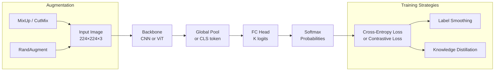

# Image Classification

> **Last Updated:** June 2026
> **Level:** Intermediate → Advanced
> **Related Sections:** [CNN Architectures](../03_architectures/00_cnn_architectures.md) · [Vision Transformers](../03_architectures/01_vision_transformers.md) · [Datasets & Benchmarks](../11_datasets_and_benchmarks/00_imagenet_and_large_scale.md) · [Research Frontier](../12_research_frontier_2024_2026/00_foundation_models.md)

---

## Overview

Image classification is the canonical supervised learning task in computer vision: given a fixed-size image tensor **x** ∈ ℝ^(H×W×C), predict a discrete label **y** ∈ {1, …, K}. Despite its apparent simplicity, the ImageNet Large Scale Visual Recognition Challenge (ILSVRC) [Russakovsky2015] served as the primary proving ground for every major architectural innovation from 2012 to the present. The benchmark's 1,000-class, 1.28-million-image training set was large enough to reward deep overparameterised models while remaining tractable, making it the ideal experimental substrate for the deep-learning revolution.

The decade-long progression on ImageNet top-1 accuracy—from AlexNet's 56.5 % in 2012 to modern foundation models exceeding 91 %—encapsulates the interplay between architecture design (depth, skip connections, attention), training recipes (data augmentation, regularisation, self-supervised pre-training), and scale (dataset size, parameter count, compute budget). Each generation invalidated prior theoretical assumptions: skip connections showed that representational depth need not imply optimisation difficulty [He2016]; the EfficientNet family demonstrated that coordinated compound scaling dominates isolated width or depth scaling [Tan2019]; and Vision Transformers [Dosovitskiy2020] revealed that inductive biases specific to convolution are not prerequisites for state-of-the-art vision performance given sufficient data or pre-training.

Contemporary image classification research operates on several fronts simultaneously: (1) data-efficient training via label smoothing, MixUp, CutMix, and RandAugment; (2) long-tail recognition under natural class-frequency imbalances; (3) zero-shot transfer through vision–language contrastive pre-training (CLIP [Radford2021]); and (4) dense self-supervised pre-training (DINOv2 [Oquab2023]) that produces linear-probe features rivalling fully supervised fine-tuning. The conceptual boundary between "classification" and "representation learning" has largely dissolved: modern classifiers are first-stage feature extractors for downstream dense prediction, retrieval, and multimodal reasoning.

---

## The ILSVRC Benchmark

**ImageNet** [Deng2009] contains 14 million images across 21,841 WordNet synsets. The ILSVRC classification challenge uses a 1,000-synset subset with:

- **Training set:** 1,281,167 images
- **Validation set:** 50,000 images (50 per class)
- **Test set:** 100,000 images (labels withheld)
- **Primary metric:** Top-1 accuracy (single-crop, 224×224 unless noted)
- **Secondary metric:** Top-5 accuracy (prediction is correct if ground-truth is among top-5 logits)

Human-level top-5 accuracy on ILSVRC is often cited as ≈ 5.1 % error (i.e., 94.9 % accuracy) [Russakovsky2015], providing a reference point surpassed by ResNets and transformers.

---

## Architectural Progression

### Convolutional Era (2012–2019)

**AlexNet** [Krizhevsky2012] established deep CNNs as the dominant paradigm, using five convolutional layers, ReLU activations, dropout, and data parallelism across two GPUs. Its 10.9 percentage-point improvement over the 2011 winner was unprecedented.

**VGGNet** [Simonyan2014] systematically replaced large kernels with stacks of 3×3 convolutions, showing that depth (16–19 layers) controlled by small receptive fields outperforms shallow networks with large kernels.

**GoogLeNet / Inception v1** [Szegedy2015] introduced the Inception module—parallel 1×1, 3×3, and 5×5 convolutions—and global average pooling, reducing parameters from VGG's 138 M to 6.8 M while achieving lower error.

**ResNet** [He2016] solved the degradation problem (accuracy decreasing with depth) via residual skip connections:

```
# Residual block (pre-activation form, He et al. 2016)
def residual_block(x, F):
    # F(x) is the residual mapping to be learned
    return F(x) + x    # identity shortcut
```

ResNet-50/101/152 set new standards; ResNet-152 achieved 19.38 % top-5 error on ILSVRC 2015.

**DenseNet** [Huang2017] extended skip connections to dense connectivity: each layer receives feature maps from all preceding layers, encouraging feature reuse and gradient flow.

**EfficientNet** [Tan2019] introduced compound scaling: width, depth, and input resolution are scaled jointly under a fixed compute budget using a Neural Architecture Search-derived base (EfficientNet-B0). EfficientNet-B7 achieved 84.3 % top-1 on ImageNet with 66 M parameters. EfficientNetV2 [Tan2021] replaced depthwise separable convolutions with Fused-MBConv in early layers, achieving 87.3 % top-1 with ImageNet-21k pre-training.

**ConvNeXt** [Liu2022a] redesigned ResNet-50 following ViT training recipes—patchification stem, depthwise convolution, inverted bottlenecks, GELU, LayerNorm—closing the gap with Swin Transformers without attention. ConvNeXt-XL achieves 87.8 % top-1.

### Transformer Era (2020–present)

**ViT** [Dosovitskiy2020] partitions an image into non-overlapping 16×16 or 14×14 patches, linearly embeds each patch into a token, prepends a [CLS] token, adds 1-D positional embeddings, and processes the sequence with standard Transformer encoder blocks. When pre-trained on JFT-300M (300 M images), ViT-H/14 achieves 88.55 % top-1 on ImageNet; ViT-L/16 reaches 85.8 %. On ImageNet alone ViT underperforms CNNs due to insufficient inductive biases.

**Swin Transformer** [Liu2021] introduces shifted-window self-attention, limiting attention to local windows while cross-window communication is achieved by shifting windows between layers, recovering hierarchical feature maps analogous to CNN stages. Swin-L achieves 87.3 % top-1.

**DINOv2** [Oquab2023] distils self-supervised ViT features on a curated 142 M image dataset using knowledge distillation with register tokens and multi-crop augmentation. ViT-g/14 achieves **86.5 % top-1 linear probe** on ImageNet-1k, matching weakly supervised models. DINOv2 features transfer strongly without fine-tuning to dense prediction tasks such as depth estimation and segmentation.

---

## Training Techniques

### Loss Functions

Standard classification uses cross-entropy with softmax normalisation:

```latex
% Softmax probability for class k
p_k = \frac{\exp(z_k)}{\sum_{j=1}^{K} \exp(z_j)}

% Cross-entropy loss
\mathcal{L}_{CE} = -\sum_{k=1}^{K} y_k \log p_k
```

**Label smoothing** [Szegedy2016] replaces hard one-hot targets with a soft distribution:

```latex
% Label-smoothed target
\tilde{y}_k = (1 - \varepsilon)\, y_k + \frac{\varepsilon}{K}

% where \varepsilon \in [0.1, 0.2] is a smoothing factor
% This prevents overconfidence and improves calibration
```

### Data Augmentation

**MixUp** [Zhang2018] linearly interpolates pairs of training samples and their labels:

```latex
\tilde{x} = \lambda x_i + (1-\lambda) x_j, \quad
\tilde{y} = \lambda y_i + (1-\lambda) y_j, \quad
\lambda \sim \mathrm{Beta}(\alpha, \alpha)
```

**CutMix** [Yun2019] cuts a rectangular region from one image and pastes it onto another, with labels mixed proportionally to area:

```latex
\tilde{x} = \mathbf{M} \odot x_i + (1 - \mathbf{M}) \odot x_j, \quad
\tilde{y} = \lambda y_i + (1-\lambda) y_j
% where \mathbf{M} is a binary mask and \lambda is the cut area ratio
```

**RandAugment** [Cubuk2020] applies a random sequence of N augmentation operations each with magnitude M, eliminating the need for separate augmentation policy search.

**AugReg** [Touvron2021] refers to combining strong augmentation (RandAugment, MixUp, CutMix, Repeated Augmentation) with regularisation (Stochastic Depth, Label Smoothing) as standard training for ViTs, enabling ImageNet-only training to approach JFT-pretrained performance.

---

## Long-Tail Recognition

Natural image distributions follow power laws: frequent classes contain orders of magnitude more instances than rare classes. Strategies include:

- **Class-balanced sampling / re-weighting:** oversample minority classes or up-weight their loss terms
- **Decoupled training** [Kang2020]: train representation on uniformly sampled data, then re-balance classifier separately
- **LDAM loss** [Cao2019]: label-distribution-aware margin loss that assigns larger margins to infrequent classes
- **Logit adjustment** [Menon2021]: post-hoc calibration of logits by subtracting log class frequency

---

## Zero-Shot Classification via CLIP

CLIP [Radford2021] trains a dual-encoder (image encoder + text encoder) with contrastive loss on 400 M image–text pairs from the web. At inference, class names are embedded as text ("a photo of a {class}") and the image is classified by cosine similarity to all class embeddings—**no labelled examples required**. CLIP ViT-L/14@336px achieves **76.2 % top-1** zero-shot on ImageNet-1k. This paradigm shifts classification from a closed-vocabulary supervised problem to an open-vocabulary matching problem.

---

## Key Papers

| Paper | Authors | Year | Venue | Key Contribution |
|-------|---------|------|-------|-----------------|
| ImageNet Large Scale Visual Recognition Challenge | Russakovsky et al. | 2015 | IJCV | Benchmark definition; human-level baseline |
| AlexNet (ImageNet Classification with Deep CNN) | Krizhevsky, Sutskever, Hinton | 2012 | NeurIPS | Deep CNN + ReLU + dropout; first ILSVRC breakthrough |
| Very Deep Convolutional Networks (VGGNet) | Simonyan, Zisserman | 2014 | ICLR | Systematic depth with 3×3 kernels; 16–19 layers |
| Deep Residual Learning (ResNet) | He, Zhang, Ren, Sun | 2016 | CVPR | Residual skip connections enabling 152-layer networks |
| EfficientNet: Rethinking Model Scaling | Tan, Le | 2019 | ICML | Compound scaling of width/depth/resolution via NAS |
| An Image is Worth 16×16 Words (ViT) | Dosovitskiy et al. | 2020 | ICLR 2021 | Pure Transformer on image patches; 88.5 % with JFT |
| Swin Transformer | Liu et al. | 2021 | ICCV | Shifted-window attention; hierarchical feature maps |
| Learning Transferable Visual Models (CLIP) | Radford et al. | 2021 | ICML | Contrastive image–language pre-training; zero-shot |
| DINOv2: Learning Robust Visual Features | Oquab et al. | 2023 | TMLR | SSL ViT-g; 86.5 % linear probe ImageNet; dense transfer |
| A ConvNet for the 2020s (ConvNeXt) | Liu et al. | 2022 | CVPR | Modernised ResNet following ViT design choices |

---

## Benchmark Performance: ImageNet Top-1 Accuracy Progression

| Model | Year | Params | Top-1 (%) | Top-5 (%) | Notes |
|-------|------|--------|-----------|-----------|-------|
| AlexNet | 2012 | 61 M | 56.5 | 80.2 | ILSVRC 2012 winner; 10-crop eval |
| VGG-16 | 2014 | 138 M | 74.4 | 91.9 | Single-scale, single-crop |
| GoogLeNet / Inception-v1 | 2014 | 6.8 M | 74.8 | 92.2 | 6.7 % top-5 error; ILSVRC winner |
| ResNet-50 | 2016 | 25 M | 75.3 | 92.2 | Single-crop 224² |
| ResNet-152 | 2016 | 60 M | 77.0 | 93.3 | ILSVRC 2015 winner (3.57 % top-5) |
| DenseNet-264 | 2017 | 33 M | 77.9 | 93.9 | Dense connectivity |
| EfficientNet-B7 | 2019 | 66 M | 84.3 | 97.0 | NAS + compound scaling |
| EfficientNetV2-L (+ImageNet-21k) | 2021 | 120 M | 87.3 | 98.5 | Fused-MBConv; 21k pre-train |
| ViT-H/14 (+JFT-300M) | 2020 | 632 M | 88.6 | — | Pure transformer; massive pre-train |
| Swin-L (+ImageNet-22k) | 2021 | 197 M | 87.3 | 98.2 | Shifted-window hierarchical |
| ConvNeXt-XL (+ImageNet-22k) | 2022 | 350 M | 87.8 | 98.8 | ConvNet renaissance |
| DINOv2 ViT-g/14 (linear probe) | 2023 | 1.1 B | 86.5 | — | SSL only; no fine-tuning |
| CLIP ViT-L/14@336px (zero-shot) | 2021 | 307 M | 76.2 | — | Zero-shot; no ImageNet labels |

---

## Benchmark Performance: Out-of-Distribution Robustness

| Model | ImageNet-A (top-1 %) | ImageNet-R (top-1 %) | Notes |
|-------|---------------------|---------------------|-------|
| ResNet-50 | 0.0 | 36.2 | Severe OOD degradation |
| ViT-L/16 (JFT) | 49.0 | 77.1 | Better robustness |
| DINOv2 ViT-L/14 | 59.9 | 78.7 | Curated pre-training improves robustness |
| CLIP ViT-L/14 | 70.0 | 88.9 | Language supervision strongly aids OOD |

---

## Pros & Cons of Major Paradigms

| Aspect | Pros | Cons |
|--------|------|------|
| CNN-based (ResNet/EfficientNet) | Strong inductive biases; data-efficient; fast inference; well-understood | Limited global context; diminishing returns at very large scale |
| ViT / Swin Transformer | Global attention; scales with data and compute; strong transfer | Requires large data or pre-training; high memory; quadratic attention |
| Contrastive / Self-Supervised (CLIP, DINOv2) | Zero-shot generalisation; no task-specific labels; strong OOD robustness | Computationally expensive pre-training; text alignment may miss fine-grained concepts |
| Compound Scaling (EfficientNet) | Principled scaling rules; high accuracy-per-FLOP | NAS search cost; complex training schedules |
| Label Smoothing + MixUp/CutMix | Cheap, training-time only; consistent +1–2 % gains | Hyperparameters interact; harder to interpret predictions |
| Long-tail re-weighting | Addresses real-world imbalance | Trade-off: gains on rare classes at cost of frequent class accuracy |

---

## Mermaid Diagram: Classification Pipeline



---

## Open Problems & Research Gaps

- **Calibration vs. accuracy:** Large pre-trained models achieve high top-1 accuracy but can be systematically overconfident; temperature scaling and post-hoc calibration remain unsatisfying solutions, particularly under distribution shift.
- **Sample efficiency at the tail:** Despite advances in decoupled training and logit adjustment, models still fail catastrophically on classes with fewer than ~20 training examples without auxiliary data or explicit few-shot mechanisms.
- **Robustness to natural distribution shifts:** ImageNet-A/R gaps between supervised CNNs and language-supervised models (CLIP) suggest that semantic supervision fundamentally changes representational geometry, but the mechanism is not well understood.
- **Understanding vs. texture bias:** CNNs exhibit strong texture bias [Geirhos2019] while ViTs show more shape sensitivity, yet neither fully mirrors human object recognition strategies; disentangling these biases remains an open problem.
- **Scalable zero-shot with fine-grained classes:** CLIP-style models struggle with fine-grained distinctions (species, aircraft models) where class names are ambiguous or overlapping in web text; better text conditioning or hierarchical class representations are needed.
- **Efficient scaling laws for classification:** Chinchilla-style optimal scaling laws [Hoffmann2022] have been established for language models but not systematically for vision-only or vision–language classification; optimal data:parameter ratios remain empirically unclear.
- **Post-hoc label assignment and noisy supervision:** ImageNet itself contains non-trivial label noise and multi-label images; learning under structured noise without access to clean labels is unresolved at scale.

---

## Further Reading

- [ImageNet Large Scale Visual Recognition Challenge (Russakovsky et al., 2015)](https://arxiv.org/abs/1409.0575)
- [An Image is Worth 16×16 Words: Transformers for Image Recognition at Scale (Dosovitskiy et al., 2020)](https://arxiv.org/abs/2010.11929)
- [Learning Transferable Visual Models from Natural Language Supervision — CLIP (Radford et al., 2021)](https://arxiv.org/abs/2103.00020)
- [DINOv2: Learning Robust Visual Features without Supervision (Oquab et al., 2023)](https://arxiv.org/abs/2304.07193)
- [EfficientNet: Rethinking Model Scaling for Convolutional Neural Networks (Tan & Le, 2019)](https://arxiv.org/abs/1905.11946)
- [Revisiting ResNets: Improved Training and Scaling Strategies (Bello et al., 2021)](https://arxiv.org/abs/2103.07579)
