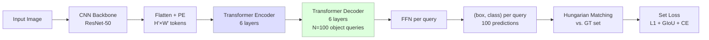

# Object Detection

> **Last Updated:** June 2026
> **Level:** Intermediate → Advanced
> **Related Sections:** [Open-Vocabulary Detection](../05_multimodal_vision_language/03_open_vocabulary_detection.md) · [Semantic Segmentation](./02_semantic_segmentation.md) · [CNN Architectures](../03_architectures/00_cnn_architectures.md) · [Vision Transformers](../03_architectures/01_vision_transformers.md)

---

## Overview

Object detection is the task of localising and classifying all instances of objects in an image, producing a set of bounding boxes {(**b**_i, c_i, s_i)} where **b**_i ∈ ℝ^4 is a box (typically in [x1, y1, x2, y2] or [cx, cy, w, h] format), c_i ∈ {1, …, K} is the class label, and s_i ∈ [0,1] is a confidence score. The COCO benchmark [Lin2014] has been the dominant evaluation protocol since 2014, using mean Average Precision averaged over ten IoU thresholds from 0.50 to 0.95 (AP, also written mAP@[0.50:0.95]) as well as AP50 and AP75.

Two architectural paradigms dominated the first half of the 2010s: **two-stage** detectors generate candidate region proposals in a first stage and classify/refine them in a second stage (R-CNN family [Girshick2014, Girshick2015, Ren2015]); **one-stage** detectors predict boxes and classes directly from a regular grid of anchors without a proposal stage (SSD [Liu2016], YOLO [Redmon2016], RetinaNet [Lin2017]). The central tension—two-stage detectors are more accurate but slower; one-stage are faster but have lower accuracy—was progressively eroded by design advances on both sides, and eventually dissolved by anchor-free detectors (FCOS [Tian2019]) and end-to-end Transformer-based detectors (DETR [Carion2020] and successors).

A third wave of **open-vocabulary** and **grounded** detection [Li2022, Liu2023] shifted focus from closed-set recognition to language-guided detection, enabling detectors to locate arbitrary objects described by free-text phrases. Grounding DINO [Liu2023] achieves 52.5 AP on COCO zero-shot while simultaneously solving referring expression comprehension, collapsing the boundary between detection and vision–language alignment.

---

## Two-Stage Detectors

### R-CNN Family

**R-CNN** [Girshick2014] (CVPR 2014): selective search generates ~2000 candidate regions; each is warped and passed through a CNN for feature extraction; a per-class SVM classifies features; a linear regressor refines box coordinates. Training and inference are disjoint; 47 seconds per image on a GPU.

**Fast R-CNN** [Girshick2015] (ICCV 2015): shares the convolutional backbone across all proposals via **RoI Pooling**—a fixed-size pooling operation applied to each proposal on the shared feature map. A single softmax classifier and box regressor share the FC layers. End-to-end training (except proposal generation); ~200 ms/image.

**Faster R-CNN** [Ren2015] (NeurIPS 2015): replaces selective search with a **Region Proposal Network (RPN)**—a lightweight fully convolutional network that slides over the feature map and predicts objectness scores and offsets for a set of anchor boxes at each location. RPN shares the backbone with the detection head (four-step alternating training or approximate joint training). Achieves 21.9 mAP@[0.50:0.95] on COCO at ~17 fps with ZF-net, 27.2 with ResNet-101.

**Feature Pyramid Network (FPN)** [Lin2017a] (CVPR 2017): addresses scale variation by constructing a top-down pathway with lateral connections that merges coarse, semantically rich deep features with fine, spatially precise shallow features. Produces multi-scale feature maps {P2, P3, P4, P5, P6} where P_k has stride 2^k. Combined with Faster R-CNN and ResNet-101, FPN achieves 36.2 mAP on COCO minival with no increase in inference time relative to single-scale.

---

## One-Stage Detectors

### SSD and YOLO Family

**SSD** [Liu2016] (ECCV 2016): places default anchor boxes of different scales and aspect ratios on multiple feature maps (conv4_3 through conv11_2), predicting offsets and class scores for each anchor in a single forward pass. VGG-16 backbone; 74.3 mAP@0.50 (VOC 2007), 25.1 mAP@[0.50:0.95] on COCO at 46 fps.

**YOLOv1** [Redmon2016] (CVPR 2016): divides image into S×S grid; each cell predicts B bounding boxes and C class probabilities, treating detection as a single regression problem. GoogLeNet-inspired backbone; 63.4 mAP@0.50 VOC 2007, 45 fps.

**YOLOv2 / YOLO9000** [Redmon2017] adds batch normalisation, anchor boxes, high-resolution classification pre-training, and multi-scale training. **YOLOv3** [Redmon2018] uses Darknet-53 backbone and FPN-like multi-scale predictions; 33.0 mAP@[0.50:0.95] COCO test.

**YOLOv4** [Bochkovskiy2020] (arXiv 2020): systematically integrates bag-of-freebies (MixUp, CutMix, mosaic, self-adversarial training) and bag-of-specials (SPP, PAN, SAM). CSPDarknet53 backbone; 43.5 mAP@[0.50:0.95] at 65 fps (V100).

**YOLOv5** (Jocher, Ultralytics, 2020): unofficial but widely adopted; PyTorch-native, anchor-based, CSP backbone; ~43.3 mAP (YOLOv5x).

**YOLOv8** (Jocher, Ultralytics, 2023): anchor-free head, C2f bottleneck, decoupled classification and regression; YOLOv8x achieves 53.9 mAP@[0.50:0.95] COCO val.

**YOLOv10** [Wang2024] (NeurIPS 2024): dual-label assignment NMS-free training; YOLOv10-X achieves 54.4 mAP at 29 ms on CPU.

**YOLO11** (Ultralytics, 2024): reduces parameters by 22 % vs YOLOv8m while +1.3 % mAP; YOLO11x 54.7 mAP COCO val.

### RetinaNet and Focal Loss

**RetinaNet** [Lin2017b] (ICCV 2017): identifies class imbalance between foreground and background anchors as the root cause of one-stage detector accuracy gaps. Introduces **focal loss**—a dynamically scaled cross-entropy that down-weights easy negatives:

```latex
% Standard cross-entropy for binary classification
\text{CE}(p_t) = -\log(p_t)

% Focal loss with focusing parameter \gamma and balancing factor \alpha
\text{FL}(p_t) = -\alpha_t (1 - p_t)^{\gamma} \log(p_t)

% p_t = p if y=1, else 1-p
% \gamma = 2, \alpha = 0.25 are default values
% (1-p_t)^\gamma down-weights easy examples exponentially
% Hard examples (p_t << 1) receive weight ~1; easy (p_t -> 1) receive ~0
```

RetinaNet with ResNeXt-101-FPN achieves 40.8 mAP@[0.50:0.95] on COCO test-dev, surpassing all prior one-stage detectors and matching the best two-stage models of its era.

### Anchor-Free Detectors

**FCOS** [Tian2019] (ICCV 2019): reformulates detection as dense per-pixel prediction. For each foreground pixel (x, y), the network predicts (l, t, r, b)—distances to the left, top, right, and bottom of the ground-truth box—along with a centerness score to suppress low-quality boxes. Eliminates all anchor hyperparameters. FCOS achieves 44.7 mAP with ResNeXt-101-FPN, 49.0 with multi-scale testing.

---

## Transformer-Based Detectors

**DETR** [Carion2020] (ECCV 2020): treats detection as a **direct set prediction** problem. A CNN backbone extracts feature maps; a Transformer encoder processes flattened spatial features; a Transformer decoder produces N learnable **object queries** in parallel, each decoded to a box and class via FFN. Hungarian algorithm finds a bipartite matching between predictions and ground truth, eliminating NMS. DETR-R50 achieves 42.0 mAP on COCO val after 500 epochs.



**Deformable DETR** [Zhu2020] (ICLR 2021): replaces global attention with **deformable attention**—each query attends to a small set of learned reference points per feature level, reducing encoder complexity from O(N²) to O(N·K) (K=4 sampled points). Converges 10× faster (50 epochs vs. 500); 46.2 mAP with ResNet-50.

**DAB-DETR** [Liu2022b] reformulates object queries as dynamic anchor boxes (x, y, w, h), providing spatial priors to the decoder cross-attention. **DN-DETR** [Li2022b] adds denoising training to stabilise the bipartite matching.

**DINO (Detection Transformer with Improved Denoising)** [Zhang2022] (ICLR 2023): combines DAB-DETR, DN-DETR, and deformable attention with a mixed query selection strategy; DINO-5scale-R50 achieves 49.0 mAP in 12 epochs; DINO-Swin-L achieves 58.5 mAP on COCO val.

**RT-DETR** [Zhao2024] (CVPR 2024): decouples intra-scale feature interaction (efficient encoder with IoU-aware query selection) from cross-scale fusion (PAN-like neck), enabling real-time inference. RT-DETR-R50 achieves 53.1 mAP at 108 fps on T4 GPU; RT-DETR-R101 achieves 54.3 mAP at 74 fps—the first DETR-family model competitive with YOLO on both accuracy and speed.

---

## Open-Vocabulary and Grounded Detection

**OWL-ViT** [Minderer2022]: uses CLIP-style image–text alignment; bipartite matching loss on image patches; zero-shot detection by matching text queries to patch features.

**Grounding DINO** [Liu2023] (arXiv 2303.05499): marries DINO detector with grounded pre-training from GLIP/CLIP. A feature enhancer fuses text and image features at multiple scales; language-guided query selection initialises object queries from text-relevant image regions; a cross-modality decoder performs tight fusion. Grounding DINO achieves 52.5 mAP (COCO zero-shot, no COCO training data) and 63.0 mAP (COCO fine-tuned). Authors: Shilong Liu, Zhaoyang Zeng, Tianhe Ren et al. (2023).

**RF-DETR** (Roboflow, 2025): the first real-time detector to exceed 60 AP on COCO (60.5 AP at 25 fps on T4), using RT-DETR with DINOv2 backbone.

---

## Key Papers

| Paper | Authors | Year | Venue | Key Contribution |
|-------|---------|------|-------|-----------------|
| Rich Feature Hierarchies… (R-CNN) | Girshick et al. | 2014 | CVPR | Region-based CNN; proposal + classify pipeline |
| Fast R-CNN | Girshick | 2015 | ICCV | RoI Pooling; end-to-end joint training |
| Faster R-CNN | Ren, He, Girshick, Sun | 2015 | NeurIPS | Region Proposal Network; ~17 fps |
| Feature Pyramid Networks (FPN) | Lin, Dollár, Girshick et al. | 2017 | CVPR | Multi-scale top-down feature pyramid |
| Focal Loss / RetinaNet | Lin, Goyal, Girshick et al. | 2017 | ICCV | Focal loss; one-stage matches two-stage accuracy |
| FCOS | Tian, Shen, Chen, He | 2019 | ICCV | Anchor-free per-pixel prediction; centerness |
| YOLOv4 | Bochkovskiy, Wang, Liao | 2020 | arXiv | Systematic bag-of-freebies integration |
| End-to-End Object Detection (DETR) | Carion, Massa et al. | 2020 | ECCV | Transformer set prediction; eliminates NMS |
| Deformable DETR | Zhu, Su et al. | 2020 | ICLR 2021 | Deformable attention; 10× faster convergence |
| DINO (Detection Transformer) | Zhang et al. | 2022 | ICLR 2023 | DAB+DN+deformable; 58.5 mAP Swin-L |
| RT-DETR | Zhao, Lv et al. | 2023 | CVPR 2024 | Real-time DETR; 53.1 mAP @ 108 fps |
| Grounding DINO | Liu, Zeng, Ren et al. | 2023 | arXiv | Open-set detection; 52.5 mAP zero-shot COCO |

---

## Benchmark Performance: COCO mAP Progression

| Model | Backbone | COCO AP | AP50 | FPS (GPU) | Notes |
|-------|----------|---------|------|-----------|-------|
| Fast R-CNN | VGG-16 | 19.7 | 35.9 | ~1 | COCO 2015 test |
| Faster R-CNN | ResNet-101 | 27.2 | 48.4 | 5 | 2015; single scale |
| SSD-300 | VGG-16 | 25.1 | 43.1 | 46 | 300² input |
| YOLOv3 | Darknet-53 | 33.0 | 57.9 | 35 | COCO test-dev |
| RetinaNet | ResNeXt-101-FPN | 40.8 | 61.1 | 7 | COCO test-dev |
| YOLOv4 | CSPDarknet53 | 43.5 | 65.7 | 65 | V100 |
| Faster R-CNN + FPN | ResNet-101 | 36.2 | 59.1 | 6 | COCO minival |
| FCOS | ResNeXt-101-FPN | 44.7 | 64.1 | 14 | Multi-scale test |
| DETR | ResNet-50 | 42.0 | 62.4 | 28 | 500 epochs |
| Deformable DETR | ResNet-50 | 46.2 | 65.2 | 19 | 50 epochs |
| DINO | Swin-L | 58.5 | 77.0 | — | COCO val |
| YOLOv8x | CSP+C2f | 53.9 | 71.0 | 52 | COCO val |
| RT-DETR-R101 | ResNet-101 | 54.3 | 72.7 | 74 | T4; real-time |
| Grounding DINO | Swin-L | 63.0 | 81.4 | — | COCO fine-tuned |

---

## Pros & Cons

| Aspect | Pros | Cons |
|--------|------|------|
| Two-stage (Faster R-CNN / FPN) | High accuracy; flexible proposal stage; strong baseline | Slower; two-stage complexity; not end-to-end NMS-free |
| One-stage anchor-based (RetinaNet/SSD) | Fast; simple architecture; well-calibrated with focal loss | Manual anchor design; struggles with extreme aspect ratios |
| Anchor-free (FCOS/CenterNet) | No anchor hyperparameters; per-pixel predictions; easy transfer | Centerness ambiguity for overlapping objects; slightly lower AP on crowded scenes |
| Transformer (DETR/RT-DETR) | Fully end-to-end (no NMS); global context; open-vocabulary extension | Slow convergence; high memory; O(N²) attention in base DETR |
| Open-vocabulary (Grounding DINO) | Detects arbitrary text-described objects; zero-shot generalisation | Slower inference; requires large-scale grounding pre-training; closed-form text precision |

---

## Open Problems & Research Gaps

- **NMS-free convergence speed:** Despite Deformable DETR and DN-DETR reducing DETR's 500-epoch requirement to 12–24 epochs, end-to-end transformer detectors still converge slower than anchor-based methods; theoretical understanding of set matching dynamics remains incomplete.
- **Small object detection:** AP_S (objects < 32² pixels) lags significantly behind AP_M and AP_L across all architectures; high-resolution backbone features at scale remain computationally prohibitive.
- **Domain generalisation:** COCO-trained detectors degrade sharply on sketch, art, or domain-shifted imagery; bridging photorealistic training to open-world deployment is unsolved.
- **Efficient open-vocabulary detection:** Grounding DINO and OWL-ViT require large language encoders that dominate inference cost; distilling open-vocabulary capabilities into compact detectors is an active challenge.
- **Dense prediction under occlusion:** Panoptic and instance segmentation resolve some crowded-scene issues, but 3D-aware detection (accounting for depth order and occlusion reasoning) at scale is still lacking robust solutions.
- **Temporal object detection:** Extending single-frame detection to video with consistent track identities under appearance change, occlusion, and motion blur remains dependent on post-hoc tracking heuristics rather than joint end-to-end learning.
- **Calibration of confidence scores:** High-AP models are often poorly calibrated—reported confidence does not match true precision; calibrated uncertainty estimates are necessary for safety-critical deployment.

---

## Further Reading

- [Faster R-CNN: Towards Real-Time Object Detection with Region Proposal Networks (Ren et al., 2015)](https://arxiv.org/abs/1506.01497)
- [Feature Pyramid Networks for Object Detection (Lin et al., 2017)](https://arxiv.org/abs/1612.03144)
- [Focal Loss for Dense Object Detection — RetinaNet (Lin et al., 2017)](https://arxiv.org/abs/1708.02002)
- [End-to-End Object Detection with Transformers — DETR (Carion et al., 2020)](https://arxiv.org/abs/2005.12872)
- [RT-DETR: DETRs Beat YOLOs on Real-time Object Detection (Zhao et al., 2024)](https://arxiv.org/abs/2304.08069)
- [Grounding DINO: Marrying DINO with Grounded Pre-Training (Liu et al., 2023)](https://arxiv.org/abs/2303.05499)
