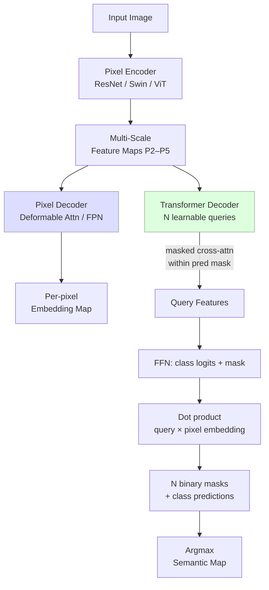

# Semantic Segmentation

> **Last Updated:** June 2026
> **Level:** Intermediate → Advanced
> **Related Sections:** [Instance & Panoptic Segmentation](./03_instance_panoptic_segmentation.md) · [Any-Model Paradigm (SAM/SAM2)](../12_research_frontier_2024_2026/02_any_model_paradigm.md) · [Vision Transformers](../03_architectures/01_vision_transformers.md) · [CNN Architectures](../03_architectures/00_cnn_architectures.md)

---

## Overview

Semantic segmentation assigns a class label to every pixel of an image, producing a dense categorical map **S** ∈ {1, …, K}^(H×W). Unlike object detection, it does not distinguish between individual instances of the same class—all pixels belonging to "car" receive an identical label regardless of how many cars are present. The task demands simultaneously high spatial resolution (accurate boundary delineation) and deep semantic abstraction (scene understanding), a tension that has driven the majority of architectural innovations in dense prediction over the past decade.

The foundational insight of **Fully Convolutional Networks (FCN)** [Long2015] was to replace the fully-connected classification head with convolutional layers, enabling end-to-end dense prediction at arbitrary resolution via bilinear upsampling. Subsequent work addressed FCN's two principal weaknesses: (1) spatial detail lost during downsampling—resolved by skip connections (U-Net [Ronneberger2015]) and atrous (dilated) convolutions (DeepLab [Chen2014]); and (2) limited receptive field for global context—resolved by Atrous Spatial Pyramid Pooling (ASPP, DeepLabv3 [Chen2017]), pyramid pooling modules (PSPNet [Zhao2017]), and ultimately global self-attention (SegFormer [Xie2021], Mask2Former [Cheng2022]).

The introduction of **large-scale promptable segmentation** (SAM [Kirillov2023], SAM2 [Ravi2024]) represents a paradigm shift: rather than training task-specific models for each semantic class, a single foundation model accepts geometric prompts (points, boxes, masks) and segments any object or region interactively. This promptable paradigm collapses the distinction between semantic, instance, and panoptic segmentation at inference time, though adapting SAM to domain-specific semantic labelling still requires prompt engineering or fine-tuning.

---

## Evaluation Metrics

**Mean Intersection-over-Union (mIoU)** is the primary metric:

```latex
% IoU for class k
\text{IoU}_k = \frac{|\hat{S}_k \cap S_k|}{|\hat{S}_k \cup S_k|}
   = \frac{TP_k}{TP_k + FP_k + FN_k}

% mIoU averaged over all K classes (ignoring background in some protocols)
\text{mIoU} = \frac{1}{K} \sum_{k=1}^{K} \text{IoU}_k
```

**Pixel Accuracy (PA)** and **mean Pixel Accuracy (mPA)** are secondary metrics. Cityscapes uses 19 evaluation classes; ADE20K uses 150.

---

## Architectural Milestones

### FCN and Encoder–Decoder Architectures

**FCN** [Long2015] (CVPR 2015): converts AlexNet/VGG/GoogLeNet classification networks to fully convolutional by replacing FC layers with 1×1 convolutions, producing coarse prediction maps upsampled with learned bilinear kernels. Skip connections from pool3/pool4 fuse coarse and fine features. FCN-8s achieves 67.2 mIoU on PASCAL VOC 2012.

**U-Net** [Ronneberger2015] (MICCAI 2015): symmetric encoder–decoder with skip connections that concatenate (rather than add) corresponding encoder feature maps to decoder layers, maximally preserving spatial detail. Designed for biomedical segmentation with limited data; generalises via crop-based training with overlap-tile strategy. Widely adopted as backbone for dense prediction across domains.

**SegNet** [Badrinarayanan2017] replaces learnable upsampling with max-pooling index transfer (unpooling), reducing memory for decoder while preserving fine boundary structure.

### Dilated Convolutions and Multi-Scale Pooling

**DeepLabv1** [Chen2014] (ICLR 2015): introduces **atrous (dilated) convolution** to increase the receptive field without losing spatial resolution or increasing parameters. Combines with a fully connected CRF for boundary refinement.

```latex
% Atrous convolution with rate r:
% y[i] = \sum_k x[i + r \cdot k] \cdot w[k]
% r=1 is standard convolution; r=2 doubles the receptive field
% with same parameter count
```

**DeepLabv2** [Chen2018a] introduces **Atrous Spatial Pyramid Pooling (ASPP)**: parallel atrous convolutions with rates {6, 12, 18, 24} probe the feature map at multiple scales and are merged to capture objects at different sizes.

**DeepLabv3** [Chen2017] improves ASPP with global average pooling and batch normalisation; removes the CRF. ResNet-101 backbone achieves 85.7 mIoU on PASCAL VOC 2012 val.

**DeepLabv3+** [Chen2018b] (ECCV 2018): adds a simple decoder that refines the coarse DeepLabv3 output using low-level features from the encoder (similar to U-Net skip connection), applying depthwise separable convolution for efficiency. Xception backbone achieves 89.0 mIoU on PASCAL VOC 2012.

**PSPNet** [Zhao2017] (CVPR 2017): **Pyramid Pooling Module** applies pooling at four scales {1×1, 2×2, 3×3, 6×6} on the final feature map to capture global and multi-scale context, concatenates with the original features, and applies a final convolution. ResNet-101 achieves 85.98 mIoU on PASCAL VOC 2012.

### Transformer-Based Models

**SETR** [Zheng2021] (CVPR 2021): uses a plain ViT as the encoder (replacing CNN backbone entirely) and a convolutional decoder. Demonstrates that global self-attention outperforms dilated convolutions for large receptive field; 50.28 mIoU on ADE20K.

**SegFormer** [Xie2021] (NeurIPS 2021): hierarchical Mix Transformer (MiT) encoder produces multi-scale features without positional encoding (avoiding interpolation artefacts at different test resolutions); a lightweight all-MLP decoder aggregates features from all encoder stages without self-attention. SegFormer-B5 achieves **84.0 mIoU on Cityscapes val** and **51.8 mIoU on ADE20K** with 84.7 M parameters. Authors: Enze Xie, Wenhai Wang, Zhiding Yu, Anima Anandkumar, Jose M. Alvarez, Ping Luo.

**Mask2Former** [Cheng2022] (CVPR 2022): a universal architecture for semantic, instance, and panoptic segmentation. Uses **masked cross-attention**—decoder queries attend only within their predicted foreground mask region, avoiding noise from background pixels. Transformer decoder with L=9 layers; pixel decoder with multi-scale deformable attention. Mask2Former with Swin-L backbone achieves **57.7 mIoU on ADE20K** and **80.3 mIoU on Cityscapes val** for semantic segmentation. Authors: Bowen Cheng, Ishan Misra, Alexander G. Schwing, Alexander Kirillov, Rohit Girdhar.

**OneFormer** [Jain2023] (CVPR 2023): trains a single model jointly on semantic, instance, and panoptic objectives, conditioned on a task token ("semantic", "instance", "panoptic") prepended to text queries. Achieves SOTA on all three tasks simultaneously, outperforming task-specific specialised models.



---

## Foundation Segmentation Models

### SAM — Segment Anything Model

**SAM** [Kirillov2023] (ICCV 2023): introduces the **promptable segmentation** paradigm. Architecture: (1) MAE-pretrained ViT-H image encoder; (2) lightweight prompt encoder for points, boxes, masks, and text; (3) mask decoder with two-way transformer and multi-output disambiguation head. Trained on SA-1B—11 M images with >1 B mask annotations collected via a model-in-the-loop annotation engine. SAM supports interactive segmentation with point/box/text prompts and predicts multiple masks to handle ambiguity. Zero-shot transfer to domain-specific segmentation (medical, satellite) is strong with appropriate prompting. Authors: Alexander Kirillov, Eric Mintun, Nikhila Ravi et al. (Meta AI).

### SAM2 — Segment Anything in Images and Videos

**SAM2** [Ravi2024] (arXiv 2408.00714, 2024): extends SAM to video by adding a **streaming memory mechanism**—a memory encoder, memory bank, and memory attention module that conditions the mask decoder on past frame features and predicted masks. Introduces the **Promptable Visual Segmentation (PVS)** task: given any frame-level prompt, track the masklet across all frames. SAM2 uses a hierarchical Hiera image encoder and achieves lower annotation time on video benchmarks than interactive frame-by-frame annotation. Authors: Nikhila Ravi, Valentin Gabeur, Yuan-Ting Hu et al. (Meta AI).

---

## Key Papers

| Paper | Authors | Year | Venue | Key Contribution |
|-------|---------|------|-------|-----------------|
| Fully Convolutional Networks (FCN) | Long, Shelhamer, Darrell | 2015 | CVPR | First end-to-end dense prediction; skip connections |
| U-Net | Ronneberger, Fischer, Brox | 2015 | MICCAI | Symmetric encoder–decoder; concatenative skips |
| DeepLabv1 | Chen, Papandreou et al. | 2014 | ICLR 2015 | Atrous convolution + CRF |
| DeepLabv3+ | Chen, Zhu et al. | 2018 | ECCV | ASPP decoder; Xception backbone; 89.0 VOC |
| PSPNet | Zhao, Shi, Qi et al. | 2017 | CVPR | Pyramid pooling module; global context |
| SegFormer | Xie, Wang et al. | 2021 | NeurIPS | Mix Transformer + MLP decoder; 84.0 Cityscapes |
| Mask2Former | Cheng, Misra et al. | 2022 | CVPR | Masked cross-attention; universal segmentation |
| OneFormer | Jain et al. | 2023 | CVPR | Single model for all segmentation tasks |
| Segment Anything (SAM) | Kirillov, Mintun et al. | 2023 | ICCV | Promptable foundation model; SA-1B 1B masks |
| SAM 2 | Ravi, Gabeur et al. | 2024 | arXiv | Video segmentation; streaming memory |

---

## Benchmark Performance

### Cityscapes Validation Set (19 classes, mIoU %)

| Model | Backbone | mIoU (val) | Notes |
|-------|----------|-----------|-------|
| FCN-8s | VGG-16 | 65.3 | Bilinear upsampling; PASCAL pretrain |
| PSPNet | ResNet-101 | 81.2 | Pyramid pooling module |
| DeepLabv3+ | Xception-65 | 82.1 | ASPP + decoder |
| SegFormer-B5 | MiT-B5 | 84.0 | Cityscapes val; no extra data |
| Swin-L UperNet | Swin-L | 83.1 | Standard 512² training |
| Mask2Former | Swin-L | 83.3 | Universal; 160k iters |
| Mask2Former | Swin-L (512²) | 80.3 | Standard Cityscapes training |

### ADE20K Validation Set (150 classes, mIoU %)

| Model | Backbone | mIoU (val) | Params | Notes |
|-------|----------|-----------|--------|-------|
| FCN | ResNet-101 | 39.9 | 68 M | Baseline |
| PSPNet | ResNet-101 | 43.3 | 86 M | — |
| DeepLabv3+ | ResNet-101 | 44.1 | — | — |
| SETR-PUP | ViT-L | 50.3 | 308 M | ViT encoder |
| SegFormer-B4 | MiT-B4 | 50.3 | 64 M | 5× smaller than SETR |
| SegFormer-B5 | MiT-B5 | 51.8 | 85 M | — |
| Mask2Former | Swin-L | 57.7 | 216 M | Universal model |
| OneFormer | Swin-L | 57.0 | 219 M | Multi-task conditioned |
| SegNeXt-L | MSCAN-L | 51.0 | 49 M | Efficient; outperforms Mask2Former-Swin-T |

---

## Pros & Cons

| Aspect | Pros | Cons |
|--------|------|------|
| Dilated CNN (DeepLab) | Preserves resolution without extra params; well-tuned for dense prediction; fast inference | Limited global context without ASPP; boundary artefacts without CRF |
| Encoder–Decoder (U-Net / SegFormer) | Recovers fine spatial detail via skip connections; scalable decoder | Decoder adds memory and compute; skip features may be noisy at very high res |
| Transformer (Mask2Former) | Global context; universal (semantic + instance + panoptic); SOTA accuracy | High compute; complex masked-attention implementation; slow training |
| Foundation model (SAM) | Zero-shot; interactive; 1B+ mask training data; generalises across domains | Not a closed-set classifier by default; prompts require spatial guidance; not real-time |
| SAM2 (video) | Extends tracking with minimal extra annotation; streaming memory efficient | Video memory bank grows with sequence length; edge-case failure on appearance change |

---

## Open Problems & Research Gaps

- **Label-efficient adaptation of SAM:** SAM's interactive segmentation is extremely powerful but converting its masks to semantic labels for closed-set benchmarks requires additional classification heads or text prompts, and the best adaptation strategy remains an open design question.
- **Real-time universal segmentation:** Mask2Former at full resolution with Swin-L runs at under 2 fps; efficient approximations (reduced query count, sparse attention) that retain universal multi-task capability are not fully explored.
- **Weakly-supervised segmentation:** Image-level labels or sparse annotations are far cheaper than pixel-level labelling; leveraging CLIP-scale weak supervision for semantic segmentation without per-pixel annotation remains an active frontier.
- **Long-tail class segmentation:** ADE20K and COCO-Stuff contain extremely rare semantic classes (objects appearing in <0.1 % of images); current models show large per-class IoU variance that aggregate mIoU metrics obscure.
- **Boundary precision at high resolution:** Even state-of-the-art models predict jagged boundaries at 4k+ resolution due to limited decoder resolution; hierarchical or implicit representation approaches for boundary-preserving segmentation are underexplored.
- **Domain shift and calibration:** Models trained on Cityscapes degrade substantially on adverse weather, night, and sensor-shifted imagery; unsupervised domain adaptation for segmentation is still behind supervised performance.
- **Unified semantic understanding:** Ideally a single model should handle semantic segmentation, instance segmentation, depth, normals, and optical flow from a shared representation; such "any prediction" multi-task architectures remain computationally expensive and training-unstable.

---

## Further Reading

- [Fully Convolutional Networks for Semantic Segmentation (Long et al., 2015)](https://arxiv.org/abs/1411.4038)
- [DeepLabv3+: Encoder-Decoder with Atrous Separable Convolution (Chen et al., 2018)](https://arxiv.org/abs/1802.02611)
- [SegFormer: Simple and Efficient Design for Semantic Segmentation with Transformers (Xie et al., 2021)](https://arxiv.org/abs/2105.15203)
- [Masked-attention Mask Transformer for Universal Image Segmentation — Mask2Former (Cheng et al., 2022)](https://arxiv.org/abs/2112.01527)
- [Segment Anything (Kirillov et al., 2023)](https://arxiv.org/abs/2304.05131)
- [SAM 2: Segment Anything in Images and Videos (Ravi et al., 2024)](https://arxiv.org/abs/2408.00714)
