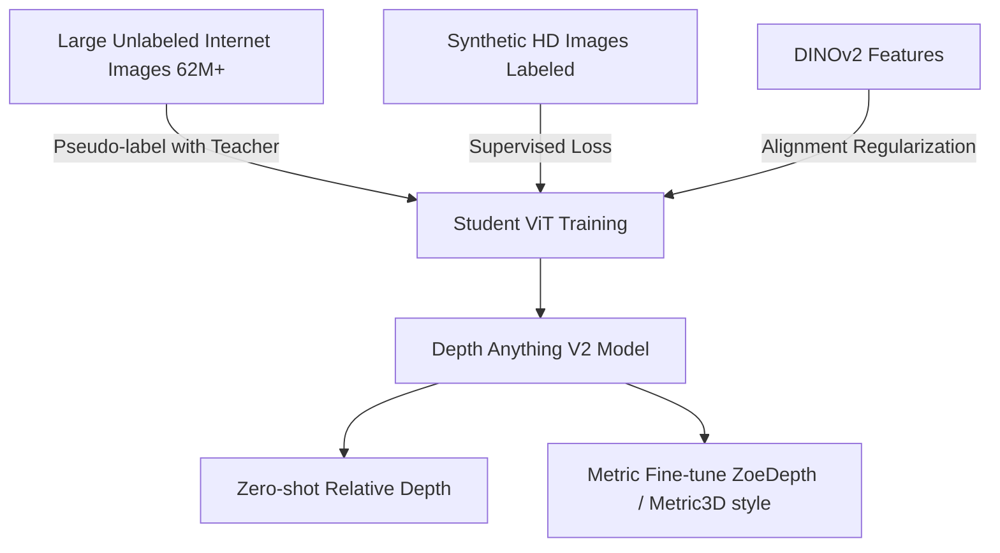

# Depth Estimation: Monocular, Stereo, and Foundation Models

> **Last Updated:** June 2026
> **Level:** Advanced
> **Related Sections:** [Pose Estimation](./04_pose_estimation.md) | [3D Vision and Scene Understanding](../04_3d_vision_and_scene/00_overview.md) | [Any-Model Paradigm](../12_research_frontier_2024_2026/02_any_model_paradigm.md) | [Perception for Robotics](../06_robotics_and_embodied_ai/08_perception_for_robotics.md)

---

## Overview

Depth estimation — inferring the distance from a camera to scene surfaces — is a foundational CV task that bridges 2D imagery and 3D understanding. The problem exists in several forms depending on available input: **monocular** (single image or video), **stereo** (synchronized rectified image pair), and **multi-view** (overlapping views over time or space). Monocular depth is fundamentally ill-posed — a given 2D projection is consistent with infinitely many 3D scenes — so learned approaches must exploit photometric cues, occlusion patterns, and learned scene priors. Stereo depth estimation is more constrained by epipolar geometry but requires precise calibration and struggles with textureless and reflective surfaces.

The field has evolved through four distinct eras. The seminal deep-learning work of [Eigen2014] showed that a multi-scale CNN could predict pixel-wise depth from a single image by coupling a global-context network with a local-refinement network, fundamentally establishing data-driven depth estimation. The **self-supervised paradigm** emerged with Monodepth2 [Godard2019], which exploits view synthesis between consecutive or stereo frames as a free training signal, enabling large-scale training without LiDAR ground truth. **Dataset-mixing** approaches (MiDaS [Ranftl2020], DPT [Ranftl2021]) showed that training on diverse multi-source data with affine-invariant loss functions produces robust zero-shot generalization across scenes. Most recently, **large-scale foundation models** (Depth Anything V1/V2 [Yang2024], Metric3D [Wei2023], ZoeDepth [Bhat2023]) operate at web-scale training regimes, approaching universal depth estimation with or without metric scale recovery.

Stereo depth occupies a complementary niche: given rectified stereo pairs, disparity estimation along horizontal epipolar lines is solvable with high precision. RAFT-Stereo [Lipson2021] transplants the recurrent correlation lookup idea from RAFT optical flow to stereo, achieving state-of-the-art accuracy with iterative refinement. While monocular models have improved dramatically, stereo remains preferred when hardware allows due to its more reliable metric scale and performance on textureless surfaces.

---

## Problem Formulation and Loss Functions

### Scale-Invariant Loss (Eigen 2014)

Early depth CNNs could not recover absolute metric scale from single images, motivating scale-invariant regression. The scale-invariant log loss [Eigen2014] is:

```latex
\mathcal{L}_{\text{SI}} = \frac{1}{n}\sum_i d_i^2 - \frac{\lambda}{n^2}\left(\sum_i d_i\right)^2, \quad d_i = \log \hat{y}_i - \log y_i
```

where y_i is the ground-truth depth at pixel i, ŷ_i is the prediction, and λ ∈ [0,1] controls the scale-invariance (λ=1 fully removes global scale). This loss was widely adopted in subsequent work and remains a standard component.

### Affine-Invariant Loss (MiDaS)

For cross-dataset training with heterogeneous depth sources (stereo, SfM sparse, LiDAR, depth sensors), depth values have inconsistent scale and shift. MiDaS [Ranftl2020] introduces an affine-invariant formulation by normalizing predictions and targets before computing loss:

```latex
\hat{d} = \frac{d - \text{median}(d)}{s(d)}, \quad \text{where} \quad s(d) = \frac{1}{n}\sum_i |d_i - \text{median}(d)|
```

Training minimizes the scale-shift-invariant MSE between normalized prediction and target, enabling joint training on data with incompatible depth scales.

### Photometric Reconstruction Loss (Monodepth2)

Monodepth2 [Godard2019] trains entirely from monocular video (or stereo) without ground-truth depth. For a source frame I_s and target frame I_t with relative pose T_{t→s}, the synthesized target view Î_t is computed by warping I_s using the predicted depth D_t:

```latex
\hat{I}_t(p) = I_s\!\left\langle K\, T_{t\to s}\, D_t(p)\, K^{-1}\, p \right\rangle
```

where ⟨·⟩ denotes bilinear sampling and K is the camera intrinsics matrix. The photometric loss combines L1 and SSIM:

```latex
\mathcal{L}_{\text{photo}} = \alpha \cdot \frac{1 - \text{SSIM}(\hat{I}_t, I_t)}{2} + (1 - \alpha) \cdot \|\hat{I}_t - I_t\|_1
```

Monodepth2 adds **auto-masking** (ignoring pixels that are better explained by the identity warp, i.e., static objects that don't move between frames) and **multi-scale smoothness** to stabilize training.

---

## Key Architectures

### MiDaS and DPT

MiDaS (Ranftl, Lasinger, Hafner, Schindler, Koltun; TPAMI 2022, arXiv 2019) trains a single depth network on a mixture of datasets with affine-invariant loss. Version 3.0 (DPT [Ranftl2021]) replaces the convolutional backbone with a Vision Transformer (ViT), assembling multi-scale tokens from different ViT stages into a dense feature pyramid decoded by a convolutional head. DPT-Large achieves a 28% relative improvement over its convolutional counterpart and sets new state-of-the-art on NYU Depth v2 and KITTI at the time of publication.

### Depth Anything V1 / V2 (Yang 2024)

Depth Anything V1 [Yang2024a] (CVPR 2024) scales monocular depth to large-scale internet data using a ViT backbone and semantic feature alignment from DINOv2 features, training on 1.5M labeled images plus 62M pseudo-labeled internet images. V2 [Yang2024b] (NeurIPS 2024) makes three key changes: (1) replaces real labeled images with **photorealistic synthetic images** from high-quality rendering engines to eliminate label noise; (2) scales the **teacher model** capacity; (3) distills to student models via large-scale pseudo-labeled real images. The result is finer boundary delineation and significantly improved robustness on challenging scenarios (night, fog, reflections). Depth Anything V2 models (ViT-S/B/L) have become the de-facto standard for zero-shot relative depth in downstream systems.



### ZoeDepth (Bhat 2023)

ZoeDepth [Bhat2023] combines relative and metric depth in a two-stage framework: first pre-training on 12 datasets with MiDaS-style affine-invariant loss, then fine-tuning lightweight metric bins heads (one per domain — indoor/outdoor) that predict absolute depth in meters. The metric bins module uses log-spaced bin centers with bin-widths predicted per image, achieving unprecedented zero-shot metric transfer across eight unseen datasets.

### Metric3D (Wei 2023)

Metric3D [Wei2023] (ICCV 2023) addresses metric depth estimation by introducing a **canonical camera space transformation** that normalizes images to a fixed focal length before depth prediction, resolving metric ambiguity arising from different camera intrinsics. This allows training a single model across datasets with wildly different sensor characteristics. Metric3D v2 (arxiv 2404.15506) extends this to a geometric foundation model predicting both metric depth and surface normals jointly with a ViT-L/ViT-g backbone.

### RAFT-Stereo (Lipson 2021)

RAFT-Stereo [Lipson2021] (3DV 2021, Best Student Paper) adapts the recurrent all-pairs field transforms architecture from RAFT optical flow to stereo matching. Key changes: (1) 1D cost volumes over horizontal disparities (exploiting epipolar rectification); (2) multi-level GRU architecture that propagates context across scales more efficiently than single-scale RAFT. RAFT-Stereo achieves sub-pixel accuracy on SceneFlow and significantly reduces error on ETH3D and KITTI stereo benchmarks.

---

## Evaluation Metrics

### Standard Depth Metrics

Let d_i be the ground-truth depth and d̂_i be the predicted depth for pixel i, over N valid pixels:

**Absolute Relative Error (AbsRel):**
```latex
\text{AbsRel} = \frac{1}{N}\sum_{i} \frac{|\hat{d}_i - d_i|}{d_i}
```

**Root Mean Squared Error (RMSE):**
```latex
\text{RMSE} = \sqrt{\frac{1}{N}\sum_{i} (\hat{d}_i - d_i)^2}
```

**Threshold Accuracy (δ < threshold):**
```latex
\delta_t = \% \text{ of pixels where } \max\!\left(\frac{\hat{d}_i}{d_i},\, \frac{d_i}{\hat{d}_i}\right) < t, \quad t \in \{1.25,\, 1.25^2,\, 1.25^3\}
```

For relative depth evaluation (scale-ambiguous models), standard practice is to compute a per-image least-squares scale alignment before computing AbsRel and RMSE.

---

## Key Papers

| Paper | Authors | Year | Venue | Key Contribution |
|---|---|---|---|---|
| Depth Map Prediction from a Single Image using a Multi-Scale Deep Network | Eigen, Puhrsch, Fergus | 2014 | NeurIPS | First CNN-based monocular depth; scale-invariant log loss; multi-scale coarse-to-fine |
| Digging into Self-Supervised Monocular Depth Estimation (Monodepth2) | Godard, Mac Aodha, Firman, Brostow | 2019 | ICCV | Photometric self-supervision; auto-masking; minimum reprojection; no LiDAR required |
| Towards Robust Monocular Depth Estimation: Mixing Datasets for Zero-shot Cross-dataset Transfer (MiDaS) | Ranftl, Lasinger, Hafner, Schindler, Koltun | 2022 | IEEE TPAMI | Affine-invariant loss for multi-dataset training; zero-shot generalization |
| Vision Transformers for Dense Prediction (DPT) | Ranftl, Bochkovskiy, Koltun | 2021 | ICCV | ViT backbone for dense prediction; multi-scale token reassembly decoder |
| Depth Anything: Unleashing the Power of Large-Scale Unlabeled Data | Yang, Kang, Huang, Xu, Feng, Zhao | 2024 | CVPR | Large-scale semi-supervised depth; DINOv2 feature alignment; 62M pseudo-labeled images |
| Depth Anything V2 | Yang, Kang, Huang, Zhao, Xu, Feng, Zhao | 2024 | NeurIPS | Synthetic training images; scaled teacher; superior fine detail and robustness |
| ZoeDepth: Zero-shot Transfer by Combining Relative and Metric Depth | Bhat et al. | 2023 | arXiv | Two-stage: relative pre-train + lightweight metric heads; zero-shot metric transfer |
| Metric3D: Towards Zero-shot Metric 3D Prediction from A Single Image | Wei Yin, Chi Zhang et al. | 2023 | ICCV | Canonical camera normalization resolves multi-sensor metric ambiguity |
| RAFT-Stereo: Multilevel Recurrent Field Transforms for Stereo Matching | Lipson, Teed, Deng | 2021 | 3DV | Adapts RAFT to stereo via 1D cost volumes; multi-level GRU; Best Student Paper |

---

## Benchmark Performance

| Model | Dataset | Metric | Score | Notes |
|---|---|---|---|---|
| Depth Anything V2-L | NYU Depth v2 | AbsRel ↓ | 0.066 | Zero-shot; ViT-L backbone |
| Depth Anything V2-L | KITTI Eigen split | AbsRel ↓ | 0.046 | Zero-shot; ViT-L backbone |
| Monodepth2 (M+S) | KITTI Eigen split | AbsRel ↓ | 0.090 | Self-supervised; mono+stereo training |
| ZoeDepth (NK model) | NYU Depth v2 | AbsRel ↓ | 0.075 | Metric depth; indoor |
| ZoeDepth (NK model) | KITTI | AbsRel ↓ | 0.053 | Metric depth; outdoor |
| DPT-Large | NYU Depth v2 | AbsRel ↓ | 0.110 | Relative depth (scale-aligned) |
| RAFT-Stereo | ETH3D stereo | Bad-1px ↓ | 0.86% | Stereo; recurrent refinement 32 iters |
| Metric3D v2 (ViT-L) | KITTI | AbsRel ↓ | 0.045 | Zero-shot metric; canonical camera |

*Scores from respective papers; some values depend on evaluation protocol details (cap, sparse vs. dense GT, scale alignment). Direct comparisons require identical protocols.*

---

## Pros & Cons

| Aspect | Pros | Cons |
|---|---|---|
| Monocular depth (self-supervised) | No LiDAR/depth sensor needed; scalable to internet video; good generalization | Scale-ambiguous output; degrades on dynamic objects; limited metric accuracy |
| Foundation depth models (Depth Anything, MiDaS) | Excellent zero-shot generalization; single model for diverse scenes | Still relative depth; scale errors compound in downstream 3D tasks |
| Metric depth (ZoeDepth, Metric3D) | Absolute depth enables direct robotics/AR use; zero-shot metric across scenes | Sensitive to camera intrinsics estimation; indoor/outdoor domain split still challenging |
| Stereo depth (RAFT-Stereo) | Metric scale from geometry; very accurate on textured surfaces | Requires hardware stereo rig; fails on low-texture/transparent regions; calibration sensitivity |

---

## Open Problems & Research Gaps

- **Metric depth from uncalibrated monocular cameras:** Current metric approaches (Metric3D, ZoeDepth) still require approximate intrinsics; robust field-of-view estimation remains unsolved for fully unknown cameras.
- **Dynamic scene handling in self-supervised depth:** Photometric loss violates the rigid-world assumption for moving objects; mask-based and 3D scene-flow methods partially address this but add complexity.
- **Night and adverse-weather depth:** Depth foundation models trained on daytime data exhibit significant domain gap in low-light, rain, fog, or snow; specialized training regimes and sensor fusion are needed.
- **Depth for transparent and specular surfaces:** Glass, water, mirrors, and metals violate the Lambertian assumption behind photometric losses; stereo, ToF, and structured light also fail; depth completion from complementary sensors is an active research direction.
- **Temporal consistency without video training:** Single-image models applied frame-by-frame produce flickering depth maps; lightweight temporal consistency modules compatible with foundation model inference are needed.
- **Unified monocular + stereo + multi-view models:** Most architectures are specialized; training a single model that degrades gracefully from stereo to monocular with increasing baseline ambiguity remains an open architectural challenge.
- **Benchmark saturation and out-of-distribution generalization:** NYU and KITTI benchmarks are near-saturated; new evaluation protocols covering reflective, thin, and far-field objects are needed to expose remaining failure modes.

---

## Further Reading

- [Depth Anything V2 paper (arXiv:2406.09414)](https://arxiv.org/abs/2406.09414) — NeurIPS 2024 [Yang2024]
- [Depth Anything project page](https://depth-anything-v2.github.io/) — Models, demos, and leaderboard
- [MiDaS GitHub (isl-org)](https://github.com/isl-org/MiDaS) — Multi-dataset model with DPT variants
- [RAFT-Stereo (princeton-vl)](https://github.com/princeton-vl/RAFT-Stereo) — Official implementation [Lipson2021]
- [Metric3D v2 project](https://jugghm.github.io/Metric3Dv2/) — Zero-shot metric depth and surface normals
- [Monodepth2 GitHub (nianticlabs)](https://github.com/nianticlabs/monodepth2) — Self-supervised depth baseline [Godard2019]
