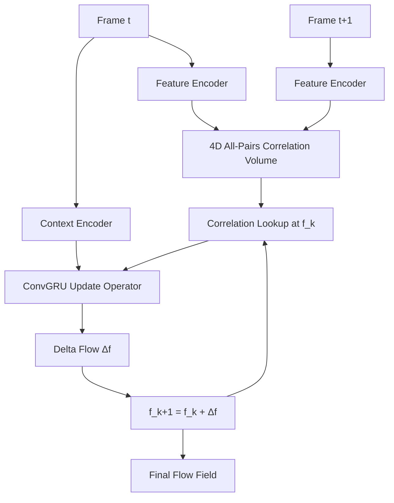

# Optical Flow and Visual Tracking

> **Last Updated:** June 2026
> **Level:** Advanced
> **Related Sections:** [Semantic Segmentation](./02_semantic_segmentation.md) | [Depth Estimation](./05_depth_estimation.md) | [Pose Estimation](./04_pose_estimation.md) | [Perception for Robotics](../06_robotics_and_embodied_ai/08_perception_for_robotics.md)

---

## Overview

Optical flow and visual tracking are the two central primitives for understanding temporal dynamics in video. **Optical flow** estimates the instantaneous 2D displacement field between consecutive frames: for every pixel p in frame I_t, the flow vector f(p) ∈ ℝ² gives the corresponding pixel location in frame I_{t+1}. **Tracking** operates over longer temporal horizons, maintaining identities of objects or point trajectories through video sequences despite occlusion, deformation, and appearance changes.

These tasks are deeply interrelated. Flow is used as a tracking cue (point tracking is integration of flow over time), and tracked correspondences can bootstrap self-supervised flow training. Both underpin downstream applications including video stabilization, action recognition, autonomous driving, and video generation conditioning. The 2020s have seen a convergence of the two problems: modern methods like CoTracker [Karaev2023] track any point jointly through a shared transformer, while SAM2 [Ravi2024] unifies segmentation and tracking into a single streaming memory model.

Architecturally, the dominant paradigm shifted from classical variational methods (Lucas-Kanade, Horn-Schunck) to deep learning with FlowNet [Dosovitskiy2015], then to cost-volume architectures (PWC-Net [Sun2018], RAFT [Teed2020]), and now to transformer-based joint tracking (CoTracker, TAPIR [Doersch2023]). The key insight of RAFT — building all-pairs 4D correlation volumes and iterating over them with a recurrent update operator — fundamentally changed the field and remains the architectural template for most top-performing flow and stereo methods.

---

## Classical Optical Flow

### Lucas-Kanade (1981)

The Lucas-Kanade (LK) algorithm assumes **spatial constancy** of brightness within a local window and linearizes the brightness constancy constraint:

```latex
I(p + \mathbf{f}, t+1) \approx I(p, t) + \nabla I \cdot \mathbf{f} + I_t = 0
```

For an N×N window, this yields an over-determined system solved by least squares:

```latex
\mathbf{f} = \left(\sum_{p \in \Omega} \nabla I \nabla I^\top\right)^{-1} \sum_{p \in \Omega} \nabla I \cdot I_t
```

The 2×2 matrix is the **structure tensor** (Harris matrix). LK fails at non-textured regions (rank-deficient matrix) and large displacements. Coarse-to-fine pyramid extension addresses large motion; the algorithm remains the backbone of classical feature trackers (e.g., KLT).

### Horn-Schunck (1981)

Horn-Schunck adds a global smoothness regularizer:

```latex
\mathcal{E}(\mathbf{f}) = \int \left[(I_x u + I_y v + I_t)^2 + \alpha^2(|\nabla u|^2 + |\nabla v|^2)\right] \, dp
```

minimized via Euler-Lagrange equations. This produces globally smooth flows but over-smooths motion discontinuities at object boundaries.

---

## Deep Optical Flow

### FlowNet / FlowNet2 (Dosovitskiy 2015, Ilg 2017)

FlowNet [Dosovitskiy2015] (ICCV 2015) introduced the first end-to-end trainable optical flow network, demonstrating that CNNs can learn to estimate flow from the FlyingChairs synthetic dataset. Two variants were proposed: FlowNetS (simple stacked two-frame encoder) and FlowNetC (explicit correlation layer between features at a central layer). FlowNet2 [Ilg2017] (CVPR 2017) dramatically improved accuracy by: (1) showing that **data curriculum** (training schedule) matters more than architecture; (2) stacking multiple FlowNet networks with intermediate warp-refinement. FlowNet2 reduced estimation error by over 50% versus FlowNetS while adding a faster lightweight variant (FlowNet2-s) running at 140 fps.

### PWC-Net (Sun 2018)

PWC-Net [Sun2018] (CVPR 2018 Oral) synthesized three inductive biases into a compact model:

1. **Learnable feature pyramid**: multi-scale features extracted by a shared encoder
2. **Warping**: the second frame's features are warped by the upsampled coarse flow estimate
3. **Cost volume**: a local correlation volume between warped features and first-frame features at each scale

```latex
\text{cv}(\mathbf{f}, d) = \mathbf{F}_1(p) \cdot \mathbf{F}_2(p + \mathbf{f} + d), \quad d \in [-D, D]^2
```

Flow is decoded from cost volumes hierarchically from coarse to fine. PWC-Net is 17× smaller than FlowNet2 and outperforms it on MPI Sintel and KITTI 2015, achieving roughly 35 fps on Sintel-resolution images.

### RAFT (Teed & Deng 2020)

RAFT [Teed2020] (ECCV 2020) is the most influential modern optical flow architecture. The three core ideas:

**All-pairs 4D correlation volume:** Unlike PWC-Net's local correlation, RAFT computes correlations between all pairs of pixels across both frames at a single scale, forming a 4D volume C ∈ ℝ^{H×W×H×W}. Multi-scale pooling creates a 4-level correlation pyramid without re-computing features:

```latex
C(\mathbf{f}_1^i, \mathbf{f}_2^j) = \langle \mathbf{f}_1^i, \mathbf{f}_2^j \rangle, \quad \forall (i, j) \in [H \times W] \times [H \times W]
```

**Recurrent iterative update:** A ConvGRU iteratively refines the flow field from an initial estimate of zero. At each iteration, the correlation lookup at the current estimated flow location retrieves a fixed neighborhood of correlation values, which together with flow and context features drive the GRU update:

```latex
\mathbf{f}^{k+1} = \mathbf{f}^k + \Delta\mathbf{f}^k, \quad \Delta\mathbf{f}^k = \text{GRU}(\mathbf{h}^k, \mathbf{c}^k, \text{lookup}(C, \mathbf{f}^k))
```

**Context network:** A separate encoder on only the first frame provides fixed context features injected at each GRU step.

RAFT achieved a 16% error reduction over prior state-of-the-art on KITTI 2015 (F1-all: 5.10%) and 30% on Sintel Final (EPE: 2.855 px) at publication. The RAFT architecture directly inspired RAFT-Stereo [Lipson2021] and FlowFormer [Huang2022].



---

## Flow Warping for Video Synthesis

A key application of optical flow is **feature/frame warping** for video tasks including video object segmentation, temporal consistency in depth, and video generation. Given source frame I_s and flow field f_{s→t}:

```latex
\hat{I}_t(p) = I_s(p + \mathbf{f}_{s \to t}(p))
```

implemented with bilinear sampling. In training of video models, flow warped features provide temporal correspondence without explicit attention over all past frames. The warping error (photometric consistency) also serves as a proxy for flow quality:

```latex
\mathcal{L}_{\text{warp}} = \|I_t - \hat{I}_t\|_1 \cdot (1 - M_{\text{occ}})
```

where M_occ is an occlusion mask estimated by forward-backward consistency.

---

## Multi-Object Tracking (MOT)

### SORT (Bewley 2016)

SORT [Bewley2016] (ICIP 2016) establishes the template for online MOT: for each frame, (1) predict tracklet locations forward via **Kalman filter** (constant velocity model), (2) associate detections to predicted tracklets via **Hungarian algorithm** on IoU cost matrix, (3) create/delete tracks by score thresholding. At 260 Hz SORT is orders of magnitude faster than contemporary methods while matching their accuracy on MOT2015.

### DeepSORT (Wojke 2017)

DeepSORT [Wojke2017] (ICIP 2017) extends SORT by replacing pure IoU association with a combined metric: IoU distance + appearance distance from a deep re-ID embedding. A CNN trained on the Market-1501 person re-ID dataset extracts 128-dimensional descriptors per detection crop. Association uses Mahalanobis distance in Kalman state space for motion and cosine distance in appearance space, combined via min-cost linear assignment. DeepSORT dramatically reduces ID switches on occlusions at modest computational overhead.

### ByteTrack (Zhang 2022)

ByteTrack [Zhang2022] (ECCV 2022) challenges the standard practice of discarding low-confidence detections. The key insight: **every detection box, including low-score ones**, carries useful information. ByteTrack performs two-pass association: first match high-confidence detections (score > τ_high) to existing tracks via IoU, then match **low-confidence detections** (τ_low < score < τ_high) to **unmatched tracks** from the first pass. This recovers occluded objects and improves recall without increasing false positives. ByteTrack achieves state-of-the-art HOTA/MOTA on MOT17/20 with essentially no additional computation over a base detector.

---

## Point Tracking (Track-Any-Point)

### CoTracker (Karaev 2023)

CoTracker [Karaev2023] (arXiv 2023, ECCV 2024) reformulates point tracking as a **joint transformer problem over multiple co-tracked points**. Standard methods track points independently, ignoring mutual correlations. CoTracker represents tracks as a grid of tokens (position, visibility, appearance, correlation features) and applies a transformer that jointly updates all tracks simultaneously. This enables physically consistent trajectories — e.g., points on a rigid body move coherently. CoTracker can track up to 70K points jointly and achieves state-of-the-art on TAP-Vid benchmarks.

### TAPIR (Doersch 2023)

TAPIR [Doersch2023] (ICCV 2023, Google DeepMind) introduces a two-stage tracking-any-point model: (1) **frame-independent initialization** that independently finds per-frame candidate matches for the query point using a learned appearance model; (2) **temporal refinement** that updates trajectory and query features based on local correlation context across time. TAPIR achieves an ~20% absolute AJ improvement over prior methods on TAP-Vid DAVIS and supports fast inference on long high-resolution videos.

### SAM2 for Video (Ravi 2024)

SAM 2 [Ravi2024] (arXiv 2408.00714, Meta AI) extends the Segment Anything Model to video by adding a **per-session streaming memory module** that propagates segmentation masks across frames. Given a user prompt (click, box, or mask) on any frame, SAM2 tracks the prompted object through the entire video in both forward and backward directions. The memory encoder stores object embeddings from past frames; the memory attention mechanism retrieves relevant memories when processing new frames. SAM2 unifies interactive image segmentation and video object tracking in a single architecture, achieving state-of-the-art performance on SA-V, MOSE, and LVOS video object segmentation benchmarks.

---

## Evaluation Metrics

### Optical Flow: EPE

**End-Point Error (EPE):** Average Euclidean distance between predicted and ground-truth flow vectors:

```latex
\text{EPE} = \frac{1}{N}\sum_{i} \|\hat{\mathbf{f}}_i - \mathbf{f}_i\|_2
```

Reported as average EPE (AEE) in pixels. The **Fl-all** metric (KITTI) counts the percentage of pixels with EPE > 3px AND EPE > 5% of GT magnitude.

### MOT Metrics: MOTA and HOTA

**MOTA (Multiple Object Tracking Accuracy):**

```latex
\text{MOTA} = 1 - \frac{\sum_t (FN_t + FP_t + \text{IDSW}_t)}{\sum_t \text{GT}_t}
```

MOTA penalizes false negatives (FN), false positives (FP), and identity switches (IDSW) equally; it biases toward detection quality over association quality.

**HOTA (Higher Order Tracking Accuracy)** [Luiten2021]: Decomposes into detection accuracy (DetA) and association accuracy (AssA):

```latex
\text{HOTA} = \sqrt{\text{DetA} \cdot \text{AssA}}
```

HOTA averages over localization thresholds (α ∈ [0.05, 0.95]) and is considered a more balanced metric than MOTA.

**IDF1:** Ratio of correctly identified detections over the mean of total true and computed detections; measures re-identification quality.

---

## Key Papers

| Paper | Authors | Year | Venue | Key Contribution |
|---|---|---|---|---|
| An Iterative Image Registration Technique with an Application to Stereo Vision (Lucas-Kanade) | Lucas, Kanade | 1981 | IJCAI | Spatial-constancy optical flow via least-squares patch matching |
| FlowNet: Learning Optical Flow with Convolutional Networks | Dosovitskiy, Fischer, Ilg et al. | 2015 | ICCV | First end-to-end CNN optical flow; FlowNetS/C; FlyingChairs dataset |
| FlowNet 2.0: Evolution of Optical Flow Estimation with Deep Networks | Ilg, Mayer, Saikia, Keuper, Dosovitskiy, Brox | 2017 | CVPR | Stacked networks + data curriculum; 50%+ error reduction |
| PWC-Net: CNNs for Optical Flow Using Pyramid, Warping, and Cost Volume | Sun, Yang, Liu, Kautz | 2018 | CVPR (Oral) | Learnable pyramid + warping + cost volume; 17× smaller than FlowNet2 |
| RAFT: Recurrent All-Pairs Field Transforms for Optical Flow | Teed, Deng | 2020 | ECCV | All-pairs 4D correlation + ConvGRU iteration; new SOTA on Sintel and KITTI |
| Simple Online and Realtime Tracking (SORT) | Bewley, Ge, Ott, Ramos, Upcroft | 2016 | ICIP | Kalman filter + Hungarian algorithm; 260 Hz real-time MOT |
| Simple Online and Realtime Tracking with a Deep Association Metric (DeepSORT) | Wojke, Bewley, Paulus | 2017 | ICIP | Appearance re-ID embedding + Mahalanobis-IoU hybrid for reduced ID switches |
| ByteTrack: Multi-Object Tracking by Associating Every Detection Box | Zhang, Sun, Jiang et al. | 2022 | ECCV | Two-pass association using low-confidence boxes; state-of-the-art HOTA/MOTA |
| CoTracker: It is Better to Track Together | Karaev, Rocco, Graham, Neverova, Vedaldi, Rupprecht | 2023 | arXiv / ECCV 2024 | Joint transformer tracking of 70K+ points; correlation-aware co-tracking |
| TAPIR: Tracking Any Point with per-frame Initialization and temporal Refinement | Doersch, Yang, Vecerik et al. | 2023 | ICCV | Two-stage TAP model; ~20% AJ improvement on TAP-Vid DAVIS |
| SAM 2: Segment Anything in Images and Videos | Ravi et al. | 2024 | arXiv | Streaming memory for video segmentation and object tracking; Meta AI |

---

## Benchmark Performance

| Model | Dataset | Metric | Score | Notes |
|---|---|---|---|---|
| RAFT | MPI Sintel Final | EPE ↓ | 2.855 | Generalization eval; 32 iters |
| RAFT | KITTI 2015 | F1-all ↓ | 5.10% | Fine-tuned on KITTI; 32 iters |
| PWC-Net | MPI Sintel Final | EPE ↓ | 5.04 | Without test-time augment |
| FlowNet2 | MPI Sintel Final | EPE ↓ | 6.02 | Stacked CNN; 8 fps |
| ByteTrack | MOT17 test | HOTA ↑ | 63.1 | YOLOX detector; standard protocol |
| ByteTrack | MOT17 test | MOTA ↑ | 80.3 | Standard MOT protocol |
| DeepSORT | MOT16 test | MOTA ↑ | 61.4 | DPM detector; 2017 baseline |
| TAPIR | TAP-Vid DAVIS | AJ ↑ | 61.3 | Reported in [Doersch2023] |
| CoTracker | TAP-Vid DAVIS | AJ ↑ | 60.6 | 70K joint points; [Karaev2023] |

---

## Pros & Cons

| Aspect | Pros | Cons |
|---|---|---|
| RAFT-style all-pairs flow | Highly accurate; robust to large motions; strong generalization | Memory-intensive 4D correlation volumes; inference slower than PWC-Net |
| PWC-Net-style cost volume | Fast; memory efficient; explicit geometric reasoning | Local search radius limits large-displacement accuracy |
| Joint point tracking (CoTracker, TAPIR) | Physically consistent trajectories; handles occlusion via joint context | Higher compute than per-point; memory grows with tracked point count |
| Online MOT (SORT/ByteTrack) | Real-time; no re-training needed for new domains; simple implementation | Relies on external detector quality; no global trajectory optimization |

---

## Open Problems & Research Gaps

- **Long-range flow and large displacement:** Standard RAFT with 32 iterations can still fail on fast-moving small objects or scene cuts; scaling all-pairs correlation to high-resolution video remains expensive.
- **Occlusion-aware flow:** Pixels that become occluded between frames violate brightness constancy; producing reliable confidence/occlusion masks alongside flow is still imperfect.
- **Unsupervised/self-supervised flow from video:** Photometric supervision works but breaks on dynamic illumination changes; combining with optical physics models is an open area.
- **Unified flow + depth + ego-motion:** Joint estimation of scene flow (3D motion), depth, and camera ego-motion from monocular video is theoretically elegant but difficult to train robustly.
- **Long-term point tracking:** Both CoTracker and TAPIR degrade on videos longer than a few hundred frames; efficient memory architectures for multi-minute tracking are needed.
- **Multi-object tracking with appearance-free re-ID:** ByteTrack's two-pass IoU approach fails on crowded scenes without appearance; stronger re-ID at low cost for edge deployment is needed.
- **Open-vocabulary tracking:** Tracking semantically specified objects (described by text prompts) across video without instance-level annotation is an emerging frontier (see SAM2, Grounded-SAM approaches).

---

## Further Reading

- [RAFT paper (arXiv:2003.12039)](https://arxiv.org/abs/2003.12039) — ECCV 2020 best paper [Teed2020]
- [ByteTrack GitHub (FoundationVision)](https://github.com/FoundationVision/ByteTrack) — Official implementation [Zhang2022]
- [TAPIR project page (DeepMind)](https://deepmind-tapir.github.io/) — Models and TAP-Vid benchmark [Doersch2023]
- [CoTracker GitHub (facebookresearch)](https://github.com/facebookresearch/co-tracker) — CoTracker and CoTracker3 [Karaev2023]
- [SAM2 GitHub (facebookresearch)](https://github.com/facebookresearch/sam2) — Official SAM2 implementation [Ravi2024]
- [PWC-Net GitHub (NVLabs)](https://github.com/NVlabs/PWC-Net) — Official NVIDIA implementation [Sun2018]
