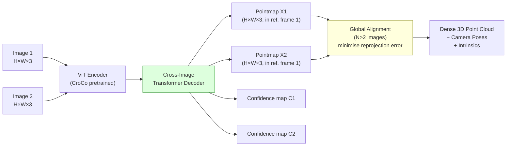

# 3D Reconstruction

> **Last Updated:** June 2026
> **Level:** Advanced
> **Related Sections:** [Structure-from-Motion & SLAM](../04_3d_vision_and_scene/03_sfm_and_slam.md) · [Neural Radiance Fields & Gaussian Splatting](../04_3d_vision_and_scene/01_nerf_and_gaussian_splatting.md) · [Depth Estimation](../04_3d_vision_and_scene/00_depth_estimation.md) · [Research Frontier](../12_research_frontier_2024_2026/00_foundation_models.md)

---

## Overview

3D reconstruction is the problem of inferring the geometry of a physical scene or object from one or more 2D images, recovering a representation—point cloud, mesh, voxel grid, signed distance field, or radiance field—that encodes shape, depth, and often appearance. The field spans a spectrum from classical multi-view geometry pipelines that require calibrated cameras and dense image overlap, to neural implicit representations that recover surface geometry from photometric supervision alone, to feedforward transformer-based models that infer 3D structure from a handful of uncalibrated images in a single forward pass.

The dominant classical approach—**Structure from Motion (SfM)** [Schönberger2016] followed by **Multi-View Stereo (MVS)** [Seitz2006]—solves reconstruction in two stages: (1) estimate camera poses by matching sparse local features (SIFT, SuperPoint) across images; (2) estimate dense depth maps by photometric consistency across multiple views. COLMAP [Schönberger2016] is the de facto gold-standard SfM+MVS pipeline. The learning-based MVS paradigm, initiated by MVSNet [Yao2018], replaces hand-crafted photometric consistency with learned cost volumes and recurrent regularisation, improving accuracy and robustness.

**Neural implicit representations** transformed reconstruction quality in 2020–2022. NeRF [Mildenhall2020] optimises a continuous radiance function (density + colour) for novel-view synthesis; NeuS [Wang2021] and VolSDF [Yariv2021] recast NeRF-style volume rendering around signed distance functions, enabling accurate surface extraction via marching cubes. These per-scene optimisation methods require tens to hundreds of images and hours of compute per scene.

The most significant recent advance is the emergence of **feedforward geometric models**. DUSt3R [Wang2024] reformulates all pairwise geometric problems—depth, pose, intrinsics—as **pointmap regression**: given a pair of images, a ViT encoder–decoder directly regresses two aligned 3D point clouds (one per image) expressed in a common coordinate frame, without any camera calibration input. MASt3R [Leroy2024] augments DUSt3R with dense local feature outputs, enabling simultaneous metric reconstruction and image matching. These models represent a paradigm shift analogous to DETR in detection: eliminating hand-crafted geometric pipelines in favour of end-to-end learning.

---

## Evaluation Metrics

**Chamfer Distance (CD):** measures bidirectional point-cloud proximity:

```latex
% Chamfer Distance between predicted set P and ground truth Q:
\text{CD}(P, Q) = \frac{1}{|P|} \sum_{p \in P} \min_{q \in Q} \|p - q\|_2
                + \frac{1}{|Q|} \sum_{q \in Q} \min_{p \in P} \|p - q\|_2

% Lower is better; measured in mm on DTU / cm on ShapeNet
% Symmetric; does not penalise topology errors
```

**F-Score at threshold τ:** precision–recall tradeoff for surface completeness and accuracy:

```latex
% Precision: fraction of predicted points within τ of any GT point
\text{Prec}(\tau) = \frac{1}{|P|}\sum_{p \in P} \mathbb{1}\bigl[\min_{q \in Q}\|p-q\|_2 < \tau\bigr]

% Recall: fraction of GT points within τ of any predicted point
\text{Rec}(\tau)  = \frac{1}{|Q|}\sum_{q \in Q} \mathbb{1}\bigl[\min_{p \in P}\|p-q\|_2 < \tau\bigr]

% F-Score
F(\tau) = \frac{2 \cdot \text{Prec}(\tau) \cdot \text{Rec}(\tau)}{\text{Prec}(\tau) + \text{Rec}(\tau)}

% Common thresholds: \tau = 1mm (DTU), 1% of diagonal (ShapeNet)
```

---

## Classical Multi-View Stereo

### COLMAP

**COLMAP** [Schönberger2016] (CVPR 2016): incremental SfM + patch-based MVS pipeline. SfM stage: SIFT feature extraction → exhaustive or vocabulary-tree matching → RANSAC-based Essential/Fundamental matrix estimation → bundle adjustment. MVS stage: depth maps estimated per image via photometric consistency over neighbouring views, then fused with geometric consistency filtering. COLMAP remains the reference method for 3D Gaussian Splatting and NeRF training pipelines. Authors: Johannes L. Schönberger, Jan-Michael Frahm.

**Limitations:** requires ≥20–50 images with sufficient overlap; fails under low texture, reflective surfaces, or repetitive patterns; hours of compute for large scenes.

### MVSNet

**MVSNet** [Yao2018] (ECCV 2018): the first end-to-end learning-based MVS. Backbone CNN extracts feature maps from N=5 input views; a differentiable **cost volume** is built by warping all source views into the reference-view camera frustum using homography planes at D=256 depth hypotheses; 3D CNNs regularise and regress the cost volume into a depth map. Key contributions: (1) differentiable homography warping; (2) variance-based cost metric across views. Achieves SOTA on DTU benchmark; generalises to Tanks and Temples without fine-tuning. Authors: Yao Yao, Zixin Luo, Shiwei Li et al.

**RNN-MVSNet / PatchmatchNet** [Wang2021b] replace 3D CNN regularisation with recurrent (GRU) or iterative PatchMatch, enabling higher resolutions and lower memory.

---

## Single-View 3D Reconstruction

**Pixel2Mesh** [Wang2018] (ECCV 2018): predicts a 3D triangular mesh from a single RGB image by iteratively deforming an icosphere using graph convolutional networks that fuse image features via perspective projection. A coarse-to-fine cascade deforms at three resolutions. Evaluated on ShapeNet with Chamfer Distance and F-Score@1 %. Authors: Nanyang Wang, Yinda Zhang et al.

**Occupancy Networks** [Mescheder2019]: learn a continuous implicit occupancy function f: ℝ^3 → [0,1] conditioned on image features; extract surface via Marching Cubes. More topology-flexible than mesh deformation.

**LRM — Large Reconstruction Model** [Hong2023] (ICLR 2024): the first large-scale single-image 3D reconstruction model. A ViT image encoder extracts features from a single input image; a multi-layer Transformer decoder with camera-conditioned cross-attention regresses a triplane NeRF representation (three axis-aligned 2D feature planes) from which geometry and appearance are decoded. Trained on ~1 M multi-view objects from Objaverse and MVImgNet. Achieves photorealistic novel-view synthesis and extractable mesh (TSDF fusion) from a single image in ~5 seconds on a single GPU. 500 M parameters. Authors: Yicong Hong, Kai Zhang, Jiuxiang Gu, Sai Bi et al. arXiv 2311.04400.

---

## Neural Implicit Surface Reconstruction

**NeRF** [Mildenhall2020] (ECCV 2020): a MLP f_θ(x, d) → (c, σ) maps 3D point position **x** and view direction **d** to colour **c** and volume density σ. Volume rendering integrates c·σ along each ray to produce a 2D pixel colour; backpropagation through the rendering equation trains the MLP solely on posed RGB images. Geometry can be extracted as the surface where σ is maximal, but NeRF's density field is not a proper surface representation.

**NeuS** [Wang2021] (NeurIPS 2021): replaces volume density with a **Signed Distance Function (SDF)**: f_θ(x) → s ∈ ℝ where s = 0 is the surface. A logistic function converts SDF to density, ensuring the weight function in volume rendering peaks unbiasedly at the zero-level set. This allows accurate surface extraction via Marching Cubes. NeuS achieves mean Chamfer distance **0.77 mm** (with mask) and **0.84 mm** (without mask) on DTU, significantly outperforming IDR (0.90) and NeRF (1.54). Authors: Peng Wang, Lingjie Liu, Yuan Liu et al.

```latex
% NeuS density from SDF (simplified):
\sigma(t) = \frac{d}{dt}\Phi_s(f(p(t)))

% \Phi_s(x) = \text{sigmoid}(-x/s) is the CDF of the logistic distribution
% s is a learnable scale parameter (decreases during training)
% The weight function w(t) = T(t) \cdot \sigma(t) peaks at the SDF zero-crossing
% without bias even under occlusion, unlike prior NeRF-based approaches
```

**VolSDF** [Yariv2021] (NeurIPS 2021): independently proposes volume rendering of SDFs with a Laplace distribution density. Achieves Chamfer distance **0.86 mm** on DTU. Introduces an opacity approximation enabling analytical ray sampling without fine/coarse networks.

**HF-NeuS** [Wang2022]: adds high-frequency detail by disentangling coarse geometry (SDF) from fine texture displacement, improving reconstruction of thin structures.

**3DGS-based surface reconstruction** (2024): SuGaR [Guédon2024] and 2DGS [Huang2024] extend 3D Gaussian Splatting with surface constraints (binding Gaussians to mesh faces, or flattening Gaussians to 2D discs), enabling fast surface reconstruction from multi-view images at NeRF-comparable quality.

---

## Feedforward Geometric Foundation Models

### DUSt3R

**DUSt3R** [Wang2024] (CVPR 2024): "Dense and Unconstrained Stereo 3D Reconstruction." Given two images (I_1, I_2), a ViT encoder (CroCo-pretrained [Weinzaepfl2022]) separately processes each image; a cross-image Transformer decoder produces two **pointmaps** X_1 ∈ ℝ^(H×W×3) and X_2 ∈ ℝ^(H×W×3) expressed in the reference frame of image 1. Each pixel in each image is mapped to a 3D point with confidence. No camera intrinsics, extrinsics, or overlap knowledge is required. For N>2 images, a global alignment procedure minimises reprojection between all pairwise pointmaps under a shared global frame via fast gradient descent. Camera poses and intrinsics are then analytically recovered from the pointmaps. arXiv 2312.14132. Authors: Shuzhe Wang, Vincent Leroy, Yohan Cabon, Boris Chidlovskii, Jérôme Revaud (NAVER LABS Europe).



### MASt3R

**MASt3R** [Leroy2024] (ECCV 2024): "Grounding Image Matching in 3D with MASt3R." Augments DUSt3R with a **dense local feature head** that outputs descriptor maps alongside pointmaps. The matching loss maximises feature similarity at corresponding 3D-consistent points, enabling simultaneous metric 3D reconstruction and visual matching. MASt3R outperforms DUSt3R on multiple pose estimation and visual localisation benchmarks, and provides a complete SfM pipeline (MASt3R-SfM) without requiring any prior feature matcher. Achieves camera rotation error within 2–3° and translation error within 1–2 % on standard benchmarks. Authors: Vincent Leroy, Yohan Cabon, Jérôme Revaud.

---

## Key Papers

| Paper | Authors | Year | Venue | Key Contribution |
|-------|---------|------|-------|-----------------|
| COLMAP (SfM + MVS) | Schönberger, Frahm | 2016 | CVPR | Gold-standard incremental SfM + patch-based MVS |
| MVSNet | Yao, Luo, Li et al. | 2018 | ECCV | Differentiable cost volume; learned MVS |
| Pixel2Mesh | Wang, Zhang et al. | 2018 | ECCV | GCN mesh deformation from single image |
| NeRF | Mildenhall, Tancik et al. | 2020 | ECCV | Volume rendering neural radiance fields |
| NeuS | Wang, Liu et al. | 2021 | NeurIPS | Unbiased SDF volume rendering; 0.77mm DTU |
| VolSDF | Yariv, Gu et al. | 2021 | NeurIPS | Laplace density from SDF; 0.86mm DTU |
| LRM: Large Reconstruction Model | Hong, Zhang et al. | 2023 | ICLR 2024 | Single-image triplane NeRF; 500M params; 5s |
| DUSt3R | Wang, Leroy et al. | 2023 | CVPR 2024 | Pointmap regression; no camera calibration needed |
| MASt3R | Leroy, Cabon, Revaud | 2024 | ECCV 2024 | DUSt3R + dense matching; SfM pipeline |

---

## Benchmark Performance

### DTU Dataset — Chamfer Distance (mm, lower is better)

| Method | CD (with mask) | CD (without mask) | Type |
|--------|---------------|-----------------|------|
| COLMAP | 0.50 | — | Classical MVS |
| MVSNet | ~0.45 | — | Learned MVS (dense) |
| NeRF | 1.54 | 1.49 | Neural implicit |
| IDR | 0.90 | — | Neural implicit |
| NeuS | **0.77** | 0.84 | SDF volume rendering |
| VolSDF | 0.86 | — | SDF Laplace density |
| HF-NeuS | 0.76 | — | SDF + high-freq |
| DUSt3R | not publicly reported | — | Feedforward pointmap |

### ShapeNet — Single-Image 3D (Chamfer Distance × 10^3, lower is better)

| Method | Mean CD | F@1% | Notes |
|--------|---------|------|-------|
| Pixel2Mesh | 0.591 | — | Mesh deformation; 13 ShapeNet categories |
| Occupancy Networks | 0.551 | — | Implicit function |
| LRM | not publicly reported per-class | — | NeRF-based; qualitative SOTA |

### Tanks and Temples — F-Score (%, higher is better)

| Method | Intermediate | Advanced | Notes |
|--------|-------------|---------|-------|
| COLMAP | 42.1 | 27.2 | Classical MVS |
| MVSNet | 43.5 | — | Generalised without fine-tuning |
| PatchmatchNet | 53.2 | 32.6 | Iterative PatchMatch |
| DUSt3R | not publicly reported on Tanks | — | Architecture targets unconstrained scenes |

---

## Pros & Cons

| Aspect | Pros | Cons |
|--------|------|------|
| Classical MVS (COLMAP) | Well-understood; no training data; complete pipeline; high accuracy | Requires calibrated cameras; fails on low-texture / reflective surfaces; slow |
| Learned MVS (MVSNet) | Better robustness to appearance variation; generalises across scenes | Still needs posed cameras from SfM; depth map fusion artifacts |
| Neural implicit (NeuS/VolSDF) | Accurate thin structures; differentiable; single-scene over-fitting | Per-scene optimisation (hours); requires calibrated posed images; no real-time |
| Feedforward (DUSt3R/MASt3R) | Uncalibrated; fast inference; handles sparse views; generalises zero-shot | Coarser reconstruction than per-scene methods; limited large-scene scalability |
| Single-image (LRM/Pixel2Mesh) | No multi-view requirement; fast; large-scale training | Ambiguous depth from single view; hallucination of occluded geometry |

---

## Open Problems & Research Gaps

- **Large-scale outdoor reconstruction:** DUSt3R and MASt3R were designed for object-level and room-scale scenes; extending feedforward reconstruction to unbounded outdoor (autonomous driving, aerial) scenes with thousands of images remains an open challenge.
- **Accurate surface normals and thin structures:** Neural SDFs struggle to reconstruct thin objects (grass, hair, wires) because the zero-level set degenerates; hybrid representations combining NeRF density near surfaces with SDF for boundaries are being explored but not standardised.
- **Real-time neural reconstruction:** 3D Gaussian Splatting enables real-time rendering but reconstruction still requires minutes to hours of optimisation; truly real-time neural reconstruction (e.g., for robotics or AR) at scene scale is unsolved.
- **Material and appearance disentanglement:** Most reconstruction methods conflate geometry with surface appearance; separating intrinsic albedo, surface normals, and illumination from multi-view images (inverse rendering) without known lighting is still an open problem.
- **Generalisation to in-the-wild textures:** Learned MVS and feedforward models trained on synthetic/curated data can fail on real scenes with unusual materials; domain randomisation and self-supervised adaptation strategies are incomplete.
- **Uncertainty quantification:** Surface reconstruction models rarely provide per-point uncertainty estimates; calibrated 3D confidence maps would be critical for robotic manipulation and AR scene understanding where erroneous geometry is dangerous.
- **Integration with scene semantics:** Most geometric reconstruction pipelines are class-agnostic; jointly reconstructing geometry and semantic labels (panoptic 3D reconstruction) at scale, particularly in open-vocabulary settings, is an emerging research area.

---

## Further Reading

- [COLMAP: Structure-from-Motion Revisited (Schönberger & Frahm, 2016)](https://openaccess.thecvf.com/content_cvpr_2016/papers/Schonberger_Structure-From-Motion_Revisited_CVPR_2016_paper.pdf)
- [MVSNet: Depth Inference for Unstructured Multi-view Stereo (Yao et al., 2018)](https://arxiv.org/abs/1804.02505)
- [NeuS: Learning Neural Implicit Surfaces by Volume Rendering (Wang et al., 2021)](https://arxiv.org/abs/2106.10689)
- [LRM: Large Reconstruction Model for Single Image to 3D (Hong et al., 2023)](https://arxiv.org/abs/2311.04400)
- [DUSt3R: Geometric 3D Vision Made Easy (Wang et al., 2024)](https://arxiv.org/abs/2312.14132)
- [MASt3R: Grounding Image Matching in 3D (Leroy et al., 2024)](https://arxiv.org/abs/2406.09756)
