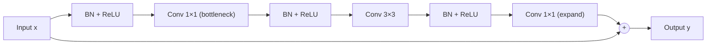
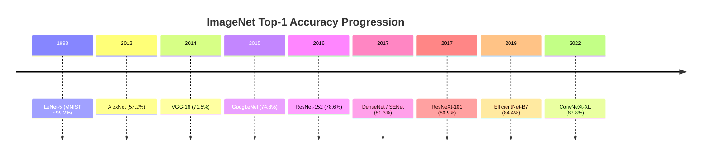

# CNN Architectures: From LeNet to ConvNeXt

> **Last Updated:** June 2026
> **Level:** Intermediate → Advanced
> **Related Sections:**
> - [Image Classification](../02_core_tasks/00_image_classification.md)
> - [Vision Transformers](./01_vision_transformers.md)
> - [Hybrid Architectures](./02_hybrid_architectures.md)
> - [Efficient Architectures](../09_efficiency_and_deployment/01_efficient_architectures.md)

---

## Overview

Convolutional Neural Networks (CNNs) constitute the foundational backbone family of modern computer vision, tracing a continuous lineage from Yann LeCun's LeNet-5 (1998) to the ConvNeXt family (Liu et al., CVPR 2022). Over this span, the dominant design vocabulary has converged on a small set of orthogonal principles: **receptive field management** (stride, dilation, pooling), **skip/residual connectivity** (He et al., 2016), **normalization strategies** (Batch Norm, Layer Norm, Group Norm), **channel attention** (Hu et al., 2018), **depthwise-separable convolutions** (Howard et al., 2017), and **compound scaling** (Tan & Le, 2019). Each era's breakthrough architecture can largely be understood as a disciplined combination of these primitives under a given parameter/FLOP budget.

The ImageNet Large Scale Visual Recognition Challenge (ILSVRC) served as the defining benchmark from 2010 through 2017, compressing more than a decade of architectural progress into eight competition cycles. AlexNet's 2012 victory demonstrated that GPU-trained deep CNNs could shatter prior handcrafted-feature baselines; VGGNet showed that depth with 3×3 convolutions alone was a powerful scaling axis; GoogLeNet proved that multi-scale parallel branches (Inception modules) could reduce parameters while increasing depth; ResNet resolved the vanishing-gradient barrier through identity shortcut connections and made 100+-layer networks routinely trainable. The subsequent post-ResNet era — DenseNet, ResNeXt, SENet, EfficientNet, ConvNeXt — can be read as systematic ablations exploring width, cardinality, channel recalibration, and the alignment of CNN inductive biases with Transformer-derived training recipes.

A critical and still-active research question concerns whether CNNs and Vision Transformers occupy the same fundamental representation class or whether their inductive biases (local spatial connectivity vs. global self-attention) produce qualitatively different learned representations [Liu2022]. The ConvNeXt result, which matches Swin Transformer accuracy after modernizing a ResNet-50 training recipe without any attention mechanism, suggests that much of the observed ViT advantage in the 2021–2022 period was attributable to training recipe differences rather than architectural necessity. This observation motivates continued hybrid and purely convolutional research alongside the Transformer mainstream.

---

## Core Design Principles

### Receptive Fields

The effective receptive field of a unit in layer $l$ of a CNN with uniform kernel size $k$ and unit stride is:

```
RF(l) = 1 + l * (k - 1)
```

With strided convolutions or pooling of stride $s$, receptive field growth accelerates. In practice, deeper layers have large theoretical receptive fields but their effective receptive fields (the region that actually influences a unit's output via gradient magnitude) are considerably smaller [Luo2016]. Dilated (atrous) convolutions with dilation rate $d$ expand the receptive field to:

```
RF_dilated(l) = 1 + l * d * (k - 1)
```

without increasing parameter count, enabling dense prediction without spatial resolution loss.

### Skip Connections and Residual Learning

The core ResNet identity shortcut [He2016] is:

```
y = F(x, {W_i}) + x
```

where $F$ represents the residual mapping to be learned. When input and output dimensions differ, a linear projection $W_s$ is applied:

```
y = F(x, {W_i}) + W_s * x
```

This formulation ensures gradient flow through an identity path, making the optimization landscape smoother and enabling networks of 50–1000+ layers to train without degeneration.

### Depthwise-Separable Convolutions

Standard convolution with kernel $K \in \mathbb{R}^{k \times k \times C_{in} \times C_{out}}$ has cost $O(k^2 \cdot C_{in} \cdot C_{out} \cdot H \cdot W)$. Depthwise-separable factorization [Howard2017] replaces this with:

1. Depthwise conv (one filter per input channel): cost $O(k^2 \cdot C_{in} \cdot H \cdot W)$
2. Pointwise (1×1) conv: cost $O(C_{in} \cdot C_{out} \cdot H \cdot W)$

Reduction ratio: $\frac{1}{C_{out}} + \frac{1}{k^2}$, typically ~8–9× for $k=3$.

### Compound Scaling (EfficientNet)

[Tan2019] formalized scaling along three axes — depth $d$, width $w$, and resolution $r$ — via a compound coefficient $\phi$:

```
d = alpha^phi
w = beta^phi
r = gamma^phi

subject to: alpha * beta^2 * gamma^2 ≈ 2
            alpha >= 1, beta >= 1, gamma >= 1
```

The constraint ensures that total FLOPs scale as approximately $2^\phi$ per doubling. Constants $\alpha, \beta, \gamma$ are found by a small grid search at $\phi = 1$.

---

## Architecture Lineage

### LeNet-5 (LeCun et al., 1998)
Seminal architecture for handwritten digit recognition (MNIST). Used $5\times5$ conv layers, average pooling, tanh activations, and a fully-connected classifier. Established the conv → pool → FC pipeline that remained canonical for over a decade. Top-1 on MNIST: ~99.2%.

### AlexNet (Krizhevsky et al., 2012)
Won ILSVRC 2012 with a top-5 error of 15.3% (runner-up: 26.2%). Key innovations: ReLU activations (replacing tanh/sigmoid), dropout for regularization, data augmentation (random crops, flips, color jitter), training on two GTX 580 GPUs via model-parallel split. Architecture: 5 conv layers + 3 FC layers, ~60M parameters. This result catalyzed the modern deep learning era in computer vision.

### VGGNet (Simonyan & Zisserman, 2014/ICLR 2015)
Systematic study showing that depth with exclusively $3\times3$ convolutions achieves competitive accuracy. VGG-16 and VGG-19 achieved 71.5% top-1 on ImageNet. Key insight: two stacked $3\times3$ convolutions have the same receptive field as one $5\times5$ convolution but with fewer parameters and an extra nonlinearity. VGG's uniform design made it the go-to transfer learning backbone for several years, despite ~138M parameters.

### GoogLeNet / Inception-v1 (Szegedy et al., 2015)
Introduced the Inception module: parallel branches of $1\times1$, $3\times3$, $5\times5$ convolutions and $3\times3$ max-pooling, concatenated along the channel dimension. $1\times1$ convolutions are used as dimensionality-reduction bottlenecks before wider convolutions. Achieved 74.8% top-1, 6.67% top-5 on ImageNet with only ~6.8M parameters vs. AlexNet's 60M. The Inception family continued with v2 (Batch Norm), v3 (factorized convolutions), and Inception-ResNet variants.

### ResNet (He et al., CVPR 2016)
Introduced identity shortcut connections, enabling training of networks up to 1000+ layers. ResNet-152 won ILSVRC 2015 with 3.57% top-5 error (ensemble), 78.57% top-1 (single model). ResNet-50 achieves ~77.15% top-1. The bottleneck design (1×1→3×3→1×1 convolutions) reduces computation in deeper variants. Arguably the most impactful CNN architecture, still widely used as a backbone in detection, segmentation, and self-supervised learning.

### DenseNet (Huang et al., CVPR 2017, Best Paper Award)
Extends residual connectivity to dense connections: each layer receives feature maps from all preceding layers in the dense block. For a network with $L$ layers, there are $L(L+1)/2$ direct connections. Advantages: feature reuse, vanishing-gradient mitigation, reduced parameter count. DenseNet-201 achieves comparable ImageNet accuracy to ResNet-152 with substantially fewer parameters. DenseNet-BC (bottleneck + compression) reduces FLOPs further.

### ResNeXt (Xie et al., CVPR 2017)
Introduces **cardinality** (number of parallel transformation paths) as a third dimension of scaling alongside depth and width. A ResNeXt block with cardinality $C$ aggregates $C$ independent transformations:

```
y = sum_{i=1}^{C} T_i(x) + x
```

This is mathematically equivalent to grouped convolutions. ResNeXt-101 (32×4d) achieves 80.9% top-1, outperforming ResNet-101 by ~1.5% with similar FLOP cost. ResNeXt formed the basis of the ILSVRC 2016 runner-up entry.

### SENet (Hu et al., CVPR 2018)
Squeeze-and-Excitation (SE) blocks introduce channel-wise attention via a two-step process: (1) **squeeze**: global average pooling to produce a channel descriptor; (2) **excitation**: two FC layers with sigmoid to produce per-channel scaling weights. SE-ResNet-154 achieves 81.32% top-1 on ImageNet. The SE block won 1st place in ILSVRC 2017, reducing top-5 error to 2.251%. The SE mechanism adds minimal overhead (<1% extra parameters) and is routinely embedded in modern architectures.

### EfficientNet (Tan & Le, ICML 2019)
Proposed neural architecture search (NAS) to find a base architecture (EfficientNet-B0) followed by compound scaling. EfficientNet-B7 achieves **84.4% top-1 / 97.1% top-5** on ImageNet, while being 8.4× smaller and 6.1× faster than the then-best ConvNet (GPipe). The compound coefficient formulation allows a single family to cover the full mobile-to-server spectrum (B0–B7). EfficientNetV2 [Tan2021] further incorporates Fused-MBConv blocks and progressive training, reaching 87.3% top-1.

### ConvNeXt (Liu et al., CVPR 2022)
"A ConvNet for the 2020s" progressively modernizes a ResNet-50 by adopting Swin Transformer training recipes and architectural micro-decisions: (1) patchify stem (4×4 non-overlapping conv), (2) depth-wise 7×7 convolutions, (3) inverted bottleneck, (4) GELU activations, (5) Layer Norm instead of Batch Norm, (6) fewer normalization layers, (7) separating downsampling layers. ConvNeXt-XL achieves **87.8% top-1** on ImageNet (with ImageNet-22K pre-training), matching or exceeding Swin-L, while retaining the simplicity of ConvNets. This result demonstrated that CNN–Transformer performance gaps in 2021 were largely recipe artifacts.

---

## Architecture Diagrams

### ResNet Residual Block



### CNN Architecture Evolution Timeline



---

## Key Papers

| Paper | Authors | Year | Venue | Key Contribution |
|-------|---------|------|-------|-----------------|
| Gradient-Based Learning Applied to Document Recognition | LeCun, Bottou, Bengio, Haffner | 1998 | Proc. IEEE | LeNet-5: foundational conv-pool-FC pipeline for digit recognition |
| ImageNet Classification with Deep CNNs (AlexNet) | Krizhevsky, Sutskever, Hinton | 2012 | NeurIPS | Deep CNN + GPU training + ReLU + dropout; broke ILSVRC 2012 |
| Very Deep Convolutional Networks (VGGNet) | Simonyan, Zisserman | 2015 | ICLR | Systematic depth study with 3×3 convolutions; strong transfer baseline |
| Deep Residual Learning for Image Recognition (ResNet) | He, Zhang, Ren, Sun | 2016 | CVPR | Identity shortcuts enabling 152-layer nets; 3.57% top-5 ILSVRC 2015 |
| Densely Connected Convolutional Networks (DenseNet) | Huang, Liu, van der Maaten, Weinberger | 2017 | CVPR | Dense connectivity for feature reuse; CVPR 2017 Best Paper |
| Aggregated Residual Transformations (ResNeXt) | Xie, Girshick, Dollár, Tu, He | 2017 | CVPR | Cardinality as a new scaling dimension; grouped convolutions |
| Squeeze-and-Excitation Networks (SENet) | Hu, Shen, Sun | 2018 | CVPR | Channel-wise attention via squeeze-excitation; ILSVRC 2017 winner |
| EfficientNet: Rethinking Model Scaling | Tan, Le | 2019 | ICML | Compound scaling of depth/width/resolution; B7: 84.4% top-1 |
| A ConvNet for the 2020s (ConvNeXt) | Liu, Mao, Wu, Feichtenhofer, Darrell, Xie | 2022 | CVPR | Modernized ResNet matches Swin Transformer; 87.8% top-1 |

---

## Benchmark Performance

| Model | Dataset | Metric | Score | Notes |
|-------|---------|--------|-------|-------|
| AlexNet | ImageNet-1K | Top-1 Acc. | 57.2% | Trained from scratch, single model |
| VGG-16 | ImageNet-1K | Top-1 Acc. | 71.5% | Center crop evaluation |
| GoogLeNet / Inception-v1 | ImageNet-1K | Top-1 Acc. | 74.8% | ~6.8M parameters |
| ResNet-50 | ImageNet-1K | Top-1 Acc. | 77.15% | Standard training recipe |
| ResNet-152 | ImageNet-1K | Top-5 Err. | 3.57% | Ensemble; ILSVRC 2015 winner |
| SENet-154 | ImageNet-1K | Top-1 Acc. | 81.32% | 224×224 center crop |
| ResNeXt-101 (32×4d) | ImageNet-1K | Top-1 Acc. | 80.9% | Grouped convolutions, cardinality=32 |
| EfficientNet-B7 | ImageNet-1K | Top-1 Acc. | 84.4% | NAS base + compound scaling |
| EfficientNetV2-L | ImageNet-1K | Top-1 Acc. | 85.7% | With ImageNet-21K pre-training |
| ConvNeXt-XL | ImageNet-1K | Top-1 Acc. | 87.8% | ImageNet-22K pre-training + fine-tune |

---

## Pros & Cons

| Aspect | Pros | Cons |
|--------|------|------|
| Inductive Bias | Strong locality and translation equivariance; excellent on small datasets | Fixed local receptive fields limit global context modeling; quadratic receptive field growth requires many layers |
| Computational Efficiency | Highly optimized CUDA kernels; excellent hardware utilization; structured sparsity | Large models (VGG, ResNet-152) have high parameter counts; depthwise convs may be memory-bandwidth limited |
| Scalability | Compound scaling (EfficientNet) provides principled FLOPs/accuracy tradeoff | Performance appears to plateau around 87–88% ImageNet-1K without extra data; ViTs scale better at billion-param regime |
| Training Stability | Batch Norm + residual connections make optimization straightforward; well-understood hyperparameter landscape | Batch Norm requires sufficiently large batch sizes; performance degrades under very small batches |
| Transfer Learning | Rich, general-purpose features; widely supported in frameworks | Pre-trained CNN features may generalize less well than ViTs on tasks requiring long-range context |

---

## Open Problems & Research Gaps

1. **Global Context Without Attention**: Can purely convolutional architectures capture long-range dependencies as effectively as self-attention without the quadratic cost? Large-kernel ConvNets (RepLKNet, SLaK) with kernels up to 51×51 explore this direction but have not yet closed the performance gap on dense prediction tasks at scale.

2. **Effective Receptive Field Utilization**: The gap between theoretical and effective receptive fields in deep CNNs remains poorly understood. At what depth and width does increasing the theoretical receptive field yield diminishing returns, and how can architectural choices be made to maximize effective receptive fields?

3. **CNN Scaling Laws**: EfficientNet provides a heuristic compound scaling rule, but the field lacks rigorous theoretical scaling laws comparable to those derived for Transformers. Characterizing CNN performance as a function of parameters, data, and compute at billion-parameter scale is an open empirical challenge.

4. **Batch Normalization Alternatives**: Batch Norm introduces undesirable train/test discrepancy and batch-size dependence. Layer Norm and Group Norm partially address this, but their performance lags on certain CNN architectures. Principled alternatives that retain BN's optimization benefits without its limitations are an active research area.

5. **Robustness and Out-of-Distribution Generalization**: CNNs are notoriously susceptible to texture bias [Geirhos2019] and distribution shift. While data augmentation (AugMix, RandAugment) and adversarial training improve robustness, the fundamental causes of CNN brittleness and strategies for principled mitigation remain open.

6. **CNN-Specific Self-Supervised Pre-Training**: Masked image modeling methods (MAE, BEiT) primarily benefit ViTs due to their patch-level processing. Adapting competitive self-supervised objectives for CNNs — which lack the patch tokenization structure — without architectural modification is an unsolved challenge.

7. **Architecture Search Beyond Compound Scaling**: NAS methods that found EfficientNet-B0 are computationally expensive and may not generalize across domains. Hardware-aware, differentiable NAS that discovers new motifs (beyond inverted bottlenecks and depthwise separable convolutions) for diverse deployment constraints (edge TPU, mobile NPU, server GPU) remains a frontier.

---

## Further Reading

- [He et al., Deep Residual Learning for Image Recognition (arXiv:1512.03385)](https://arxiv.org/abs/1512.03385)
- [Tan & Le, EfficientNet: Rethinking Model Scaling for CNNs (ICML 2019)](https://proceedings.mlr.press/v97/tan19a.html)
- [Liu et al., A ConvNet for the 2020s (CVPR 2022 / arXiv:2201.03545)](https://arxiv.org/abs/2201.03545)
- [Hu et al., Squeeze-and-Excitation Networks (CVPR 2018)](https://openaccess.thecvf.com/content_cvpr_2018/html/Hu_Squeeze-and-Excitation_Networks_CVPR_2018_paper.html)
- [Aman's AI Journal – CNN Architectures (cs231n survey)](https://aman.ai/cs231n/cnn-arch/)
- [Papers With Code – ImageNet Benchmark](https://paperswithcode.com/sota/image-classification-on-imagenet)
