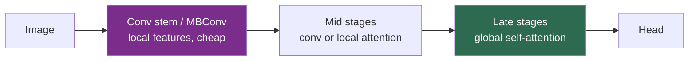

# Hybrid CNN-Transformer Architectures

> **Last Updated:** June 2026
> **Level:** Intermediate
> **Related Sections:**
> - [Vision Transformers](./01_vision_transformers.md)
> - [CNN Architectures](./00_cnn_architectures.md)
> - [State Space Models](./05_state_space_models.md)
> - [Efficient Architectures](../09_efficiency_and_deployment/01_efficient_architectures.md)

---

## Overview

Hybrid CNN-Transformer architectures occupy the pragmatic middle ground in the post-2021 backbone landscape: they fuse the **local inductive bias and hardware efficiency of convolutions** with the **global receptive field of self-attention**. The motivation is empirical. Pure ViTs lack locality and translation equivariance and therefore underperform CNNs when trained on small or medium datasets and at high resolution; pure CNNs aggregate long-range context only slowly through stacked layers. Hybrids resolve this tension by using convolution where it helps most—early layers, where low-level features are local and abundant—and attention where it helps most—later layers, where global semantic context matters. The result is a family of models (CvT, CoAtNet, LeViT, MobileViT, MaxViT) that consistently match or beat both pure paradigms at a given compute budget, especially on small data.

The deepest lesson of this line is the **convergence of CNN and Transformer design**. ConvNeXt [Liu2022] is a *pure CNN* derived by progressively modernizing a ResNet with Transformer-inspired choices (patchify stem, depthwise 7×7 kernels, inverted bottleneck, GELU, LayerNorm, Swin-matched stage ratios) until it matches Swin's accuracy—demonstrating that much of the Transformer's advantage was the *training recipe and macro design*, not attention per se. This file surveys the principal hybrids, the mechanisms by which they combine the two operators, and the small-data and efficiency regimes where they dominate.

---

## Mechanisms of Combination

Hybrids differ in *how* and *where* they inject convolution:

- **Convolutional tokenization/stem** — replace ViT's linear patch projection with overlapping convolutions (CvT, LeViT's 4-conv stem) for richer low-level features and implicit positional information.
- **Convolution in the projection** — depthwise-separable conv for Q/K/V projections (CvT's convolutional projection), eliminating explicit positional encodings.
- **Staged conv→attention** — convolution (MBConv) in early stages, attention in late stages (CoAtNet: S0 conv stem, S1–S2 MBConv, S3–S4 Transformer).
- **Attention-as-convolution** — fold global attention inside a conv-style block (MobileViT unfolds patches, applies attention across corresponding positions, folds back).
- **Multi-axis attention** — combine blocked local + dilated grid attention for linear-complexity global reach (MaxViT).

---

## Principal Architectures

### CvT — Convolutional Vision Transformer
**CvT** [Wu2021] (ICCV 2021, Microsoft) introduces **convolutional token embedding** (overlapping convs across a 3-stage hierarchy) and **convolutional projection** (depthwise-separable conv for Q/K/V), and *eliminates positional encodings* because convolution encodes position implicitly. CvT-13 (20M) reaches 81.6%; CvT-W24 (277M, IN-22K) reaches 87.7%.

### CoAtNet — Convolution + Attention
**CoAtNet** [Dai2021] (NeurIPS 2021, Google) unifies depthwise convolution and self-attention via **relative attention**, stacking MBConv early and Transformer late. CoAtNet-2 reaches 84.1% (IN-1K) / 87.1% (IN-21K); the largest variant reaches 88.56% with IN-21K and 90.88% with JFT-3B pretraining—among the highest reported. It explicitly frames the convolution-for-generalization / attention-for-capacity trade-off.

### LeViT — ViT in ConvNet's Clothing
**LeViT** [Graham2021] (ICCV 2021, Meta) targets **inference speed**: a 4-layer conv stem, attention-based downsampling, learned per-head **attention bias** replacing positional embeddings, and shrinking head counts. LeViT-128S matches DeiT-Tiny's 76.6% with ~4× fewer FLOPs.

### MobileViT — Mobile-Friendly Hybrid
**MobileViT** [Mehta2022] (ICLR 2022, Apple) treats the Transformer as a convolution: it unfolds non-overlapping patches, applies global attention across corresponding inter-patch positions, then folds back, interleaved with MBConv blocks. MobileViT-S (5.6M) reaches 78.4%, beating MobileNetV3-Large (~75.2%) at similar size and DeiT-S (79.8%) with ~4× fewer parameters.

### MaxViT — Multi-Axis Vision Transformer
**MaxViT** [Tu2022] (ECCV 2022, Google + UT Austin) alternates **blocked local attention** (within P×P windows) and **dilated grid attention** (over a sparse global grid), both linear-complexity, preceded by MBConv. MaxViT-Base reaches 85.0% (224²) / 86.7% (512²); MaxViT-XLarge reaches 88.7% with IN-21K.

### ConvNeXt — The CNN that Converged
**ConvNeXt** [Liu2022] (CVPR 2022) is a pure CNN modernized with Transformer design choices; ConvNeXt-XL reaches 87.8% (IN-22K, 384²) and runs ~35% faster than Swin-B at comparable accuracy—evidence that the architecture dichotomy is largely a recipe dichotomy.

---

## Key Papers

| Paper | Authors | Year | Venue | Key Contribution |
|-------|---------|------|-------|-----------------|
| CvT | Wu, Xiao, Codella, et al. | 2021 | ICCV | Convolutional token embedding & projection; no pos-enc |
| CoAtNet | Dai, Liu, Le, Tan | 2021 | NeurIPS | Unify MBConv + relative attention; staged stacking |
| LeViT | Graham, El-Nouby, Touvron, et al. | 2021 | ICCV | Fast inference; conv stem + attention bias |
| MobileViT | Mehta, Rastegari | 2022 | ICLR | Attention-as-convolution for mobile |
| MaxViT | Tu, Talebi, Zhang, et al. | 2022 | ECCV | Multi-axis (block + grid) linear-complexity attention |
| ConvNeXt | Liu, Mao, Wu, Feichtenhofer, et al. | 2022 | CVPR | Pure CNN matching Swin via modernized design |

---

## Benchmark Performance

| Model | Params | FLOPs | ImageNet top-1 | Notes |
|-------|--------|-------|----------------|-------|
| CvT-13 | 20M | 4.5G | 81.6% | IN-1K, 224² |
| CoAtNet-2 | 75M | 15.7G | 84.1% / 87.1% | IN-1K / IN-21K |
| LeViT-128S | 7.8M | 0.3G | 76.6% | ~4× fewer FLOPs vs DeiT-Ti |
| MobileViT-S | 5.6M | 1.1G | 78.4% | Beats MobileNetV3-L |
| MaxViT-Base | 119M | 24.2G | 85.0% / 86.7% | 224² / 512² |
| ConvNeXt-XL | 350M | 60.9G | 87.8% | IN-22K, 384² |

---

## Pros & Cons

| Aspect | Pros | Cons |
|--------|------|------|
| Conv inductive bias | Strong small-data performance; sample-efficient | Adds architectural complexity vs plain ViT |
| Global attention (late) | Long-range context where it matters | Still costly at high resolution without windowing |
| Hardware efficiency | Conv ops highly optimized; MaxViT/LeViT linear cost | FLOPs ≠ latency; gains hardware-dependent |
| Design convergence (ConvNeXt) | CNN simplicity + ViT accuracy | Shows attention may be unnecessary—muddies "hybrid" rationale |

---

## Open Problems & Research Gaps

- **Optimal conv/attention ratio.** No principled rule for how much convolution to inject at which depth; current designs are empirical.
- **Small-data theory.** The sample-efficiency advantage of conv bias is documented empirically but lacks predictive theory.
- **Latency vs. FLOPs.** Reported FLOP savings often don't translate to wall-clock speedups across diverse hardware (see [Efficient Architectures](../09_efficiency_and_deployment/01_efficient_architectures.md)).
- **Scaling behavior.** Whether hybrids retain their edge at foundation-model scale, or converge to plain ViT/ConvNeXt, is unsettled.
- **Unification with state-space models.** How conv/attention hybrids relate to linear-time SSMs (see [State Space Models](./05_state_space_models.md)) for high-resolution vision is open.
- **Dense-prediction transfer.** Best practices for adapting hybrids to detection/segmentation backbones are less mature than for Swin.

---

## Further Reading

- [CoAtNet (arXiv:2106.04803)](https://arxiv.org/abs/2106.04803) — marrying convolution and attention
- [MaxViT (arXiv:2204.01697)](https://arxiv.org/abs/2204.01697) — multi-axis linear-complexity attention
- [MobileViT (arXiv:2110.02178)](https://arxiv.org/abs/2110.02178) — mobile-friendly hybrid
- [ConvNeXt (arXiv:2201.03545)](https://arxiv.org/abs/2201.03545) — a ConvNet for the 2020s
- [CvT (arXiv:2103.15808)](https://arxiv.org/abs/2103.15808) — convolutions in vision transformers
