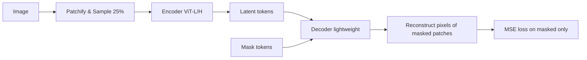

# Self-Supervised Learning for Visual Representations

> **Last Updated:** June 2026
> **Level:** Advanced
> **Related Sections:**
> - [Vision Transformers](./01_vision_transformers.md)
> - [Multimodal Architectures](./04_multimodal_architectures.md)
> - [World Models](../06_robotics_and_embodied_ai/02_world_models.md)
> - [Large Vision-Language Models](../05_multimodal_vision_language/02_large_vision_language_models.md)

---

## Overview

Self-supervised learning (SSL) has emerged as the dominant paradigm for pre-training visual representations at scale, circumventing the need for expensive human annotation. The core intuition is to define a *pretext task* whose supervision signal derives purely from the data itself, compelling the network to learn semantically meaningful features as a byproduct. Unlike fully supervised approaches, SSL representations generalize across a broader distribution of downstream tasks, and models trained at sufficient scale often rival or surpass supervised baselines on linear probing, fine-tuning, and transfer benchmarks.

The field has bifurcated into two broad families. **Contrastive methods** explicitly push representations of augmented views of the same image together in embedding space while repelling representations of different images. The InfoNCE objective formalises this with a noise-contrastive estimation framework. Contrastive methods require careful handling of negatives—either through large batch sizes (SimCLR), memory banks / momentum encoders (MoCo), or cluster assignments (SwAV). **Non-contrastive methods** (BYOL, SimSiam, Barlow Twins, VICReg) eliminate negative pairs entirely, relying instead on architectural asymmetries, exponential moving average (EMA) teachers, or covariance regularisation to prevent representational collapse. A third family, **masked image modeling (MIM)**, takes inspiration from BERT and learns by reconstructing masked patches, decoupling the pretext task from augmentation-driven consistency.

The emergence of **self-distillation** methods (DINO, DINOv2) blurs the boundary: they combine knowledge-distillation from a momentum teacher with a self-supervised contrastive-style objective, producing representations with remarkable emergent properties such as object-aware attention maps. More recently, **joint-embedding predictive architectures** (I-JEPA) predict abstract latent representations of masked regions rather than raw pixels, avoiding the tendency of pixel-space MIM models to focus on low-level texture. The ongoing debate between contrastive methods and MIM centres on the observation that MIM representations require fine-tuning to unlock their quality (poor linear probing), whereas contrastive and self-distillation features separate classes linearly but may underfit holistic scene understanding required for dense prediction tasks.

---

## Contrastive Methods

### InfoNCE Loss

The InfoNCE (Noise-Contrastive Estimation) loss is the mathematical backbone of most contrastive SSL methods. Given a query embedding $q$ and a set of keys $\{k_0, k_1, \ldots, k_K\}$ where $k_0$ is the positive (same-image) key:

```latex
L_{\text{InfoNCE}} = -\log \frac{\exp(q \cdot k_0 / \tau)}{\sum_{i=0}^{K} \exp(q \cdot k_i / \tau)}
```

Here $\tau$ is a temperature hyperparameter. The loss is equivalent to maximising a lower bound on the mutual information between the two views [Oord2018]. The number of negatives $K$ critically determines the quality of the gradient signal.

### MoCo (Momentum Contrast)

[He2020] MoCo decouples the dictionary size from the batch size via a **momentum encoder** and a **FIFO queue**. The momentum encoder parameters $\theta_k$ are updated as an exponential moving average of the query encoder $\theta_q$:

```latex
\theta_k \leftarrow m \cdot \theta_k + (1 - m) \cdot \theta_q, \quad m \approx 0.999
```

MoCo v2 added projection heads and stronger augmentations; MoCo v3 adapted the framework to Vision Transformers with patch-based inputs, achieving 76.5% linear probing on ImageNet with ViT-B/16 [Chen2021MoCov3].

### SimCLR

[Chen2020] SimCLR uses a large batch (up to 8192) without a memory bank. A nonlinear projection head $g(\cdot)$ maps representations to a contrastive loss space:

```latex
L_{i,j} = -\log \frac{\exp(\text{sim}(z_i, z_j)/\tau)}{\sum_{k=1}^{2N} \mathbf{1}_{[k \neq i]} \exp(\text{sim}(z_i, z_k)/\tau)}
```

SimCLR established that (1) projection heads matter, (2) augmentation diversity is critical (random crop + color jitter + Gaussian blur), and (3) larger batches yield better representations.

### SwAV

[Caron2020] SwAV introduces **online clustering** via Sinkhorn-Knopp assignment, mapping views to a set of prototypes and enforcing consistency across views in the code space rather than the embedding space. This enables multi-crop training (many small crops in addition to two global views), reaching 75.3% ImageNet top-1 with ResNet-50 under linear probing.

---

## Non-Contrastive Methods

Non-contrastive methods avoid explicit negative pairs, which simplifies training but requires mechanisms to prevent **mode collapse** (all outputs mapping to the same vector).

### BYOL

[Grill2020] BYOL (Bootstrap Your Own Latent) uses **two asymmetric networks**: an online network $f_\theta$ with a predictor head, and a target network $f_\xi$ updated by EMA. The online network is trained to predict the target network's representation of a differently-augmented view:

```latex
L_{\text{BYOL}} = \|q_\theta(z_\theta) - \text{sg}(z'_\xi)\|_2^2
```

where $\text{sg}(\cdot)$ is stop-gradient. BYOL with ResNet-50 achieves 74.3% top-1; scaled to ResNet-200×2 it reaches 79.6%. The momentum target is the key collapse-prevention mechanism.

### SimSiam

[Chen2021SimSiam] SimSiam removes the EMA teacher, using a stop-gradient on one branch. The analysis shows it implicitly performs EM: the predictor finds the mean of the target distribution, preventing collapse without momentum. Achieves 71.3% top-1 on ImageNet with ResNet-50.

### Barlow Twins

[Zbontar2021] Barlow Twins encourages the cross-correlation matrix between representations of two augmented views to be close to the identity:

```latex
L_{\text{BT}} = \sum_i (1 - C_{ii})^2 + \lambda \sum_i \sum_{j \neq i} C_{ij}^2
```

This decorrelation objective naturally avoids collapse. Achieves 73.2% top-1, comparable to VICReg.

### VICReg

[Bardes2022] VICReg separates the objective into three terms: variance regularisation (maintains per-dimension std > threshold), invariance (minimises MSE between augmented views), and covariance (off-diagonal covariance terms to zero). Explicit and interpretable; also achieves 73.2% top-1 with ResNet-50. Published at ICLR 2022.

---

## Self-Distillation Methods

### DINO

[Caron2021] DINO (Self-DIstillation with NO labels) applies knowledge distillation where both teacher and student are the same architecture but the teacher's weights are an EMA of the student. A centering operation on teacher logits and sharpening on student logits prevent collapse. **Emergent property**: ViT self-attention heads trained with DINO spontaneously segment foreground objects without any segmentation supervision. Achieves 80.1% top-1 with ViT-S/8 under k-NN evaluation.

### DINOv2

[Oquab2023] DINOv2 scales DINO with (1) a curated 142M image dataset (LVD-142M) filtered by a clustering-based pipeline, (2) ViT-g/14 backbone, and (3) mixed DINO + iBOT objectives. Achieves **86.5% top-1** on ImageNet-1k under linear probing—surpassing weakly supervised methods. Features transfer with minimal adaptation across depth estimation, semantic segmentation, and instance retrieval.

---

## Masked Image Modeling

### BEiT

[Bao2022] BEiT (Bidirectional Encoder Representations from Image Transformers) tokenises images via a discrete VAE (dVAE) and trains a ViT to predict the visual tokens of masked patches—directly analogous to BERT. Achieves 56.7% linear probing accuracy on ImageNet (requiring fine-tuning to shine).

### MAE

[He2022] Masked Autoencoders use an **asymmetric encoder-decoder**: a heavy ViT encoder processes only visible patches (typically 25% of tokens), and a lightweight decoder reconstructs raw pixel values of masked patches. The asymmetry makes training efficient despite a high masking ratio (75%). Achieves 68.0% linear probing / **87.8% fine-tuning** with ViT-H. MAE fundamentally challenges the belief that pixel-level targets are uninformative.



### I-JEPA

[Assran2023] I-JEPA (Image Joint-Embedding Predictive Architecture) predicts **abstract latent representations** of target blocks (not raw pixels). A context encoder sees un-masked patches; a predictor conditioned on block position predicts the target encoder's representation of masked blocks. The stop-gradient on the target encoder prevents collapse:

```latex
L_{\text{I-JEPA}} = \sum_{b} \|\hat{s}_b - \text{sg}(s_b)\|_2^2
```

I-JEPA outperforms MAE in linear probing and few-shot settings while training 5× faster on ViT-H. Published at CVPR 2023.

---

## Contrastive vs. MIM: The Core Debate

The tension between contrastive/self-distillation methods and MIM centres on the **linear separability vs. representation completeness** trade-off:

| Property | Contrastive (DINO, SimCLR) | MIM (MAE, BEiT) |
|---|---|---|
| Linear probing | Strong (80%+) | Weak (56-68%) |
| Fine-tuning ceiling | Good | Excellent (87.8%) |
| Dense prediction (seg, depth) | Good (DINO attention maps) | Very good |
| Training efficiency | Moderate (large batch or EMA) | High (sparse encoder) |
| Pretext task | View invariance | Local pixel/token reconstruction |
| Emergent segmentation | Yes (DINO) | Weaker |

DINOv2 partially resolves this by combining DINO + iBOT (a MIM-style objective applied per-token), getting strong linear probing **and** dense prediction.

---

## Key Papers

| Paper | Authors | Year | Venue | Key Contribution |
|---|---|---|---|---|
| MoCo v2 | He, Fan, Wu, Xie, Girshick | 2020 | arXiv | Momentum encoder + queue decouples batch/dict size |
| SimCLR | Chen, Kornblith, Norouzi, Hinton | 2020 | ICML | Large-batch contrastive with projection head |
| BYOL | Grill, Strub, Altché et al. | 2020 | NeurIPS | EMA teacher, no negatives required |
| SwAV | Caron, Misra, Mairal et al. | 2020 | NeurIPS | Online clustering + multi-crop training |
| SimSiam | Chen, He | 2021 | CVPR | Stop-gradient sufficient to prevent collapse |
| Barlow Twins | Zbontar, Jing, Misra et al. | 2021 | ICML | Cross-correlation identity regularisation |
| DINO | Caron, Touvron, Misra et al. | 2021 | ICCV | Self-distillation; emergent segmentation in ViTs |
| VICReg | Bardes, Ponce, LeCun | 2022 | ICLR | Explicit variance/invariance/covariance terms |
| MAE | He, Chen, Xie, Li et al. | 2022 | CVPR | Asymmetric encoder-decoder, 75% masking ratio |
| BEiT | Bao, Dong, Piao, Wei | 2022 | ICLR | Discrete visual token prediction (BERT for images) |
| I-JEPA | Assran, Duval, Misra et al. | 2023 | CVPR | Predict abstract latent reps, not pixels |
| DINOv2 | Oquab, Darcet, Moutakanni et al. | 2023 | TMLR | Curated 142M dataset + DINO+iBOT; 86.5% linear |

---

## Benchmark Performance

| Model | Dataset | Metric | Score | Notes |
|---|---|---|---|---|
| SimCLR (RN-50) | ImageNet | Linear Top-1 | 69.3% | Batch 4096 |
| MoCo v3 (ViT-B/16) | ImageNet | Linear Top-1 | 76.5% | [He2021MoCov3] |
| BYOL (RN-50) | ImageNet | Linear Top-1 | 74.3% | EMA teacher |
| BYOL (RN-200×2) | ImageNet | Linear Top-1 | 79.6% | Wider/deeper |
| SwAV (RN-50) | ImageNet | Linear Top-1 | 75.3% | Multi-crop |
| Barlow Twins (RN-50) | ImageNet | Linear Top-1 | 73.2% | [Zbontar2021] |
| VICReg (RN-50) | ImageNet | Linear Top-1 | 73.2% | ICLR 2022 |
| DINO (ViT-S/8) | ImageNet | k-NN Top-1 | 78.3% | No linear head |
| BEiT (ViT-B/16) | ImageNet | Linear Top-1 | 56.7% | Fine-tune: 83.2% |
| MAE (ViT-H/14) | ImageNet | Linear Top-1 | 68.0% | Fine-tune: 87.8% |
| DINOv2 (ViT-g/14) | ImageNet | Linear Top-1 | 86.5% | LVD-142M pretrain |
| I-JEPA (ViT-H/14) | ImageNet | Linear Top-1 | ~77% | 5× faster than MAE |

---

## Pros & Cons

| Aspect | Pros | Cons |
|---|---|---|
| Contrastive (MoCo/SimCLR) | Strong linear probing; well-understood theory; no collapse risk with negatives | Needs large batches or memory banks; sensitive to augmentation choice |
| Non-contrastive (BYOL/SimSiam) | No need for negatives; simpler training loop | Fragile to architectural changes; collapse risk without careful tuning |
| MIM (MAE/BEiT) | Excellent fine-tuning ceiling; scalable; efficient (sparse encoder) | Poor linear probing; representations may encode low-level texture |
| Self-distillation (DINO/DINOv2) | Best all-round transfer; emergent segmentation; strong out-of-box | Slow training with EMA; sensitive to centering/sharpening temperatures |
| Non-contrastive redundancy reduction (Barlow/VICReg) | Interpretable objectives; no negatives, no momentum | Slightly below top contrastive methods on linear probing |

---

## Open Problems & Research Gaps

1. **Collapse theory for non-contrastive methods**: Formal proofs of why stop-gradient + predictor prevents collapse in SimSiam remain incomplete; empirical instabilities occur with ViTs at large scale [Chen2021SimSiam].

2. **Linear probing vs. fine-tuning discrepancy in MIM**: MAE shows a ~20 percentage-point gap between linear probing (68%) and fine-tuning (87.8%), suggesting the representations are non-linearly separable. Understanding this geometric structure theoretically is an open problem.

3. **Optimal masking strategy**: MAE uses random masking; structured masking (e.g., block masking in BEiT, semantic masking) may better capture compositional structure. Principled selection of mask patterns remains unsolved.

4. **SSL for video and 3D**: Extending MIM and contrastive methods to spatio-temporal volumes (video) and point clouds is active; naive extension fails to capture temporal dynamics or 3D geometry efficiently.

5. **Data curation vs. scaling**: DINOv2 shows curated 142M data outperforms uncurated billions. The optimal data selection strategy—particularly for domain-specific applications—is not well understood.

6. **Integration with language supervision**: The boundary between SSL (no labels) and weakly supervised VLP (noisy captions) is blurring. How to best combine image-only SSL signals with image-text signals without sacrificing either modality's unique supervision signal is unresolved.

7. **Theoretical understanding of emergent properties**: DINO's spontaneous foreground segmentation is empirically striking but lacks a theoretical explanation. Why exactly does the ViT's [CLS] token attention self-organize into object-level maps remains an open question.

---

## Further Reading

- [He et al., *Masked Autoencoders Are Scalable Vision Learners*, CVPR 2022](https://arxiv.org/abs/2111.06377)
- [Oquab et al., *DINOv2: Learning Robust Visual Features without Supervision*, TMLR 2023](https://arxiv.org/abs/2304.07193)
- [Assran et al., *Self-Supervised Learning from Images with a Joint-Embedding Predictive Architecture*, CVPR 2023](https://arxiv.org/abs/2301.08243)
- [Caron et al., *Emerging Properties in Self-Supervised Vision Transformers (DINO)*, ICCV 2021](https://arxiv.org/abs/2104.14294)
- [Zbontar et al., *Barlow Twins: Self-Supervised Learning via Redundancy Reduction*, ICML 2021](https://arxiv.org/abs/2103.03230)
- [A Survey on Self-Supervised Representation Learning, arXiv 2023](https://arxiv.org/abs/2308.11455)
