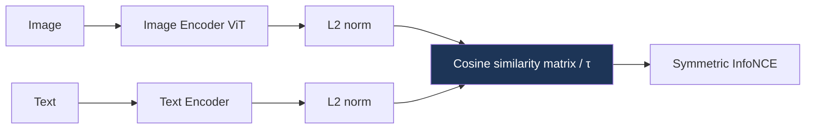

# Multimodal Architectures

> **Last Updated:** June 2026
> **Level:** Intermediate
> **Related Sections:**
> - [Large Vision-Language Models](../05_multimodal_vision_language/02_large_vision_language_models.md)
> - [Self-Supervised Learning](./03_self_supervised_learning.md)
> - [VLP Models](../05_multimodal_vision_language/01_vlp_models.md)
> - [VLA Models](../06_robotics_and_embodied_ai/01_vla_models.md)

---

## Overview

Multimodal architectures learn joint representations across modalities—most prominently vision and language—by aligning their embedding spaces through one of three mechanisms: **contrastive alignment** (pull matched image-text pairs together, push mismatched apart), **cross-attention fusion** (let one modality attend to another inside a Transformer), or **early fusion** (concatenate modality tokens into one sequence). The choice of mechanism determines what the model is good at: contrastive dual-encoders (CLIP) excel at retrieval and zero-shot classification but cannot generate text; cross-attention models (Flamingo) and early-fusion models (GPT-4o) support open-ended generation and reasoning. These architectures are the foundation of the large VLMs in [Large Vision-Language Models](../05_multimodal_vision_language/02_large_vision_language_models.md) and, with an action head, the VLAs in [VLA Models](../06_robotics_and_embodied_ai/01_vla_models.md).

The pivotal work is **CLIP** [Radford2021], which showed that contrastive training on 400M noisy web image-text pairs yields a vision encoder whose representations are *semantically aligned with language*, enabling zero-shot transfer by simply embedding class names as text prompts. CLIP reframed recognition from "predict a fixed label set" to "match against arbitrary text," and its image encoder became the default perceptual front-end for downstream VLMs. This file develops the contrastive objective, contrasts the three fusion paradigms, and surveys the connector designs (Q-Former, Perceiver Resampler) that bridge frozen encoders to LLMs.

---

## Contrastive Alignment

CLIP and ALIGN [Jia2021] train a dual encoder—an image encoder `f` (ViT or ResNet) and a text encoder `g` (Transformer)—to maximize cosine similarity of matched pairs in a batch and minimize it for mismatches, via a symmetric InfoNCE loss over the `N×N` similarity matrix:

```
# image and text embeddings L2-normalized; τ = learned temperature
logits = (I_emb @ T_embᵀ) / τ           # N×N
loss_i2t = cross_entropy(logits, labels=arange(N))      # rows
loss_t2i = cross_entropy(logits.T, labels=arange(N))    # cols
loss = (loss_i2t + loss_t2i) / 2
```

The contrastive objective scales with batch size (more negatives) and data, but the softmax normalization couples batch size to the loss; **SigLIP** [Zhai2023] replaces it with a per-pair **sigmoid** loss that decouples the two and improves efficiency at both small and large batches.



CLIP ViT-L/14 reaches ~75–76% zero-shot ImageNet top-1—remarkable for a model that saw no ImageNet labels.

---

## Cross-Attention Fusion

**Flamingo** [Alayrac2022] (NeurIPS 2022) connects a frozen vision encoder to a frozen LLM via two trainable components: a **Perceiver Resampler** that compresses a variable number of visual features into a fixed set of tokens, and **gated cross-attention** layers interleaved into the LLM that let text tokens attend to visual tokens. This preserves the LLM's language ability while grounding it in images, enabling few-shot in-context multimodal learning. **BLIP-2** [Li2023] uses a lightweight **Q-Former**—a set of learned query tokens that cross-attend to frozen image features and feed the LLM—as an efficient connector, the dominant adapter pattern for open VLMs.

---

## Early Fusion & Unified Encoders

**CoCa** [Yu2022] combines contrastive and captioning objectives in one encoder-decoder. **ImageBind** [Girdhar2023] aligns *six* modalities (image, text, audio, depth, thermal, IMU) to a shared space using only image-paired data, enabling emergent cross-modal retrieval. Natively multimodal models (GPT-4o, Gemini) push early fusion to the limit, training on interleaved image-text-audio token streams end-to-end. The taxonomy—adapter vs. cross-attention vs. early-fusion—maps directly onto the cost/capability trade-off in [Large Vision-Language Models](../05_multimodal_vision_language/02_large_vision_language_models.md).

---

## Key Papers

| Paper | Authors | Year | Venue | Key Contribution |
|-------|---------|------|-------|-----------------|
| CLIP | Radford, Kim, Hallacy, et al. | 2021 | ICML | Contrastive image-text pretraining; zero-shot transfer |
| ALIGN | Jia, Yang, Xia, et al. | 2021 | ICML | Scaling contrastive VL to 1.8B noisy pairs |
| Flamingo | Alayrac, Donahue, Luc, et al. | 2022 | NeurIPS | Perceiver Resampler + gated cross-attention; few-shot |
| BLIP-2 | Li, Li, Savarese, Hoi | 2023 | ICML | Q-Former connector to frozen LLM |
| ImageBind | Girdhar, El-Nouby, Liu, et al. | 2023 | CVPR | Bind 6 modalities via image-paired alignment |
| SigLIP | Zhai, Mustafa, Kolesnikov, Beyer | 2023 | ICCV | Sigmoid contrastive loss for efficient scaling |

---

## Benchmark Performance

| Model | Task | Metric | Score | Notes |
|-------|------|--------|-------|-------|
| CLIP ViT-L/14 | Zero-shot ImageNet | Top-1 | ~75–76% | No ImageNet labels [Radford2021] |
| SigLIP | Zero-shot ImageNet | Top-1 | Strong, batch-efficient | Sigmoid loss [Zhai2023] |
| Flamingo-80B | Few-shot VQAv2 | Accuracy | SOTA (2022) | In-context multimodal |
| BLIP-2 | Zero-shot VQAv2 | Accuracy | Strong, efficient | Q-Former + frozen LLM |
| ImageBind | Cross-modal retrieval | Recall | Emergent zero-shot | 6 modalities |

---

## Pros & Cons

| Aspect | Pros | Cons |
|--------|------|------|
| Contrastive dual-encoder (CLIP) | Fast retrieval, zero-shot, scalable | Cannot generate; weak compositional/spatial reasoning |
| Cross-attention (Flamingo) | Generative, few-shot, preserves LLM | More parameters; heavier training |
| Adapter/Q-Former (BLIP-2) | Efficient, reuses frozen models | Connector can bottleneck visual detail |
| Early fusion (GPT-4o/Gemini) | Richest interleaved reasoning | Massive compute; closed; hard to study |

---

## Open Problems & Research Gaps

- **Compositional & spatial reasoning.** Contrastive embeddings entangle attributes and miss relations (see [Spatial Intelligence](../12_research_frontier_2024_2026/06_spatial_intelligence.md)).
- **Connector design.** No consensus on the optimal frozen-encoder→LLM bridge (projector vs. Q-Former vs. resampler).
- **Modality balance.** Joint training tends to favor the dominant modality; principled balancing is unsolved.
- **Beyond image-text.** Scaling ImageBind-style many-modality alignment without paired data for every pair is hard.
- **Negative sampling & data quality.** Contrastive performance is highly sensitive to batch composition and curation (see [Scaling Laws in Vision](../12_research_frontier_2024_2026/01_scaling_laws_vision.md)).
- **Unified generation+understanding.** Single models that both understand and generate across modalities remain early.

---

## Further Reading

- [CLIP (arXiv:2103.00020)](https://arxiv.org/abs/2103.00020) — learning transferable visual models from language supervision
- [Flamingo (arXiv:2204.14198)](https://arxiv.org/abs/2204.14198) — few-shot visual language model
- [BLIP-2 (arXiv:2301.12597)](https://arxiv.org/abs/2301.12597) — Q-Former bootstrapping
- [ImageBind (arXiv:2305.05665)](https://arxiv.org/abs/2305.05665) — one embedding space for six modalities
- [SigLIP (arXiv:2303.15343)](https://arxiv.org/abs/2303.15343) — sigmoid loss for language-image pretraining
