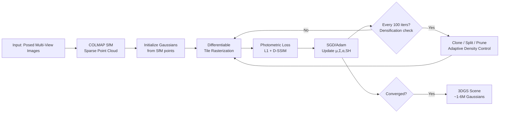

# 3D Gaussian Splatting: Real-Time Novel View Synthesis

> **Last Updated:** June 2026
> **Level:** Advanced
> **Related Sections:** [NeRF and Variants](./01_nerf_and_variants.md) · [3D Representations](./00_3d_representations.md) · [4D and Dynamic Scenes](../12_research_frontier_2024_2026/05_4d_and_dynamic_scenes.md)

---

## Overview

3D Gaussian Splatting (3DGS), introduced by Bernhard Kerbl, Georgios Kopanas, Thomas Leimkühler, and George Drettakis (INRIA Sophia Antipolis) at SIGGRAPH 2023, represents the most significant practical advance in novel view synthesis since NeRF. The method achieves real-time rendering (100+ FPS at 1080p) while matching or exceeding NeRF-quality photorealism, by representing scenes as collections of millions of anisotropic 3D Gaussian primitives rendered via differentiable tile-based rasterization. Unlike NeRF's implicit MLP, 3DGS is an explicit representation — Gaussians are geometrically interpretable, directly editable, and rendered without any ray marching.

The 3DGS paper won immediate acclaim in the computer vision community and spawned an extraordinarily rapid ecosystem. Within a year of publication, hundreds of papers extended it to dynamic scenes (4D-GS, SC-GS), semantic understanding (LangSplat), surface reconstruction (2DGS), anti-aliasing (Mip-Splatting), robotics grasping, medical imaging, and autonomous driving. The speed advantage over NeRF (~100× faster at inference) makes it the de-facto standard for interactive 3D scene representations as of 2024–2026.

The core trade-off relative to NeRF is: 3DGS trades memory efficiency (millions of Gaussians × ~60 bytes each = hundreds of MB per scene) for rendering speed, and trades surface quality (Gaussians do not explicitly model surfaces) for perceptual image quality. These trade-offs motivate the active variant literature: 2DGS for better surfaces, Mip-Splatting for anti-aliasing, Scaffold-GS for structured representation.

---

## Mathematical Foundation: Anisotropic 3D Gaussians

Each Gaussian primitive $\mathcal{G}_k$ is defined by:
- **Mean** $\mu_k \in \mathbb{R}^3$ — 3D position
- **Covariance** $\Sigma_k \in \mathbb{R}^{3\times3}$ (positive semi-definite) — shape and orientation
- **Opacity** $\alpha_k \in [0, 1]$ — transparency
- **Color** $c_k$ represented as **Spherical Harmonic (SH) coefficients** — view-dependent appearance

```
# 3D Gaussian density function
G_k(x) = exp(-0.5 * (x - μ_k)^T Σ_k^{-1} (x - μ_k))

# Covariance parameterization (ensures positive semi-definiteness):
Σ_k = R_k S_k S_k^T R_k^T

where:
  R_k ∈ SO(3) — rotation matrix (stored as quaternion q_k)
  S_k = diag(s_x, s_y, s_z) — axis-aligned scale matrix

# 2D projection (splatting) to camera plane:
Σ'_k = J W Σ_k W^T J^T

where W ∈ R^{3x3} is the world-to-camera rotation
      J ∈ R^{2x3} is the Jacobian of the projective transform

# View-dependent color via Spherical Harmonics:
c_k(d) = Σ_{l=0}^{L} Σ_{m=-l}^{l}  f_k^{lm} · Y_l^m(d)

where Y_l^m are real spherical harmonics basis functions
      L=3 (degree-3 SH, 16 coefficients per color channel = 48 floats per Gaussian)
```

---

## Tile-Based Differentiable Rasterization

NeRF renders by marching rays; 3DGS renders by **splatting** — projecting each 3D Gaussian to a 2D ellipse on screen and compositing them front-to-back. This maps to GPU rasterization hardware:

```mermaid
flowchart TD
    A[3D Gaussians\n{μ_k, Σ_k, α_k, c_k}] --> B[Project to 2D\nΣ'_k = J W Σ_k W^T J^T]
    B --> C[Compute 2D bounding box\nper Gaussian]
    C --> D[Divide screen into 16×16 tiles]
    D --> E[Assign Gaussians to tiles\nbased on bounding boxes]
    E --> F[Sort Gaussians by depth\nper tile — GPU radix sort]
    F --> G[Tile-parallel alpha compositing\nfront-to-back per pixel]
    G --> H[Rendered Image]
    H --> I[Photometric Loss\n||C_rendered - C_gt||^2]
    I --> J[Backward through rasterizer\nGradients to μ, Σ, α, SH]
    J --> K[Adaptive Density Control\n- Clone small Gaussians with large gradients\n- Split large Gaussians\n- Prune transparent Gaussians]
```

The alpha compositing formula for pixel $p$ viewing Gaussians in sorted depth order:

```
# Alpha compositing (front-to-back)
C(p) = Σ_{i=1}^{N} c_i · α̃_i · Π_{j=1}^{i-1} (1 - α̃_j)

where α̃_i = α_i · exp(-0.5 (p - μ'_i)^T (Σ'_i)^{-1} (p - μ'_i))
             ← Gaussian weight of projected ellipse at pixel p
```

**Adaptive Density Control (ADC):** During training, 3DGS monitors the magnitude of position gradients $||\nabla_{\mu_k} \mathcal{L}||$. Gaussians with large gradients in under-reconstructed regions are either:
- **Cloned** (copied with slight perturbation) if they are small — covering more space
- **Split** (replaced by two smaller Gaussians sampled from the PDF) if they are large — improving detail
Gaussians with opacity below a threshold $\epsilon$ are **pruned**. This adaptive procedure grows the representation from the SfM initialization (typically ~100k points) to 1–6M Gaussians over training.

---

## Training Pipeline



Training typically takes 30–60 minutes on a single RTX 3090 for a bounded indoor scene.

---

## Key Variants

### Scaffold-GS [Lu2023, CVPR 2024 Highlight]

Lu, Yu, Xu, Xiangli et al. introduce **anchor points** as a structured scaffold. Instead of free-floating Gaussians, neural Gaussians are predicted on-the-fly from a sparse set of learned anchor points via MLPs conditioned on viewing direction and distance. This reduces redundancy, improves view-dependent effects, and is more robust to sparse viewpoints. The anchor growing/pruning strategy is analogous to ADC but operates on anchors rather than individual Gaussians.

### Mip-Splatting [Yu2024, CVPR 2024 Best Student Paper]

Zehao Yu, Anpei Chen, Binbin Huang, Torsten Sattler, and Andreas Geiger (MPI Tübingen) address aliasing in 3DGS. Standard 3DGS uses a 2D dilation filter that causes artifacts at extreme zoom levels (Gaussians become too small or too large). Mip-Splatting introduces:
1. A **3D smoothing filter** constraining each Gaussian's size to be no smaller than the maximum sampling frequency of the training views
2. A **2D Mip filter** (box filter approximation) replacing the dilation filter

Result: clean zoom-in and zoom-out without floaters or jaggies. Won CVPR 2024 Best Student Paper.

### 2DGS [Huang2024, SIGGRAPH 2024]

Huang, Yu, Chen, Geiger, Gao propose **2D Gaussian Splatting**: instead of volumetric 3D Gaussians, use **2D planar Gaussian disks** (surfels) that are tangent to surfaces. A 2D Gaussian is defined in a local tangent plane (u, v axes) and has zero thickness along the normal. This provides:
- View-consistent geometry (unlike 3DGS whose density is view-independent but appearance is view-dependent)
- Natural surface normals from the disk orientation
- Better mesh extraction (100× faster than SDF-based methods at comparable quality)
Requires perspective-correct ray-splat intersection during rasterization.

### LangSplat [Qin2023]

Minghan Qin, Wanhua Li, Jiawei Zhou, Haoqian Wang, and Hanspeter Pfister embed **CLIP language features** into 3DGS. Each Gaussian carries an additional feature vector in a scene-specific compressed CLIP space (trained via scene autoencoder). Open-vocabulary 3D queries (e.g., "find the coffee mug") are answered by rendering the language field at query scale and computing similarity with text embeddings. Applications include robotic manipulation, scene understanding, and object retrieval.

---

## Dynamic 3DGS Variants

### 4D Gaussian Splatting [Wu2023]

Guanjun Wu et al. extend 3DGS to dynamic scenes by introducing a **4D deformation field**: a canonical set of 3D Gaussians is maintained, and a learned network predicts time-conditioned deformation $(\delta\mu, \delta R, \delta S)$ for each Gaussian at time $t$. This avoids storing separate Gaussians per frame, achieving ~80 FPS rendering of monocular dynamic scenes. The deformation network is an MLP with spatial-temporal encoding.

### SC-GS: Sparse-Controlled Gaussian Splatting [Huang2024b, CVPR 2024]

Yi-Hua Huang, Yang-Tian Sun et al. (CVMI Lab / Ant Research) propose a more structured dynamic model. Rather than deforming all Gaussians independently (which struggles with temporal coherence), SC-GS uses **sparse control points** that learn compact 6-DoF transformation bases. Dense Gaussians interpolate their deformations from nearby control points via learned weights. This produces temporally coherent, editable dynamic scenes — users can manipulate control point trajectories to edit the motion.

---

## Robotics: LangSplat and Spatial Reasoning

The combination of 3DGS's real-time rendering with semantic features has opened new avenues for embodied AI. LangSplat enables robots to perform open-vocabulary 3D spatial queries without needing to re-render the scene. Follow-on works embed additional features: affordance fields for grasping, instance segmentation (Gaussian Grouping), and occupancy for navigation. The explicit Gaussian primitive structure also enables physical simulation integration — Gaussians can be associated with rigid or deformable body parts for manipulation planning.

---

## Key Papers

| Paper | Authors | Year | Venue | Key Contribution |
|-------|---------|------|-------|-----------------|
| 3D Gaussian Splatting for Real-Time Radiance Field Rendering | Kerbl, Kopanas, Leimkühler, Drettakis | 2023 | SIGGRAPH | Anisotropic 3D Gaussians + tile rasterization; real-time NVS at 100+ FPS |
| Scaffold-GS: Structured 3D Gaussians for View-Adaptive Rendering | Lu, Yu, Xu, Xiangli et al. | 2023 (CVPR 2024 Highlight) | CVPR 2024 | Anchor-based neural Gaussians; reduced redundancy, better view-dependent effects |
| Mip-Splatting: Alias-free 3D Gaussian Splatting | Yu, Chen, Huang, Sattler, Geiger | 2024 | CVPR (Best Student Paper) | 3D smoothing + 2D Mip filter; eliminates zoom aliasing |
| 2D Gaussian Splatting for Geometrically Accurate Radiance Fields | Huang, Yu, Chen, Geiger, Gao | 2024 | SIGGRAPH | 2D planar surfels; view-consistent geometry; clean mesh extraction |
| LangSplat: 3D Language Gaussian Splatting | Qin, Li, Zhou, Wang, Pfister | 2023 | arXiv/CVPR | CLIP language features per Gaussian; open-vocabulary 3D queries |
| 4D Gaussian Splatting for Real-Time Dynamic Scene Rendering | Wu, Yi, Fang, Xie, Zhang et al. | 2023 | arXiv (CVPR 2024) | Temporal deformation field over canonical Gaussians; ~80 FPS dynamic scenes |
| SC-GS: Sparse-Controlled Gaussian Splatting for Editable Dynamic Scenes | Huang, Sun, Yang, Lyu, Cao, Qi | 2024 | CVPR | Sparse control points + dense Gaussian interpolation; editable dynamic scenes |
| DreamGaussian: Generative Gaussian Splatting for Efficient 3D Content Creation | Tang, Ren et al. | 2023 | ICLR 2024 Oral | 3DGS as optimization target for text/image-to-3D; 2-min generation |

---

## Benchmark Performance

| Model | Dataset | Metric | Score | Notes |
|-------|---------|--------|-------|-------|
| 3DGS | Mip-NeRF 360 | PSNR | 27.21 dB | 100+ FPS at 1080p; 30–60 min training |
| 3DGS | Tanks & Temples | PSNR | 23.14 dB | Outdoor large scenes |
| Mip-Splatting | Mip-NeRF 360 | PSNR | 27.92 dB | +0.71 dB vs vanilla 3DGS |
| Scaffold-GS | Mip-NeRF 360 | PSNR | 27.70 dB | Better on texture-less regions |
| 2DGS | DTU | Chamfer Distance | 0.48 mm | Surface reconstruction; better than NeRF-based methods |
| LangSplat | LERF Benchmark | Relevancy@1 | not publicly reported | Qualitative improvements over LERF |
| 4D-GS (Wu et al.) | Neural 3D Video | PSNR | 31.97 dB | Dynamic; ~80 FPS |

---

## Pros & Cons

| Aspect | Pros | Cons |
|--------|------|------|
| Speed and Quality | Real-time 100+ FPS at 1080p; PSNR comparable to Mip-NeRF 360; fast 30–60 min training | Per-scene optimization; large memory (hundreds of MB to GB per scene) |
| Geometry | Explicit primitives; editable; easy to integrate with physics; anchoring to surfaces possible | No explicit surface normals by default; floaters and needle Gaussians in textureless areas |
| Extensibility | Rich ecosystem; easy to attach semantic/language features; dynamic extensions well-developed | Aliasing at different zoom levels (addressed by Mip-Splatting); limited topology handling |

---

## Open Problems & Research Gaps

- **Memory compression:** A typical 3DGS scene with 3M Gaussians stores ~60 bytes per Gaussian = ~180 MB uncompressed. For AR/VR streaming, this is prohibitive. Compact representations (vector quantization, pruning, neural compression) are active research.
- **Surface quality:** While 2DGS improves surface reconstruction, the Gaussian primitive is fundamentally a density not a surface. Tight coupling of 3DGS to mesh topology (e.g., Gaussian Mesh Splatting) remains an open problem.
- **Generalizable 3DGS:** Like NeRF, 3DGS requires per-scene optimization. Feed-forward 3DGS prediction (Splatter Image, pixelSplat, MVSplat) is an emerging direction that predicts Gaussian parameters from images without optimization.
- **Long-duration dynamic scenes:** Current dynamic 3DGS methods (4D-GS, SC-GS) work on short clips (seconds). Hours-long or streaming scene recording requires online/incremental Gaussian management.
- **Semantic field integration:** LangSplat and related methods are beginning to answer open-vocabulary spatial queries, but combining semantics, physics, and real-time rendering in a single Gaussian field remains challenging.
- **Multi-scale rendering:** Rendering a 3DGS scene at very different zoom levels (from satellite to centimeter) without quality degradation requires hierarchical Gaussian representations analogous to mipmaps.
- **Topology-aware representation:** Gaussians cannot easily represent topology changes (e.g., splitting objects, occlusion boundaries). Handling such transitions for dynamic editing is largely unsolved.

---

## Further Reading

- [3DGS Official Repository (INRIA)](https://github.com/graphdeco-inria/gaussian-splatting) — reference implementation and pretrained models
- [3DGS Project Page](https://www-sop.inria.fr/reves/Basilic/2023/KKLD23/) — paper, supplemental, and videos
- [Awesome 3D Gaussian Splatting (GitHub)](https://github.com/MrNeRF/awesome-3D-gaussian-splatting) — curated list of 3DGS papers
- [Mip-Splatting GitHub (Autonomous Vision)](https://github.com/autonomousvision/mip-splatting) — code and CVPR 2024 Best Student Paper materials
- [LangSplat Project Page](https://langsplat.github.io/) — language-embedded Gaussian splatting
- [4DGS Project Page (Wu et al.)](https://guanjunwu.github.io/4dgs/) — dynamic Gaussian splatting with videos
