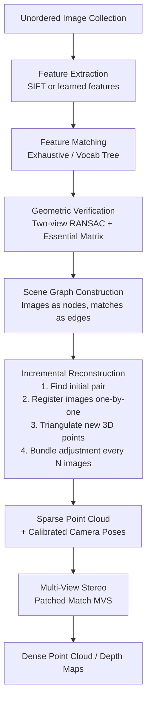

# Structure from Motion and SLAM

> **Last Updated:** June 2026
> **Level:** Advanced
> **Related Sections:** [3D Reconstruction (Core Tasks)](../02_core_tasks/09_3d_reconstruction.md) · [Gaussian Splatting](./02_gaussian_splatting.md) · [3D Representations](./00_3d_representations.md)

---

## Overview

Structure from Motion (SfM) and Simultaneous Localization and Mapping (SLAM) are the foundational technologies for recovering 3D scene geometry and camera pose from visual input. SfM operates offline on unordered image collections, performing joint estimation of camera intrinsics, extrinsics, and sparse 3D structure via bundle adjustment. SLAM operates online (or pseudo-online) on video streams, maintaining a live map and localizing the camera in real time. Both fields have undergone profound transformation over the past decade — from purely classical handcrafted pipelines (SIFT, RANSAC, bundle adjustment) to deep-learning-augmented systems, and most recently to end-to-end learned approaches that subsume the entire pipeline within a neural network.

The classical SfM pipeline, epitomized by COLMAP [Schönberger2016], achieves high accuracy by carefully solving each sub-problem (feature detection, description, matching, geometric verification, incremental reconstruction, bundle adjustment) with hand-engineered algorithms optimized over decades. This robustness and accuracy remains the gold standard for offline 3D reconstruction pipelines used by NeRF and 3DGS as pre-processing. However, classical pipelines are slow (hours for large datasets) and brittle with low-texture, repetitive patterns, or wide baselines.

Deep learning has attacked this from multiple angles: learned feature detectors/descriptors (SuperPoint [DeTone2018], D2-Net), learned matching (SuperGlue [Sarlin2020, CVPR], LightGlue [Lindenberger2023, ICCV]), and end-to-end SLAM systems (DROID-SLAM [Teed2021, NeurIPS]). The most radical departure is DUSt3R [Wang2024, CVPR] and its successor MASt3R [Leroy2024, ECCV], which eliminate the traditional pipeline entirely — a transformer directly regresses dense 3D pointmaps from image pairs without requiring known camera parameters.

---

## Classical SfM: COLMAP

Johannes L. Schönberger and Jan-Michael Frahm (UNC Chapel Hill) published **"Structure-from-Motion Revisited"** at CVPR 2016, which is the foundational reference for COLMAP — the most widely used open-source SfM system. COLMAP provides an end-to-end pipeline from unordered images to calibrated camera poses and dense 3D reconstruction.

### Pipeline Overview



### Bundle Adjustment

The core optimization in SfM is **bundle adjustment** (BA) — jointly minimizing the reprojection error of all observed 3D points across all cameras:

```
# Bundle Adjustment objective:
min_{P_j, X_i}  Σ_{(i,j) ∈ visibility}  ρ( || π(P_j, X_i) - x_{ij} ||^2 )

where:
  P_j ∈ SE(3)        — camera pose (rotation + translation) for image j
  X_i ∈ R^3         — 3D point position
  x_{ij} ∈ R^2      — observed 2D keypoint location
  π(P_j, X_i)       — projection function (camera model)
  ρ(·)              — robust loss (Cauchy/Huber to downweight outliers)

Solved via Levenberg-Marquardt with sparse linear solvers (Schur complement)
exploiting the block-sparse structure of the Jacobian.
```

COLMAP's incremental approach registers cameras one by one, triangulating new points and running local BA frequently. Global BA runs at the end. Loop closure is not built in (unlike SLAM systems).

### COLMAP MVS

After SfM, COLMAP's Multi-View Stereo (MVS) step uses **PatchMatch** applied in a depth-map fusion framework to produce dense reconstruction. Each reference image estimates a depth map by evaluating photometric consistency of small patches across neighboring views, then per-image depths are fused into a consistent point cloud.

---

## Feature Detection and Matching Evolution

### Classical: SIFT [Lowe2004]

SIFT (Scale-Invariant Feature Transform) has been the dominant handcrafted detector-descriptor for 20 years. It detects keypoints at scale-space extrema (DoG), computes 128-dim histogram-of-gradient descriptors, and achieves invariance to scale, rotation, and partial illumination changes.

### Learned: SuperPoint [DeTone2018]

Daniel DeTone, Tomasz Malisiewicz, and Andrew Rabinovich (Magic Leap) presented **SuperPoint** at the CVPR 2018 Deep Vision workshop. SuperPoint is a self-supervised homographic adaptation approach: a base **MagicPoint** detector is trained on synthetic geometrics, then domain-adapted to real images using random homographic warpings. The network jointly detects interest points and computes 256-dim descriptors in a single forward pass.

The training uses **homographic adaptation**: for each training image, apply many random homographies $H_1, \ldots, H_K$, detect keypoints in each warped image, warp detections back to original coordinates, and aggregate to create pseudo-ground-truth keypoint positions for self-supervised training.

### Learned Matching: SuperGlue [Sarlin2020, CVPR 2020]

Paul-Edouard Sarlin, Daniel DeTone, Tomasz Malisiewicz, and Andrew Rabinovich (ETH Zürich + Magic Leap) introduced **SuperGlue** as a feature **matching** network at CVPR 2020 (Oral). Given keypoints and descriptors from two images, SuperGlue formulates matching as optimal transport, solved differentiably via the Sinkhorn algorithm. The keypoints are first embedded with their positions and descriptors, then processed by a **Graph Neural Network (GNN)** with cross-attention between images to exchange information about co-visible structure.

```
# SuperGlue matching pipeline:
1. Encode: positional encoding (position + score) → initial descriptor
2. GNN: L layers of self-attention (within one image) + cross-attention (between images)
3. Final MLP head → matching descriptor
4. Compute score matrix S_{ij} = <d_i, d_j>
5. Sinkhorn algorithm → soft assignment matrix P (dustbin for unmatchable points)
6. Mutual nearest neighbor: select matches from P
```

### Efficient Matching: LightGlue [Lindenberger2023, ICCV 2023]

Philipp Lindenberger, Paul-Edouard Sarlin, and Marc Pollefeys (ETH Zürich) published **LightGlue** at ICCV 2023. LightGlue is a drop-in replacement for SuperGlue with adaptive computation: it predicts per-point confidence and prunes both unmatchable points (early in the network) and network depth (stopping early for easy pairs). The result is 4–10× faster than SuperGlue on easy pairs (large visual overlap) while maintaining accuracy on hard pairs. LightGlue also offers improved training stability and lower memory usage.

---

## Classical SLAM: ORB-SLAM2 and ORB-SLAM3

### ORB-SLAM2 [Mur-Artal2017]

Raúl Mur-Artal and Juan D. Tardós (Universidad de Zaragoza) published **ORB-SLAM2** in IEEE Transactions on Robotics (TRO) 2017. It is the most widely cited classical SLAM system, supporting monocular, stereo, and RGB-D cameras with real-time loop closure and relocalization.

Architecture:
- **Tracking thread**: estimates camera pose from ORB features via PnP with RANSAC
- **Local mapping thread**: triangulates new map points, performs local BA
- **Loop closing thread**: detects loops via DBoW2 vocabulary tree, corrects accumulated drift with Sim(3) pose-graph optimization

### ORB-SLAM3 [Campos2021]

Carlos Campos, Richard Elvira, Juan J. Gómez Rodríguez, José M.M. Montiel, and Juan D. Tardós extended ORB-SLAM2 to ORB-SLAM3 (IEEE TRO, 2021, DOI: 10.1109/TRO.2021.3075644). Key additions:
- **Visual-Inertial (VI-SLAM)**: tightly-coupled IMU integration via Maximum-a-Posteriori estimation through the IMU initialization phase, rather than treating IMU as a separate system
- **Multi-map SLAM**: maintains an atlas of maps for recovering from tracking failures and multi-session mapping
- **Fisheye lens models**: supports wide field-of-view cameras common in robotics and automotive

---

## Deep Visual SLAM: DROID-SLAM [Teed2021, NeurIPS 2021]

Zachary Teed and Jia Deng (Princeton University) introduced **DROID-SLAM** at NeurIPS 2021 (Oral), receiving significant recognition. DROID-SLAM is a deep end-to-end SLAM system with a key architectural insight: a **Dense Bundle Adjustment (DBA) layer** — a differentiable version of bundle adjustment integrated into the deep network, enabling gradients to flow from the rendering loss back through the BA solver.

```
# DROID-SLAM pipeline:
Input: video frames {I_t}
1. Feature extraction: context + appearance networks (ResNet-based)
2. Correlation volume: dense L2 similarity between feature maps across frames
3. Update operator (GRU-based): 
   hidden state h_t → predicts per-pixel flow revisions (Δu) 
   and confidence weights (w_t)
4. Dense Bundle Adjustment layer:
   min_{G_t, D_t}  Σ_{(i,j) ∈ frame_pairs}  Σ_p  w_{ij,p} · ||u_{ij,p} - Π(G_i, G_j, D_i, p)||^2
   where G_t ∈ SE(3), D_t = inverse depth map
   Solved as a sparse least-squares system (Gauss-Newton)
5. Output: camera poses {G_t} + depth maps {D_t}
```

DROID-SLAM trained on monocular video generalizes to stereo and RGB-D at test time by modifying the measurement model. It achieves large improvements over classical methods (ORB-SLAM2/3) and prior deep SLAM (DeepV2D), suffering fewer catastrophic failures.

---

## Neural SLAM with Gaussian Representations

### SplaTAM [Keetha2024, CVPR 2024]

Nikhil Keetha, Jay Karhade et al. (Carnegie Mellon) introduced **SplaTAM** for dense RGB-D SLAM using 3D Gaussians as the map representation. Camera tracking minimizes the photometric + depth rendering loss w.r.t. camera pose (with Gaussian parameters fixed); mapping optimizes Gaussian parameters (with pose fixed). New Gaussians are added at unobserved pixels using the known depth. The 3DGS representation enables dense color map extraction and high-quality rendering, unlike the sparse maps of ORB-SLAM.

### MonoGS [Matsuki2024, CVPR 2024 Highlight + Best Demo Award]

Hidenobu Matsuki, Riku Murai et al. (Imperial College London) extended Gaussian SLAM to monocular cameras (no depth sensor) in **MonoGS**, requiring simultaneous tracking, Gaussian initialization from depth estimates, and isotropic-to-anisotropic Gaussian refinement. MonoGS received both a CVPR 2024 Highlight and the Best Demo Award.

---

## DUSt3R and MASt3R: End-to-End 3D Reconstruction

### DUSt3R [Wang2024, CVPR 2024]

Shuzhe Wang, Vincent Leroy, Yohann Cabon, Boris Chidlovskii, and Jerome Revaud (NAVER LABS Europe) published **DUSt3R** (Dense and Unconstrained Stereo 3D Reconstruction) at CVPR 2024. DUSt3R is a radically different approach — it formulates all of geometric 3D vision as a **pointmap regression** problem:

```
# DUSt3R formulation:
Input: two images I_1, I_2 (arbitrary, uncalibrated, no known poses)
Output: 
  X^{1→1} ∈ R^{H×W×3}  (pointmap of I_1 in frame of I_1)
  X^{2→1} ∈ R^{H×W×3}  (pointmap of I_2 in frame of I_1)
  conf_1, conf_2         (confidence maps)

Architecture: ViT encoder → cross-attention transformer → two DPT decoders

From pointmaps, recover:
  - Camera intrinsics (from pointmap geometry)
  - Relative pose (from comparing X^{1→1} and X^{2→1})
  - Depth maps (||X^{i→1}[u,v]||_2)
  - Dense correspondences (argmin ||X^{1→1}[u,v] - X^{2→1}[u',v']||)

Multi-image: connect pairwise graphs → global alignment via least-squares
```

DUSt3R requires no camera calibration or pose initialization — it works from any image pair in any order. It sets state-of-the-art on monocular and multi-view depth estimation and relative pose estimation benchmarks.

### MASt3R [Leroy2024, ECCV 2024]

Vincent Leroy, Yohann Cabon, and Jerome Revaud (NAVER LABS Europe) extended DUSt3R to **MASt3R** (Matching And Stereo 3D Reconstruction) at ECCV 2024. MASt3R adds a dense local feature matching head to DUSt3R, enabling pixel-aligned matching between images. This is achieved by adding an extra decoder head and a fast matching algorithm operating in the 3D pointmap space. MASt3R significantly outperforms DUSt3R on matching-centric tasks (map-free relocalization) while retaining reconstruction quality, and also introduces MASt3R-SfM — a complete SfM pipeline built on MASt3R pairwise predictions.

---

## Key Papers

| Paper | Authors | Year | Venue | Key Contribution |
|-------|---------|------|-------|-----------------|
| Structure-from-Motion Revisited (COLMAP) | Schönberger, Frahm | 2016 | CVPR | Incremental SfM with SIFT; gold standard offline pipeline |
| SuperPoint: Self-Supervised Interest Point Detection and Description | DeTone, Malisiewicz, Rabinovich | 2018 | CVPR DeepVision | Self-supervised keypoint detector via homographic adaptation |
| SuperGlue: Learning Feature Matching with Graph Neural Networks | Sarlin, DeTone, Malisiewicz, Rabinovich | 2020 | CVPR (Oral) | Attentional GNN + Sinkhorn optimal transport for feature matching |
| ORB-SLAM2: An Open-Source SLAM System for Monocular, Stereo, and RGB-D | Mur-Artal, Tardós | 2017 | IEEE TRO | Classical SLAM with ORB features; loop closure; relocalization |
| ORB-SLAM3: Visual, Visual-Inertial, and Multimap SLAM | Campos, Elvira, Gómez, Montiel, Tardós | 2021 | IEEE TRO | Visual-inertial tightly coupled; multi-map atlas; fisheye |
| DROID-SLAM: Deep Visual SLAM for Monocular, Stereo, and RGB-D | Teed, Deng | 2021 | NeurIPS (Oral) | Differentiable dense bundle adjustment; end-to-end trainable SLAM |
| LightGlue: Local Feature Matching at Light Speed | Lindenberger, Sarlin, Pollefeys | 2023 | ICCV | Adaptive depth/width pruning; 4–10× faster than SuperGlue |
| DUSt3R: Geometric 3D Vision Made Easy | Wang, Leroy, Cabon, Chidlovskii, Revaud | 2024 | CVPR | ViT pointmap regression; no known poses/intrinsics required |
| Grounding Image Matching in 3D with MASt3R | Leroy, Cabon, Revaud | 2024 | ECCV | DUSt3R + dense matching head; metric SfM without calibration |
| SplaTAM: Splat, Track & Map 3D Gaussians for Dense RGB-D SLAM | Keetha et al. | 2024 | CVPR | 3DGS as SLAM map; joint Gaussian optimization and camera tracking |

---

## Benchmark Performance

| Model | Dataset | Metric | Score | Notes |
|-------|---------|--------|-------|-------|
| COLMAP (SIFT) | ETH3D | F1 (sparse SfM) | ~0.62 | Classical; slow but accurate |
| COLMAP + SuperGlue | ETH3D | F1 | ~0.76 | +14 pts over SIFT |
| ORB-SLAM2 (Mono) | TUM RGB-D | ATE RMSE (m) | 0.016 | Monocular; scale ambiguity |
| ORB-SLAM3 (Mono+IMU) | EuRoC | ATE RMSE (m) | 0.007 | Visual-inertial; best classical |
| DROID-SLAM (Mono) | TUM RGB-D | ATE RMSE (m) | 0.010 | Deep; 2–5× better than classical on hard scenes |
| DUSt3R | ScanNet (pose est.) | RRA@15° | 91.3% | No known camera params |
| MASt3R | Map-free Reloc. | Median Pos. Error | ~0.14m | SOTA; outperforms SuperGlue+COLMAP |
| SplaTAM | TUM RGB-D | ATE RMSE (m) | 0.009 | Dense Gaussian map + trajectory |

---

## Pros & Cons

| Aspect | Pros | Cons |
|--------|------|------|
| Classical SfM (COLMAP) | High accuracy; robust via RANSAC; widely validated; modular pipeline | Slow (hours for large datasets); brittle on low-texture; requires feature overlap |
| Deep Matching (SuperGlue/LightGlue) | Handles wide baselines, repetitive textures, low light; state-of-the-art accuracy | Requires GPU; not interpretable; training requires ground-truth matches |
| End-to-End (DUSt3R/MASt3R) | No camera calibration needed; handles unconstrained in-the-wild images; single forward pass | Memory-intensive (ViT); slower per-pair than classical; global alignment still needed for many images |

---

## Open Problems & Research Gaps

- **Scalability of neural SfM:** DUSt3R/MASt3R process pairs efficiently but global alignment of thousands of images is still a computational bottleneck. Hierarchical or distributed approaches analogous to graph-based SfM are needed.
- **Long-term SLAM:** Classical ORB-SLAM3 handles multi-session mapping but struggles with perceptual aliasing (visually similar but geometrically different places). Deep place recognition (NetVLAD, SuperPoint-based) partially addresses this.
- **Dynamic environments:** All SfM/SLAM methods assume a static world. Handling moving objects (pedestrians, vehicles) requires explicit dynamic segmentation (Mask-SLAM, DynaSLAM) or probabilistic filtering, adding significant complexity.
- **Real-time 3DGS SLAM:** SplaTAM and MonoGS optimize Gaussians online but are slower than ORB-SLAM3. Achieving real-time Gaussian SLAM at ORB-SLAM3 speed with dense map quality is an important open problem.
- **Metric scale from monocular:** Monocular SfM and SLAM recover scene structure only up to scale. Without IMU or known object sizes, metric scale is unavailable. Depth priors from monocular depth estimation models (DPT, Depth Anything) offer a partial solution.
- **Adversarial conditions:** Rain, fog, night, and motion blur severely degrade all current methods. Robust all-weather SLAM for autonomous vehicles requires cross-modal fusion (LiDAR, radar) and learned robustness.
- **Privacy-preserving SfM:** Feature descriptors leak visual information. Cryptographic approaches to privacy-preserving localization (using quantized or hashed descriptors) are emerging but not mature.

---

## Further Reading

- [COLMAP Documentation](https://colmap.github.io/) — comprehensive user guide and API reference
- [SuperGlue Project Page (Magic Leap)](https://psarlin.com/superglue/) — paper, slides, and pretrained models
- [LightGlue GitHub (ETH CVG)](https://github.com/cvg/LightGlue) — code and benchmarks
- [DROID-SLAM GitHub (Princeton VL)](https://github.com/princeton-vl/DROID-SLAM) — reference implementation
- [DUSt3R GitHub (NAVER)](https://github.com/naver/dust3r) — code with demo
- [MASt3R GitHub (NAVER)](https://github.com/naver/mast3r) — including MASt3R-SfM pipeline
