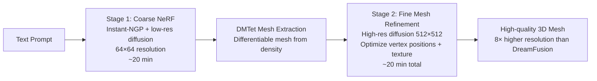
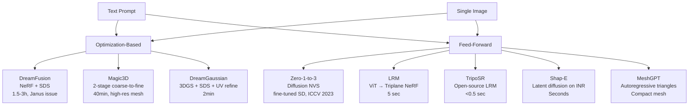

# 3D Content Generation: Text-to-3D and Image-to-3D

> **Last Updated:** June 2026
> **Level:** Advanced
> **Related Sections:** [3D Generation (Generative Vision)](../10_generative_vision/03_3d_generation.md) · [Gaussian Splatting](./02_gaussian_splatting.md) · [3D Representations](./00_3d_representations.md)

---

## Overview

3D content generation — creating 3D assets from text descriptions or single images — is one of the most commercially significant open problems in computer vision and computer graphics. The field bifurcated into two main paradigms: **optimization-based approaches** that use 2D diffusion priors to supervise 3D optimization (DreamFusion, Magic3D), and **feed-forward approaches** that train large transformers or diffusion models directly on 3D data to predict 3D structure in a single forward pass (LRM, TripoSR, Shap-E). The latter now dominates practical applications due to its speed (seconds vs. hours), though it requires large-scale 3D training data.

DreamFusion [Poole2022] established the SDS (Score Distillation Sampling) loss as the mechanism for distilling 2D diffusion knowledge into 3D representations — a NeRF is optimized so that renders from all viewpoints look like plausible outputs of a pre-trained text-to-image diffusion model. This was a conceptual breakthrough enabling text-to-3D without any 3D supervision, but it suffers from the notorious **Janus problem** (multi-face artifacts), over-saturation, and slow optimization (1.5–3 hours per object). Magic3D [Lin2023] addressed quality through a two-stage coarse-to-fine approach; DreamGaussian [Tang2023] replaced NeRF with 3D Gaussians to achieve ~2 minute generation.

Feed-forward approaches emerged in 2023 with Zero-1-to-3 [Liu2023] (viewpoint-conditioned novel view synthesis from a single image via fine-tuned diffusion), LRM [Hong2023] (large transformer predicting NeRF directly from a single image in 5 seconds), and TripoSR [Tochilkin2024] (open-source LRM with improved data and training). Shap-E and Point-E (OpenAI) explored direct generation of implicit functions and point clouds respectively. MeshGPT [Siddiqui2024] closed the loop with autoregressive native mesh generation.

---

## Score Distillation Sampling (SDS)

DreamFusion's core contribution is the **SDS loss** — a method to use a frozen 2D diffusion model $\epsilon_\phi$ as a 3D optimization oracle:

```
# Score Distillation Sampling (SDS) Loss
Given:
  θ         — 3D representation parameters (NeRF weights)
  g(θ, c)   — differentiable renderer (produces image x for camera c)
  ε_φ(x_t, t, y) — frozen pretrained diffusion model, text y
  t         — diffusion timestep ~ Uniform(t_min, t_max)
  ε         — Gaussian noise

Algorithm:
  1. Render image: x = g(θ, c)  for random camera pose c
  2. Add noise: x_t = √ᾱ_t · x + √(1-ᾱ_t) · ε
  3. Predict noise: ε̂_φ = ε_φ(x_t, t, y)   (no grad w.r.t. φ)
  4. SDS gradient w.r.t. θ:
     ∇_θ L_SDS = E_{t,ε,c} [ w(t) · (ε̂_φ(x_t, t, y) - ε) · ∂x/∂θ ]

Key: this is NOT backprop through the diffusion model — it uses the
     predicted noise as a pseudo-gradient direction, weighted by w(t).
     The U-Net Jacobian ∂ε̂_φ/∂x is dropped (expensive + empirically hurts).

Intuition: at each step, the diffusion model says "this render looks noisy;
           move the 3D scene in this direction to make it look like the text".
```

The SDS loss has well-known pathologies: **over-saturation** (the diffusion model maps to high-confidence modes), **over-smoothing** (multiple views are supervised independently, creating averaging artifacts), and the **Janus problem** (see below). ProlificDreamer [Wang2023] improved SDS with **Variational Score Distillation (VSD)**, treating the rendered image distribution as a distribution rather than a point, achieving higher-fidelity results.

### The Janus Problem

The Janus problem (named after the two-faced Roman god) is the canonical failure mode of SDS-based 3D generation: the 3D representation produces a plausible 2D image from any viewpoint, but the scene has **no consistent 3D structure** — instead, each viewpoint independently "looks like" the prompt, resulting in objects with multiple fronts (e.g., a human face visible from all angles around the head) or inconsistent geometry.

```
# Janus problem root cause:
The 2D diffusion prior p_φ(x | y) independently scores each rendered view.
It has no mechanism to enforce 3D consistency between views.
A 3D representation that places a face texture on all sides of the geometry
minimizes SDS loss from all azimuths, but is geometrically nonsensical.

Mitigations:
- Pose-conditioned diffusion (Zero123): conditions on relative camera pose
- 3D-aware diffusion models (trained on multi-view data)
- Geometry regularizers (depth smoothness, normal consistency)
- Multi-view SDS: evaluate multiple views simultaneously (MVDream)
```

---

## DreamFusion [Poole2022]

Ben Poole, Ajay Jain, Jonathan T. Barron, and Ben Mildenhall (Google Brain / Google Research) introduced DreamFusion as an arXiv preprint in September 2022 (published at ICLR 2023). It combines NeRF with the Imagen text-to-image diffusion model as a prior. The NeRF is initialized with density accumulated near a sphere, then optimized for ~10k–15k iterations. Additional regularizers include: normal consistency (neighboring points should have similar normals), orientation loss (densities should face the camera), and background regularization. Textureless regions are handled by sampling random albedo colors as a "textureless" baseline.

DreamFusion requires access to a large pre-trained text-to-image model (Imagen, which is not public) — this initially limited reproducibility. Subsequent works used publicly available models (Stable Diffusion, DeepFloyd IF).

---

## Magic3D [Lin2023, CVPR 2023]

Chen-Hsuan Lin, Jun Gao, Luming Tang, Towaki Takikawa, Xiaohui Zeng, Xun Huang, Karsten Kreis, Sanja Fidler, Ming-Yu Liu, and Tsung-Yi Lin (NVIDIA) published Magic3D at CVPR 2023. It addresses DreamFusion's slow optimization and low resolution by introducing a **two-stage coarse-to-fine pipeline**:



DMTet (Deep Marching Tetrahedra) enables differentiable mesh optimization from an initial coarse mesh. Magic3D achieves 8× higher resolution than DreamFusion (512 vs. 64 supervision) and 2× faster optimization (40 min vs. 1.5+ hours). User study shows 61.7% preference over DreamFusion.

---

## Zero-1-to-3 [Liu2023, ICCV 2023]

Ruoshi Liu, Rundi Wu, Basile Van Hoorick, Pavel Tokmakov, Sergey Zakharov, and Carl Vondrick (Columbia University) introduced Zero-1-to-3 at ICCV 2023. Rather than generating 3D from scratch, Zero-1-to-3 uses a large pre-trained image diffusion model (Stable Diffusion) fine-tuned on Objaverse to generate **novel views** of an object from a single image at a specified relative camera pose $(\Delta R, \Delta T)$.

```
# Zero-1-to-3 formulation:
Input:  single image I_ref, relative camera pose (ΔR, Δt)
Output: novel view image I_novel

Architecture: 
  - Stable Diffusion U-Net fine-tuned on Objaverse renders
  - Conditioning: CLIP features of I_ref + (ΔR, Δt) injected via cross-attention
  - Trained on 800k objects × multiple pose pairs

Applications:
  - Direct use: single-image novel view synthesis
  - 3D reconstruction: Score Distillation using Zero-1-to-3 as diffusion prior
    (Zero123-XL, One-2-3-45)
```

Zero-1-to-3 demonstrates strong zero-shot generalization to in-the-wild images and paintings despite training on synthetic Objaverse data. It became the foundation for a family of single-image 3D reconstruction methods.

---

## LRM: Large Reconstruction Model [Hong2023]

Yicong Hong, Kai Zhang, Jiuxiang Gu, Sai Bi, Yang Zhou, Difan Liu, Feng Liu, Kalyan Sunkavalli, Trung Bui, and Hao Tan (Adobe Research) introduced LRM (Large Reconstruction Model) as an arXiv preprint in November 2023. LRM is the first **feed-forward large-scale 3D reconstruction model**: a single forward pass predicts a full NeRF from one image in ~5 seconds.

```
# LRM Architecture:
Input: single image I ∈ R^{256×256×3}

1. Image Encoder: DINOv2 ViT-L (frozen) → image tokens [cls, patch_1,...,patch_N]
2. Cross-attention: image tokens → 3D triplane tokens
   - Triplane: three orthogonal 2D feature planes (XY, XZ, YZ)
   - Each plane: 192 × 192 × C resolution
3. NeRF Decoder: triplane features interpolated at query points → MLP → (density, color)
4. Volume rendering → predicted views for photometric loss

Training: ~1M 3D objects (Objaverse synthetic + MVImgNet real)
          Multi-view supervision with camera-conditioned decoder
Inference: 5 seconds on a single GPU
```

LRM's transformer-based architecture (500M parameters) enables learning geometry priors over large-scale 3D data, allowing generalization to diverse in-the-wild input images.

---

## TripoSR [Tochilkin2024]

Dmitry Tochilkin, David Pankratz, Zexiang Liu, Zixuan Huang, Adam Letts, Yangguang Li, Ding Liang, Christian Laforte, Varun Jampani, and Yan-Pei Cao (Tripo AI + Stability AI) released TripoSR (arXiv March 2024) as an open-source, MIT-licensed large reconstruction model building on the LRM architecture. Key improvements over LRM:
- **Better data processing**: improved rendering pipeline, more object-centric crops
- **Training improvements**: improved loss weighting, better background augmentation
- **Speed**: under 0.5 seconds for 3D mesh from a single image
- **Open-source**: full code and weights released, unlike LRM

TripoSR achieves superior quantitative and qualitative performance vs. other open-source single-image 3D methods and is widely deployed in commercial 3D generation workflows.

---

## DreamGaussian [Tang2023, ICLR 2024 Oral]

Jiaxiang Tang et al. published DreamGaussian (ICLR 2024 Oral), replacing NeRF with 3D Gaussian Splatting as the optimization target in SDS-based generation. Key innovations:
1. **Progressive densification**: Gaussian splitting/cloning converges faster for generative tasks than NeRF's occupancy pruning
2. **Mesh extraction + UV refinement**: after Gaussian optimization, extracts a textured mesh via marching cubes on Gaussian opacity, then refines texture in UV space using the 2D diffusion prior

Results: ~2 minute generation vs. 1.5+ hours for DreamFusion/Magic3D. The speed improvement comes from 3DGS's faster rendering and the more direct optimization landscape provided by explicit primitives.

---

## Shap-E and Point-E (OpenAI)

Heewoo Jun and Alex Nichol (OpenAI) released two text-to-3D systems:

**Point-E** (2022): A two-stage pipeline — a text-to-image model generates a single rendered view, then a point cloud diffusion model conditioned on this image generates a 3D point cloud. Fast but limited by point cloud quality.

**Shap-E** (2023, arXiv:2305.02463): Trains a **latent diffusion model on implicit neural representations (INR)**. An encoder maps 3D assets (from ShapeNet/Cap3D) to latent vectors of a small MLP that represents the object. A conditional diffusion model then samples new latent vectors given text or image inputs. The same latent can be decoded as both a textured mesh and a NeRF. Shap-E produces 3D assets in seconds but at lower quality than optimization-based methods.

---

## MeshGPT [Siddiqui2024, CVPR 2024]

Yawar Siddiqui, Antonio Alliegro, Alexey Artemov et al. published MeshGPT at CVPR 2024. Rather than generating density fields and extracting meshes, MeshGPT directly **autoregressively generates triangle meshes** — the native representation of 3D graphics.

```
# MeshGPT pipeline:
1. Graph Convolution Encoder: triangle mesh → per-triangle features
2. Residual Vector Quantization (RVQ): compress triangle features → discrete tokens
3. GPT-style Transformer Decoder: 
   autoregressively predict next triangle token
   (vertex triplets encoded as sorted (v1, v2, v3) tuples)
4. VQ-VAE Decoder: tokens → triangle geometries

Training: supervised on ShapeNet + 3D-FUTURE
Output: compact meshes with sharp edges, ~150–300 triangles
        (vs. marching cubes which generates 10,000+)

Key advantage: meshes resemble artist-created topology —
               efficient, clean, with proper edge loops
```

MeshGPT achieves 9% better shape coverage and 30-point FID improvement over prior mesh generation methods. It does not yet handle textures or complex scenes.

---

## Pipeline Comparison



---

## Key Papers

| Paper | Authors | Year | Venue | Key Contribution |
|-------|---------|------|-------|-----------------|
| DreamFusion: Text-to-3D using 2D Diffusion | Poole, Jain, Barron, Mildenhall | 2022 | ICLR 2023 | SDS loss; NeRF optimization via 2D diffusion prior; text-to-3D without 3D data |
| Magic3D: High-Resolution Text-to-3D Content Creation | Lin, Gao, Tang et al. (NVIDIA) | 2023 | CVPR | 2-stage coarse NeRF → fine DMTet mesh; 8× higher res, 2× faster than DreamFusion |
| Zero-1-to-3: Zero-shot One Image to 3D Object | Liu, Wu, Van Hoorick et al. | 2023 | ICCV | Fine-tuned diffusion for pose-conditioned NVS; enables image-to-3D without 3D supervision |
| LRM: Large Reconstruction Model for Single Image to 3D | Hong, Zhang et al. (Adobe) | 2023 | arXiv (ICLR 2024) | 500M param ViT transformer; triplane NeRF prediction in 5 sec; trained on 1M objects |
| TripoSR: Fast 3D Object Reconstruction from a Single Image | Tochilkin, Pankratz et al. (Tripo AI / Stability AI) | 2024 | arXiv | Open-source LRM variant; <0.5 sec; MIT license |
| DreamGaussian: Generative Gaussian Splatting for 3D Content Creation | Tang, Ren et al. | 2023 | ICLR 2024 (Oral) | 3DGS as SDS target; mesh extraction + UV refinement; 2-min generation |
| Shap-E: Generating Conditional 3D Implicit Functions | Jun, Nichol (OpenAI) | 2023 | arXiv | Latent diffusion on INR weights; text/image to 3D in seconds |
| MeshGPT: Generating Triangle Meshes with Decoder-Only Transformers | Siddiqui, Alliegro, Artemov et al. | 2024 | CVPR | Autoregressive triangle sequence generation; compact artist-quality meshes |
| ProlificDreamer: High-Fidelity and Diverse Text-to-3D via VSD | Wang et al. | 2023 | NeurIPS | Variational Score Distillation; higher quality than SDS; reduced over-saturation |

---

## Benchmark Performance

| Model | Dataset | Metric | Score | Notes |
|-------|---------|--------|-------|-------|
| LRM | GSO (Google Scanned Objects) | PSNR (novel views) | not publicly reported | Qualitative comparison in paper |
| TripoSR | GSO | PSNR | not publicly reported | Claims superior to open-source LRM variants |
| Zero-1-to-3 | GSO | PSNR (novel view) | 20.13 dB | Single image, held-out test views |
| DreamGaussian | — | CLIP Similarity | 0.287 | Text-to-3D; 2 min vs. DreamFusion 1.5h |
| MeshGPT | ShapeNet | FID (mesh quality) | 30-pt improvement | vs. prior mesh generation methods |
| DreamFusion | — | CLIP R-Precision | ~0.75 | Text alignment; Janus problem visible |
| Shap-E | ShapeNet Eval | FID | not publicly reported | Faster generation but lower quality |

---

## Pros & Cons

| Aspect | Pros | Cons |
|--------|------|------|
| Optimization-based (SDS) | No 3D training data needed; highly flexible text/image conditioning; latest 2D diffusion quality | Slow (minutes to hours); Janus problem; over-saturation; each object requires new optimization |
| Feed-forward (LRM/TripoSR) | Fast (<1 sec – 5 sec); deterministic; scalable deployment; generalizes from large data | Requires large 3D training datasets; limited detail for complex scenes; train-test distribution mismatch |
| Native mesh generation (MeshGPT) | Compact, clean artist-quality topology; directly usable in rendering/simulation | Limited to ShapeNet-like objects; no texture generation yet; limited generalization |

---

## Open Problems & Research Gaps

- **Janus problem remains unsolved at scale:** Multi-view consistent generation fundamentally requires either multi-view diffusion training (MVDream, Zero123++) or explicit 3D consistency constraints. Current methods still exhibit Janus-like artifacts on complex prompts.
- **Texture quality and detail:** Feed-forward methods (LRM, TripoSR) produce blurry textures compared to optimization-based approaches. High-frequency texture generation at scale is a key open problem.
- **Scene generation (not just objects):** Current 3D generation focuses on single objects. Text-to-scene (multiple objects with spatial relationships, backgrounds, lighting) is largely unsolved. SceneWiz3D and Set-the-Scene are early attempts.
- **Physical plausibility:** Generated 3D assets often violate physics — floating parts, intersecting geometry, incorrect proportions. Incorporating physical priors or simulation-based feedback during generation is an emerging area.
- **Video-to-3D:** Given the abundance of video data, learning 3D generation from monocular video (rather than posed multi-view data) is highly valuable but requires solving appearance vs. geometry ambiguity.
- **Controllable generation:** Fine-grained control over generated 3D assets (shape, material, part articulation) is limited. Text is too coarse for precise geometric specification; CAD-like control interfaces are needed.
- **Evaluation metrics:** PSNR/FID/CLIP similarity inadequately capture 3D consistency, geometric accuracy, and perceptual quality simultaneously. A unified 3D generation benchmark is lacking.

---

## Further Reading

- [DreamFusion Project Page (Google)](https://dreamfusion3d.github.io/) — paper, videos, and SDS explanation
- [Zero-1-to-3 GitHub (Columbia CVLab)](https://github.com/cvlab-columbia/zero123) — code and pretrained models
- [TripoSR GitHub (VAST-AI)](https://github.com/VAST-AI-Research/TripoSR) — open-source code, MIT license
- [DreamGaussian GitHub](https://github.com/dreamgaussian/dreamgaussian) — ICLR 2024 Oral implementation
- [MeshGPT Project Page](https://nihalsid.github.io/mesh-gpt/) — paper and generation results
- [Shap-E GitHub (OpenAI)](https://github.com/openai/shap-e) — code and model weights
