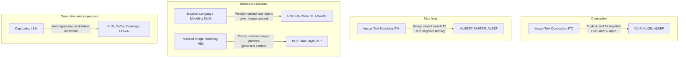

# Multimodal Vision-Language Learning: Overview and Foundations

> **Last Updated:** June 2026
> **Level:** Intermediate
> **Related Sections:** [VLP Models](./01_vlp_models.md) | [Large Vision-Language Models](./02_large_vision_language_models.md) | [Open-Vocabulary Detection](./03_open_vocabulary_detection.md) | [Document and OCR](./04_document_and_ocr.md)

---

## Overview

Multimodal vision-language learning addresses the problem of jointly modeling visual and linguistic information to support tasks that require understanding both modalities — visual question answering, image captioning, image-text retrieval, grounded referring expression comprehension, and more. The field emerged from early work on visual question answering and image captioning in the 2015–2017 era, and underwent a fundamental paradigm shift when BERT-style transformer pretraining was applied to vision-language data at scale starting in 2019–2020.

The core challenge that distinguishes vision-language learning from unimodal learning is the **modality gap**: visual and linguistic representations live in semantically dissimilar embedding spaces, require different tokenization strategies (patch features vs. wordpiece tokens), and carry information at very different granularities (pixels encode continuous appearance; words encode discrete symbolic concepts). Bridging this gap requires architectural choices about how to combine the two streams, and training objectives that force the representations to align. The major alignment paradigms are **contrastive** (CLIP, ALIGN — push matching pairs together and non-matching pairs apart), **generative** (caption the image or predict masked text tokens), and **matching** (binary classification: does this image-text pair match?).

The evolution of VLP models from 2019 to 2026 can be characterized by three successive architectures: (1) **dual-encoder** models (CLIP, ALIGN) that encode image and text independently — fast for retrieval but cannot model fine-grained cross-modal interactions; (2) **fusion-encoder** models (ViLBERT, UNITER, OSCAR, ALBEF) that apply cross-attention to combined image-text representations — powerful for understanding tasks but slow for large-scale retrieval; and (3) **generative VLMs** (BLIP, CoCa, Flamingo, LLaVA, GPT-4V) that add an autoregressive language decoder to the cross-modal encoder, enabling open-ended generation and multi-turn dialogue. The third paradigm — now dominant — is discussed in depth in [Large Vision-Language Models](./02_large_vision_language_models.md).

---

## Modality Gap

The modality gap refers to the structural difference between how vision and language representations are organized in embedding space:

```
Sources of modality gap:
  1. Tokenization:
     - Images: continuous, high-dimensional pixel grids
       Tokenized as: CNN region features (early VLP), grid features, or
       ViT patch tokens (modern VLP)
     - Text: discrete symbolic sequences
       Tokenized as: wordpiece/BPE subword tokens
  
  2. Information density:
     - A 224x224 image encodes ~50K pixels but ~196 meaningful ViT tokens
     - A caption encodes 10-20 meaningful concepts in 10-30 tokens
     - Mismatch: one visual region may map to many words, and vice versa
  
  3. Semantic granularity:
     - Visual features: local (texture, edges), mid-level (parts), global (scene)
     - Language tokens: syntactic (POS), semantic (named entities), pragmatic
     - No natural correspondence without explicit alignment training

  4. Domain gap in pretraining:
     - Image encoders pretrained on ImageNet (classification)
     - Language encoders pretrained on text corpora
     - Their respective inductive biases diverge: convolutions encode
       spatial locality; transformers encode global context
```

Empirical work on contrastive models (CLIP) has revealed that the modality gap persists even after joint training: when visualized in 2D (PCA/t-SNE), image and text embeddings of matching pairs form a "gap" in embedding space, separated by roughly one standard deviation. This gap reflects the different inductive biases of the two encoders and is partially mitigated by retrieval-augmented architectures and cross-attention fusion.

---

## Alignment Objectives and Pretraining Tasks

Modern VLP models employ combinations of four pretraining tasks:



**Image-Text Contrastive (ITC)**: Given a batch of N (image, text) pairs, maximize cosine similarity for matched pairs and minimize it for unmatched pairs. The InfoNCE loss is:

```
L_ITC = -(1/N) * sum_i [
  log exp(s(I_i, T_i) / tau)
  / sum_j exp(s(I_i, T_j) / tau)
]  -- image-to-text direction

where s = cosine similarity, tau = learnable temperature
```

**Image-Text Matching (ITM)**: A binary classifier on top of the fused representation predicts whether an (image, text) pair is matched. Hard negative mining (selecting in-batch negatives with high ITC similarity) makes this task more discriminative.

**Masked Language Modeling (MLM)**: Standard BERT-style masking applied to text tokens, but with the image tokens included in the context — the model must use visual context to predict masked words (e.g., "[MASK] is walking in the garden" given an image of a dog).

**Captioning (LM)**: Autoregressive generation of the caption token by token, conditioned on image features via cross-attention. Scales naturally to open-ended generation.

---

## Region vs. Grid vs. Patch Features

A major axis of architectural diversity in VLP is how visual information is tokenized:

```
1. Region features (2016–2021):
   - Detected object regions from Faster R-CNN (bottom-up features, Anderson 2018)
   - 36–100 region proposals; each encoded as 2048-d pool5 feature + box coordinates
   - Pros: Semantic, object-aligned; works well for VQA and referring expression
   - Cons: Slow (requires separate detector); discretization bias; no background
   - Used by: ViLBERT, LXMERT, UNITER, OSCAR, VinVL

2. Grid features (2020–2021):
   - Convolutional backbone (ResNet) activations on uniform spatial grid (e.g., 7x7)
   - No detection step; simpler; more background context
   - Pros: Fast; no detector bottleneck
   - Cons: Less semantically structured; harder to align with noun phrases
   - Used by: CLIP (ViT grid tokens), PixelBERT

3. Patch features (2021–present):
   - ViT patches: divide image into 14x14 or 16x16 pixel patches; flatten
   - Standard transformer tokenization; no inductive locality bias
   - Pros: End-to-end trainable; scales to arbitrary resolution; consistent with LLM paradigm
   - Cons: Needs large datasets to learn locality from scratch
   - Used by: CLIP ViT-L/14, BLIP-2 Q-Former, LLaVA, InternVL, ...

Trend: Region features largely replaced by patch features (2022+); end-to-end ViT
  encoders dominate modern VLMs. Grounding tasks still benefit from region-aligned
  features via resampler/Q-Former compression.
```

---

## Zero-Shot Capabilities

A major advantage of large-scale VLP pretraining is **zero-shot transfer**: the ability to solve downstream tasks without any task-specific training examples.

**Zero-shot image classification** (CLIP-style): Define class names as text prompts ("a photo of a {class}"), encode both image and class names, predict the class with highest cosine similarity. On ImageNet, CLIP ViT-L/14 achieves 75.5% top-1 accuracy without any fine-tuning.

**Zero-shot image-text retrieval**: Rank a corpus of captions by cosine similarity to the query image (or vice versa). CLIP, ALIGN, and CoCa achieve competitive Recall@1 on MSCOCO without fine-tuning.

**Zero-shot VQA**: Autoregressive VLMs (Flamingo, BLIP-2) answer VQA questions with 0 in-context examples; competitive with supervised models from 2020.

---

## Evolution to VLMs and VLAs

The trajectory from VLP models to modern Vision-Language Models (VLMs) and Vision-Language-Action (VLA) models for robotics represents a scaling of both model size and capability scope:

```
Era 1 (2019–2021): Fusion encoders
  BERT-size (110M–400M params); region features; task-specific heads
  Tasks: VQA, retrieval, captioning with fine-tuning
  Representative: ViLBERT, UNITER, OSCAR, ALBEF

Era 2 (2022–2023): Dual-encoder contrastive + generative
  Large ViT encoders (400M–1B); web-scale data (LAION, CC12M)
  Tasks: Zero-shot classification, retrieval, generation
  Representative: CLIP, ALIGN, BLIP, CoCa, BLIP-2

Era 3 (2023–2026): LLM-backbone VLMs
  LLM as decoder (7B–70B+ params); visual instruction tuning; multi-image/video
  Tasks: Open-ended QA, reasoning, code, tool use
  Representative: LLaVA-1.5, InternVL2, Qwen-VL, GPT-4V, Gemini, Claude 3
  -> See ./02_large_vision_language_models.md

Era 4 (2024–2026): VLAs for embodied AI
  Action tokens added to VLM output space; robot manipulation and navigation
  Representative: RT-2, OpenVLA, pi0, GR-2
  -> See ../06_robotics_and_embodied_ai/
```

---

## Key Papers

| Paper | Authors | Year | Venue | Key Contribution |
|-------|---------|------|-------|-----------------|
| ViLBERT | Lu et al. | 2019 | NeurIPS | Two-stream BERT; co-attentional transformer; multi-task VLP |
| LXMERT | Tan & Bansal | 2019 | EMNLP | Three-encoder model (lang, vis, cross); 5 pretraining tasks |
| UNITER | Chen et al. | 2020 | ECCV | Universal image-text representation; Word-Region Alignment |
| OSCAR | Li et al. | 2020 | ECCV | Object tags as anchor points bridging visual and language semantics |
| VinVL | Zhang et al. | 2021 | arXiv/CVPR | Stronger visual features from improved object detector; new SOTA on VQA |
| CLIP | Radford et al. | 2021 | ICML | Contrastive pretraining on 400M pairs; strong zero-shot classification |
| ALIGN | Jia et al. | 2021 | ICML | Noisy 1.8B image-text pairs; scale over curation |
| ALBEF | Li et al. | 2021 | NeurIPS | ITC + ITM + MLM; momentum distillation; hard negative mining |
| BLIP | Li et al. | 2022 | ICML | Bootstrapped caption filtering; unified understanding+generation |
| CoCa | Yu et al. | 2022 | arXiv/TMLR | Contrastive + captioning losses; single model for all VL tasks |
| BLIP-2 | Li et al. | 2023 | ICML | Q-Former bridges frozen ViT and frozen LLM; instruction following |

---

## Benchmark Performance

| Model | Task | Dataset | Metric | Score |
|-------|------|---------|--------|-------|
| CLIP ViT-L/14 | Zero-shot classification | ImageNet | Top-1 Acc | 75.5% |
| ALIGN | Image→Text retrieval | MSCOCO 5K | R@1 | 77.0% |
| ALBEF | VQA | VQAv2 test-std | VQA Acc | 75.84% |
| BLIP | Image captioning | NoCaps | CIDEr | 113.2 |
| BLIP | VQA | VQAv2 test-dev | VQA Acc | 78.25% |
| CoCa | Zero-shot classification | ImageNet | Top-1 Acc | 86.3% |
| BLIP-2 (FlanT5-XXL) | VQA | VQAv2 test-dev | VQA Acc | 82.19% |
| BLIP-2 (Vicuna-13B) | Zero-shot VQA | OK-VQA | VQA Acc | 45.9% |

---

## Pros & Cons

| Aspect | Pros | Cons |
|--------|------|------|
| **Contrastive pretraining (CLIP-style)** | Fast retrieval; strong zero-shot; scales to web data | No fine-grained cross-modal interaction; weak on compositional VQA |
| **Fusion-encoder pretraining (BERT-style)** | Strong on understanding tasks (VQA, ITM); captures cross-modal syntax | Slow inference (full attention over joint sequence); poor at generation |
| **Generative VLP (BLIP, CoCa)** | Unified model for understanding + generation; instruction tunable | Caption quality depends on noisy web alt-text; large decoder memory footprint |
| **Region-based tokenization** | Semantically structured; directly grounded to objects | Requires off-the-shelf detector; detector errors propagate; fixed 36 regions |
| **Patch-based tokenization (ViT)** | Scales to arbitrary resolution; end-to-end; consistent with LLMs | High token count for high-resolution images; locally unstructured |

---

## Open Problems & Research Gaps

- **Modality gap persistence**: Even after large-scale contrastive training, image and text embeddings remain in distinct clusters in joint embedding space. This limits fine-grained alignment for tasks requiring precise attribute or spatial correspondence.
- **Compositional reasoning**: Current VLP models fail systematically at negation ("a photo without a dog"), ordinal counting, and complex spatial relationships, even when benchmark-tuned. The cause is likely distributional: web image-text pairs rarely express compositional negation or precise counting.
- **Data efficiency for VLM alignment**: State-of-the-art VLMs require millions of instruction-tuning examples (LLaVA-665K). The minimum data required for high-quality visual instruction following is not well characterized.
- **Cross-lingual and cross-cultural VLP**: Most large VLP models are English-centric; multilingual extension requires either parallel image-text corpora or language-agnostic visual representations, neither of which is yet fully satisfactory.
- **Efficient grounding**: Linking VLP model outputs to specific image regions (grounded generation, pointing to objects mentioned in text) requires either heavyweight detection heads or specialized architectures; no lightweight grounding mechanism is yet standard.
- **Temporal modeling**: The next frontier is extending VLP from static image-text to video-text and long-document understanding, requiring efficient temporal attention and longer context windows.

---

## Further Reading

- [Lu et al. (2019), "ViLBERT: Pretraining Task-Agnostic Visiolinguistic Representations," NeurIPS 2019](https://arxiv.org/abs/1908.02265)
- [Li et al. (2021), "Align before Fuse: Vision and Language Representation Learning with Momentum Distillation," NeurIPS 2021](https://arxiv.org/abs/2107.07651)
- [Li et al. (2022), "BLIP: Bootstrapping Language-Image Pre-training for Unified Vision-Language Understanding and Generation," ICML 2022](https://arxiv.org/abs/2201.12086)
- [Radford et al. (2021), "Learning Transferable Visual Models From Natural Language Supervision (CLIP)," ICML 2021](https://arxiv.org/abs/2103.00020)
- [Yu et al. (2022), "CoCa: Contrastive Captioners are Image-Text Foundation Models," TMLR 2022](https://arxiv.org/abs/2205.01068)
- [Zhang et al. (2024), "MM-LLMs: Recent Advances in MultiModal Large Language Models," survey](https://arxiv.org/abs/2401.13601)
