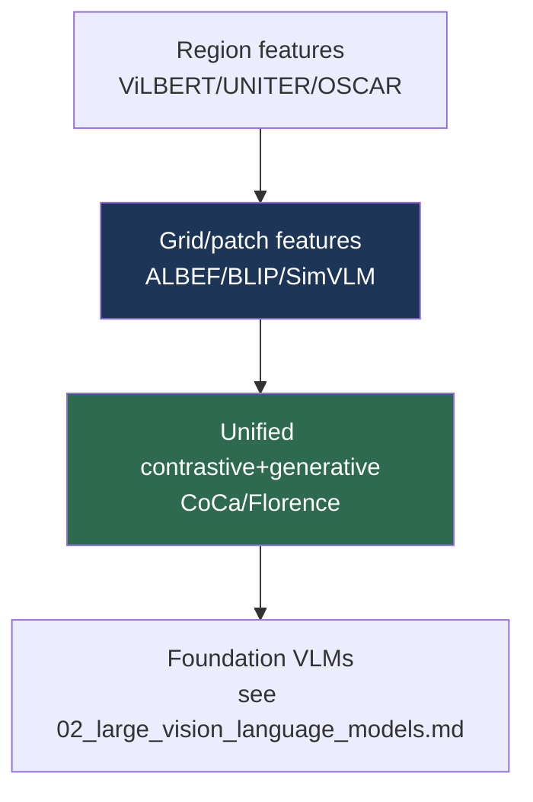

# Vision-Language Pretraining (VLP) Models

> **Last Updated:** June 2026
> **Level:** Intermediate
> **Related Sections:**
> - [Overview: Vision-Language](./00_overview.md)
> - [Large Vision-Language Models](./02_large_vision_language_models.md)
> - [Multimodal Architectures](../03_architectures/04_multimodal_architectures.md)
> - [Open-Vocabulary Detection](./03_open_vocabulary_detection.md)

---

## Overview

Vision-language pretraining (VLP) refers to the pre-LLM generation of models (roughly 2019–2022) that learned joint image-text representations through transformer encoders trained on paired data, then fine-tuned for downstream tasks: visual question answering (VQA), image-text retrieval, captioning, visual reasoning (NLVR2), and visual entailment. These models predate the "VLM = vision encoder + LLM" paradigm of [Large Vision-Language Models](./02_large_vision_language_models.md) but established the objectives—image-text contrastive (ITC), image-text matching (ITM), and masked-language modeling (MLM)—that all subsequent multimodal models inherit. Understanding VLP is essential because its architectural debates (region vs. grid vs. patch features; single-stream vs. dual-stream fusion; encoder vs. encoder-decoder) directly shaped the design space of modern VLMs and VLAs.

The trajectory has three phases. **Region-feature era** (ViLBERT, LXMERT, UNITER, OSCAR, VinVL) relied on a frozen object detector (Faster R-CNN) to extract region features, treating detected objects as visual "words"—powerful but slow and bottlenecked by the detector's vocabulary. **End-to-end era** (ALBEF, BLIP, SimVLM) dropped the detector for grid or patch features and trained the vision backbone jointly, introducing momentum distillation and bootstrapped captioning to handle noisy web data. **Unified era** (CoCa, Florence) combined contrastive and generative objectives in one model, foreshadowing the convergence into foundation VLMs. This file surveys these models, their objectives, and their downstream impact.

---

## Pretraining Objectives

VLP models combine a small set of objectives:

```
# Image-Text Contrastive (ITC): align matched pairs (CLIP-style)
L_ITC = InfoNCE(image_emb, text_emb)

# Image-Text Matching (ITM): binary classifier on fused [CLS]
L_ITM = BCE( head(fuse(image, text)), is_match )

# Masked Language Modeling (MLM): predict masked tokens given image
L_MLM = CE( predict(masked_text | image), true_tokens )
```

ALBEF's insight was to **align before fuse**: apply ITC on unimodal encoders first, then fuse with cross-attention for ITM/MLM—improving the quality of the fused representation. BLIP added **captioning (LM)** loss and a **CapFilt** bootstrapping scheme.

---

## The Three Eras

### Region-Feature Models

**ViLBERT** [Lu2019] (NeurIPS 2019) and **LXMERT** [Tan2019] (EMNLP 2019) used **dual-stream** architectures: separate transformers for vision (over Faster R-CNN region features) and language, connected by co-attention. **UNITER** [Chen2020] (ECCV 2020) used a **single-stream** transformer over concatenated region and word tokens with word-region alignment. **OSCAR** [Li2020] (ECCV 2020) injected object *tags* as anchor points to ease alignment; **VinVL** [Zhang2021] (CVPR 2021) showed that *better region features* (a stronger detector) substantially improve all downstream tasks—highlighting the detector bottleneck.

### End-to-End Models

**ALBEF** [Li2021] (NeurIPS 2021) removed the detector, using a ViT for grid features, ITC alignment, and **momentum distillation** to denoise web supervision. **BLIP** [Li2022] (ICML 2022) unified understanding and generation with a multimodal mixture-of-encoder-decoder and **CapFilt** (a captioner generates synthetic captions; a filter removes noisy ones), bootstrapping cleaner data. **SimVLM** [Wang2022] used a single prefix-LM objective at scale.

### Unified Models

**CoCa** [Yu2022] (Contrastive Captioner) combines a contrastive loss (image-text alignment) and a captioning loss (generative) in one encoder-decoder, yielding a model strong at both retrieval and generation. **Florence** (Microsoft) positioned itself as a "foundation model" spanning space, time, and modality.



---

## Key Papers

| Paper | Authors | Year | Venue | Key Contribution |
|-------|---------|------|-------|-----------------|
| ViLBERT | Lu, Batra, Parikh, Lee | 2019 | NeurIPS | Dual-stream co-attention VLP over region features |
| LXMERT | Tan, Bansal | 2019 | EMNLP | Cross-modality encoder for VQA/reasoning |
| UNITER | Chen, Li, Yu, et al. | 2020 | ECCV | Single-stream VLP with word-region alignment |
| OSCAR | Li, Yin, Li, et al. | 2020 | ECCV | Object tags as semantic anchors |
| ALBEF | Li, Selvaraju, Gotmare, et al. | 2021 | NeurIPS | Align-before-fuse + momentum distillation |
| BLIP | Li, Li, Xiong, Hoi | 2022 | ICML | Unified understanding/generation + CapFilt |
| CoCa | Yu, Wang, Vasudevan, et al. | 2022 | TMLR | Contrastive + captioning in one encoder-decoder |

---

## Benchmark Performance

| Model | VQAv2 (test-std) | NLVR2 | TR/IR @COCO | Notes |
|-------|------------------|-------|-------------|-------|
| UNITER-L | ~73.4 | ~79.5 | strong | Region features [Chen2020] |
| VinVL | ~76.6 | ~83.1 | SOTA (2021) | Better region features [Zhang2021] |
| ALBEF | ~75.8 | ~83.1 | strong | Detector-free [Li2021] |
| BLIP | ~78.3 | ~82.2 | SOTA retrieval | CapFilt bootstrapping [Li2022] |
| CoCa | ~82.3 | — | SOTA | Also 91.0% ImageNet (frozen) [Yu2022] |

*Scores approximate and protocol-dependent.*

---

## Pros & Cons

| Aspect | Pros | Cons |
|--------|------|------|
| Region features | Object-grounded, strong on VQA | Detector bottleneck; slow; fixed vocabulary |
| End-to-end (ALBEF/BLIP) | Detector-free, faster, scalable | Needs careful noise handling (CapFilt/momentum) |
| Unified (CoCa) | One model for retrieval + generation | Larger, more complex training |
| Encoder-only VLP | Strong discriminative tasks | Cannot generate open-ended text (vs. LLM-based VLMs) |

---

## Open Problems & Research Gaps

- **The detector legacy.** Region features gave object grounding that patch-based VLMs partly lost; recovering fine-grained grounding cheaply is open (links to [Open-Vocabulary Detection](./03_open_vocabulary_detection.md)).
- **Noisy web supervision.** CapFilt and momentum distillation are heuristics; principled denoising of image-text pairs is unsolved (see [Scaling Laws in Vision](../12_research_frontier_2024_2026/01_scaling_laws_vision.md)).
- **Compositional reasoning.** VLP models exploit dataset biases; genuine compositional understanding remains weak.
- **Unifying discriminative and generative objectives.** CoCa combines them but the optimal balance and architecture is unsettled.
- **Transfer to embodied tasks.** How VLP representations transfer to control (VLAs) versus LLM-based VLMs is under-studied.
- **Evaluation contamination.** VQAv2/NLVR2 leaderboards saturate and suffer from annotation artifacts.

---

## Further Reading

- [ALBEF (arXiv:2107.07651)](https://arxiv.org/abs/2107.07651) — align before fuse
- [BLIP (arXiv:2201.12086)](https://arxiv.org/abs/2201.12086) — bootstrapping language-image pretraining
- [CoCa (arXiv:2205.01917)](https://arxiv.org/abs/2205.01917) — contrastive captioners
- [UNITER (arXiv:1909.11740)](https://arxiv.org/abs/1909.11740) — universal image-text representation
- [VinVL (arXiv:2101.00529)](https://arxiv.org/abs/2101.00529) — revisiting visual representations in VLP
