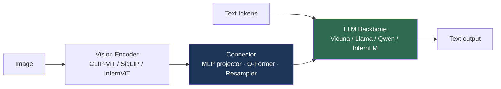

# Large Vision-Language Models (LMMs)

> **Last Updated:** June 2026
> **Level:** Advanced
> **Related Sections:**
> - [Multimodal Architectures](../03_architectures/04_multimodal_architectures.md)
> - [Multimodal LLMs 2025–2026](../12_research_frontier_2024_2026/03_multimodal_llm_2025_2026.md)
> - [VLA Models](../06_robotics_and_embodied_ai/01_vla_models.md)
> - [Document & OCR](./04_document_and_ocr.md)

---

## Overview

Large multimodal models (LMMs, or large vision-language models) extend the autoregressive LLM to accept interleaved image (and increasingly video/audio) inputs, producing free-form text grounded in visual content. They are the perceptual front-end of modern AI systems and the direct ancestors of the VLAs in [VLA Models](../06_robotics_and_embodied_ai/01_vla_models.md)—RT-2 and Gemini Robotics are LMMs with an action head. The field organizes around a key architectural axis: **CLIP-adapter (modular) models**, which bolt a pretrained vision encoder onto a pretrained LLM via a lightweight connector (LLaVA, InstructBLIP), versus **natively multimodal models** trained on interleaved data from the start (Flamingo, GPT-4o, Gemini).

The 2023–2026 trajectory is one of rapid convergence between open and closed models. The LLaVA lineage demonstrated that a *simple* projection between a frozen CLIP encoder and an open LLM, trained on modest instruction data, could approach proprietary quality at a fraction of the cost; InternVL then scaled the open vision encoder to 6B parameters to close the gap further. Meanwhile closed models (GPT-4o, Gemini 1.5/2.0) pushed native multimodality, real-time audio-vision, and million-token video context. This file maps the architecture taxonomy, traces the major model families, and compares them on the standard LMM benchmark suite (MMBench, MMMU, MathVista, DocVQA, RefCOCO).

---

## Architecture Taxonomy

**CLIP-adapter (modular).** A frozen (or lightly tuned) vision encoder produces visual tokens that a **connector** maps into the LLM's embedding space. Connector designs range from a simple **MLP projector** (LLaVA-1.5) to a **Q-Former** (BLIP-2, a learned set of query tokens that cross-attend to image features) to a **Perceiver Resampler** (Flamingo). Training is typically two-stage: (1) connector pretraining on image-caption data to align modalities, then (2) visual instruction tuning on multimodal dialogues.

**Natively multimodal.** Models like Flamingo [Alayrac2022] interleave cross-attention layers into a frozen LLM to attend to images, trained on web-scale interleaved image-text; GPT-4o and Gemini are trained multimodally end-to-end, enabling interleaved image-text reasoning and (for GPT-4o) real-time audio-vision. See [Multimodal Architectures](../03_architectures/04_multimodal_architectures.md) for the fusion-mechanism details.

---

## Major Model Families

### The LLaVA Lineage

**LLaVA** [Liu2023] (NeurIPS 2023) introduced *visual instruction tuning*: GPT-4-generated multimodal instruction data + a simple linear projection from CLIP-ViT to Vicuna. **LLaVA-1.5** swapped the linear projector for a two-layer MLP, added academic-task data and higher resolution, and became a strong, cheap baseline. **LLaVA-1.6 / LLaVA-NeXT** added dynamic high-resolution ("AnyRes" tiling) and stronger LLMs. **LLaVA-OneVision** unified single-image, multi-image, and video understanding in one model with transfer across modalities. The lineage's significance is methodological: it proved competitive LMMs can be built cheaply and reproducibly.

### InternVL

**InternVL** [Chen2024c] (CVPR 2024) scaled the *vision* side, pairing a 6B-parameter **InternViT-6B** with an LLM via a progressive alignment strategy. **InternVL 1.5 / 2 / 2.5** became the leading open-source LMMs, with InternVL2.5 matching or surpassing some proprietary models on MMMU and MMBench—the clearest evidence that the open–closed gap had largely closed by 2025.

### Proprietary Frontier

**GPT-4V → GPT-4o** (OpenAI) moved from vision-capable GPT-4 to a natively multimodal "omni" model with interleaved image-text and real-time audio-vision. **Gemini 1.5 Pro** (Google) introduced a **1M-token context window** enabling long-video understanding (validated by needle-in-a-haystack video retrieval), extended in **Gemini 2.0 Flash**. **Qwen-VL / Qwen2-VL** (Alibaba) are strong on document understanding and Chinese content with dynamic-resolution encoding. The 2025–2026 frontier is tracked in [Multimodal LLMs 2025–2026](../12_research_frontier_2024_2026/03_multimodal_llm_2025_2026.md).

---

## Key Papers

| Paper | Authors | Year | Venue | Key Contribution |
|-------|---------|------|-------|-----------------|
| Flamingo | Alayrac, Donahue, Luc, et al. | 2022 | NeurIPS | Interleaved image-text via Perceiver Resampler + gated cross-attn |
| BLIP-2 | Li, Li, Savarese, Hoi | 2023 | ICML | Q-Former connector bridging frozen encoder & LLM |
| LLaVA | Liu, Li, Wu, Lee | 2023 | NeurIPS | Visual instruction tuning; simple projector + Vicuna |
| InternVL | Chen, Wu, Wang, et al. | 2024 | CVPR | InternViT-6B; scaling the open vision encoder |
| Qwen2-VL | Wang, Bai, Tan, et al. | 2024 | arXiv | Dynamic-resolution encoding; strong doc/multilingual |

---

## Benchmark Performance

| Model | MMBench | MMMU | MathVista | DocVQA | Notes |
|-------|---------|------|-----------|--------|-------|
| LLaVA-1.5-13B | ~67 | ~36 | ~27 | — | Cheap reproducible baseline |
| InternVL2.5-78B | ~88 | ~70 | ~72 | ~95 | Open-source frontier (approx.) |
| Qwen2-VL-72B | ~86 | ~64 | ~70 | ~96 | Strong document understanding |
| GPT-4o | ~83 | ~69 | ~63 | ~92 | Native multimodal, real-time |
| Gemini 1.5 Pro | ~80 | ~62 | ~63 | ~93 | 1M-token video context |

*Scores are approximate, vary by eval protocol/version, and move quickly—treat as indicative and consult current leaderboards. RefCOCO (referring grounding) is reported separately for grounding-capable variants.*

---

## Pros & Cons

| Aspect | Pros | Cons |
|--------|------|------|
| CLIP-adapter (LLaVA) | Cheap, reproducible, fast to iterate | Bounded by frozen encoder; weaker fine-grained perception |
| Native multimodal (GPT-4o/Gemini) | Interleaved reasoning, real-time, long context | Closed weights; massive compute; opaque |
| Scaled open encoder (InternVL) | Closes gap to proprietary; open weights | Heavy 6B encoder; expensive to train |
| Q-Former (BLIP-2) | Compresses visual tokens efficiently | Harder to train; can bottleneck detail |

---

## Open Problems & Research Gaps

- **Spatial and fine-grained perception.** LMMs still fail at precise spatial relations and small-object/text detail (see [Spatial Intelligence](../12_research_frontier_2024_2026/06_spatial_intelligence.md)).
- **Hallucination.** Object and attribute hallucination persists; grounding and faithfulness remain unsolved.
- **Visual token efficiency.** High-resolution images explode token counts; optimal compression (Q-Former vs. tiling vs. pooling) is unsettled.
- **Video at scale.** Long-video understanding beyond keyframe sampling, with true temporal reasoning, is immature even at 1M-token context.
- **Evaluation integrity.** Benchmark contamination and format-overfitting inflate scores; robust evaluation is an open methodological problem.
- **Connector design.** No consensus on the best encoder→LLM connector; the choice materially affects perception fidelity.
- **Unified any-to-any.** Truly unified models handling image, video, audio, and action (toward VLAs) remain early.

---

## Further Reading

- [LLaVA (arXiv:2304.08485)](https://arxiv.org/abs/2304.08485) — visual instruction tuning
- [BLIP-2 (arXiv:2301.12597)](https://arxiv.org/abs/2301.12597) — Q-Former connector
- [InternVL (arXiv:2312.14238)](https://arxiv.org/abs/2312.14238) — scaling the open vision encoder
- [Flamingo (arXiv:2204.14198)](https://arxiv.org/abs/2204.14198) — interleaved few-shot multimodal learning
- [Qwen2-VL (arXiv:2409.12191)](https://arxiv.org/abs/2409.12191) — dynamic-resolution multimodal model
