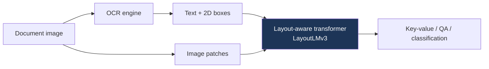

# Document Understanding & OCR

> **Last Updated:** June 2026
> **Level:** Advanced
> **Related Sections:**
> - [Large Vision-Language Models](./02_large_vision_language_models.md)
> - [Overview: Vision-Language](./00_overview.md)
> - [Multimodal LLMs 2025–2026](../12_research_frontier_2024_2026/03_multimodal_llm_2025_2026.md)

---

## Overview

Document AI sits at the intersection of vision, language, and layout: the task is to read and reason over structured visual documents—forms, invoices, receipts, scientific papers, tables, charts, and infographics—where *spatial layout* carries semantic meaning that plain OCR text discards. The field has moved through three paradigms. First, **OCR-then-language** pipelines fed recognized text (and 2D positions) into layout-aware transformers (LayoutLM family). Second, **OCR-free** end-to-end models (Donut, Pix2Struct) read pixels directly and generate structured output, eliminating the brittle, error-propagating OCR stage. Third, **general VLMs** (Qwen2-VL, InternVL, GPT-4o) absorbed document understanding as one capability among many, using high-resolution encoding to read dense text natively—now the dominant approach (see [Large Vision-Language Models](./02_large_vision_language_models.md)).

The central technical challenge is **high-resolution dense-text perception**: a document page may contain thousands of characters that demand far higher effective resolution than natural-image VLMs typically use, forcing tiling/dynamic-resolution schemes and exploding visual-token counts. A second challenge is *structured output*: documents require reading order, table structure, and key-value extraction, not just free text. This file surveys the layout-aware, OCR-free, and VLM-based approaches, the benchmarks (DocVQA, ChartQA, InfographicVQA, OCRBench), and the unresolved problems of robust structure extraction.

---

## Layout-Aware Models

**LayoutLM** [Xu2020] (KDD 2020, Microsoft) augmented BERT with **2D positional embeddings** (token bounding-box coordinates), pretraining on the IIT-CDIP document corpus. **LayoutLMv2** added image embeddings and a spatial-aware self-attention; **LayoutLMv3** [Huang2022b] (ACM MM 2022) unified text and image masking with a single multimodal transformer over patch + text tokens, dropping the dependence on a separate CNN, and became a strong backbone for form/receipt understanding (FUNSD, CORD). These models still require an upstream OCR engine, inheriting its errors.

---

## OCR-Free End-to-End Models

**Donut** [Kim2022] (ECCV 2022) is an OCR-free encoder-decoder: a Swin vision encoder reads the raw page and a transformer decoder generates structured output (JSON) directly, trained with synthetic document generation (SynthDoG). **Pix2Struct** [Lee2023] (ICML 2023) pretrains by parsing webpage screenshots into simplified HTML, a screenshot-to-structure objective that transfers strongly to charts, UIs, and documents. **Nougat** [Blecher2023] (Meta) targets academic PDFs, converting page images to markup (LaTeX/Markdown) for scientific documents. **GOT-OCR2.0** (2024) is a compact general OCR-2.0 model handling text, formulas, tables, and sheet music in a unified end-to-end manner.

---

## VLM-Based Document Understanding

Modern general VLMs now lead document benchmarks by treating reading as a special case of multimodal reasoning. **Qwen2-VL** uses **naive dynamic resolution** (variable visual tokens per image) and excels at dense-text and multilingual documents; **InternVL** uses dynamic high-resolution tiling; **GPT-4o** and **Gemini** read documents natively. The trend is the *disappearance of a dedicated document pipeline* into the general VLM—though specialized OCR-free models remain valuable for structured extraction and on-device use.

---

## Key Papers

| Paper | Authors | Year | Venue | Key Contribution |
|-------|---------|------|-------|-----------------|
| LayoutLM | Xu, Li, Cui, et al. | 2020 | KDD | 2D positional embeddings for documents |
| LayoutLMv3 | Huang, Lv, Cui, et al. | 2022 | ACM MM | Unified text-image masking; patch-based |
| Donut | Kim, Hong, Yim, et al. | 2022 | ECCV | OCR-free image-to-JSON document parsing |
| Pix2Struct | Lee, Joshi, Turc, et al. | 2023 | ICML | Screenshot-to-HTML pretraining |
| Nougat | Blecher, Cucurull, Scialom, Stojnic | 2023 | arXiv (Meta) | Academic PDF → markup |
| Qwen2-VL | Wang, Bai, Tan, et al. | 2024 | arXiv | Dynamic resolution; SOTA doc understanding |

---

## Benchmark Performance

| Model | DocVQA (ANLS) | ChartQA | InfoVQA | Notes |
|-------|---------------|---------|---------|-------|
| LayoutLMv3 | ~83 (DocVQA) | — | — | OCR-dependent [Huang2022b] |
| Donut | ~67–72 | — | — | OCR-free [Kim2022] |
| Pix2Struct-L | ~76 | ~58 | ~40 | Screenshot pretraining [Lee2023] |
| Qwen2-VL-72B | ~96 | ~88 | ~84 | VLM, dynamic res |
| GPT-4o | ~92 | ~85 | — | Native multimodal |

*ANLS = Average Normalized Levenshtein Similarity; scores approximate and version-dependent.*

---

## Pros & Cons

| Aspect | Pros | Cons |
|--------|------|------|
| Layout-aware (LayoutLM) | Strong structured extraction; explicit layout | OCR error propagation; pipeline complexity |
| OCR-free (Donut/Pix2Struct) | End-to-end, no OCR stage; robust | Needs high-res; harder to train |
| General VLMs | SOTA, unified, multilingual | Huge compute; weaker exact structure output |
| Specialized OCR-2.0 (GOT) | Compact, on-device, formulas/tables | Narrower than general VLMs |

---

## Open Problems & Research Gaps

- **High-resolution token explosion.** Reading dense pages inflates visual-token counts; efficient high-res encoding is unsolved (see [Large Vision-Language Models](./02_large_vision_language_models.md)).
- **Structured output fidelity.** VLMs read text well but produce exact table/JSON structure unreliably.
- **Reading order & long documents.** Multi-page, complex-layout reasoning remains weak.
- **Chart and diagram reasoning.** Numerical reasoning over charts (ChartQA) and infographics lags text QA.
- **Handwriting & low-resource scripts.** Robust recognition across scripts and handwriting is immature.
- **Hallucination in extraction.** VLMs may fabricate field values not present in the document—critical for finance/legal use.
- **Evaluation.** Benchmarks emphasize QA over faithful end-to-end structured extraction.

---

## Further Reading

- [LayoutLMv3 (arXiv:2204.08387)](https://arxiv.org/abs/2204.08387) — unified text-image document pretraining
- [Donut (arXiv:2111.15664)](https://arxiv.org/abs/2111.15664) — OCR-free document understanding
- [Pix2Struct (arXiv:2210.03347)](https://arxiv.org/abs/2210.03347) — screenshot parsing pretraining
- [Nougat (arXiv:2308.13418)](https://arxiv.org/abs/2308.13418) — neural optical understanding for academic documents
- [GOT-OCR2.0 (arXiv:2409.01704)](https://arxiv.org/abs/2409.01704) — general OCR theory
