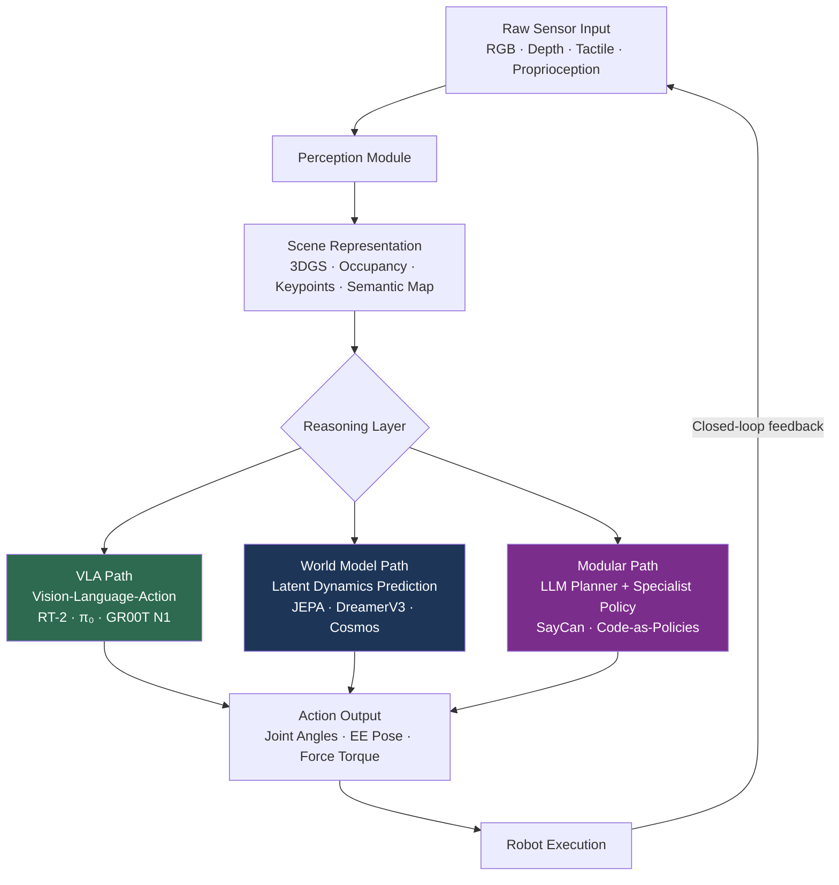

# Embodied AI: Overview and Ecosystem Roadmap

> **Last Updated:** June 2026
> **Level:** Research Frontier
> **Related Sections:**
> - [VLA Models (Vision-Language-Action)](./01_vla_models.md)
> - [3D Vision and Scene Representations](../04_3d_vision_and_scene/00_overview.md)
> - [Multimodal Vision-Language Models](../05_multimodal_vision_language/00_overview.md)
> - [Research Frontier 2024–2026](../12_research_frontier_2024_2026/04_vla_embodied_2025_2026.md)

---

## Overview

Embodied AI designates systems that perceive their physical environment through sensors, build internal representations of that environment, reason over those representations using learned or symbolic models, and then execute actions that alter the state of the world. Unlike purely perceptual AI (image classifiers, detectors) or purely generative AI (large language models, diffusion models), embodied systems are closed-loop: every action changes future observations, making the learning problem fundamentally non-i.i.d. The field is the convergence of three historically separate disciplines—computer vision, natural language processing, and control theory—and as of 2026 that convergence has accelerated dramatically due to the rise of large-scale robot foundation models and the commoditisation of high-dexterity hardware.

What makes the embodied setting fundamentally hard is the compounding of multiple long-tail distributions. The visual world is open-ended (novel objects, novel scenes, novel lighting), the language of instruction is compositional and ambiguous, and the dynamics of physical interaction introduce contact-rich nonlinearities that resist analytic treatment. A manipulation policy that achieves 97% success on a fixed kitchen counter—as RT-1 did [Brohan2022]—will commonly fail when the counter height changes by ten centimetres or a new cup colour appears. Bridging this brittleness gap is the central research question of the field in 2025–2026.

The field is simultaneously a scientific programme and an industrial race. Academic groups at UC Berkeley BAIR, CMU, Stanford, and ETH Zurich continue to produce the foundational algorithmic advances—from imitation learning and offline RL to world models and diffusion-based policies. Meanwhile, well-capitalised companies including Physical Intelligence (π), Figure AI, 1X Technologies, Boston Dynamics, Agility Robotics, NVIDIA, and Google DeepMind are translating those advances into deployable systems. The convergence of large-scale Internet pretraining with robot trajectory data—pioneered by RT-2 [Brohan2023] and now standard practice—means that the gap between academic prototypes and industrial deployments is closing faster than at any previous point in robotics history.

---

## The Perception → Reasoning → Action Pipeline

The canonical decomposition of an embodied agent separates three processing layers, though modern end-to-end approaches intentionally blur the boundaries.



### Perception Module

The perception module transforms raw sensor streams into structured representations that downstream reasoning can consume. In 2022–2023, the dominant paradigm was to treat perception as a learned feature extraction step embedded inside the policy (e.g., the FiLM-conditioned EfficientNet in RT-1 [Brohan2022]). By 2025, the preferred approach is to use a shared pretrained visual encoder—typically a SigLIP or DINOv2 backbone—that produces semantic tokens compatible with a language model backbone, allowing visual representations to benefit from Internet-scale pretraining. Depth sensors and wrist-mounted tactile sensors are increasingly standard; point-cloud and force-torque signals are integrated via lightweight projectors into the token stream.

Scene representations span a spectrum of abstraction:
- **3D Gaussian Splatting (3DGS):** Compact, renderable scene models that support novel-view synthesis and spatial queries; increasingly used for sim-to-real transfer and scene memory [Kerbl2023].
- **Occupancy grids and voxel representations:** Explicit spatial maps used for collision avoidance and reachability planning.
- **Keypoint and object-centric representations:** Sparse but semantically meaningful; used by DIFT-based correspondence methods and transporter networks.
- **Semantic maps:** Top-down layouts augmented with object labels; used by LLM planners for navigation.

### Reasoning Layer

Three architectural families compete at the reasoning layer:

**VLA (Vision-Language-Action) Path.** The end-to-end paradigm. A pretrained vision-language model is extended with an action head that directly outputs robot actions. The key design choices are (a) how to represent actions—discrete token bins [Brohan2023, Kim2024], continuous regression, or flow matching [Black2024]—and (b) whether to generate action chunks (sequences of future actions) or single-step predictions. This path currently achieves the best results on dexterous manipulation benchmarks. Its weakness is the computational cost of running a multi-billion-parameter model at policy frequencies (50 Hz+).

**World Model Path.** Rather than mapping directly from observation to action, a world model first learns a latent dynamics model of the environment and then plans actions in latent space. DreamerV3 [Hafner2023] demonstrated that a single world model can master over 150 tasks across diverse domains using model-based RL in "dream" rollouts. NVIDIA's Cosmos [2024] extends this to physical AI by unifying world generation, visual reasoning, and action simulation in a single Mixture-of-Transformers architecture. The V-JEPA line of work [LeCun group] pursues prediction in joint embedding space rather than pixel space, avoiding the pixel-level reconstruction loss that can dominate gradients and distract from dynamics learning. The world model path is theoretically appealing for long-horizon planning and sample efficiency but has not yet matched VLAs on dexterous real-world manipulation.

**Modular (LLM Planner + Specialist Policy) Path.** LLMs are used as high-level planners that decompose natural-language tasks into sub-goals, which are then executed by trained specialist policies or motion primitives. SayCan [Ahn2022] introduced the key insight of grounding LLM outputs with value function affordances: the LLM scores candidate skill descriptions for plausibility, and a learned affordance function scores them for feasibility, and the product determines the next action. Code as Policies [Liang2023] went further, generating executable Python programs that call perception APIs and motion primitives as library functions, enabling spatial reasoning and loop logic without task-specific training data.

### Action Representation

The action space for a manipulation robot is typically a 7-DoF vector (3D end-effector position, 3D orientation, gripper width) or a full joint-angle vector for humanoids (20–50+ DoF). The key design tension is between expressiveness and training stability:

```
# Discrete tokenization (RT-2, OpenVLA)
action_bins = 256  # per dimension
action_token = discretize(action, bins=action_bins)  # lossy but LM-compatible

# Continuous regression (Octo, simple BC)
action = MLP(latent)  # unimodal, may average over multimodal demonstrations

# Diffusion / Flow Matching (π₀, GR00T N1)
# Flow matching learns vector field v_θ(x_t, t) such that
# dx_t/dt = v_θ(x_t, t), integrating from noise x_0 ~ N(0,I) to action x_1
action_chunk = flow_match(latent, noise=torch.randn(H, action_dim))
```

Flow matching [Lipman2022] is emerging as the preferred action head design for dexterous manipulation because it avoids discretization artefacts, handles multimodal action distributions naturally, and is faster to sample than score-based diffusion.

---

## The Industrial and Academic Landscape (2025–2026)

### Industrial Labs and Companies

**Physical Intelligence (π)** — Founded 2024 by Sergey Levine, Chelsea Finn, Karol Hausman, Brian Ichter, Pete Florence, and others. Released π₀ (October 2024) [Black2024] and π₀.5 (April 2025) [Hejna2025], the latter achieving meaningful generalisation to entirely new home environments unseen during training. The key technical innovation is flow-matching action generation on top of a PaliGemma backbone. Raised ~$470M by end of 2024.

**Figure AI** — Released the Helix VLA (2025), the first VLA designed for whole-body humanoid dexterity running entirely on embedded onboard GPUs. Helix was the first VLA to run simultaneously on two robots sharing a long-horizon task. Deployed Figure 02 robots at BMW's Spartanburg plant, logging 1,250+ runtime hours and loading 90,000+ parts across 30,000 vehicles [FigureAI2025]. Ended its OpenAI partnership in 2025 to operate a fully proprietary AI stack.

**1X Technologies** — Focuses on home-domain humanoids (NEO) and commercial platforms (EVE). OpenAI is an investor and early collaboration partner. Research emphasis on whole-body control and long-horizon task completion from natural language.

**Boston Dynamics** — Electric Atlas (Gen 3) entered initial industrial deployments in 2025. Spot remains the most widely deployed quadruped platform globally. Research focus on model predictive control, parkour-style whole-body locomotion, and integration with VLA-style task planning.

**NVIDIA** — Released GR00T N1 (March 2025) [NVIDIA2025], a 34B-parameter (full) / 2.2B-parameter (released) dual-system foundation model for humanoid robots. Also released Cosmos, the Omniverse/Isaac Sim simulation stack for synthetic data generation (780k trajectories in 11 hours), and the Isaac Lab training framework for sim-to-real transfer.

**Google DeepMind** — The RT series (RT-1, RT-2, RT-X) established the VLA paradigm [Brohan2022, Brohan2023]. In March 2025, DeepMind released Gemini Robotics [GoogleDeepMind2025], a VLA built on Gemini 2.0 with advanced dexterous manipulation capabilities, and Gemini Robotics-ER for embodied spatial reasoning. Gemini Robotics On-Device was released June 2025, requiring only 50–100 demonstrations to generalise new skills.

**UC Berkeley BAIR** — Home to the research groups behind RT-1/RT-2 (Pieter Abbeel, Sergey Levine before his move to PI), OpenVLA [Kim2024], and foundational work in offline RL, imitation learning, and robot learning. BAIR comprises 50+ faculty and 300+ graduate students.

**CMU Robotics Institute** — Home to foundational work in legged locomotion (Russ Tedrake), planning under uncertainty, and contact-rich manipulation. Dean Pomerleau's self-driving lineage continues through the CMU AV groups.

**Stanford Human-Centered Robotics Lab and IRIS Lab** — Contributors to Diffusion Policy [Chi2023], and active in dexterous hand manipulation, deformable object manipulation, and generalisation benchmarks for VLAs.

---

## Key Open Research Questions (2026)

### Data Efficiency and the Demonstration Bottleneck

Large language models benefited from a fundamentally passive data source—text on the Internet. Robotics has no equivalent. Curated robot trajectories are expensive: collecting the 130k episodes used to train RT-1 required 17 months across 13 robots [Brohan2022]. Closing the ~120,000× gap between robot data and LLM pretraining data is the single largest bottleneck. Current strategies include (a) sim-to-real transfer using physics simulators (Isaac Sim, MuJoCo) with domain randomization, (b) human video pretraining (GR00T N1 used 3M egocentric video clips), and (c) data sharing across embodiments (Open X-Embodiment [OpenXEmbodiment2023]).

### Generalisation to Novel Objects and Scenes

State-of-the-art VLAs still exhibit steep performance cliffs on out-of-distribution objects. π₀ loses ~14 percentage points (~19% relative) between in-distribution and novel-object settings; ACT loses ~42 points (~88% relative) [benchmarkpaper2024]. Achieving distribution-shift robustness comparable to humans (who can manipulate a novel object after a few seconds of visual inspection) requires richer scene understanding and possibly physical common-sense priors.

### Long-Horizon Task Completion

Most VLA benchmarks involve episodes of 10–30 seconds and 1–3 sub-steps. Real-world housework or factory assembly involves sequences of dozens of steps over minutes or hours, requiring persistent memory, re-planning on failure, and multi-step reasoning. π₀.5 [Hejna2025] made progress here but long-horizon performance remains significantly below human ability.

### Safe Physical Interaction

Robots operating in human environments must avoid injuring people, damaging objects, and violating physical constraints. Current learned policies have no formal safety guarantees, and failure modes can be catastrophic. Control-theoretic safety certificates (Control Barrier Functions), uncertainty-aware planning, and anomaly detection are active research areas.

### Real-Time VLA Inference

A 55B-parameter VLA cannot run at 50 Hz on onboard compute without aggressive model compression. Approaches including knowledge distillation, quantization, and speculative decoding are being adapted from LLM serving to VLA deployment. The FAST tokenizer [FAST2025] can compress action sequences in frequency space via Discrete Cosine Transform, matching π₀ performance at 5× reduced training compute.

### Multi-Robot Coordination

Most current systems assume a single robot. Real factory and home scenarios increasingly require multiple robots to share tasks, exchange state estimates, and avoid collision. Figure AI's Helix demonstrated two-robot coordination on a shared task [FigureAI2025], but principled multi-agent robot learning remains largely unsolved.

### Sim-to-Real Transfer Fidelity

Physics simulators still fail to accurately model soft-body interactions, liquid dynamics, and contact-rich manipulation (e.g., inserting a USB plug). Closing the sim-to-real gap for these contact modes is critical for data-efficient training.

---

## Key Papers

| Paper | Authors | Year | Venue | Key Contribution |
|-------|---------|------|-------|-----------------|
| RT-1: Robotics Transformer for Real-World Control at Scale | Brohan et al. | 2022 | CoRL / RSS 2023 | TokenLearner + Transformer on 130k demo dataset; 97% success on 700+ tasks |
| Do As I Can, Not As I Say: Grounding Language in Robotic Affordances (SayCan) | Ahn et al. | 2022 | CoRL | LLM planner grounded by affordance value functions |
| RT-2: Vision-Language-Action Models Transfer Web Knowledge to Robotic Control | Brohan et al. (Zitkovich et al.) | 2023 | CoRL | Co-fine-tuning VLM on robot data; emergent chain-of-thought in robot policies |
| Open X-Embodiment: Robotic Learning Datasets and RT-X Models | Open X-Embodiment Collaboration | 2023 | ICRA 2024 (Best Paper) | 22-embodiment, 527-skill, 160k-episode cross-embodiment dataset and RT-X |
| π₀: A Vision-Language-Action Flow Model for General Robot Control | Black et al. | 2024 | arXiv (Physical Intelligence) | Flow-matching action head on PaliGemma; 50 Hz dexterous manipulation |
| OpenVLA: An Open-Source Vision-Language-Action Model | Kim et al. | 2024 | CoRL | 7B open-weight VLA on Open X-Embodiment; matches RT-2 on BridgeV2 |
| GR00T N1: An Open Foundation Model for Generalist Humanoid Robots | NVIDIA | 2025 | arXiv | 34B dual-system humanoid foundation model with diffusion action decoder |
| Gemini Robotics: Bringing AI into the Physical World | Google DeepMind | 2025 | arXiv | Gemini 2.0-based VLA for dexterous manipulation; multi-embodiment transfer |
| π₀.5: a Vision-Language-Action Model with Open-World Generalization | Hejna et al. (Physical Intelligence) | 2025 | arXiv | Co-training on heterogeneous tasks + web data for novel-environment generalisation |

---

## Benchmark Performance

| System | Benchmark | Metric | Score | Notes |
|--------|-----------|--------|-------|-------|
| RT-1 | In-distribution (700 instructions) | Success rate | 97% | 13 EDR robots, kitchen tasks |
| RT-1 | Unseen instructions | Success rate | 76% | +24% over next-best baseline |
| RT-2-PaLI-X-55B | Unseen objects (hard) | Success rate | 62% | vs. RT-1 baseline ~32% |
| RT-2-PaLM-E-12B | Unseen objects (hard) | Success rate | 62% | Both variants tied on average |
| RT-2-PaLI-X-55B | Language Table (sim) | Success rate | 90% | vs. 77% prior SOTA |
| OpenVLA | Google Robot tasks | Mean success rate | 85.0 ± 4.6% | vs. RT-2-X 78.3 ± 5.4% |
| π₀ | In-distribution (4-task macro avg) | Success rate | ~72% | Clean dish, sponge, bag, shorts |
| π₀ | Unseen objects (instance + spatial OOD) | Success rate | ~59% | ~13 pp drop from ID |
| ACT | In-distribution (same benchmark) | Success rate | ~48% | ~42 pp drop on unseen objects |
| GR00T N1 | Sim + real (combined) | Task success | +40% over baseline | With synthetic + real data mix |

---

## Pros & Cons

| Aspect | Pros | Cons |
|--------|------|------|
| End-to-end VLA approaches | Single model handles perception + language + action; benefits from Internet pretraining; emergent generalisation | Computationally expensive at inference; requires large robot datasets; opaque failure modes |
| Modular (LLM Planner + Skills) | Interpretable plan steps; easy to swap specialist policies; composable skills | Compounding errors across modules; LLM can hallucinate infeasible plans; requires grounding mechanism |
| World-model-based planning | Sample-efficient via latent imagination; enables look-ahead; theoretically principled | Sim-to-real gap in world model; latent planning for contact-rich tasks unsolved; slower to train |
| Sim-to-real training (Isaac Sim / MuJoCo) | Unlimited data generation; safe failure exploration; domain randomization | Physics fidelity gaps (contacts, deformables, liquids); rendering realism lag behind VLM encoders |
| Cross-embodiment datasets (Open X-Embodiment) | Positive transfer across robots; reduces per-robot data requirements; enables generalist policies | Action space heterogeneity complicates joint training; dataset quality varies widely across labs |

---

## Open Problems & Research Gaps

- **Physical common sense without simulation:** How can a robot model the mass, compliance, and fragility of a novel object from vision alone, without any physical interaction, to plan safe grasps?
- **Failure detection and recovery:** Current VLAs execute plans open-loop; robust closed-loop recovery from mid-task failures (dropped objects, failed grasps, unexpected obstacles) requires real-time anomaly detection and re-planning.
- **Tactile-visual-proprioceptive fusion:** Force-torque and tactile signals are critical for fine manipulation (e.g., peg-in-hole, plug insertion) but are rarely integrated into VLA architectures; learned cross-modal attention across heterogeneous sensor modalities is an open problem.
- **Lifelong learning without catastrophic forgetting:** A deployed robot should incorporate new skills without degrading previously learned ones; existing continual learning methods do not scale to the task diversity required by generalist policies.
- **Formal safety verification for learned policies:** Control Barrier Functions and formal methods assume analytic dynamics; extending safety certificates to black-box neural policies acting in partially observable environments is theoretically unsolved.
- **Language grounding for physical quantities:** LLM-based planners reason fluently about objects but struggle with physical magnitudes ("apply 5 Newtons of force," "tilt 15 degrees")—bridging symbolic language and quantitative physical reasoning remains open.
- **Scalable multi-robot coordination:** Extending single-robot VLAs to fleets of heterogeneous robots that share tasks, negotiate roles, and maintain collision-free schedules requires new architectures for inter-agent communication and shared world models.

---

## Further Reading

- [RT-1 project page and paper](https://robotics-transformer1.github.io/) — Original RT-1 paper and dataset details
- [Open X-Embodiment project page](https://robotics-transformer-x.github.io/) — Cross-embodiment dataset and RT-X models
- [Physical Intelligence π₀ blog post](https://www.pi.website/blog/pi0) — Official release post with architecture details and demo videos
- [NVIDIA GR00T N1 whitepaper](https://d1qx31qr3h6wln.cloudfront.net/publications/GR00T%20N1%20Whitepaper.pdf) — Full technical description of dual-system architecture
- [Google DeepMind Gemini Robotics](https://deepmind.google/discover/blog/gemini-robotics-brings-ai-into-the-physical-world/) — March 2025 release with dexterous manipulation results
- [Gemini Robotics arXiv](https://arxiv.org/pdf/2503.20020) — Technical paper for Gemini Robotics and Gemini Robotics-ER
