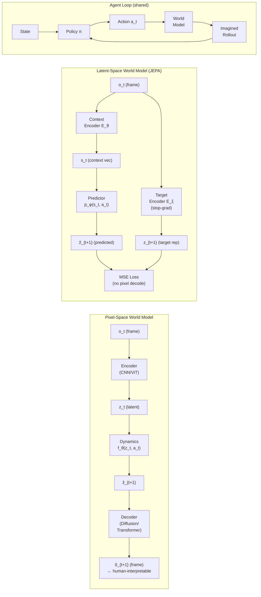

# World Models for Embodied AI

> **Last Updated:** June 2026
> **Level:** Research Frontier
> **Related Sections:**
> - [Vision-Language-Action Models](./01_vision_language_action_models.md)
> - [Pros, Cons & Roadmaps](./07_pros_cons_roadmaps.md)
> - [Generative Vision — Video Diffusion & Generation](../10_generative_vision/03_video_generation.md)
> - [Self-Supervised Representation Learning](../03_architectures/06_self_supervised_learning.md)

---

## Overview

A **world model** is a learned internal simulator: given a current state $s_t$ and an action $a_t$, it predicts the distribution over future states $s_{t+1}$ — and, by rollout, arbitrary-length futures. The term descends from cognitive science [Craik 1943] but reached modern ML prominence through [Ha & Schmidhuber 2018], who combined a convolutional VAE with an LSTM to let an agent "dream" rollouts entirely in latent space. The central hypothesis is that an agent with a compact, accurate world model can plan efficiently, transfer knowledge across tasks, and acquire skills without exhaustive environment interaction — a potential path toward the sample efficiency and robustness that pure model-free RL lacks.

The field has bifurcated around a foundational architectural tension: **pixel-space prediction** (generate photorealistic future frames) versus **latent-space prediction** (predict abstract representations of future states without decoding to pixels). Pixel-space models — typified by video diffusion approaches such as NVIDIA Cosmos [Agarwal et al. 2025] and DIAMOND [Alonso et al. 2024] — produce human-interpretable rollouts useful for sim-to-real pipelines and debugging, but are computationally expensive and can hallucinate visually plausible yet physically implausible scenes. Latent-space models — typified by the JEPA family [LeCun 2022; Assran et al. 2023; Bardes et al. 2024] and DreamerV3 [Hafner et al. 2023] — discard perceptual detail deliberately, focusing prediction on the causal variables that matter for planning. They are dramatically cheaper per rollout but produce non-interpretable states and must solve the harder problem of defining a representation that is both predictable and action-informative.

Yann LeCun's position paper "A Path Towards Autonomous Machine Intelligence" [LeCun 2022] crystallised the research agenda: world models are the missing ingredient for autonomous agents, and they should be trained via a Joint-Embedding Predictive Architecture (JEPA) with energy-based learning rather than by generative pixel synthesis. This thesis directly challenged the prevailing paradigm of end-to-end Vision-Language-Action (VLA) models and sparked a productive disagreement that continues to organise the field in 2026.

---

## The Pixel-Space vs. Latent-Space Dichotomy

### Pixel-Space World Models

Pixel-space models predict future observations $\hat{o}_{t+1} \approx o_{t+1}$ directly:

```
Objective (pixel reconstruction):
  L_pixel = E[ || o_{t+1} - f_θ(o_t, a_t) ||^2 ]
            or
  L_VDM   = E[ || ε - ε_θ(x_t, t, o_t, a_t) ||^2 ]   (diffusion variant)
```

**Advantages:** generated frames can be used as rendered observations in a downstream planner or as synthetic training data for downstream policies; visual consistency is directly evaluated with FID/FVD. **Disadvantages:** pixel generation is computationally expensive; models frequently violate physical laws while achieving low pixel-reconstruction error; the representation entangles perceptual factors (lighting, texture) with causal factors (object position, velocity).

### Latent-Space World Models

Latent-space models predict future *representations* $\hat{z}_{t+1} \approx \text{sg}(z_{t+1})$ in an embedding space, never decoding to pixels:

```
JEPA Objective (no pixel generation):
  L_JEPA = || s_θ(context) - p_φ(z_{target}) ||^2
            where  z_{target} = E_ξ(x_{target})  (stop-gradient on target encoder E_ξ)
```

```
RSSM Objective (DreamerV3):
  L = E[ -log p_θ(o_t | h_t, z_t)          (recon)
        + β_1 KL[q_φ(z_t|h_t,o_t) || p_θ(z_t|h_t)]   (representation)
        + β_2 L_reward + β_3 L_continue ]
```

The RSSM (Recurrent State Space Model) used in the Dreamer family maintains a deterministic recurrent state $h_t$ (GRU) combined with stochastic categorical latents $z_t$, updated as $h_t = f(h_{t-1}, z_{t-1}, a_{t-1})$.

### Pipeline Comparison (Mermaid)



---

## DreamerV3: Fixed-Hyperparameter World Models at Scale

DreamerV3 [Hafner et al. 2023, arXiv 2301.04104] is the most comprehensive demonstration that a single world model architecture with **fixed hyperparameters** can master over 150 tasks spanning continuous control, Atari, BSuite, Minecraft, and more. Prior Dreamer versions [DreamerV1: Hafner et al. 2020; DreamerV2: Hafner et al. 2021] required domain-specific tuning; DreamerV3 eliminates this via symlog transformations of inputs, KL-balancing, and free-bits regularisation.

**Architecture:** RSSM with a 32-category × 32-class categorical representation ($z_t \in \{0,1\}^{32 \times 32}$), a GRU with hidden size 4096, and separate decoder heads for reconstruction, reward, and episode continuation. The **imagination rollout** uses the RSSM to generate 15-step sequences in latent space for actor-critic updates, never querying the real environment during policy improvement.

**Key results:**

- First algorithm to collect diamonds in Minecraft (item requiring ~20-minute causal action chain) **from scratch without human data or curriculum** — though collection frequency is low (roughly 1 in ~10 episodes at the reported horizon) due to RSSM's bounded horizon
- Atari 100k mean HNS ≈ 112% (normed mean), normed median ≈ 49%
- Consistently reaches or exceeds specialist baselines on DMControl continuous control tasks
- Trains on a single GPU without environment-specific hyperparameter search

**Limitations:** long-horizon credit assignment remains problematic (the Minecraft result is impressive but not reliable per-episode); the RSSM's fixed GRU memory bounds effective planning depth; imagination fidelity degrades for stochastic, visually complex environments.

---

## I-JEPA: Prediction in Representation Space for Images

I-JEPA (Image-based Joint-Embedding Predictive Architecture) [Assran et al., CVPR 2023, arXiv 2301.08243] is the first large-scale validation of LeCun's JEPA thesis on images. Rather than reconstructing pixels (as in MAE [He et al. 2022]) or enforcing view-invariance (as in DINO [Caron et al. 2021]), I-JEPA predicts the *representation* of multiple target image patches from a single context patch.

**Architecture:** Two ViT encoders (context encoder $E_\theta$ and exponential-moving-average target encoder $E_\xi$), plus a narrow predictor network $p_\phi$. The context block is a randomly sampled contiguous region; target blocks are 4 non-overlapping regions sampled from the rest of the image. The predictor conditions on positional embeddings of target locations to avoid the trivial solution of ignoring position.

```
Masking strategy:
  Context: 1 large block  (~15% of tokens)
  Targets: 4 blocks       (~85% of tokens)
  Loss: L2 in representation space only — no pixel reconstruction
```

**Benchmark results (ViT-H/14, ImageNet-1K, reported in paper):**

- Linear probing top-1: **77.5%** — outperforms MAE ViT-H (77.2%) on the same architecture while training **10× faster** (under 1,200 GPU-hours vs ~12,000 for MAE ViT-H)
- Training throughput advantage: **2.5× faster** than iBOT ViT-S/16; **>10× faster** than MAE ViT-H/14
- Object counting (CLEVR/Count): outperforms DINO and iBOT by large margins, indicating richer structural representations
- Depth prediction (CLEVR/Dist): similarly strong, suggesting latent prediction captures 3D geometry better than view-invariance methods

The critical insight is that predicting in feature space forces the model to learn *semantic* structure rather than low-level textures; view-based contrastive methods encourage invariance that can discard useful information, while pixel reconstruction wastes capacity on perceptual detail.

---

## V-JEPA: Extending JEPA to Video

V-JEPA [Bardes et al. 2024, arXiv 2404.08471] scales I-JEPA to the temporal domain. Instead of predicting spatial patches, V-JEPA predicts **masked spatiotemporal tubes** in feature space — full 3D volumes of video tokens — using a ViT-based encoder-predictor architecture applied to video without action conditioning.

**Masking strategy:** spatiotemporal masking removes 75–90% of video tokens in tubes aligned along the time axis, forcing the model to reason about motion continuity.

**Benchmark results (ViT-H/16, trained only on video):**

| Benchmark | Metric | V-JEPA Score | Prior Best |
|---|---|---|---|
| Kinetics-400 | Top-1 Acc. | 81.9% | ~78% (video models) |
| Something-Something v2 | Top-1 Acc. | 72.2% | ~62% (video models) |
| ImageNet-1K (no image FT) | Top-1 Acc. | 77.9% | ~72% (video models) |

The +10 point improvement on Something-Something v2 is especially significant: this benchmark rewards **physical dynamics understanding** (e.g., "pulling something from right to left") over static scene recognition, confirming that predicting in representation space encourages emergent physics understanding.

### V-JEPA 2 (2025)

V-JEPA 2 [arXiv 2506.09985, Meta AI, June 2025] extends the framework to **action-conditioned prediction and robotic planning**. The 1.2B-parameter model undergoes two-stage training: (1) self-supervised video prediction on 1M+ hours of video; (2) action-conditioned fine-tuning (V-JEPA 2-AC) on ~62 hours of unlabeled robot video from the Droid dataset [Khazatsky et al. 2024].

**Key results:**

- Something-Something v2: **77.3%** top-1 (motion understanding)
- Epic-Kitchens-100 action anticipation: **39.7%** recall@5 (state-of-the-art, surpassing task-specific models)
- Zero-shot pick-and-place on Franka arms in two novel lab environments: **65–80% success rate** using goal-image-conditioned planning, with no task-specific data collected from those environments

V-JEPA 2 demonstrates the first plausible evidence that a latent world model trained primarily on passive internet video can transfer to **active robot control** via planning in latent space.

---

## Genie: Generative Interactive Environments from Unlabelled Video

Genie [Bruce et al., ICML 2024 **Best Paper Award**, arXiv 2402.15391] trains an interactive world model entirely from unlabelled internet videos of 2D platformer games, without any ground-truth action labels. At 11B parameters, it is the first **latent action** world model at foundation-model scale.

**Architecture:** Three components:
1. **Spatiotemporal video tokenizer** — converts raw frames to discrete tokens
2. **Latent Action Model (LAM)** — a VQ-VAE that infers a small codebook of discrete latent actions from consecutive frame pairs (encoder sees frames, decoder predicts next frame given history + inferred action)
3. **Autoregressive dynamics model** — predicts future tokens conditioned on latent action tokens

The LAM learns interpretable action primitives (e.g., MOVE_LEFT, JUMP) without supervision, purely from temporal consistency. At inference, users can control the generated environment by selecting latent actions frame-by-frame.

**Significance for robotics:** Genie demonstrates that action-grounded world models can be bootstrapped from passive video, sidestepping the data bottleneck of labelled robot trajectories. The latent action space may transfer to robot embodiments if pre-trained on robot video.

### Genie 2 (December 2024)

Genie 2 [Parker-Holder et al., DeepMind, announced December 4 2024] scales the concept to **3D environments** generated from a single image. Key advances:

- Generates physics-consistent interactive 3D worlds conditioned on a single image input
- Maintains world persistence for 10–60 seconds with emergent behaviours: object interactions, character animation, agent-of-agents modelling
- Trained on a large-scale diverse internet video dataset
- Demonstrates emergent capabilities at scale not present in smaller models

Genie 2 has not been released publicly as of June 2026 and peer-reviewed benchmark numbers are not yet available; the above is based on DeepMind's December 2024 blog announcement.

---

## DIAMOND: Diffusion World Models for Atari

DIAMOND (DIffusion As a Model Of eNvironment Dreams) [Alonso, Jelley, Micheli, Kanervisto, Storkey, Pearce, Fleuret; NeurIPS 2024 Spotlight, arXiv 2405.12399] argues that **visual details matter** for RL inside world models and that standard discrete-latent models (IRIS, DreamerV3) discard information that determines reward outcomes (e.g., bullet positions in Asterix).

**Architecture:** Replaces the discrete latent decoder with a full diffusion model (EDM formulation [Karras et al. 2022]) that generates the next frame conditioned on a history of frames and the action. Rollouts are sequences of denoised frames; the RL agent observes these frames directly.

**Atari 100k results (mean HNS, 26 games):**

| Model | Mean HNS | IQM |
|---|---|---|
| DIAMOND (2024) | **1.46** | **0.64** |
| STORM [Shamsian et al. 2024] | 1.266 | — |
| DreamerV3 [Hafner 2023] | 1.097 | — |
| IRIS [Micheli et al. 2023] | 1.046 | — |

DIAMOND achieves superhuman performance on 11 of 26 games. The EDM formulation is critical: standard DDPM degrades over long rollouts, while EDM's noise-adaptive training maintains visual coherence.

**Limitation:** inference is slow — each environment step requires multiple denoising passes, making real-time robot deployment impractical at present.

---

## NVIDIA Cosmos: Physical AI World Foundation Model

Cosmos [Agarwal et al., NVIDIA, arXiv 2501.03575, announced CES January 2025] is the first commercially-available, openly-licensed world foundation model platform targeting **physical AI** (autonomous vehicles + robotics). Unlike research prototypes, Cosmos ships an end-to-end system:

**Components:**

1. **Cosmos Tokenizer** — causal image/video neural tokenizer; 8× higher compression ratio and 12× faster processing than prior tokenizers; preserves temporal causality (token at time $t$ does not attend to $t+1$)
2. **Autoregressive WFM family** — transformer-based next-token prediction over tokenized video; variants: Nano (edge/real-time), Super (baseline), Ultra (max quality)
3. **Diffusion WFM family** — continuous video diffusion models for high-fidelity generation
4. **Isaac Sim integration** — Cosmos-generated synthetic trajectories feed NVIDIA Isaac Lab's parallel RL training and GR00T-Dreams/GR00T-Mimic data-engine blueprints

**Training data:** 20 million hours of real-world video across robotics, AV, industrial, and human-interaction domains (~9,000 trillion tokens). Licensed under NVIDIA's open model license (commercial use permitted).

**Physical AI positioning:** Cosmos is positioned as a *data engine* — its rollouts provide diverse, physics-consistent synthetic training data to close the real-to-sim gap for robot policy training, rather than as a policy itself. This is a qualitatively different use case from RL-oriented world models like DreamerV3 or DIAMOND.

---

## JEPA vs. Generative World Models: The Core Debate

The debate crystallises around two incompatible prior beliefs about what world models should optimise:

| Dimension | JEPA (LeCun school) | Generative / Pixel-space |
|---|---|---|
| **Primary objective** | Predict abstract representations; no pixel synthesis | Predict / generate future observations |
| **Architecture** | Encoder + predictor (no decoder) | Encoder + decoder (diffusion/AR/VQ-VAE) |
| **Collapse avoidance** | EMA target encoder; VICReg/VIC | Reconstruction loss; VQ bottleneck |
| **Interpretability** | Latent space opaque to humans | Generated frames human-readable |
| **Sample efficiency** | High (compact latents, fast rollout) | Lower (decoder training overhead) |
| **Sim-to-real** | Requires latent-to-action mapping | Can generate camera images for downstream |
| **Scaling behaviour** | Unclear; small public benchmarks only | Demonstrated (Cosmos 20M video hours) |
| **Physical plausibility** | No ground-truth guarantee | FID/FVD optimised; physics may be violated |

**Hybrid trend (2025–2026):** Several groups have merged both paradigms. V-JEPA 2-AC [Bardes et al. 2025] predicts in latent space but adds an action-conditioned post-training stage — effectively a JEPA with a thin generative head. DIAMOND [Alonso et al. 2024] generates pixels but uses them as RL observations, not as training targets for the policy backbone. The emerging consensus is that **pure pixel generation is unnecessary** for robot control but that **some form of decoding back to observable space** remains useful for sim data generation and interpretability.

---

## Key Papers

| Paper | Authors | Year | Venue | Key Contribution |
|---|---|---|---|---|
| Mastering Diverse Domains through World Models (DreamerV3) | Hafner, Lillicrap, Norouzi, Ba | 2023 | arXiv / ICML workshop | Fixed-hyperparameter RSSM world model; first Minecraft diamonds from scratch; 150+ task evaluation |
| Self-Supervised Learning from Images with a Joint-Embedding Predictive Architecture (I-JEPA) | Assran, Duval, Misra et al. | 2023 | CVPR | Predict abstract patch representations, not pixels; beats MAE efficiency; superior object-level features |
| Revisiting Feature Prediction for Learning Visual Representations from Video (V-JEPA) | Bardes, Garrido, Ponce et al. | 2024 | arXiv (Meta AI) | Video JEPA; masked spatiotemporal prediction in feature space; state-of-the-art on SSv2 (+10 pts) |
| Genie: Generative Interactive Environments | Bruce, Dennis, Edwards, Parker-Holder et al. | 2024 | ICML (Best Paper) | 11B-param world model from unlabelled 2D video; unsupervised latent action codebook |
| Diffusion for World Modeling: Visual Details Matter in Atari (DIAMOND) | Alonso, Jelley, Micheli et al. | 2024 | NeurIPS Spotlight | Diffusion world model for Atari; mean HNS 1.46 — new SOTA among world-model-trained agents |
| Cosmos World Foundation Model Platform for Physical AI | Agarwal et al. (NVIDIA) | 2025 | arXiv 2501.03575 | First commercially-open physical AI WFM; 20M video hours; causal tokenizer; AR+diffusion families |
| V-JEPA 2: Self-Supervised Video Models Enable Understanding, Prediction and Planning | Bardes et al. (Meta AI) | 2025 | arXiv 2506.09985 | 1.2B action-conditioned WM; zero-shot robot pick-and-place; SOTA Epic-Kitchens-100 anticipation |
| A Path Towards Autonomous Machine Intelligence | LeCun | 2022 | OpenReview (white paper) | Foundational JEPA thesis; H-JEPA + EBM framework; world models as the core of autonomous intelligence |

---

## Benchmark Performance

| Model | Dataset / Task | Metric | Score | Notes |
|---|---|---|---|---|
| DreamerV3 | Atari 100k (26 games) | Mean HNS | ~112% (normed mean) | Fixed hyperparams, single GPU |
| DreamerV3 | Minecraft (diamond) | Task completion | ~1 in 10 episodes | First algorithm to achieve without human data |
| DIAMOND | Atari 100k (26 games) | Mean HNS | **1.46** | NeurIPS 2024 SOTA among WM-trained agents; IQM 0.64 |
| DIAMOND | Atari 100k (26 games) | Superhuman games | 11 / 26 | |
| STORM | Atari 100k | Mean HNS | 1.266 | Previous SOTA |
| I-JEPA (ViT-H/14) | ImageNet-1K | Linear probe top-1 | 77.5% | 10× faster than MAE ViT-H |
| V-JEPA (ViT-H/16) | Kinetics-400 | Top-1 Acc. | 81.9% | Video-only pretraining |
| V-JEPA (ViT-H/16) | Something-Something v2 | Top-1 Acc. | 72.2% | +10 pts over prior video models |
| V-JEPA (ViT-H/16) | ImageNet-1K (no img FT) | Top-1 Acc. | 77.9% | +6 pts over prior video models |
| V-JEPA 2 | Something-Something v2 | Top-1 Acc. | 77.3% | 1.2B params |
| V-JEPA 2 | Epic-Kitchens-100 | Recall@5 (anticipation) | **39.7%** | SOTA, surpasses task-specific models |
| V-JEPA 2-AC | Pick-and-place (Franka, 2 labs) | Success rate | 65–80% | Zero-shot, no env-specific data |

---

## Pros & Cons

| Aspect | Pros | Cons |
|---|---|---|
| **Latent-space WM (JEPA/DreamerV3)** | Extremely fast rollouts; sample-efficient RL; collapse-resistant via EMA targets; scales well per FLOP | Non-interpretable latents; no direct sim-to-real pixel bridge; quality of latent representation depends heavily on pretraining |
| **Pixel-space WM (DIAMOND/Cosmos)** | Human-interpretable generated frames; enables sim data pipelines; visual consistency evaluated with FID/FVD | Slow inference (diffusion denoising adds latency per step); can generate visually plausible but physically incorrect scenes; decoder training overhead |
| **Action-conditioned WM (V-JEPA 2-AC, Genie)** | Bridges passive video pretraining to active control; enables goal-conditioned planning; latent action models require no action labels | Action label scarcity limits fine-tuning signal; latent action spaces may not align to robot morphology; transfer from 2D video to 3D robot workspace uncertain |
| **Generative WM as data engines (Cosmos/Isaac Lab)** | Massively scalable synthetic data; domain randomisation; reduces need for expensive real-world data collection | Sim-to-real gap remains; physical plausibility not guaranteed; training cost enormous (20M video hours for Cosmos) |
| **Evaluation metrics (FVD/FID vs. physical plausibility)** | FVD/FID are standardised and widely used | High FVD does not correlate with planning quality; physics violations invisible to perceptual metrics; new physics-aware benchmarks (WorldModelBench, VideoCon-Physics) not yet standard |

---

## Open Problems & Research Gaps

1. **Evaluation beyond FVD/FID.** Standard video quality metrics (FID, FVD) measure perceptual realism but are uncorrelated with physical plausibility and downstream RL performance [c.f. WorldModelBench 2025]. A standard benchmark for *decision-centric* world model evaluation — analogous to BenchML for representations — does not yet exist.

2. **Passive video → active control transfer.** V-JEPA 2 demonstrates promise but requires ~62 hours of robot data for action conditioning; Genie's latent action approach is untested beyond 2D video domains. Whether world models trained on diverse internet video can be efficiently adapted to novel robot morphologies at near-zero action-label cost is unresolved.

3. **Long-horizon consistency and memory.** DreamerV3's RSSM and Genie's autoregressive transformer both degrade in consistency beyond 15–60 seconds of rollout. Structured state representations (object-centric, graph-based) may help but impose inductive bias that limits generality.

4. **Physical law compliance.** Current pixel-space models violate mass conservation, collision physics, and rigidity constraints in generated rollouts. Integrating physics priors (neuro-symbolic constraints, differentiable simulation) without sacrificing scalability is an open architectural challenge.

5. **Compute trade-off: simulation vs. real data.** Cosmos requires ~9,000 trillion tokens of training data; Isaac Lab simulation generates synthetic data that may not close the reality gap. The optimal mix of real robot data, human video, and simulation for world model pretraining is empirically unknown.

6. **Unified architecture for perception, prediction, and planning.** Current systems separate the representation backbone (ViT), the dynamics model (RSSM/transformer), and the policy network. A single architecture that jointly optimises all three — analogous to how transformers unified language tasks — would simplify training and potentially improve consistency.

7. **Scaling laws for world models.** Unlike language models, no empirical scaling law (compute × data → performance) has been established for world models applicable to embodied AI. The relationship between model size, training data, and downstream robot policy quality is largely unknown.

---

## Further Reading

- [DreamerV3 arXiv](https://arxiv.org/abs/2301.04104) — Hafner et al., "Mastering Diverse Domains through World Models"
- [I-JEPA CVPR 2023](https://openaccess.thecvf.com/content/CVPR2023/html/Assran_Self-Supervised_Learning_From_Images_With_a_Joint-Embedding_Predictive_Architecture_CVPR_2023_paper.html) — Assran et al., official proceedings
- [V-JEPA 2 arXiv](https://arxiv.org/abs/2506.09985) — Bardes et al., "V-JEPA 2: Self-Supervised Video Models Enable Understanding, Prediction and Planning" (June 2025)
- [DIAMOND project page](https://diamond-wm.github.io/) — with videos, code, and per-game Atari results
- [NVIDIA Cosmos arXiv](https://arxiv.org/abs/2501.03575) — full technical report on the WFM platform
- [LeCun 2022 white paper](https://openreview.net/pdf?id=BZ5a1r-kVsf) — "A Path Towards Autonomous Machine Intelligence" — the foundational JEPA manifesto
