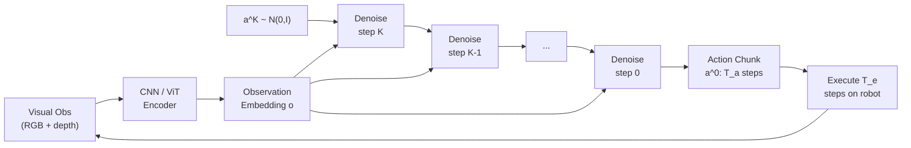

# Diffusion Policy: Visuomotor Control via Action Diffusion

> **Last Updated:** June 2026
> **Level:** Advanced | Research Frontier
> **Related Sections:**
> - [Cross-Embodiment Learning](./04_cross_embodiment.md)
> - [Simulation and Data for Embodied AI](./05_simulation_and_data.md)
> - [Vision-Language-Action Models](../05_multimodal_vision_language/README.md)
> - [Generative Models and Diffusion](../10_generative_vision/README.md)

---

## Overview

Diffusion Policy [Chi2023] reframes robot imitation learning as a conditional denoising problem: rather than regressing a single "best" action or computing a categorical distribution over discretized actions, a policy network iteratively denoises a sequence of Gaussian noise into a coherent action trajectory conditioned on the current visual observation. The underlying generative mechanism is a Denoising Diffusion Probabilistic Model (DDPM) [Ho2020], where a U-Net or transformer backbone learns to reverse a fixed forward noising process. At inference time the model starts from pure noise in action space and takes $K$ denoising steps guided by the observation embedding, producing a receding-horizon action chunk that is executed open-loop for a short horizon before the next planning cycle begins.

The key behavioral advantage is the handling of **multimodal action distributions**. In demonstrations of everyday manipulation, a human may reach for an object from the left or from the right depending on subtle context; a standard behavior-cloning MSE loss averages both modes and produces a hesitant middle trajectory. Diffusion Policy's energy-based implicit score-matching objective naturally represents such distributions without mode collapse, yielding significantly higher task success on contact-rich and precision tasks. [Chi2023] demonstrated an average 46.9% improvement over prior state-of-the-art behavioral cloning baselines (IBC, BET) across 15 simulated and real tasks.

The work also introduced two architecture variants: a **CNN-based** policy encoding spatial observations via a ResNet-18 feature pyramid, and a **Transformer-based** policy (DiT-style) that cross-attends over observation tokens to condition each denoising step. The transformer variant shows superior generalization on long-horizon tasks but incurs higher computational cost. Subsequent work in 2024-2026 has extended the paradigm to 3D point cloud conditioning (DP3), flow-matching accelerators (pi-zero), and large-scale pretraining, making diffusion-based action generation the de facto standard for visuomotor imitation learning.

---

## Technical Background: DDPM for Action Generation

### Forward and Reverse Processes

Given a demonstration action trajectory $\mathbf{a}^0 \in \mathbb{R}^{T_a \times D_a}$ (a chunk of $T_a$ future joint-position or end-effector waypoints), the forward process adds Gaussian noise over $K$ steps:

```latex
q(\mathbf{a}^k | \mathbf{a}^{k-1}) = \mathcal{N}\!\left(\mathbf{a}^k;\,\sqrt{1-\beta_k}\,\mathbf{a}^{k-1},\,\beta_k \mathbf{I}\right)
```

where $\beta_1, \ldots, \beta_K$ is a fixed variance schedule (cosine or linear). After $K$ steps $\mathbf{a}^K \approx \mathcal{N}(\mathbf{0}, \mathbf{I})$. The policy network $\epsilon_\theta$ is trained to predict the noise at each step conditioned on the visual observation embedding $\mathbf{o}$:

```latex
\mathcal{L}_\text{DP} = \mathbb{E}_{k,\,\mathbf{a}^0,\,\boldsymbol{\epsilon}}\!\left[\left\|\boldsymbol{\epsilon} - \epsilon_\theta\!\left(\mathbf{a}^k,\,k,\,\mathbf{o}\right)\right\|^2\right]
```

At inference, starting from $\mathbf{a}^K \sim \mathcal{N}(\mathbf{0},\mathbf{I})$, the reverse process iterates:

```latex
\mathbf{a}^{k-1} = \frac{1}{\sqrt{\alpha_k}}\!\left(\mathbf{a}^k - \frac{1-\alpha_k}{\sqrt{1-\bar{\alpha}_k}}\,\epsilon_\theta(\mathbf{a}^k, k, \mathbf{o})\right) + \sigma_k\,\mathbf{z}
```

where $\alpha_k = 1-\beta_k$, $\bar{\alpha}_k = \prod_{i=1}^k \alpha_i$, and $\mathbf{z} \sim \mathcal{N}(\mathbf{0},\mathbf{I})$.

### Receding-Horizon Control

Diffusion Policy generates an action chunk of horizon $T_a$ (e.g., 16 steps at 10 Hz = 1.6 s) but only executes the first $T_e < T_a$ actions before re-planning. This **action chunking** improves temporal consistency and reduces compounding errors compared to per-step prediction.



### Inference Acceleration: DDIM and Beyond

Standard DDPM requires $K=100$ denoising steps, yielding ~1-2 Hz on a GPU — insufficient for reactive control. **DDIM** (Denoising Diffusion Implicit Models) [Song2021] reformulates inference as a deterministic ODE, enabling 10-16 steps while preserving sample quality. With 10 DDIM steps on an Nvidia RTX 3080, [Chi2023] reports ~0.1 s inference latency, achieving ~10 Hz control. Further acceleration:

- **Consistency Distillation** [Song2023]: distills the multi-step process into a 1-4 step model.
- **Flow Matching** [Lipman2022]: replaces the score-matching loss with straight conditional flows, enabling 1-step inference. Used in pi-zero [Black2024].
- **Rectified Flow / FM + DiT**: adopted by pi-zero-FAST for 50 Hz real-time control.

---

## Architecture Variants

### CNN Diffusion Policy (DP-C)

- Observation encoder: ResNet-18 with group normalization, outputs spatial feature map flattened to a 1D token.
- Denoiser: 1-D temporal U-Net over the action sequence, conditioned via FiLM layers from observation embedding.
- Training: 100 DDPM steps, cosine noise schedule, AdamW optimizer.
- Inference: 10-16 DDIM steps; adequate for 10 Hz tabletop control.

### Transformer Diffusion Policy (DP-T)

- Observation encoder: ViT or ResNet, outputs a sequence of tokens.
- Denoiser: transformer decoder where noisy action tokens cross-attend over observation tokens at each denoising step.
- Stronger on tasks requiring global spatial reasoning; ~2x compute vs. DP-C.

### 3D Diffusion Policy (DP3) [Ze2024]

Replaces 2D image encoder with a sparse **point cloud** encoder (PointNet++ MLP backbone) capturing metric 3D structure. Action conditioning uses the compact 3D representation. Published at RSS 2024; achieves 24.2% relative improvement over 2D DP across 72 simulation tasks, and 85% real-robot success on 4 dexterous tasks (Roll-Up, Dumpling, Drill, Pour) with only 40 demonstrations each.

---

## Comparison: Diffusion Policy vs. Related Methods

### Behavioral Cloning Baselines

| Method | Distribution Model | Mode Averaging? | Inference Latency |
|--------|-------------------|-----------------|-------------------|
| MSE Regression BC | Unimodal Gaussian | Yes (collapses modes) | <1 ms |
| IBC [Florence2021] | Energy-based (MCMC) | No | ~100 ms (MCMC) |
| BET [Shafiullah2022] | Discrete VQ + Offset | Partial | ~5 ms |
| Diffusion Policy [Chi2023] | DDPM score field | No | 10-100 ms (DDIM) |
| ACT [Zhao2023] | CVAE + Transformer | Partial (CVAE) | ~5 ms |
| pi-zero [Black2024] | Flow Matching + VLM | No | <20 ms |

### ACT (Action Chunking with Transformers) [Zhao2023]

ACT [Zhao2023] introduced action chunking (predicting $k=100$ timesteps at 50 Hz) with a CVAE-Transformer architecture on the ALOHA bimanual platform. It achieves 80-95% success on fine-grained bimanual tasks vs. 20-50% for standard BC, and requires only ~50 demonstrations. ACT uses temporal ensemble (average overlapping action predictions) rather than open-loop execution of chunks. Diffusion Policy outperforms ACT on highly multimodal tasks; ACT is faster at inference and simpler to implement.

### pi-zero (pi0) [Black2024]

Physical Intelligence's pi-zero [Black2024] builds a **Vision-Language-Action Flow Model** on top of the PaliGemma 3B VLM backbone, replacing DDPM with flow matching for action generation. Trained on 10,000+ hours of demonstrations across 7 robot platforms and 68 tasks, pi-zero achieves state-of-the-art zero-shot and fine-tuned performance on dexterous tasks (laundry folding, box assembly, table bussing). The flow matching head enables ~50 Hz real-time control. This represents the convergence of diffusion/flow-based policies with large-scale language-grounded pretraining.

---

## Key Papers

| Paper | Authors | Year | Venue | Key Contribution |
|-------|---------|------|-------|-----------------|
| Diffusion Policy: Visuomotor Policy Learning via Action Diffusion | Chi et al. | 2023 | RSS 2023 / IJRR 2024 | DDPM over action trajectories; receding-horizon control; 46.9% avg improvement over SOTA BC |
| Denoising Diffusion Probabilistic Models | Ho et al. | 2020 | NeurIPS 2020 | Original DDPM framework used as the generative backbone |
| Denoising Diffusion Implicit Models | Song et al. | 2021 | ICLR 2021 | DDIM accelerated inference (10-16 steps vs. 100); enables robot-frequency deployment |
| Learning Fine-Grained Bimanual Manipulation with Low-Cost Hardware (ACT) | Zhao et al. | 2023 | RSS 2023 | Action chunking + CVAE-Transformer on ALOHA; key baseline/alternative to DP |
| 3D Diffusion Policy (DP3) | Ze et al. | 2024 | RSS 2024 | Point-cloud conditioning; 24.2% improvement on 72 sim tasks; 85% real-world success |
| pi-zero: A Vision-Language-Action Flow Model for General Robot Control | Black et al. (Physical Intelligence) | 2024 | arXiv 2410.24164 | Flow matching + PaliGemma 3B VLM; 7 platforms, 68 tasks, 10K+ demo hours |
| Diffusion Transformer Policy | Ye et al. | 2024 | ICLR 2025 | DiT-based denoiser with cross-attention to observation tokens; strong on long-horizon tasks |

---

## Benchmark Performance

| Model | Dataset / Task | Metric | Score | Notes |
|-------|---------------|--------|-------|-------|
| Diffusion Policy (DP-C) | Robomimic Lift | Success Rate | 96.9% | CNN variant, 100 demos |
| Diffusion Policy (DP-C) | Robomimic Can | Success Rate | 91.3% | CNN variant |
| Diffusion Policy (DP-T) | Robomimic Transport | Success Rate | 78.8% | Transformer variant; bimanual |
| Diffusion Policy (DP-C) | Push-T | Coverage Score | 0.804 | Multimodal pushing task |
| Diffusion Policy avg | 12 Robomimic tasks | Success Rate | SOTA 11/12 | First publication result |
| DP3 | 72 simulation tasks | Avg Success Rate | +24.2% rel. over DP-C | Point-cloud 3D observations |
| DP3 | 4 real dexterous tasks | Success Rate | 85% | 40 demos each; Allegro Hand + gripper |
| ACT | ALOHA sim insertion | Success Rate | 95% | 50 demos; CVAE-Transformer |
| ACT | ALOHA real battery slot | Success Rate | 80% | Contact-rich fine-grained |
| pi-zero | Laundry folding (real) | Task Completion | not publicly reported | Zero-shot after pretraining |
| Diffusion Policy (DP-C) vs IBC | 11 tasks average | Success Rate | +46.9% relative | Original paper comparison |

---

## Pros & Cons

| Aspect | Pros | Cons |
|--------|------|------|
| Distribution modeling | Naturally represents multimodal and discontinuous action distributions; no mode collapse | Training requires large datasets to avoid overfitting the score field |
| Inference quality | Action chunks produce temporally smooth, physically consistent trajectories | Standard DDPM (100 steps) too slow (1-2 Hz) for reactive tasks; requires DDIM or flow matching |
| Architecture flexibility | Modular: any visual encoder (CNN, ViT, point cloud) can condition the denoiser | Hyperparameter sensitivity: noise schedule, chunk length, step count, architecture size all matter |
| Generalization | Handles unseen object positions well when combined with strong visual encoders | Struggles with extreme distribution shift; still requires task-specific demonstrations |
| Training stability | Score-matching loss is well-behaved; compatible with standard deep learning toolchains | More complex to implement than MSE-BC; 2-5x longer training time |
| Scalability | Scales to larger models and datasets (DiT, VLM backbones) | Compute cost at inference scales with denoising steps; edge deployment is challenging |

---

## Open Problems & Research Gaps

1. **Real-time inference at high control frequency.** Even with DDIM, achieving reliable 50-100 Hz control on embedded hardware (Jetson Orin, etc.) without specialized distillation remains unsolved. Consistency models and flow matching reduce steps but introduce training complexity.

2. **Long-horizon task composition.** Diffusion Policy excels at short manipulation primitives but chains of 5+ subtasks (pick, stack, hand-off, insert, close) still suffer from error accumulation. Hierarchical diffusion or language-conditioned sub-goal selection is an open direction.

3. **Sim-to-real transfer for diffusion policies.** The multimodal score field may overfit to simulation visual statistics. Domain randomization interacts poorly with denoising steps tuned for specific visual noise levels; bridging remains ad hoc.

4. **Data efficiency.** Current SOTA results use 50-200 demonstrations per task. Few-shot and one-shot diffusion policies that generalize from a single demo via foundation model priors are not yet reliable in contact-rich settings.

5. **Action space heterogeneity.** Diffusion Policy is typically applied to a fixed action space (e.g., end-effector delta or joint positions). Extending to whole-body humanoid control (50+ DoF) or deformable tool manipulation with force/torque feedback is largely unexplored.

6. **Theoretical guarantees on coverage and safety.** The stochastic denoising process can occasionally produce dynamically infeasible actions. Constrained diffusion (projecting samples onto feasible manifolds) or diffusion with safety certificates is an open theoretical challenge.

7. **Integration with model-based planning.** Combining the expressive generative model of Diffusion Policy with physics-based model predictive control (MPC) — using diffusion to propose candidate trajectories and MPC to filter — has shown promise but lacks a principled training framework.

---

## Further Reading

- [Diffusion Policy project page and code (Columbia)](https://diffusion-policy.cs.columbia.edu/)
- [3D Diffusion Policy (DP3) — arXiv:2403.03954](https://arxiv.org/abs/2403.03954)
- [pi-zero paper — arXiv:2410.24164](https://arxiv.org/abs/2410.24164)
- [ACT (ALOHA) — arXiv:2304.13705](https://arxiv.org/abs/2304.13705)
- [DDIM — arXiv:2010.02502](https://arxiv.org/abs/2010.02502)
- [Diffusion Transformer Policy — OpenReview ICLR 2025](https://openreview.net/forum?id=PvvXDazPMs)
