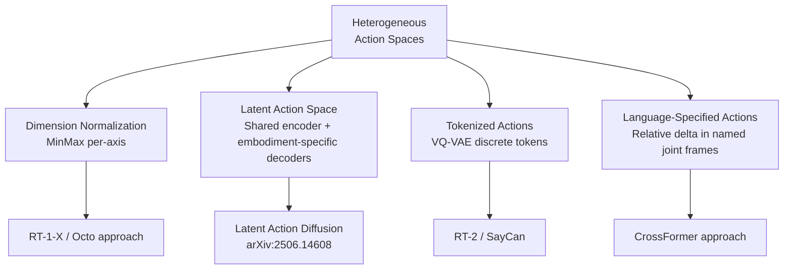
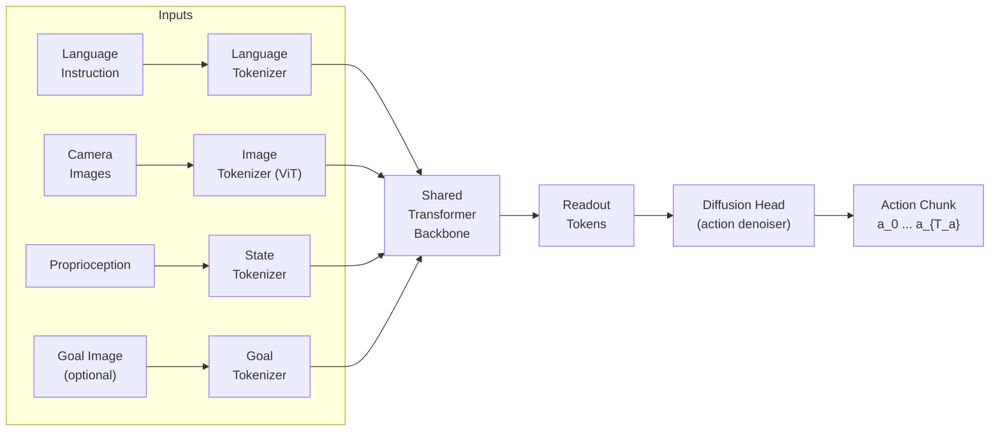

# Cross-Embodiment Learning for Robotics

> **Last Updated:** June 2026
> **Level:** Advanced | Research Frontier
> **Related Sections:**
> - [Diffusion Policy](./03_diffusion_policy.md)
> - [Simulation and Data for Embodied AI](./05_simulation_and_data.md)
> - [Vision-Language Models](../05_multimodal_vision_language/README.md)
> - [Datasets and Benchmarks](../11_datasets_and_benchmarks/README.md)

---

## Overview

Cross-embodiment learning asks whether a single policy — or a shared representation — can transfer knowledge across robots with fundamentally different kinematics, morphologies, sensor suites, and action spaces. The central hypothesis, confirmed empirically by the Open X-Embodiment project [OXE2023], is that **co-training on diverse robot data improves per-embodiment performance** even when the robot structures differ drastically. This mirrors findings in NLP and computer vision: more diverse pretraining data improves generalization on downstream tasks, and the same logic extends to visuomotor control.

The Open X-Embodiment (OXE) dataset [OXE2023], released in late 2023 and presented at ICRA 2024, aggregated over 1 million robot trajectories from 22 distinct embodiments (single-arm manipulators, bimanual systems, mobile manipulators, legged robots) contributed by 34 research institutions across 60 individual datasets, covering 527 distinct manipulation skills. The dataset is stored in the **RLDS** (Reinforcement Learning Datasets) format — a TensorFlow Datasets-backed episode structure — which provides a unified serialization layer that abstracts over heterogeneous sensor configurations. Training RT-1-X (a Robotics Transformer) on this mixture yielded a 50% average success-rate improvement across five diverse robot platforms compared to policies trained exclusively on per-embodiment data, establishing co-training as a powerful inductive bias.

The fundamental obstacle is the **embodiment gap**: each robot exposes a distinct observation space (monocular RGB, stereo, RGBD, proprioception dimensionality, force-torque) and a distinct action space (joint positions, end-effector Cartesian delta, absolute poses, gripper width). Bridging these gaps without manual alignment is the defining unsolved problem in cross-embodiment research, and recent architectures (Octo, CrossFormer, pi-zero) each propose different solutions ranging from modality-specific tokenizers to latent action spaces.

---

## The Embodiment Gap: Observation and Action Heterogeneity

### Observation Space Misalignment

Different robots attach cameras at different positions, use different resolutions, and may include modalities entirely absent on other platforms (wrist cameras, tactile sensors, depth rings). Approaches to alignment:

- **Canonical view normalization**: warp all images to a canonical egocentric perspective using estimated camera intrinsics/extrinsics.
- **Modality masking**: treat missing sensors as masked tokens; the model learns to predict actions from available subsets.
- **Modality-specific tokenizers**: each sensor type (RGB image, depth, joint state, language) passes through a dedicated encoder, and all output tokens are concatenated into a unified sequence before the shared transformer backbone.

### Action Space Misalignment

Action dimensionalities range from 4-DoF (simple gripper) to 30+ DoF (humanoid manipulation). Key strategies:



**MinMax normalization** (used in Octo [OctoTeam2024]) applies per-dimension affine rescaling to $[-1, 1]$ across all demonstrations in a training mixture, providing consistent numerical ranges for the denoiser/regressor while preserving relative magnitudes.

**Embodiment-specific action heads** (used in CrossFormer [Doshi2024]) attach separate small MLP heads per embodiment type to a shared transformer trunk, allowing the trunk to learn transferable representations while action decoders handle morphology-specific output structure.

---

## Open X-Embodiment Dataset and RT-X Models

### Dataset Statistics

- **22 robot embodiments**: includes Franka Panda, Google RT-1 robot, WidowX, Hello Robot Stretch, Boston Dynamics Spot, xArm, UR5, ALOHA, and others.
- **1,000,000+ trajectories** across **527 distinct manipulation skills** from **34 research labs** at **21 institutions**.
- **Data format**: RLDS (see below); all converted to a common episode schema with flexible observation/action fields.
- Released under CC-BY license; hosted on Google Cloud Storage.

### RLDS Data Format

RLDS (Reinforcement Learning Datasets) is the standardization layer that made OXE possible. Each dataset episode is stored as:

```
Episode:
  steps: [
    {
      observation: {image_0: uint8[H,W,3], image_1: ..., state: float32[D_obs]},
      action: float32[D_act],
      reward: float32,
      discount: float32,
      is_first: bool,
      is_last: bool,
      is_terminal: bool,
      language_instruction: string
    }, ...
  ]
```

The schema is backed by TensorFlow Datasets serialized as TFRecord shards. RLDS has become the de facto standard for robotic learning datasets, enabling plug-and-play mixing across labs without bespoke data loaders.

### RT-1-X and RT-2-X

The OXE paper evaluated two RT-X models:

- **RT-1-X**: the RT-1 Robotics Transformer architecture [Brohan2022] retrained on the full OXE mixture. Achieved **+50% average success rate** across 5 evaluation platforms vs. platform-specific RT-1 checkpoints.
- **RT-2-X**: the RT-2 vision-language-action model (PaLI-X backbone) co-trained on OXE. Achieved **3x performance** on real-world robotic skill execution. RT-2-X demonstrated emergent cross-embodiment generalization — skills seen only on one robot were executable on novel embodiments.

---

## Octo: Open-Source Generalist Robot Policy

**Octo** [OctoTeam2024] (RSS 2024) is the first fully open-source generalist robot policy pretrained on OXE. Key design choices:

- **Architecture**: transformer with readout tokens for task specification (language string or goal image), processing heterogeneous observations via modality-specific tokenizers.
- **Action head**: diffusion head (conditional DDPM) over 4-step action chunks, modeling expressive multimodal distributions.
- **Training data**: 800,000 robot demonstrations from the OXE mixture (a curated subset for compute feasibility).
- **Fine-tuning**: Octo can be fine-tuned to new observation spaces (e.g., force-torque inputs), new action spaces (e.g., joint-position control), and entirely new embodiments within minutes to hours, making it a practical starting point for new labs.
- **Results**: Octo matches or outperforms prior task-specific SOTA on 9 of 11 evaluation tasks in the OXE evaluation suite after fine-tuning.



---

## CrossFormer: Scaling Across Morphologies

**CrossFormer** [Doshi2024] (CoRL 2024, Oral — top 4%) extended cross-embodiment learning beyond manipulation to navigation, locomotion, and aerial vehicles:

- **Training data**: 900,000 trajectories across 20 embodiments, including single/dual-arm manipulators, wheeled robots, quadcopters, and quadrupeds.
- **Architecture**: modality-specific tokenizers → shared decoder-only transformer → embodiment-specific action heads (one per morphology type). Missing modalities are zero-masked.
- **Key finding**: a single network trained jointly outperforms separate per-embodiment policies on 12 of 20 evaluation tasks, with particularly large gains on data-scarce embodiments that benefit from knowledge transfer.
- **Action space handling**: each embodiment registers its action dimensionality and normalization statistics at training time; the corresponding head uses a small MLP to project from the shared latent.

---

## Cross-Embodiment Co-Training: Empirical Findings

A consistent empirical finding across OXE, Octo, and CrossFormer is that **adding diverse cross-embodiment data improves performance on the source embodiment**, even when the added data comes from morphologically very different robots. Mechanisms proposed:

1. **Shared visual representations**: diverse scenes and objects across datasets improve the visual encoder's generalization.
2. **Task-level transfer**: manipulation primitives (grasping, pushing, placing) appear across embodiments; sharing this signal improves primitive-level policies.
3. **Implicit data augmentation**: varied camera viewpoints, lighting, and backgrounds in cross-embodiment data act as augmentation for the target embodiment.

However, **negative transfer** occurs when datasets are too different in action statistics or task semantics; dataset mixture weighting (e.g., up-weighting in-distribution data) is critical for avoiding performance degradation.

---

## Key Papers

| Paper | Authors | Year | Venue | Key Contribution |
|-------|---------|------|-------|-----------------|
| Open X-Embodiment: Robotic Learning Datasets and RT-X Models | Padalkar, Walke, et al. (large consortium) | 2023 | arXiv 2310.08864; ICRA 2024 | 1M+ trajectories, 22 embodiments, 527 skills; RT-1-X +50% success; RT-2-X 3x improvement |
| Octo: An Open-Source Generalist Robot Policy | Octo Model Team | 2024 | RSS 2024 | First open-source generalist policy on OXE; diffusion head; fine-tunable to new embodiments |
| Scaling Cross-Embodied Learning: One Policy for Manipulation, Navigation, Locomotion and Aviation (CrossFormer) | Doshi, Walke, Mees, Dasari, Levine | 2024 | CoRL 2024 (Oral, top 4%) | 900K traj, 20 embodiments incl. quadcopters; embodiment-specific heads on shared trunk |
| pi-zero: A Vision-Language-Action Flow Model for General Robot Control | Black et al. (Physical Intelligence) | 2024 | arXiv 2410.24164 | Flow matching + PaliGemma 3B; 7 platforms, 68 tasks, 10K+ demo hours; SOTA dexterous manipulation |
| RLDS: An Ecosystem to Generate, Share and Use Datasets in Reinforcement Learning | Ramos et al. | 2021 | arXiv 2111.02767 | RLDS format — the standardization layer enabling OXE interoperability |
| RT-1: Robotics Transformer for Real-World Control at Scale | Brohan et al. | 2022 | RSS 2023 | Transformer action policy pretrained at scale; baseline architecture for RT-X |
| Pushing the Limits of Cross-Embodiment Learning for Manipulation and Navigation | Hejna et al. | 2024 | arXiv 2402.19432 | Systematic study of negative transfer and mixture weighting strategies |

---

## Benchmark Performance

| Model | Evaluation | Metric | Score | Notes |
|-------|-----------|--------|-------|-------|
| RT-1-X | 5 diverse platforms (OXE eval) | Avg Success Rate | +50% vs. per-robot RT-1 | Co-training benefit on source embodiments |
| RT-2-X | Real-world manipulation skills | Success Rate | 3x vs. RT-2 single-embodiment | Emergent cross-embodiment generalization |
| Octo (fine-tuned) | 9 of 11 OXE eval tasks | Success Rate | Matches/exceeds SOTA | After minimal fine-tuning on target robot |
| CrossFormer | 20-embodiment eval suite | Avg Success Rate | Outperforms per-embodiment on 12/20 | Largest gains on data-scarce embodiments |
| pi-zero | 68 tasks, 7 platforms | Task Completion | SOTA on tested dexterous tasks | not publicly reported per-task numbers |
| Octo (zero-shot) | Berkeley Bi-Manual (novel platform) | Success Rate | not publicly reported | Demonstrates zero-shot new-embodiment capability |

---

## Pros & Cons

| Aspect | Pros | Cons |
|--------|------|------|
| Data efficiency | Cross-embodiment co-training acts as free augmentation; scarce-data embodiments benefit most from shared pretraining | Negative transfer can occur when action statistics or task semantics diverge significantly; requires careful mixture weighting |
| Generalization | Models learn platform-agnostic visual and task representations; better zero-shot generalization to unseen scenes and objects | Generalization within a novel embodiment is still limited; fine-tuning or adaptation data from the target robot is usually needed |
| Infrastructure | RLDS standardization enables plug-and-play dataset mixing; growing ecosystem of open datasets | RLDS/TFRecord infrastructure is non-trivial to adopt; PyTorch-native alternatives are still maturing |
| Architecture flexibility | Modality-specific tokenizers + masking elegantly handle missing sensors; embodiment-specific heads avoid conflation of different action spaces | Model capacity must scale with number of embodiments; storing per-embodiment heads adds parameters; memory cost grows with embodiment diversity |

---

## Open Problems & Research Gaps

1. **Principled mixture weighting.** How should training batches weight trajectories from 22+ embodiments? Current practice mixes by dataset size or manual heuristics; a theoretically principled approach (e.g., gradient-based data selection, influence functions) remains absent.

2. **Action space unification.** MinMax normalization and embodiment-specific heads are workarounds. A truly universal action representation — perhaps in a latent space learned by a cross-embodiment VAE or via relative joint-frame primitives — that allows genuine zero-shot transfer to unseen morphologies is an open problem.

3. **Proprioceptive and tactile integration.** Most cross-embodiment work focuses on RGB visual observations and ignores proprioception or force-torque signals, which are critical for contact-rich assembly. Tokenizing and aligning these signals across heterogeneous sensor configurations is largely unsolved.

4. **Human demonstration transfer.** Human video contains orders of magnitude more diverse manipulation data. Bridging the human-to-robot embodiment gap (morphology, kinematics, tool use) via retargeting, reward learning, or latent alignment is a major open direction (related: DexMimic, AnyDex, 2025-2026 work).

5. **Evaluation protocol standardization.** Every cross-embodiment paper defines its own evaluation suite, making comparisons across papers impossible. A standardized multi-embodiment benchmark analogous to ImageNet for manipulation generalization does not yet exist.

6. **Continual/lifelong cross-embodiment learning.** As new robots are added to a fleet, catastrophic forgetting of old embodiment skills is a real concern. Continual learning methods (EWC, LoRA-based adapters) for incremental embodiment addition are not yet mature.

7. **Scaling laws for cross-embodiment co-training.** It is unknown whether OXE-style co-training follows power-law scaling (more embodiments = monotonically better) or exhibits diminishing returns. Mapping the scaling curve requires systematic ablations not yet published.

---

## Further Reading

- [Open X-Embodiment project page](https://robotics-transformer-x.github.io/)
- [Octo model and code (octo-models.github.io)](https://octo-models.github.io/)
- [CrossFormer paper — arXiv:2408.11812](https://arxiv.org/abs/2408.11812)
- [RLDS paper — arXiv:2111.02767](https://arxiv.org/abs/2111.02767)
- [Open X-Embodiment GitHub (google-deepmind)](https://github.com/google-deepmind/open_x_embodiment)
- [pi-zero paper — arXiv:2410.24164](https://arxiv.org/abs/2410.24164)
