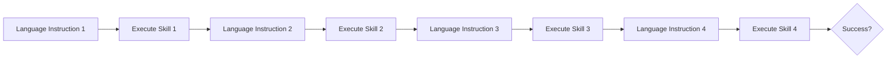
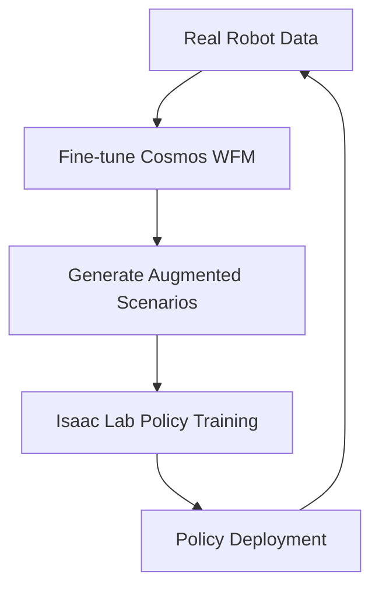

# Simulation & Data for Embodied AI

> **Last Updated:** June 2026
> **Level:** Advanced | Research Frontier
> **Related Sections:** [./02_world_models.md](./02_world_models.md) | [./09_robot_data_and_teleoperation.md](./09_robot_data_and_teleoperation.md) | [./04_cross_embodiment.md](./04_cross_embodiment.md) | [./01_vla_models.md](./01_vla_models.md)

---

## Overview

Simulation has become an indispensable component of modern robot learning, serving both as a training environment for reinforcement and imitation learning and as a scalable source of annotated synthetic data for perception systems. The core challenge bridging simulation and physical deployment — the **sim-to-real gap** — arises from discrepancies in physics fidelity, visual appearance, contact dynamics, sensor noise models, and actuator behavior. Closing this gap requires a combination of high-fidelity physics engines, photorealistic rendering, and principled domain randomization strategies that expose policies to sufficient distributional variation during training to generalize to the real world at test time.

The past three years have seen an explosion in GPU-parallel simulation frameworks. Where Isaac Gym (2021) pioneered running thousands of independent robot environments on a single GPU, its successor **Isaac Lab** [Mittal2025] formalizes this into a unified framework combining rigid-body physics, deformable simulation, photorealistic rendering (via NVIDIA Omniverse), and tight integration with reinforcement learning libraries. On the academic side, **Genesis** [Zhou2024] — released in December 2024 — claims up to 43 million frames per second for a single Franka arm scene on an RTX 4090, representing approximately 430,000× real-time acceleration. This marks a qualitative shift: training locomotion policies in 26 seconds of wall-clock time makes hyperparameter sweep over entire policy families tractable.

Complementing physics-based simulators, **world models** have emerged as an alternative data-generation pathway. NVIDIA **Cosmos** [NVIDIA2025], launched at CES 2025, is a family of diffusion- and autoregressive-based world foundation models trained on large video corpora that can synthesize physically plausible video sequences conditioned on text, image, or robot action inputs. Coupling Cosmos with Isaac Lab enables a *data flywheel*: real robot interactions can be used to fine-tune Cosmos, which then generates augmented training scenarios fed back to Isaac Lab for policy learning. This pipeline promises to dramatically reduce the real-world data burden while maintaining physical plausibility.

---

## GPU-Parallel Physics Simulators

### Isaac Lab (NVIDIA)

Isaac Lab [Mittal2025] is the official successor to Isaac Gym, building on NVIDIA's PhysX 5 engine and the Omniverse USD scene description format. Key capabilities:

- **Parallel environments:** Thousands of independent environments per GPU, each with independent physics state
- **Multi-modal sensing:** RGB, depth, segmentation, force-torque, proprioception — all GPU-resident
- **Domain randomization:** Programmatic randomization of masses, friction coefficients, visual textures, lighting
- **Tight RL integration:** Native interfaces to RSL_RL, RL_Games, and Stable Baselines 3
- **Imitation learning support:** Data collection pipelines for behavioral cloning

```
GPU Memory
┌──────────────────────────────────────────────────┐
│  Env 0   │  Env 1   │  Env 2   │  ...  │  Env N  │  (N = 4096+ on A100)
│  Physics │  Physics │  Physics │       │  Physics │
│  Render  │  Render  │  Render  │       │  Render  │
└──────────────────────────────────────────────────┘
              ↓ batched observations
         Policy Network (GPU)
              ↓ batched actions
         Environment Step (GPU)
```

### Genesis

Genesis [Zhou2024] is a pure-Python physics engine built on top of Taichi, delivering:

- **43M+ FPS** for single-arm manipulation (RTX 4090, self-collisions only)
- **27M FPS** with random action perturbation active
- **81× faster** than Isaac Gym on equivalent benchmarks
- Unified solver supporting rigid body, MPM (granular/soft), SPH (fluid), FEM, and stable Newtonian fluids

### MuJoCo / MJX

MuJoCo remains the reference simulator for contact-rich manipulation research due to its accurate soft-contact model and extensive validation. **MJX** extends MuJoCo to JAX, enabling GPU/TPU-parallel batched simulation:

```python
# MJX batched rollout sketch
import mujoco
from mujoco import mjx
import jax
import jax.numpy as jnp

model = mujoco.MjModel.from_xml_path("robot.xml")
mx = mjx.put_model(model)
dx = jax.vmap(mjx.make_data)(mx)            # N parallel states
step_fn = jax.jit(jax.vmap(mjx.step))       # batched step
dx = step_fn(mx, dx)
```

### SAPIEN / ManiSkill3

SAPIEN is a fast articulated-object physics engine developed at UC San Diego. **ManiSkill3** [Gu2024] builds on SAPIEN to provide:

- GPU-parallel environments with rendering (up to 10,000 FPS for state-based, 2,000 FPS with visual rendering)
- 20+ task families, 2,000+ object models
- Standardized benchmark API for manipulation skill evaluation

### Habitat 3.0

Facebook AI's Habitat 3.0 focuses on embodied navigation and social navigation with human avatars, supporting both rigid-body agents and articulated humanoids in photorealistic 3D scans of real environments (HM3D, Gibson, Replica datasets).

### ProcTHOR

ProcTHOR [Deitke2022] uses procedural generation to create thousands of visually diverse indoor environments for training navigation and instruction-following agents. The key insight is that diversity at training time — even with simplified rendering — transfers well to the real world through distribution coverage.

### RoboCasa

RoboCasa [Nasiriany2024] is a large-scale kitchen simulation framework built on Robosuite/MuJoCo, featuring:

- 120 visually diverse kitchen scenes
- 25 atomic tasks, 100 composite tasks
- 1,200 human demonstrations + 72,000 synthetic demonstrations
- AI-generated textures (text-to-image) and assets (text-to-3D)
- Presented at RSS 2024

---

## Sim-to-Real Transfer & Domain Randomization

The fundamental difficulty is that policies trained in simulation encounter a real world with different dynamics, appearance, and noise characteristics. Bridging strategies fall into three categories:

### Domain Randomization (DR)

Randomize simulation parameters during training so that real-world parameters fall within the training distribution:

```
P(success_real) ≈ E_{ψ ~ P(ψ)}[P(success_sim | ψ)]
```

where `ψ` encodes randomized physical parameters (mass, friction, damping) and visual parameters (texture, lighting, camera pose).

**Visual DR:** Random textures, colors, lighting, distractors. Notable result: OpenAI's Dexterous Hand [OpenAI2019] used extreme visual DR to transfer from simulation to a real Shadow Hand.

**Dynamics DR:** Randomize mass, inertia, joint friction, actuator gains. **Adaptive DR** (ADR) automatically expands randomization ranges based on policy competence, avoiding both under- and over-randomization.

### System Identification & Differentiable Simulation

Rather than randomizing blindly, system identification fits simulation parameters to real trajectories. Differentiable simulators (e.g., Warp, DiffTaichi) enable gradient-based parameter optimization:

```math
\hat{\psi} = \arg\min_{\psi} \sum_t \| s_t^{\text{real}} - s_t^{\text{sim}}(\psi) \|^2
```

### Reality Gap in Contact Dynamics

Contact simulation (grasping, insertion) remains the hardest domain due to:
- Deformation of real object surfaces
- Friction anisotropy
- Sensor compliance of robot end-effectors
- Environmental variability (dust, humidity)

---

## Benchmark Simulation Suites

### RLBench

RLBench [James2020] provides 100 structured manipulation tasks defined on a Franka arm in PyRep/CoppeliaSim. Tasks span simple reaching to bimanual assembly. Widely used for few-shot imitation learning benchmarks.

### Meta-World

Meta-World [Yu2020] provides 50 distinct robotic manipulation tasks for multi-task and meta-reinforcement learning evaluation, enabling measurement of both task-specific and generalized performance.

### CALVIN

CALVIN [Mees2022] is a long-horizon language-conditioned benchmark requiring an agent to execute sequences of 4 instructions in a single episode across novel scene arrangements.



### LIBERO

LIBERO [Liu2023] focuses on lifelong robot learning, with 130 tasks across four knowledge domains (spatial, object, goal, long-horizon). Tasks are designed to measure forward transfer and catastrophic forgetting.

### ManiSkill2 / ManiSkill3

ManiSkill2 [Gu2023] (ICLR 2023) includes 20 task families with 4M+ demonstrations. The upgraded ManiSkill3 (2024) adds GPU-parallel rendering with a standardized evaluation API.

---

## Synthetic Data via World Models

NVIDIA **Cosmos** [NVIDIA2025] represents a new paradigm: **world foundation models** trained on massive video corpora that can generate physically plausible synthetic training data:



Key capabilities:
- Text, image, or action-conditioned video generation
- Physics-aware generation (object permanence, contact events)
- Integration with Omniverse for domain randomization augmentation

Cosmos 3 (June 2026) is described as an "omnimodel" with native vision reasoning, multimodal generation across text, image, video, and action tokens, positioned as a unified synthetic data engine.

---

## Key Papers

| Paper | Authors | Year | Venue | Key Contribution |
|-------|---------|------|-------|-----------------|
| Isaac Lab: GPU-Accelerated Simulation Framework | Mittal et al. | 2025 | arXiv / NVIDIA Research | Unified GPU-parallel sim+render framework; multi-modal sensor support; extends Isaac Gym |
| Genesis: Generative World for General-Purpose Robotics | Zhou et al. | 2024 | Open-source release | 43M FPS pure-Python simulator; unified rigid/soft/fluid solver |
| ManiSkill2: Unified Benchmark for Generalizable Manipulation Skills | Gu et al. | 2023 | ICLR 2023 | 20 task families, 4M+ demonstrations, GPU-accelerated evaluation |
| RoboCasa: Large-Scale Simulation of Everyday Tasks | Nasiriany et al. | 2024 | RSS 2024 | 120 kitchen scenes, 100 tasks, AI-generated assets; 72K synthetic demos |
| CALVIN: Long-Horizon Language-Conditioned Manipulation | Mees et al. | 2022 | IEEE RA-L | 4-instruction chained manipulation benchmark with novel scenes |
| ProcTHOR: Large-Scale Embodied AI using Procedural Generation | Deitke et al. | 2022 | NeurIPS 2022 | Procedurally generated diverse indoor environments for navigation/instruction following |
| LIBERO: Benchmarking Knowledge Transfer for Lifelong Robot Learning | Liu et al. | 2023 | NeurIPS 2023 | 130 tasks for lifelong learning; measures forward transfer and forgetting |

---

## Benchmark Performance

| Model | Dataset/Benchmark | Metric | Score | Notes |
|-------|------------------|--------|-------|-------|
| Diffusion Policy [Chi2023] | RLBench (10 tasks) | Success Rate | 76.1% | CNN-based; image input |
| ACT [Zhao2023] | ALOHA bimanual tasks | Success Rate | 80–96% | Sim-trained, real transfer |
| SuSIE [Black2023] | CALVIN ABC→D | Avg. chain length | 3.6/4.0 | LLM subgoal synthesis |
| MT-ACT (multi-task) | LIBERO-Long | Success Rate | 72.0% | 10-task sequence |
| DP3 [Ze2024] | ManiSkill2 (point cloud) | Success Rate | 85%+ | 3D diffusion policy |
| Genesis baseline | MuJoCo locomotion | Training time | 26 sec | 430,000× real-time on RTX 4090 |

---

## Pros & Cons

| Aspect | Pros | Cons |
|--------|------|------|
| **GPU Parallel Sim** | Massive sample throughput; enables RL for complex skills; free scene variation | Physics accuracy degrades for deformable/contact-rich tasks; GPU memory limits episode diversity |
| **Domain Randomization** | Robust sim-to-real transfer for locomotion; no real data needed for initial policy | May produce overly conservative policies; visual DR can hurt semantic understanding |
| **World Model Synthetic Data** | Generates photorealistic video; can extrapolate to unseen scenarios; closed-loop with real data | Generation artifacts; physics consistency not guaranteed; expensive to train base models |
| **Procedural Scene Generation** | Unlimited visual diversity; targeted coverage of edge cases | Procedural scenes may lack real-world semantic coherence; manual task specification still needed |
| **Benchmark Suites (RLBench/CALVIN)** | Standardized evaluation; reproducible; community adoption | Fixed task sets; sim-to-real evaluation gap; may not reflect deployment complexity |

---

## Open Problems & Research Gaps

1. **Contact-rich sim-to-real transfer:** Current simulators still fail to accurately model high-frequency contact dynamics (insertion, peg-in-hole), leading to policies that solve simulated assembly tasks at >90% but drop to <30% in reality.

2. **Deformable object simulation at scale:** Cloth, rope, and compliant materials require particle-based solvers (MPM/FEM) that are orders of magnitude slower than rigid-body equivalents; GPU-parallel deformable simulation at RL-training scale remains an open challenge.

3. **Long-horizon task composition in simulation:** Current benchmarks (CALVIN: 4 steps, LIBERO: 6–10 steps) remain far shorter than industrial assembly sequences (100+ steps). Sim environments that support coherent long-horizon state tracking are needed.

4. **Automatic scene and task generation:** Manual authoring of simulation scenes remains a bottleneck. While ProcTHOR and RoboCasa use procedural tools, fully automatic task specification from natural language descriptions remains unsolved.

5. **Evaluation-sim correlation:** Success rates on ManiSkill or RLBench tasks do not reliably predict real-world performance. A principled methodology for measuring the correlation between simulation benchmark improvement and real-robot improvement is missing.

6. **Sim-to-real for tactile/haptic feedback:** Most simulators treat contacts as rigid point contacts; integrating GelSight-style tactile sensor simulation (with realistic image synthesis) into GPU-parallel frameworks is an active area with few solutions.

7. **World model quality metrics:** No consensus metric exists for evaluating whether world-model-generated training data improves downstream policy performance in proportion to generation quality (e.g., FID, FVD do not correlate well with policy utility).

---

## Further Reading

- [Isaac Lab Documentation & Paper (arXiv:2511.04831)](https://arxiv.org/abs/2511.04831)
- [Genesis Simulator GitHub](https://github.com/Genesis-Embodied-AI/genesis-world)
- [ManiSkill3 GitHub](https://github.com/haosulab/ManiSkill)
- [RoboCasa Project Page](https://robocasa.ai/)
- [NVIDIA Cosmos World Foundation Models](https://www.nvidia.com/en-us/ai/cosmos/)
- [CALVIN Benchmark](http://calvin.cs.uni-freiburg.de/)
