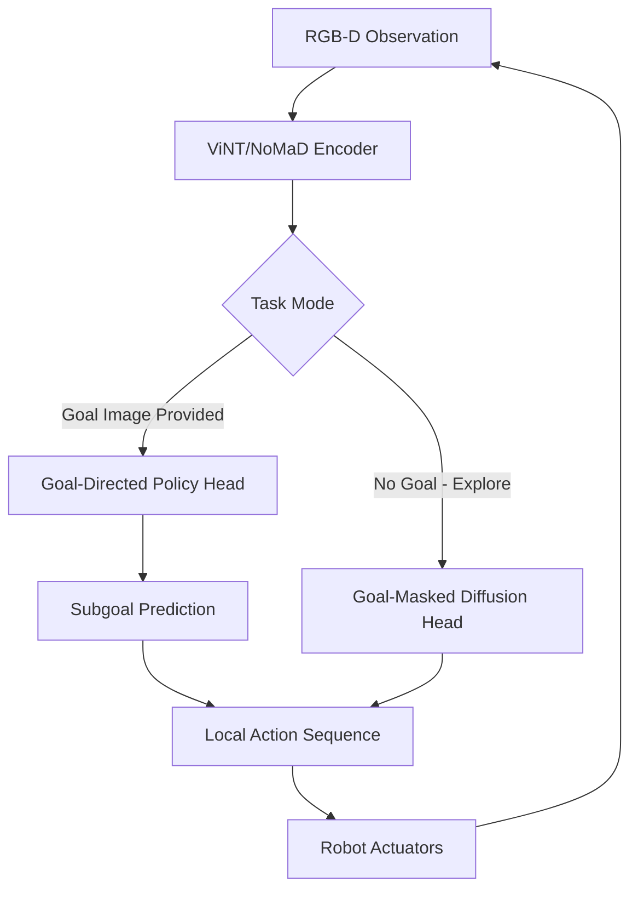

# Robot Manipulation and Navigation

> **Last Updated:** June 2026
> **Level:** Advanced | Research Frontier
> **Related Sections:**
> - [Perception for Robotics](./08_perception_for_robotics.md)
> - [Language-Conditioned Control](./10_language_conditioned_control.md)
> - [Robot Data and Teleoperation](./09_robot_data_and_teleoperation.md)
> - [Hardware and Robot Platforms](./12_hardware_robot_platforms.md)

---

## Overview

Robot manipulation and navigation represent two foundational capabilities that embodied agents must master before tackling real-world deployment. Manipulation encompasses the full spectrum from simple parallel-jaw grasping of tabletop objects to dexterous in-hand reorientation, bimanual coordination, and interaction with deformable materials. The core challenge in manipulation is bridging the perception-action gap: inferring stable, executable grasp poses from partial, noisy sensor observations of objects with arbitrary geometry, and then executing those poses robustly under real-world perturbations. The field has progressively shifted from model-based analytic approaches (e.g., GWS wrench analysis, force-closure metrics) toward data-driven methods that learn contact-rich priors from large corpora of 3D scans and human demonstrations.

Navigation encompasses the capacity of a mobile robot to move purposefully through unknown or partially known environments. Classical SLAM-based stacks (graph-based SLAM, EKF-SLAM, occupancy grid mapping) provide reliable metric maps but require explicit feature engineering and struggle in cluttered, dynamic settings. Learned navigation approaches cast the problem as goal-conditioned policy learning: given a goal specification—a GPS coordinate (PointGoal), a target object category (ObjectGoal), or a reference image (ImageGoal)—a policy trained in simulation must generalize to physical deployment. Vision-Language Navigation (VLN) extends this further by grounding natural-language route descriptions to continuous action sequences, demanding tight integration of semantic scene understanding with path planning.

The frontier is long-horizon mobile manipulation: agents that must navigate to an object, grasp it, transport it, and perform downstream assembly or placement. This demands unified representations that support both geometric precision (necessary for stable grasps) and semantic generalization (necessary for instruction following). Foundation models for navigation such as ViNT [Shah2023] and NoMaD [Sridhar2024] encode cross-embodiment mobility priors that dramatically reduce the data required to adapt to new platforms. Benchmark environments including Habitat [Savva2019], CALVIN [Mees2022], LIBERO [Liu2023], and ManiSkill3 [Tao2024] provide standardized evaluation scaffolds for measuring progress across these axes.

---

## Grasping: From Analytic to Learned Approaches

### Problem Formulation

6-DoF grasp detection maps an RGB-D or point-cloud observation $\mathcal{P} \subseteq \mathbb{R}^3$ to a set of grasp poses $\{(R_i, t_i)\}$ together with quality scores $q_i$:

```latex
\mathcal{G}^* = \arg\max_{\mathcal{G}} \sum_i q_i(R_i, t_i \mid \mathcal{P})
\quad \text{s.t.} \quad \text{FC}(R_i, t_i) = 1
```

where FC denotes force-closure satisfaction. Classical analytic methods enumerate candidate grasps and verify closure properties; learned methods regress quality scores directly from data.

### GraspNet-1Billion [Fang2020]

GraspNet-1Billion provides 97,280 RGBD images from 190 cluttered scenes captured by RealSense and Kinect cameras, with dense 6-DoF grasp annotations for each visible object surface point. The benchmark exposes a generalization axis: models are evaluated on scenes containing objects not seen during training. The companion GraspNet model processes point clouds via PointNet++ encoders and scores candidate grasps using a multi-level feature-matching head.

### Contact-GraspNet [Sundermeyer2021]

Contact-GraspNet (ICRA 2021) frames grasp detection as predicting contact points on the object surface rather than scoring pre-sampled approach vectors. A PointNet++ backbone estimates per-point grasp approach directions, width parameters, and quality scores jointly. On the ACRONYM benchmark [Eppner2021], Contact-GraspNet achieves a 90%+ grasp success rate in simulation on seen categories, dropping to ~65% on unseen shapes—motivating subsequent work on category-level generalization.

### AnyGrasp [Fang2023]

AnyGrasp scales Contact-GraspNet with a RotationNet architecture that handles arbitrary approach angles and a large-scale training set built from GraspNet-1Billion augmented with synthetic renders. In bin-picking evaluations, AnyGrasp achieves a 93.3% success rate clearing bins containing over 300 novel objects, and sustains >900 Mean Picks Per Hour (MPPH) on a single-arm industrial setup, making it among the strongest published results on the GraspNet-1Billion unseen test split.

---

## Dexterous and Bimanual Manipulation

### ALOHA and ACT [Zhao2023]

ALOHA (A Low-cost Open-source Hardware System for Bimanual Teleoperation) is a sub-$20k bimanual research platform built from WidowX arms and off-the-shelf servos. It enables collection of fine-grained demonstrations for tasks like threading a needle, zipping a bag, and opening a wine bottle. The companion learning algorithm, ACT (Action Chunking with Transformers), addresses the compounding error problem of behavioral cloning by predicting action chunks of length $k$ rather than single steps:

```latex
\pi_\theta(a_{t:t+k} \mid o_t) = \text{Transformer}(o_t)
```

A CVAE prior is used to model multi-modal action distributions during training; at inference the latent is set to zero. ACT trained with 50 demonstrations achieves task success rates of 80–95% on several fine-manipulation tasks, substantially outperforming single-step BC and LSTM baselines.

**Mobile ALOHA** [Fu2024] extends the platform with a whole-body mobile base, enabling tasks requiring locomotion and manipulation simultaneously: cooking shrimp on a stove, loading a dishwasher, pressing an elevator button. Co-training Mobile ALOHA policies with static ALOHA data provides substantial data efficiency gains through transfer.

**ALOHA Unleashed** (2024) scales the ACT Transformer backbone and trains on 500–1000 demonstrations per task, achieving 78% success on shoelace tying, 85% on shirt-hanging, and 91% on velcro-strap repair.

### Deformable Object Manipulation

Deformable objects—ropes, cloth, cables, dough—require representations that track non-rigid deformation. Approaches include: explicit mesh simulation coupled with sim-to-real transfer [Lin2022], learned visual descriptors for cloth state [Seita2021], and diffusion-based policies that model multi-modal contact dynamics [Chi2023]. The core difficulty is perceptual: standard depth sensors produce unreliable surfaces on transparent or specular materials, and deformation state is inherently high-dimensional.

---

## Navigation: Classical to Learned

### Classical SLAM-Based Navigation

Classical navigation pipelines compose: (1) a SLAM module (GMapping, Cartographer, RTAB-Map) that fuses odometry and lidar/RGBD into a 2D occupancy grid or 3D point-cloud map; (2) a global planner (A*, Dijkstra) over the metric map; and (3) a local planner (DWA, TEB) for obstacle avoidance. These stacks are reliable in static environments with accurate maps but degrade under dynamic obstacles, perceptual aliasing, and novel layouts.

### Learned Goal-Conditioned Navigation

The Habitat platform [Savva2019] standardized evaluation with three task families:

- **PointGoal**: Navigate to GPS+compass coordinates. DD-PPO [Wijmans2020] achieved near-perfect (99.6% SPL) by training with 2.5 billion environment steps across 64 GPUs.
- **ObjectGoal**: Navigate to a target object category (e.g., "find a chair"). Requires semantic reasoning; best models combine semantic maps with object priors.
- **ImageGoal**: Navigate to a location specified by a reference image. Tests visual re-localization under viewpoint change.

### Vision-Language Navigation (VLN)

The R2R (Room-to-Room) benchmark [Anderson2018] tasks agents with following natural-language route descriptions in Matterport3D scans. Recurrent BERT-based backbones (PREVALENT, HAMT) dominated early leaderboards. As of 2024:

- ScaleVLN achieves 81% Success Rate (SR) / 70% SPL on R2R validation-unseen.
- NavGPT-2 (LLM-based agent) achieves 74% SR / 61% SPL.
- RynnBrain-Nav-8B achieves 58.6% SR / 49.6% SPL on VLN-CE (continuous environments).

### Foundation Models for Navigation

**ViNT** [Shah2023] (CoRL 2023) is a Transformer trained on diverse robot navigation datasets across multiple embodiments (wheeled robots, legged robots, drones). Given a current observation and a goal image, ViNT predicts a subgoal image and a low-level action distribution. Trained jointly on datasets from 8 different platforms, ViNT demonstrates strong out-of-distribution generalization and successful zero-shot transfer to pedestrian-dense environments.

**NoMaD** [Sridhar2024] (ICRA 2024 Best Student Paper Finalist) extends ViNT with a diffusion policy head, enabling unified exploration (goal-masked) and goal-directed behavior. The diffusion head produces multi-modal action distributions suitable for uncertainty-aware planning in partially observed environments.



---

## Long-Horizon Mobile Manipulation

Long-horizon mobile manipulation requires composing navigation and manipulation sub-skills within a coherent task plan. Key challenges:

1. **Semantic grounding**: Mapping language instructions ("fetch the red mug from the kitchen") to a sequence of navigation waypoints and grasp targets.
2. **Error recovery**: When a grasp fails or the path is blocked, replanning must occur without full task restart.
3. **Object state tracking**: The agent must maintain a model of which objects have been moved and where.

The CALVIN benchmark [Mees2022] evaluates sequences of up to 5 language-conditioned manipulation tasks in a single episode, requiring the agent to generalize across novel instructions and object arrangements. The LIBERO benchmark [Liu2023] comprises 130 manipulation tasks organized into four suites (LIBERO-Spatial, LIBERO-Object, LIBERO-Goal, LIBERO-100) specifically testing lifelong and continual learning.

---

## Key Papers

| Paper | Authors | Year | Venue | Key Contribution |
|-------|---------|------|-------|-----------------|
| GraspNet-1Billion | Fang et al. | 2020 | CVPR | Large-scale grasp benchmark; 97K images, 190 scenes, dense 6-DoF annotation |
| Contact-GraspNet | Sundermeyer et al. | 2021 | ICRA | Contact-point grasp representation; PointNet++ backbone; end-to-end 6-DoF detection |
| AnyGrasp | Fang et al. | 2023 | T-RO | Scaled rotational grasp detection; 93.3% bin-picking SR, >900 MPPH |
| ALOHA + ACT | Zhao et al. | 2023 | RSS | Low-cost bimanual platform; action-chunking transformer; 50-demo learning |
| Mobile ALOHA | Fu et al. | 2024 | arXiv | Whole-body bimanual mobile manipulation via co-training |
| ViNT | Shah et al. | 2023 | CoRL | Cross-embodiment visual navigation transformer trained on 8 robot platforms |
| NoMaD | Sridhar et al. | 2024 | ICRA | Diffusion policy head for unified exploration and goal-directed navigation |
| DD-PPO | Wijmans et al. | 2020 | ICLR | Decentralized distributed PPO; 99.6% SPL on PointGoal in Habitat |
| CALVIN | Mees et al. | 2022 | RAL | Long-horizon language-conditioned multi-step manipulation benchmark |
| ManiSkill3 | Tao et al. | 2024 | arXiv | GPU-parallelized manipulation benchmark; >4300 samples/sec in simulation |

---

## Benchmark Performance

| Model | Dataset / Task | Metric | Score | Notes |
|-------|---------------|--------|-------|-------|
| AnyGrasp | GraspNet-1Billion (unseen) | AP | SOTA (published 2023) | 93.3% bin-pick SR reported |
| DD-PPO | Habitat PointGoal | SPL | 0.996 | 2.5B env steps, 64 GPUs |
| ScaleVLN | R2R val-unseen | SR / SPL | 81% / 70% | Best supervised backbone (2023) |
| NavGPT-2 | R2R val-unseen | SR / SPL | 74% / 61% | LLM-based agent; no finetuning |
| ACT | ALOHA tasks (avg) | Success | ~80-95% | Per-task; 50 human demos |
| ALOHA Unleashed | Shoelace tying | Success | 78% | 500-1000 demos per task |
| ALOHA Unleashed | Shirt hanging | Success | 85% | 500-1000 demos per task |
| RynnBrain-Nav-8B | VLN-CE R2R | SR / SPL | 58.6% / 49.6% | Open-vocabulary embodied model |
| Diffusion Policy [Chi2023] | CALVIN D→D | 5-task chain SR | not publicly reported | Reference baseline |

---

## Pros & Cons

| Aspect | Pros | Cons |
|--------|------|------|
| Learned Grasping (AnyGrasp) | Handles novel objects without CAD models; real-time inference; strong bin-picking | Degrades on transparent/reflective objects; requires dense point clouds; failure modes opaque |
| Bimanual Imitation (ALOHA/ACT) | Low hardware cost; high sample efficiency (50 demos); handles contact-rich tasks | Does not generalize across objects/scenes; sensitive to demonstration quality; no task decomposition |
| Foundation Navigation (ViNT/NoMaD) | Cross-embodiment transfer; minimal adaptation data; handles dynamic obstacles | Lower precision than metric SLAM; no map persistence; poor in structure-less environments |
| Classical SLAM Navigation | Reliable metric accuracy; interpretable maps; deterministic replanning | Brittle in dynamic scenes; requires map rebuild on layout changes; no semantic understanding |
| Long-Horizon Mobile Manipulation | Enables household-scale tasks | Requires tight perception-action-planning integration; compounding errors across stages |

---

## Open Problems & Research Gaps

1. **Transparent and Specular Object Grasping**: AnyGrasp and GraspNet methods rely on depth completion from RGBD, which fails on glass, liquids, and shiny metals. Neither IR-structured-light nor time-of-flight sensors reliably recover depth on such surfaces, and sim-to-real gaps for transparent objects remain unsolved.

2. **Reactive Bimanual Coordination**: Current bimanual imitation learning methods (ALOHA, ACT) treat both arms as a single policy with doubled action dimension. They lack explicit communication between arms and cannot reactively coordinate when one arm's plan is perturbed—a key requirement for tasks like folding cloth or assembling IKEA furniture.

3. **Zero-Shot Instruction Following in Manipulation**: VLN systems generalize to novel language instructions, but manipulation analogs (e.g., "hang the shirt on the left hook") still require per-task demonstrations. Connecting VLN-style language grounding to contact-rich skill execution is an open research problem.

4. **Graceful Failure and Recovery**: Long-horizon mobile manipulation chains failures—a missed grasp mid-sequence can invalidate subsequent steps. End-to-end policies lack recovery behaviors; hierarchical approaches [SayCan, Inner Monologue] improve this but depend on pre-specified skill libraries.

5. **Map-Free Persistent Navigation**: ViNT/NoMaD do not maintain persistent metric maps; returning to a previously visited location requires re-traversal. Integrating topological memory with foundation navigation models to enable map-free but persistent spatial reasoning is underexplored.

6. **Deformable Object State Representation**: There is no agreed-upon compact state representation for cloth, cables, or dough that is simultaneously learnable, physically grounded, and observable from RGB-D. Current methods either overfit to specific textures or require privileged simulation access.

7. **Sim-to-Real Transfer for Contact Dynamics**: Despite GPU-accelerated simulators (ManiSkill3, IsaacSim), the contact dynamics gap between simulation and reality remains a major obstacle for policies that require precise force control, soft-surface interaction, or fast regrasping.

---

## Further Reading

- [GraspNet-1Billion Dataset and Benchmark](https://graspnet.net/)
- [AnyGrasp SDK (GitHub)](https://github.com/graspnet/anygrasp_sdk)
- [General Navigation Models: ViNT, NoMaD, GNM](https://general-navigation-models.github.io/)
- [ALOHA and ACT Project Page (Tony Zhao, Stanford)](https://tonyzhaozh.github.io/aloha/)
- [Mobile ALOHA Paper (arXiv:2401.02117)](https://arxiv.org/abs/2401.02117)
- [CALVIN Benchmark](http://calvin.cs.uni-freiburg.de/)
