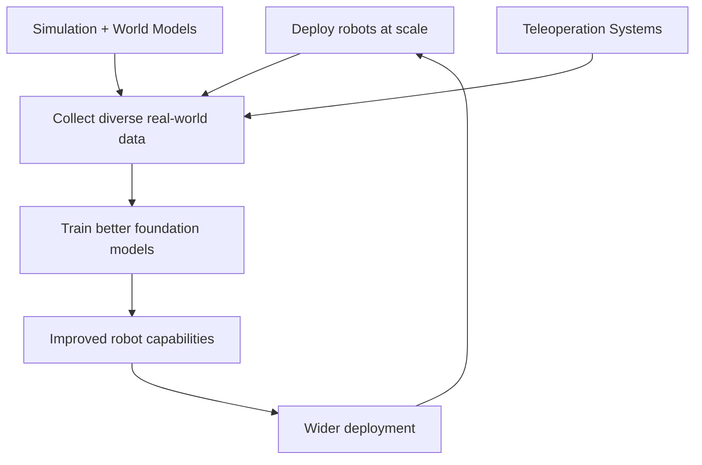
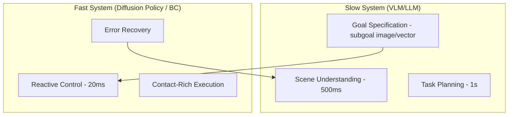

# Paradigms, Pros/Cons, and Roadmaps for Robot Learning (2026)

> **Last Updated:** June 2026
> **Level:** Advanced | Research Frontier
> **Related Sections:** [./01_vla_models.md](./01_vla_models.md) | [./02_world_models.md](./02_world_models.md) | [./11_generalist_vs_specialist.md](./11_generalist_vs_specialist.md) | [./03_diffusion_policy.md](./03_diffusion_policy.md)

---

## Overview

As of 2026, the field of robot learning has coalesced around three competing paradigms, each with distinct theoretical foundations, empirical track records, and practical constraints. This document provides a *Nature Perspectives*-style analytical treatment of the current landscape: where each paradigm succeeds, where it fails, what the field's macro-trajectories suggest, and what honest open problems remain. This is not a neutral survey — it advances specific theses about convergence, scaling, and the limits of benchmark-driven progress.

The three paradigms are: (1) **end-to-end Vision-Language-Action (VLA) models**, which unify perception, language understanding, and motor control in a single transformer; (2) **World Model-based planning**, where a learned dynamics model enables internal rollout and model-predictive control; and (3) **Diffusion Policy and related generative behavior-cloning** methods, which model action distributions as score-matched denoising processes. A fourth approach — **Modular LLM + Specialist Policy** — is better characterized as a systems integration strategy than a learning paradigm, but it occupies significant deployed industrial footprint and merits inclusion.

The deeper question animating this document is whether robotics will follow the same scaling trajectory as NLP: a "bitter lesson" path where scale and data overwhelm hand-crafted inductive biases, producing general-purpose behavior without domain-specific engineering. The evidence as of 2026 is sharply mixed, and we argue that the correct framing is not "does scale work" but "which aspects of robot competence respond to scale, on what data, and with what sample efficiency."

---

## Part I — Three Competing Paradigms (2026)

### Paradigm 1: End-to-End VLA Models

VLAs such as RT-2 [Brohan2023], OpenVLA [Kim2024], Octo [Team2024], and π0 [Black2024] treat robot control as a language modeling problem: images and instructions are tokenized and a transformer predicts discrete action tokens or continuous action chunks auto-regressively. The paradigm inherits the data-efficiency gains of large-scale vision-language pretraining: a model pretrained on internet-scale image-text data brings rich semantic priors to manipulation tasks, dramatically reducing the number of robot demonstrations needed for new tasks.

The fundamental limitation is the **latency-accuracy tradeoff** imposed by auto-regressive generation. Generating a 6-DOF action token sequence with a 7B-parameter model takes 50–500 ms on a single A100 — a frequency floor that precludes reactive control for dynamic tasks (catching, avoiding moving objects). Architectural mitigations (action chunking, parallel decoding) help but do not fully close the gap.

### Paradigm 2: World Model-Based Planning

World models [Ha2018, Hafner2023] learn a compressed latent dynamics model that enables planning by internal rollout. The paradigm's appeal is sample efficiency: an agent can improve its policy by simulating counterfactuals without additional real-world interaction. DreamerV3 [Hafner2023] demonstrated that a single set of hyperparameters trains effective policies across 150+ tasks spanning diverse observation and action spaces.

The challenge for physical robotics is that world models struggle with **multi-step contact prediction**: the distribution of physical futures after a grasp contact is high-entropy and heavily conditioned on object geometry and surface properties that the model may not have latently encoded. Video-generation-based world models (UniSim [Yang2023], Genie [Bruce2024]) improve visual fidelity but have not yet demonstrated reliable low-level control.

### Paradigm 3: Diffusion Policy and Generative BC

Diffusion Policy [Chi2023] (RSS 2023, IJRR 2025) models the conditional action distribution `p(a_t | o_t)` as a score-matched denoising process, yielding policies that handle **multimodal action distributions** (multiple valid ways to grasp an object) that Gaussian BC methods collapse. The approach outperformed prior SOTA by 46.9% average across 15 tasks in the original paper and has become a standard backbone for imitation learning.

DP's limitation is that it does not generalize beyond the support of the demonstration distribution: there is no semantic understanding of what goal the robot is pursuing, precluding compositional generalization without VLM integration.

---

## Part II — Levels of Generalization Framework

A critical missing dimension in most robot learning evaluations is a precise characterization of *what type* of generalization is being measured. We propose the following taxonomy:

| Level | Name | Definition | Example |
|-------|------|-----------|---------|
| **L1** | Task instance | Same task, different initial conditions (object pose, lighting) | Grasp red cup at random positions on table |
| **L2** | Object | Same task, unseen objects from same category | Grasp novel mugs never seen in training |
| **L3** | Environment | Same task/object distribution, novel layout/background/scene | Kitchen skills in new room |
| **L4** | Task transfer | Related but distinct tasks, zero/few-shot without finetuning | Train on pick-and-place, test on sorting |
| **L5** | Long-horizon compositional | Novel task decomposable from known primitives, chained reasoning required | "Make me breakfast" from scratch |

Most current benchmarks test L1–L2. The VLA paradigm's main claimed advance is L3–L4 via vision-language pretraining. L5 remains largely unsolved by any paradigm — current best results (SayCan [Ahn2022], InnerMonologue [Huang2022]) rely on privileged enumeration of available skills and a closed-world assumption.

---

## Part III — Multi-Axis Paradigm Comparison

| Axis | VLA (e.g., OpenVLA, π0) | World Model (DreamerV3, V-JEPA) | Diffusion Policy | Modular LLM + Policy (SayCan, CaP) |
|------|------------------------|--------------------------------|-----------------|-------------------------------------|
| **Architecture** | Large transformer (3B–70B); VLM backbone + action head | Latent dynamics RSSM or transformer; separate world + actor | U-Net or Transformer score network conditioned on obs | LLM planner + separate skill policies (RL or BC) |
| **Data requirement** | Large cross-robot demonstrations; benefits from internet pretraining | RL environment interactions; benefits from offline video | Moderate expert demonstrations (50–500 per task) | Skill library needs demonstrations; planning uses LLM zero-shot |
| **Inference latency** | **50–500 ms** (autoregressive); limited by model size | **5–50 ms** (latent rollout); compact world model | **10–100 ms** (DDPM: slow; DDIM/consistency: faster) | **100 ms–2 s** (LLM planning + skill call) |
| **Generalization level** | L1–L4 (semantic VLM prior) | L1–L3 (model accuracy degrades OOD) | L1–L2 (pure BC; limited semantic generalization) | L1–L5 (LLM handles compositionality; skills handle execution) |
| **Dexterity ceiling** | Medium; limited by action tokenization resolution | Low; planning in latent space loses high-frequency detail | High; continuous denoising captures fine-grained actions | Low-Medium; dependent on skill policy quality |
| **Sample efficiency** | Low-Medium (needs large robot data); pretraining helps | Medium-High (model-based RL) | Medium (50–500 demos competitive with state-based BC) | High for planning (zero-shot LLM); low for skill acquisition |
| **Interpretability** | Low (black-box end-to-end) | Partial (world model visualizable) | Low (diffusion process opaque) | High (LLM chain-of-thought auditable; modular) |
| **Key failure mode** | Slow inference; fine-grained manipulation; compounding tokenization error | Distribution shift during rollout; contact prediction failure | No semantic understanding; stuck in demonstration support | Tool-calling hallucination; skill boundary mismatch |
| **Hardware requirements** | GPU inference (A100/H100) for large models; edge deployment needs quantization | Modest GPU; compact world model | Modest GPU; DDPM slow on CPU | LLM: cloud/large GPU; skill policies: embedded |
| **Open-source** | OpenVLA (7B), Octo (multi-modal); π0 weights released Feb 2025 | DreamerV3 (JAX); V-JEPA (Meta) | Diffusion Policy (Columbia); 3D-DP (Ze2024) | Code-as-Policies (Google); SayCan partially |
| **Tech Readiness Level (TRL)** | TRL 4–6 | TRL 3–5 | TRL 5–7 | TRL 5–7 |
| **Best use case** | Language-guided pick-and-place; generalizing across scene backgrounds | Long-horizon planning; simulation-heavy training | Precise dexterous manipulation; bimanual tasks with rich demos | Multi-step household instructions; task sequencing |

---

## Part IV — The Bitter Lesson Debate in Robotics

The "bitter lesson" [Sutton2019] holds that general methods that leverage computation eventually outperform methods that leverage human domain knowledge. In NLP, scaling language models on internet text proved this definitively — every hand-crafted feature, grammar, or knowledge graph was eventually surpassed by sufficiently large transformers.

### Arguments FOR scaling solving robotics

**[Pro1]** RT-2 [Brohan2023] demonstrated that internet-scale vision-language pretraining transfers semantic reasoning to manipulation — robots could respond to novel color-shape combinations and cultural references never seen in robot data. This is precisely the bitter-lesson pattern.

**[Pro2]** π0 [Black2024] and its successors showed that scaling robot demonstrations from 100 to 10,000+ tasks improves performance on unseen tasks approximately log-linearly — the same scaling law form observed in NLP.

**[Pro3]** Open X-Embodiment [OXE2023] demonstrated that pooling data from 22 different robot embodiments and 21 institutions improved performance of RT-1-X by ~50% over single-embodiment baselines, suggesting data diversity matters more than data homogeneity.

**[Pro4]** The infrastructure for data collection is maturing rapidly: ALOHA, UMI, GELLO, and Apple Vision Pro teleoperation systems reduce per-demonstration cost by 5–20×; autonomous data collection pipelines reduce it further.

### Arguments AGAINST scaling solving robotics

**[Con1]** **The physics bottleneck:** Robot learning requires sample-efficient learning of continuous physical dynamics, not just pattern recognition over discrete tokens. A language model learning to "say" the right action token is not the same as a controller learning to maintain contact force under compliance. Current action tokenization schemes discard the continuous-time physics that makes manipulation hard.

**[Con2]** **The embodiment bottleneck:** Unlike NLP where a single modality (text) covers nearly all tasks, robots have widely varying kinematic chains, sensor suites, and actuation properties. A model trained on Franka arm data does not trivially transfer to a 5-fingered dexterous hand — the "same task" is an entirely different motor control problem [Peng2018].

**[Con3]** **The data collection bottleneck:** Internet-scale text was free; robot trajectory data is expensive. 76,000 demonstrations in DROID [Khazatsky2024] required 12 months of collection by 50 data collectors — a rate of ~170 demos/person/day. At this rate, reaching NLP-scale data diversity (billions of examples) is not plausible without orders-of-magnitude cheaper collection mechanisms.

**[Con4]** **The distribution shift bottleneck:** Unlike text, physical deployments encounter conditions outside any training distribution. A robot that succeeds 95% of the time but catastrophically fails on the remaining 5% (dropping fragile objects, knocking over liquids) is often undeployable. NLP's "hallucinations" are tolerable in most applications; manipulation failures can be costly or dangerous.

**Synthesis:** Scale will solve the *semantic and compositional* aspects of robot intelligence — the "what to do" layer. It will not by itself solve the *motor execution* layer — the "how to do it precisely and safely." The field's near-term path requires coupling large-scale pretrained semantic priors with specialized high-bandwidth control policies, not a single monolithic scaling solution.

---

## Part V — Data Flywheel and Strategic Moat in Physical AI

The competitive dynamics of physical AI in 2026 are shaped by a data flywheel mechanism:

**Strategic moat analysis:**

| Company / Lab | Data source | Data scale (est. 2026) | Flywheel status |
|--------------|-------------|----------------------|----------------|
| Physical Intelligence (π) | Diverse partner deployments; 7-robot training | ~68 tasks, scaling | Active; π0.6 uses RL from real experience |
| Google DeepMind | RT-X OXE; Everyday Robots legacy; partner data | 1M+ episodes (OXE) | Active via RT-X; Gemini Robotics |
| NVIDIA | Isaac Lab synthetic; Cosmos augmentation; partner data | Largely synthetic | Accelerating; Cosmos 3 provides data engine |
| Tesla | Optimus factory deployment (Fremont, Austin) | Millions of cycles in restricted domains | Nascent; battery sorting, parts handling |
| Figure / 1X / Unitree | BMW factory (Figure); Amazon (Digit) | Tens of thousands of episodes | Early-stage; deployment before scale |

The moat is not model architecture (which is widely published) but **proprietary demonstration data collected in real deployment environments**. This is why deployment speed matters independently of policy quality: earlier deployment means earlier data collection flywheel startup.

---

## Part VI — Near-Term Roadmaps (2026–2028)

### Physical Intelligence

π0 was released in October 2024; π0.5 (April 2025) introduced open-world generalization; π0.6 (November 2025) added RL-from-experience finetuning. The 2026–2028 trajectory involves:
- Scaling π0 architecture to 70B+ parameters using additional partner deployment data
- Extending to bimanual and mobile manipulation at industrial scale
- RL from human feedback (RLHF-style) on real robot rollouts

### NVIDIA (Cosmos + Isaac Lab)

NVIDIA's strategy decouples the **data problem** (Cosmos world foundation models) from the **training infrastructure problem** (Isaac Lab). The 2026–2028 roadmap involves:
- Cosmos 3 as a universal synthetic data engine; integration with Isaac Lab for closed-loop policy training
- Jetson Thor as the edge compute platform enabling on-robot inference of 100B+ parameter models
- GR00T [Nvidia2024] humanoid foundation model trained on synthetic + real data

### Google DeepMind

Following RT-X, DeepMind's Gemini Robotics integrates Gemini's multimodal reasoning into robot control. The 2026–2028 direction involves:
- Gemini Robotics-ER: enhanced reasoning for manipulation planning
- Broader embodiment coverage beyond Everyday Robots arms
- Integration with Google's manufacturing and logistics partners

### Humanoid Platforms: Figure, 1X, Unitree

- **Figure:** Figure 02 (Aug 2024) deployed at BMW; Figure 03 expected 2026–2027 with improved dexterity (20+ DOF hands) and onboard compute for full VLA inference
- **1X NEO:** Consumer-oriented bimanual humanoid; data collection via home deployment pilots
- **Unitree:** G1 at $16K democratizes research hardware; H1 Pro targets industrial deployment; data collection at academic scale

### The 2028 Horizon: Predicted Milestones

Based on current trajectories, reasonable 2028 predictions (not guarantees):
1. A deployed humanoid robot completes 5+ sequential manipulation tasks in an unstructured home environment with <10% failure rate
2. Simulation-trained policies (using world models for augmentation) match teleoperation-trained policies on 80% of standard benchmark tasks
3. Diffusion-based action generation achieves <10 ms inference on Jetson Thor, enabling real-time reactive control
4. A data-scaling paper demonstrates quantitative manipulation scaling laws analogous to Chinchilla laws in NLP

---

## Part VII — Hybrid Convergence Thesis

We argue that the near-term SOTA (2026–2028) will be dominated by **dual-system architectures** coupling a slow, high-level semantic system with a fast, reactive low-level policy:

This mirrors the dual-process cognitive architecture (System 1 / System 2 of [Kahneman2011]) and has empirical support in π0's flow-matching head [Black2024], hierarchical diffusion [Ze2024], and the SayCan/VoxPoser pattern.

The slow system handles semantic generalization (L3–L5 of our generalization framework). The fast system handles precision execution (L1–L2). Crucially, the two systems operate on different timescales and can be trained with different data regimes:
- Slow system: large-scale internet + robot data, slow update
- Fast system: task-specific demonstrations, fast adaptation via finetuning or in-context imitation

---

## Key Papers

| Paper | Authors | Year | Venue | Key Contribution |
|-------|---------|------|-------|-----------------|
| RT-2: Vision-Language-Action Models Transfer Web Knowledge to Robotic Control | Brohan et al. | 2023 | CoRL 2023 | VLM backbone for robot control; semantic generalization |
| OpenVLA: An Open-Source Vision-Language-Action Model | Kim et al. | 2024 | CoRL 2024 | 7B open-source VLA; strong cross-embodiment generalization |
| π0: A Vision-Language-Action Flow Model for General Robot Control | Black et al. | 2024 | arXiv 2024 | Flow-matching action head on PaliGemma VLM; 68 tasks, 7 robots |
| DreamerV3: Mastering Diverse Domains through World Models | Hafner et al. | 2023 | arXiv / ICML | Single-hyperparameter world model across 150+ tasks; DreamerV3 |
| Diffusion Policy: Visuomotor Policy Learning via Action Diffusion | Chi et al. | 2023 | RSS 2023 / IJRR 2025 | Denoising diffusion for action distribution modeling; 46.9% avg. improvement |
| Do As I Can, Not As I Say: Grounding Language in Robotic Affordances | Ahn et al. | 2022 | arXiv / CoRL | SayCan: LLM planning + value function affordance grounding |
| Open X-Embodiment: Robotic Learning Datasets and RT-X Models | OXE Collab | 2023 | ICRA 2024 | 22-robot, 21-institution dataset; 50% improvement with data pooling |

---

## Benchmark Performance

| Model | Dataset | Metric | Score | Notes |
|-------|---------|--------|-------|-------|
| RT-2-X [Brohan2023] | OXE evaluation embodiment | Success Rate | ~3× improvement over RT-2 single-embodiment baseline | Emergent chained reasoning |
| OpenVLA [Kim2024] | BridgeV2 held-out | Success Rate | 65.7% | 7B open-source; competitive with RT-2 |
| π0 [Black2024] | Cross-robot (68 tasks) | Task completion | Rudimentary proficiency | 7-robot, 68-task foundation model |
| Diffusion Policy [Chi2023] | 15-task aggregate | Success Rate | +46.9% over prior SOTA | CNN-based; includes Push-T, Robomimic, Block Push |
| SayCan [Ahn2022] | Real robot (101 tasks) | Planning success | 84% | 101 complex kitchen tasks |
| DreamerV3 [Hafner2023] | Atari 57 + DMC + others | Human-norm. score | SOTA across all three | Single hyperparameter set |

---

## Pros & Cons

| Aspect | Pros | Cons |
|--------|------|------|
| **VLA paradigm** | Semantic generalization (L3–L4); benefits from internet pretraining; unified architecture | Slow inference (50–500ms); poor dexterity ceiling; large GPU requirement |
| **World model paradigm** | Sample efficient; enables mental simulation; latent planning interpretable | Contact prediction failure; sim-to-real gap in learned dynamics; requires RL infrastructure |
| **Diffusion policy** | Best-in-class for dexterous imitation; handles multimodal action distributions; fast deployment | No semantic generalization; demo-bound; DDPM inference slow without distillation |
| **Modular LLM + Policy** | Interpretable; compositional reasoning; leverages off-the-shelf LLMs | Skill boundary mismatch; LLM hallucination in tool calls; latency from LLM planning |
| **Scale as a solution** | Empirical scaling laws encouraging; semantic priors transfer well; industry investment accelerating | Data collection bottleneck; embodiment diversity hurts transfer; safety failures not tolerated |

---

## Open Problems & Research Gaps

1. **Quantitative robot scaling laws:** No Chinchilla-equivalent analysis exists for robot learning — how many demonstrations, of what diversity, for a model of what size, achieves what performance on held-out tasks? This is the single most important empirical question for the field.

2. **Dexterous manipulation at human level:** Current systems achieve pick-and-place at >90% success but in-hand manipulation (re-grasping, pivot grasp, finger gaiting) at <30%. The gap between gross and fine manipulation is not addressed by scale alone.

3. **Safety and failure recovery:** No current paradigm provides systematic guarantees about failure rates or recovery behavior. Deploying a robot with 95% task success but 5% unsafe failure rate is not acceptable in human-occupied spaces.

4. **Causal understanding of physical dynamics:** Current models learn correlations in observation space. A robot that understands *why* objects behave as they do (mass, friction, gravity) would generalize to novel physical configurations far more robustly.

5. **Lifelong learning without catastrophic forgetting:** Robots deployed continuously must accumulate skills without forgetting prior ones. Standard finetuning on new tasks degrades prior task performance by 20–50%; this is an unsolved systems problem.

6. **The slow-fast interface:** Dual-system architectures require a principled interface between the semantic planner and the reactive controller — how are subgoals specified (images, language, state vectors)? How are failures detected and escalated? This interface design is ad hoc in current systems.

7. **Embodiment-agnostic policies:** Despite OXE and OpenVLA, cross-embodiment transfer remains fragile for embodiments with very different kinematics (e.g., 2-finger gripper vs. 5-finger hand). The right representation for embodiment-agnostic action is an open research question.

---

## Further Reading

- [The Bitter Lesson — Richard Sutton (2019)](http://www.incompleteideas.net/IncIdeas/BitterLesson.html)
- [π0 Technical Report (arXiv:2410.24164)](https://arxiv.org/abs/2410.24164)
- [Open X-Embodiment Project Page](https://robotics-transformer-x.github.io/)
- [DreamerV3 Paper (arXiv:2301.04104)](https://arxiv.org/abs/2301.04104)
- [Diffusion Policy Project Page](https://diffusion-policy.cs.columbia.edu/)
- [Physical Intelligence Blog](https://www.pi.website/blog)
