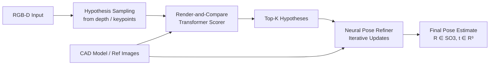
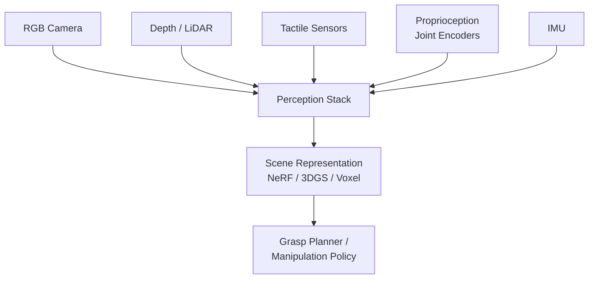

# Perception for Robotics

> **Last Updated:** June 2026
> **Level:** Advanced | Research Frontier
> **Related Sections:**
> - [Manipulation and Navigation](./06_manipulation_navigation.md)
> - [Language-Conditioned Control](./10_language_conditioned_control.md)
> - [Robot Data and Teleoperation](./09_robot_data_and_teleoperation.md)
> - [Hardware and Robot Platforms](./12_hardware_robot_platforms.md)

---

## Overview

Perception for robotics addresses the problem of extracting task-relevant representations from raw sensor streams—RGB images, depth maps, point clouds, tactile signals, and proprioception—in a form that supports downstream planning and control. Unlike passive perception tasks (e.g., image classification, video understanding), robotic perception must operate under stringent real-time constraints, handle sensor noise and partial occlusion common in manipulation workspaces, and produce representations that are geometrically precise enough to guide physical contact. A 1 mm error in estimated object pose can cause a grasp to fail; a 100 ms latency spike can cause a running robot to fall.

The field has undergone a major paradigm shift over 2022–2025. Classical pipelines composed modular components—object detection, 6-DoF pose estimation via ICP or PnP, occupancy mapping, and grasp planning—into handcrafted stacks. The new paradigm favors unified scene representations: 3D Gaussian Splats (3DGS) [Kerbl2023], Neural Radiance Fields (NeRF) [Mildenhall2021], and volumetric occupancy networks that jointly encode geometry, appearance, and semantics into a single differentiable model. These representations support view synthesis (enabling data augmentation and sim2real transfer), semantic querying via language embeddings, and real-time rendering for closed-loop feedback.

A third layer of innovation involves open-vocabulary scene understanding: fusing vision-language models such as CLIP into 3D representations, so that a robot can answer the query "where is the orange juice?" directly from a continuous feature field, without being constrained to a fixed category vocabulary established at training time. Methods including CLIP-Fields [Shafiullah2022], OpenScene [Peng2023], and LangSplat [Qin2024] demonstrate that language-queryable spatial maps can be built incrementally during robot operation with no task-specific labeling.

---

## 6-DoF Object Pose Estimation

### Problem Statement

Given an RGB or RGB-D observation and a reference model (CAD mesh or a set of reference images), estimate the rotation $R \in SO(3)$ and translation $t \in \mathbb{R}^3$ of the object in the camera frame:

```latex
(R^*, t^*) = \arg\min_{R,t} \mathcal{L}\bigl(\text{render}(M, R, t),\; I_\text{obs}\bigr)
```

The BOP (Benchmark for 6D Object Pose Estimation) Challenge provides standardized evaluation across multiple datasets (YCB-V, LM-O, T-LESS, HB, ITODD) using the Average Recall (AR) metric that aggregates VSD, MSSD, and MSPD error thresholds.

### MegaPose [Labbe2022]

MegaPose (NeurIPS 2022) addresses generalization to unseen objects by training on >2 million synthetic images depicting 50K+ diverse objects from Google Scanned Objects and ShapeNetCore. The architecture consists of a coarse estimator (regresses pose from rendered-vs-observed feature comparison) followed by an ICP-style refiner. MegaPose does not require any real training images of the target object, only its CAD model at test time. These synthetic training images were subsequently made available for BOP 2024 pre-training, establishing MegaPose's training data as a community resource.

### FoundationPose [Wen2024]

FoundationPose (CVPR 2024 Highlight, NVLabs) is a unified 6-DoF pose estimation and tracking model that supports both model-based (CAD provided) and model-free (reference images provided) operation without any per-object fine-tuning. Key innovations:

1. A large-scale synthetic training pipeline generating diverse object-scene compositions.
2. A render-and-compare transformer that scores pose hypotheses by comparing rendered and observed feature maps.
3. A neural pose refiner that iteratively updates estimates.

FoundationPose ranked **1st on the BOP leaderboard** as of March 2024 for model-based novel-object pose estimation, achieving AR = 83.3% on the BOP core unseen datasets—a substantial margin above prior SOTA.



---

## Grasp Detection and Keypoint Representations

### kPAM: KeyPoint Affordances [Manuelli2019]

kPAM formalizes category-level manipulation by representing objects via semantic 3D keypoints (e.g., "mug handle", "mug rim") rather than full 6-DoF pose. Given detected keypoints $\{k_i \in \mathbb{R}^3\}$, a task-parameterized motion plan is solved:

```latex
\min_{T \in SE(3)} \sum_i \| T k_i^{\text{ref}} - k_i^{\text{obs}} \|^2
\quad \text{s.t.} \quad \text{collision-free}(T)
```

kPAM achieves category-level generalization (mugs of different shapes, colors) without requiring dense 6-DoF pose estimation. kPAM 2.0 (RA-L 2020) extends to sequential manipulation.

### Transporter Networks [Zeng2021]

Transporter Networks (CoRL 2021) address pick-and-place tasks by decomposing action prediction into a "what to pick" and "where to place" inference, both framed as spatial cross-correlation operations over deep feature maps:

```latex
Q_\text{place}(p) = \phi_\text{key}(I_t) \star \phi_\text{query}(I_t, \text{pick}_t)
```

This structure exploits spatial translation equivariance, yielding orders-of-magnitude better sample efficiency than standard imitation learning baselines. The method makes no assumptions about object identity, canonical poses, or keypoints, operating directly on image observations.

---

## Scene Representations for Manipulation

### Neural Radiance Fields (NeRF)

NeRF [Mildenhall2021] represents a scene as a continuous function $F_\theta: (\mathbf{x}, \mathbf{d}) \mapsto (\mathbf{c}, \sigma)$ mapping 3D coordinates and view direction to color and volume density. Volume rendering:

```latex
\hat{C}(\mathbf{r}) = \int_{t_n}^{t_f} T(t)\,\sigma(\mathbf{r}(t))\,\mathbf{c}(\mathbf{r}(t), \mathbf{d})\,\mathrm{d}t
```

For robotics, NeRF enables novel view synthesis from sparse observations, supporting data augmentation for policy training and high-quality 3D reconstruction for grasping. NeRF2Real [Byravan2023] demonstrated sim2real transfer of legged locomotion policies using NeRF-rendered training environments.

### 3D Gaussian Splatting (3DGS)

3DGS [Kerbl2023] (SIGGRAPH 2023) represents scenes as a set of anisotropic Gaussians $\mathcal{G} = \{(\mu_i, \Sigma_i, \alpha_i, \mathbf{c}_i)\}$, rendered via alpha-compositing:

```latex
C(p) = \sum_{i \in \mathcal{N}} c_i \alpha_i \prod_{j < i}(1 - \alpha_j)
```

3DGS renders at 100+ FPS (vs. seconds for NeRF), enabling real-time feedback during robot operation. For manipulation:
- **SplatSim** (2024) demonstrated zero-shot sim2real transfer of RGB manipulation policies using 3DGS scene reconstruction.
- **ManiGaussian** (2024) extended 3DGS with dynamic scene modeling for multi-task robot manipulation.
- **RL-GSBridge** (2024) uses 3DGS for Real2Sim2Real transfer, building simulation environments from real robot observations.

### Voxel and Occupancy Representations

Voxel grids and occupancy networks provide an explicit volumetric alternative:
- **VoxPoser** [Huang2023] generates 3D affordance maps over a voxel workspace using LLM-composed value functions.
- **C-3PO** and occupancy network variants enable real-time collision checking for reactive manipulation planning.

---

## Open-Vocabulary Scene Understanding

### CLIP-Fields [Shafiullah2022]

CLIP-Fields trains a small MLP to map 3D coordinates to CLIP feature vectors, supervised by posed RGB frames whose patches are embedded with a CLIP image encoder. The resulting field can be queried with arbitrary text:

```latex
f^* = \arg\min_f \|\text{CLIP-img}(I_i) - f(x_i)\|^2
```

Robots using CLIP-Fields can navigate to arbitrary language queries ("find the red bottle") without any task-specific training, relying entirely on CLIP's web-trained semantic space.

### OpenScene [Peng2023]

OpenScene (CVPR 2023) distills 2D open-vocabulary features (LSeg, OpenSeg) into 3D point-cloud representations via a 3D distillation objective, enabling zero-shot semantic 3D scene queries with natural language. Unlike CLIP-Fields, OpenScene processes large-scale indoor scans (ScanNet, Matterport3D) at the scene level.

### LangSplat [Qin2024]

LangSplat (CVPR 2024) embeds CLIP language features into 3D Gaussian primitives, achieving real-time language-queryable 3D scenes. LangSplat adds a per-Gaussian CLIP feature vector $\ell_i$ alongside standard Gaussian attributes, rendered using the same alpha-compositing kernel:

```latex
L(p) = \sum_{i \in \mathcal{N}} \ell_i \alpha_i \prod_{j < i}(1 - \alpha_j)
```

This enables open-vocabulary object localization at real-time rates, making it suitable for reactive robot grasping pipelines.

---

## Depth, Point Cloud, and Sensor Fusion

### RGB-D Processing

Standard RGB-D sensors (Intel RealSense D435, Azure Kinect) provide depth via structured IR projection. Key failure modes for robotics:
- Transparent/specular objects: IR structured light fails; time-of-flight also unreliable.
- Near-field (<0.3 m): Depth accuracy degrades significantly; critical for in-hand manipulation.
- Motion blur: Fast robot motion can cause depth-color misalignment.

PointNet++ [Qi2017] and sparse 3D CNNs (MinkowskiEngine, SpConv) are standard backbones for point-cloud processing tasks including grasp detection, 6-DoF pose estimation, and scene segmentation.

### Tactile Sensing

**GelSight** sensors use an elastomeric gel surface with embedded LEDs and a camera to image deformations when the gel contacts an object, yielding high-resolution surface geometry (micron-level) and shear force estimates. The **DIGIT** sensor [Lambeta2021] miniaturized this to a fingertip form factor at $<$\$30 per unit.

In October 2024, **Digit 360** was announced (GelSight + Meta AI), a fingertip-shaped sensor with >18 sensing modalities including normal force, shear force, vibration, and thermal, offering superhuman tactile sensitivity. All code and designs are open-sourced by Meta AI.

Tactile sensing enables skills beyond vision alone: detecting slip during grasping, estimating object stiffness, and calibrating force during assembly.

### Sensor Fusion

Fusing heterogeneous sensors requires careful temporal synchronization and extrinsic calibration:



Modality fusion approaches include: early fusion (concatenation in feature space), late fusion (ensemble of per-modality predictions), and cross-modal attention mechanisms as used in transformer-based policies.

---

## Real-Time Constraints

| Task | Latency Budget | Common Bottleneck |
|------|---------------|-------------------|
| Grasp detection on point cloud | <100 ms | PointNet++ inference |
| 6-DoF pose tracking | <30 ms | Render-and-compare loop |
| 3DGS view synthesis | <10 ms | GPU rasterization |
| Language-field query | <50 ms | CLIP embedding + field eval |
| SLAM update (RTAB-Map) | <100 ms | Loop closure detection |

NVIDIA Jetson AGX Orin (275 TOPS INT8) is the standard edge platform; the newer **Jetson Thor** (2025, Blackwell architecture) delivers 2,070 FP4 TFLOPS within a 130W envelope, enabling on-robot inference of larger perception models.

---

## Key Papers

| Paper | Authors | Year | Venue | Key Contribution |
|-------|---------|------|-------|-----------------|
| GraspNet-1Billion | Fang et al. | 2020 | CVPR | Large-scale grasp benchmark; baseline model |
| NeRF | Mildenhall et al. | 2020/2021 | ECCV / CACM | Continuous volumetric scene representation |
| kPAM | Manuelli et al. | 2019/2020 | ISRR / RA-L | Semantic keypoint affordances for category-level manipulation |
| Transporter Networks | Zeng et al. | 2021 | CoRL | Spatial cross-correlation for pick-and-place; high sample efficiency |
| DIGIT | Lambeta et al. | 2021 | RA-L | Low-cost (<$30) fingertip tactile sensor |
| CLIP-Fields | Shafiullah et al. | 2022 | arXiv | Language-queryable 3D neural fields for robot navigation |
| MegaPose | Labbe et al. | 2022 | NeurIPS | 6-DoF pose estimation for unseen objects from CAD models |
| 3D Gaussian Splatting | Kerbl et al. | 2023 | SIGGRAPH | Real-time explicit radiance field via anisotropic Gaussians |
| OpenScene | Peng et al. | 2023 | CVPR | Open-vocabulary 3D scene understanding via feature distillation |
| FoundationPose | Wen et al. | 2024 | CVPR | Unified 6-DoF pose+tracking; BOP #1 ranking (AR 83.3%) |
| LangSplat | Qin et al. | 2024 | CVPR | Language-embedded 3DGS for real-time open-vocabulary 3D queries |

---

## Benchmark Performance

| Model | Dataset / Task | Metric | Score | Notes |
|-------|---------------|--------|-------|-------|
| FoundationPose | BOP core (unseen, model-based) | AR | 83.3% | CVPR 2024 Highlight; BOP #1 March 2024 |
| MegaPose | BOP (unseen objects) | AR | not publicly reported by single number | Strong baseline; training data made public |
| AnyGrasp | GraspNet-1Billion unseen test | AP | SOTA (2023) | 93.3% bin-pick SR empirically |
| Transporter Networks | CLIPort pick-and-place | Task SR | >90% seen tasks | 100x sample efficiency vs. BC |
| LangSplat | 3D semantic localization | Acc | not publicly reported | Real-time vs. NeRF-based methods |
| DIGIT 360 | Tactile sensing modalities | — | >18 sensing features | Announced October 2024 |

---

## Pros & Cons

| Aspect | Pros | Cons |
|--------|------|------|
| FoundationPose (model-based 6-DoF) | No per-object fine-tuning; model-free fallback; BOP SOTA | Requires CAD model or reference images; fails on symmetric objects without symmetry handling |
| 3DGS Scene Representation | Real-time rendering (100+ FPS); explicit geometry; language-extensible via LangSplat | Memory scales with scene complexity; dynamic object handling still limited; training requires multi-view captures |
| Tactile Sensing (GelSight/DIGIT) | Sub-mm force/geometry sensing; slip detection; enables contact-rich manipulation | Fragile in harsh environments; limited contact area; integration into policy learning non-trivial |
| Open-Vocabulary Fields (CLIP-Fields, LangSplat) | Zero-shot language queries; no task-specific labels; incremental map building | CLIP feature resolution limited; query ambiguity for spatially close objects; hallucination risk |
| Classical Depth Processing (PointNet++) | Fast, well-understood; strong open-source ecosystem | Fails on transparent/specular objects; no semantic generalization without large annotated datasets |

---

## Open Problems & Research Gaps

1. **Transparent and Reflective Object Perception**: No current depth sensor or neural reconstruction method reliably recovers geometry of glass, liquids, or polished metals in uncontrolled lighting. Polarization cameras and thermal imaging offer partial solutions but lack large-scale training data.

2. **Real-Time Dynamic Scene Reconstruction**: 3DGS assumes a static scene; robots operate in dynamic environments with moving objects, humans, and the robot itself occluding parts of the scene. Efficient dynamic 3DGS updates during robot motion remain an open problem.

3. **Tactile-Vision Fusion**: Despite the availability of low-cost tactile sensors (DIGIT), most manipulation policies still ignore tactile feedback. Fusing tactile, visual, and proprioceptive signals into a unified policy without modality dropout during deployment is underexplored.

4. **Long-Horizon Pose Tracking Under Occlusion**: FoundationPose and similar trackers lose track when objects are fully occluded (e.g., a cup placed in a drawer). Re-detection after occlusion requires heuristics; principled reasoning about object permanence is needed.

5. **Semantic Precision of Language-Queryable Fields**: CLIP-Fields and LangSplat inherit CLIP's granularity—they can distinguish "mug" from "bowl" but struggle with "the left mug" vs. "the right mug" or material properties ("the full bottle" vs. "the empty bottle").

6. **Sensor Calibration Under Deployment Drift**: Robot RGB-D sensors undergo extrinsic calibration shifts due to thermal expansion, vibration, and collisions. Continuous online self-calibration during robot operation without pausing for manual recalibration is an unsolved engineering and learning challenge.

7. **Sim-to-Real for Contact Dynamics in Perception**: Perception models trained on synthetic data (e.g., via BlenderProc for MegaPose) generalize reasonably for pose estimation but fail for contact-state prediction because simulation does not accurately model surface friction textures, deformations, or lighting near contact regions.

---

## Further Reading

- [FoundationPose (NVLabs GitHub)](https://github.com/NVlabs/FoundationPose)
- [GelSight / DIGIT Tactile Sensors](https://www.gelsight.com/)
- [3D Gaussian Splatting Project Page](https://repo-sam.inria.fr/fungraph/3d-gaussian-splatting/)
- [OpenScene: 3D Scene Understanding with Open Vocabularies](https://pengsongyou.github.io/openscene)
- [BOP Challenge 2024 Results](https://bop.felk.cvut.cz/challenges/)
- [CLIP-Fields Paper (arXiv:2210.05663)](https://arxiv.org/abs/2210.05663)
