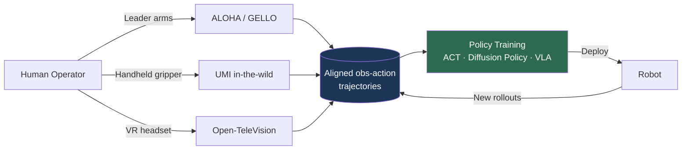

# Robot Data & Teleoperation

> **Last Updated:** June 2026
> **Level:** Advanced
> **Related Sections:**
> - [Cross-Embodiment Learning](./04_cross_embodiment.md)
> - [VLA Models](./01_vla_models.md)
> - [Simulation and Data](./05_simulation_and_data.md)
> - [Pros, Cons & Roadmaps](./07_pros_cons_roadmaps.md)

---

## Overview

The central bottleneck in contemporary robot learning is not architecture but **data**. Unlike language and vision—where the Internet supplies effectively unlimited text and image-caption pairs—robot action data must be physically generated, one trajectory at a time, on real or simulated hardware. The defining strategic question of the 2024–2026 era is therefore how to collect, aggregate, and amortize embodied interaction data at a scale comparable to the corpora that produced GPT-class language models and CLIP-class vision encoders. Every VLA discussed in [VLA Models](./01_vla_models.md) is ultimately a function of the data pipeline that fed it.

Robot data exists on a spectrum of *embodiment fidelity* and *collection cost*. At one extreme, **passive human video** (Ego4D, EPIC-KITCHENS) is abundant and cheap but lacks action labels and the precise proprioceptive grounding a policy needs. At the other extreme, **on-robot teleoperation** yields perfectly aligned observation-action trajectories but is expensive, slow, and embodiment-specific. Between these poles sit a growing set of **portable data-collection devices** (UMI's handheld gripper, GELLO's kinematic twin) that decouple demonstration collection from the robot itself, and **simulation** (covered in [Simulation and Data](./05_simulation_and_data.md)) that trades physical realism for throughput.

This file surveys the teleoperation systems and datasets that constitute the modern robot-data ecosystem, the empirical scaling laws emerging from imitation learning, and the unresolved economic and technical tensions—chief among them the *action-label gap* between human video and robot control, and the question of whether robot data collection can ever become a self-reinforcing flywheel rather than a linear cost.

---

## Teleoperation Systems

Teleoperation is the dominant source of high-quality robot demonstration data. The design axis that matters is the **operator-to-robot mapping**: how human intent is transduced into robot joint or end-effector commands.

### Leader–Follower (Kinematic) Teleoperation

**ALOHA** [Zhao2023] (*A Low-cost Open-source Hardware System for Bimanual Teleoperation*, RSS 2023) established the template for low-cost bimanual data collection. Operators backdrive two leader arms whose joint positions are mirrored onto two follower arms, enabling fine-grained tasks such as threading a zip tie or slotting a battery. The companion algorithm, **Action Chunking with Transformers (ACT)**, predicts chunks of future actions rather than single steps, mitigating the compounding-error problem of step-wise behavior cloning. The full system cost ≈ \$20,000. **Mobile ALOHA** [Fu2024] (CoRL 2024) added a wheeled base and whole-body teleoperation (≈ \$32,000), and demonstrated that **co-training with static ALOHA data boosts mobile-task success by up to 90% with only 50 demonstrations per task**—an early, concrete instance of data co-training paying off.

**GELLO** [Wu2023] (IROS 2024) builds a low-cost leader controller with the *same kinematic structure* as the target arm using 3D-printed parts and inexpensive Dynamixel servos, giving intuitive joint-space mirroring that generalizes across arm types without per-arm redesign.

### Portable / In-the-Wild Collection

The key innovation of 2024 was decoupling data collection from the robot. **UMI (Universal Manipulation Interface)** [Chi2024] (RSS 2024, Best Systems Paper finalist) is a handheld gripper with a wrist-mounted GoPro that records demonstrations *in the wild*—no robot present. Two techniques make the data deployable: **inference-time latency matching** and a **relative-trajectory action representation** that is hardware-agnostic. Policies trained purely on handheld data transfer **zero-shot** across multiple robot platforms, unlocking dynamic, bimanual, and long-horizon behaviors.

### Immersive / VR Teleoperation

**Open-TeleVision** [Cheng2024] (CoRL 2024) uses an Apple Vision Pro to give the operator immersive, first-person stereoscopic feedback from the robot's perspective, validated on long-horizon precise tasks (can sorting/insertion, folding) across two humanoid platforms. The broader trend—VR headsets as teleoperation front-ends—is now standard for humanoid data collection because it captures whole-body, dexterous intent that joystick or leader-arm rigs cannot.



---

## Datasets

| Dataset | Trajectories | Embodiments | Salient property |
|---------|-------------|-------------|------------------|
| **Open X-Embodiment** [OXE2023] | 1M+ | 22 | 60 pooled datasets, 34 labs; standard VLA pre-training corpus |
| **DROID** [Khazatsky2024] | 76,000 (~350 h) | 1 (Franka) | 564 scenes, 52 buildings, 13 institutions, in-the-wild |
| **BridgeData V2** [Walke2023] | 60,096 | 1 (WidowX) | 24 environments; open-vocab, goal-image/language conditioned |
| **RH20T** [Fang2023] | 110,000+ | multi | Contact-rich; vision + force + audio + action; one-shot focus |
| **RoboMIND** [Wu2024] | 107,000 | 4 | 479 tasks, 96 object classes; includes 5,000 annotated failures |

**Open X-Embodiment (OXE)** [OXE2023] is the keystone aggregation effort: ~1M+ trajectories spanning 22 embodiments and 527 skills, pooled from 60 existing datasets across 34 labs. Its central empirical finding—that cross-embodiment co-training improves performance *even on the source embodiment*—is the foundation of the cross-embodiment paradigm (see [Cross-Embodiment Learning](./04_cross_embodiment.md)). **DROID** [Khazatsky2024] standardized the hardware stack (Franka Panda + dual ZED stereo + ZED Mini wrist camera + Oculus Quest teleop) so that 50 collectors across 13 institutions could contribute interoperable data—76,000 trajectories across 564 real-world scenes, the most scene-diverse manipulation dataset to date.

### Human Video as a Data Source

**Ego4D** [Grauman2022] (CVPR 2022, 3,670 hours, 931 participants, 74 locations) and **EPIC-KITCHENS-100** [Damen2022] (IJCV 2022, 97 verbs × 300 nouns) are not robot datasets but are increasingly used to pre-train visual encoders for manipulation. Encoders pre-trained on Ego4D hand-object interaction segments reportedly transfer to manipulation **20–40% better than ImageNet-pretrained encoders** on downstream success rate, motivating their use in VLA pre-training pipelines. The catch is the **action-label gap**: human video contains rich physical priors (contact, affordance, object dynamics) but no robot action labels, so it can pre-train *representations* but not directly supervise *control*. Bridging this gap—via latent action models (Genie-style, see [World Models](./02_world_models.md)), inverse dynamics, or human-to-robot retargeting—is one of the most active research directions of 2025–2026.

---

## Data Scaling Laws for Robots

The most consequential empirical result of this subfield is that imitation learning appears to obey **scaling laws** analogous to those in language. *Data Scaling Laws in Imitation Learning for Robotic Manipulation* [Lin2024] (ICLR 2025; CoRL 2024 X-Embodiment Workshop Best Paper) reports a **log-linear relationship between the number of demonstrations and the logit of success rate**, holding across multiple tasks and architectures:

```
logit(success) ≈ a · log(N_demos) + b
  where logit(p) = log(p / (1 - p))
```

With sufficient data diversity (across objects and environments), single-task policies were observed to **zero-shot generalize to any object within a category in any environment**. The principal caveat: the strongest results were obtained in controlled/simulated settings, and real-world replication at scale remains ongoing. A complementary meta-analysis, *Neural Scaling Laws for Embodied AI* [Sartor2024], surveys 327 papers and finds power-law coefficients for robot foundation models closely matching those of CV/NLP models—evidence that the "bitter lesson" may extend to robotics, a debate developed in [Pros, Cons & Roadmaps](./07_pros_cons_roadmaps.md).

---

## Key Papers

| Paper | Authors | Year | Venue | Key Contribution |
|-------|---------|------|-------|-----------------|
| Learning Fine-Grained Bimanual Manipulation with Low-Cost Hardware (ALOHA/ACT) | Zhao, Kumar, Levine, Finn | 2023 | RSS | \$20k bimanual teleop + action chunking transformer |
| Mobile ALOHA | Fu, Zhao, Finn | 2024 | CoRL | Whole-body mobile teleop; static-data co-training +90% |
| Universal Manipulation Interface (UMI) | Chi, Xu, Pan, Cousineau, Burchfiel, Feng, Tedrake, Song | 2024 | RSS | Handheld in-the-wild collection; zero-shot HW transfer |
| DROID | Khazatsky, Pertsch, Nair, et al. | 2024 | RSS | 76k-trajectory, 564-scene standardized dataset |
| Open X-Embodiment | OXE Collaboration | 2023 | arXiv→ICRA 2024 | 1M+ traj, 22 embodiments; cross-embodiment transfer |
| BridgeData V2 | Walke, Black, Lee, Kim, et al. | 2023 | CoRL | 60k traj, language/goal-image conditioned at scale |
| Data Scaling Laws in Imitation Learning | Lin, Hu, Sheng, Wen, You, Gao | 2024 | ICLR 2025 | Log-linear demo-count → success-logit scaling law |

---

## Benchmark Performance

| Result | Dataset/Setting | Metric | Value | Notes |
|--------|-----------------|--------|-------|-------|
| Mobile ALOHA co-training | Mobile tasks | Success uplift | up to +90% | Only 50 demos/task with static co-training [Fu2024] |
| Ego4D-pretrained encoder | Manipulation transfer | Success rate | +20–40% vs ImageNet | Reported across manipulation benchmarks |
| Data scaling | Multi-task IL | logit(success) | log-linear in N_demos | Mostly sim/controlled; real-world ongoing [Lin2024] |
| DROID scale | Real-world | Scenes / trajectories | 564 / 76,000 | 13 institutions, 52 buildings [Khazatsky2024] |

---

## Pros & Cons

| Aspect | Pros | Cons |
|--------|------|------|
| On-robot teleoperation | Perfectly aligned obs-action data; high fidelity | Expensive (~\$2M+ for a DROID-scale set); embodiment-specific; slow |
| Portable collection (UMI/GELLO) | Cheap, fast, in-the-wild; HW-agnostic | Lacks robot proprioception; embodiment-gap at deploy time |
| Human video (Ego4D/EPIC) | Internet-scale, free, rich physical priors | No action labels (action-label gap); domain/viewpoint shift |
| Aggregation (OXE) | Cross-embodiment transfer; reusable corpus | Heterogeneous action/observation spaces require normalization |

---

## Open Problems & Research Gaps

- **The action-label gap.** No general method yet reliably converts passive human video into robot-executable action supervision; latent action models and inverse-dynamics approaches are promising but domain-specific.
- **Data normalization across embodiments.** OXE pools 22 embodiments with incompatible action spaces; principled, lossless normalization (beyond per-dataset rescaling) remains unsolved—see [Cross-Embodiment Learning](./04_cross_embodiment.md).
- **Real-world validation of scaling laws.** The log-linear scaling of [Lin2024] is strongest in controlled settings; whether it holds for contact-rich, long-horizon real tasks is unverified.
- **Quality vs. quantity.** It is unclear how demonstration *quality*, diversity, and curation trade against raw count—the robotics analogue of the DataComp/MetaCLIP debate in vision.
- **The data flywheel question.** Whether deployed-robot data can become self-reinforcing (Tesla-FSD-style) or remains a linear human-labor cost is the central economic uncertainty of the field.
- **Failure data and recovery.** Most datasets contain only successes; RoboMIND's 5,000 annotated failures hint that failure/recovery data may be disproportionately valuable but is rarely collected.
- **Tactile and force data.** Vision-heavy datasets under-represent contact dynamics; scalable collection of aligned force/tactile streams (see [Perception for Robotics](./08_perception_for_robotics.md)) is immature.

---

## Further Reading

- [Open X-Embodiment (arXiv:2310.08864)](https://arxiv.org/abs/2310.08864) — the canonical cross-embodiment dataset & RT-X models
- [DROID dataset & paper (arXiv:2403.12945)](https://arxiv.org/abs/2403.12945) — standardized in-the-wild collection
- [UMI: Universal Manipulation Interface (arXiv:2402.10329)](https://arxiv.org/abs/2402.10329) — handheld in-the-wild data
- [ALOHA / ACT (arXiv:2304.13705)](https://arxiv.org/abs/2304.13705) — low-cost bimanual teleoperation
- [Data Scaling Laws in Imitation Learning (arXiv:2410.18647)](https://arxiv.org/abs/2410.18647) — empirical scaling behavior
- [Ego4D (CVPR 2022)](https://ego4d-data.org/) — egocentric video as a manipulation prior
