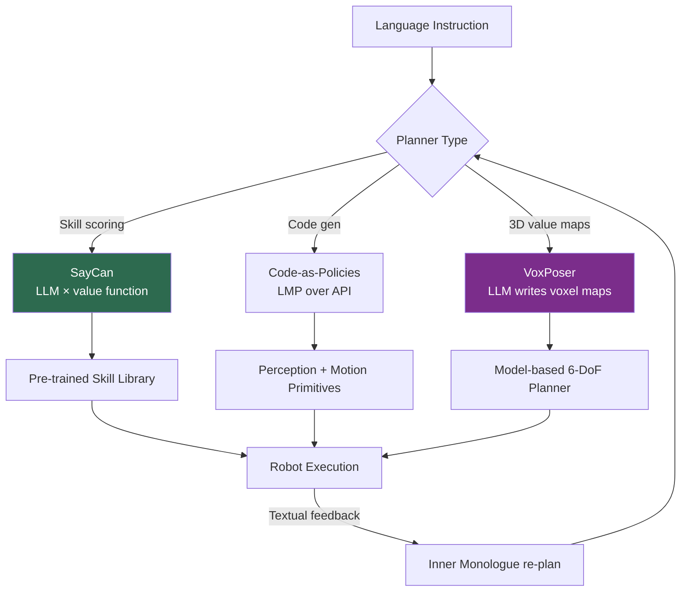

# Language-Conditioned Control

> **Last Updated:** June 2026
> **Level:** Advanced
> **Related Sections:**
> - [VLA Models](./01_vla_models.md)
> - [Generalist vs. Specialist](./11_generalist_vs_specialist.md)
> - [Robot Data & Teleoperation](./09_robot_data_and_teleoperation.md)
> - [Large Vision-Language Models](../05_multimodal_vision_language/02_large_vision_language_models.md)

---

## Overview

Language-conditioned control is the problem of mapping a natural-language instruction, together with sensory observations, to robot actions that accomplish the instruction. It sits at the intersection of grounding (linking words to perceptual and physical referents), planning (decomposing abstract goals into executable steps), and control (producing motor commands). The field bifurcated around 2022 into two architectural families that remain in tension today: **modular LLM-as-planner** systems, which use a frozen language model to sequence pre-trained skills or generate code, and **end-to-end VLAs**, which fold language understanding and action generation into a single differentiable network (treated in depth in [VLA Models](./01_vla_models.md)).

The modular line is motivated by a simple observation: large language models possess vast commonsense and procedural knowledge ("to make coffee, first find a mug") but no grounding in a specific robot's affordances or physical state. The engineering problem is therefore *grounding the planner*—constraining the LLM's fluent but physically naive proposals to actions the robot can actually execute. Different systems solve this differently: **SayCan** scores proposals by a learned value function; **Code-as-Policies** has the LLM emit executable programs over a perception/motion API; **Inner Monologue** closes the loop with textual environment feedback; **VoxPoser** has the LLM synthesize 3D value maps that a classical planner optimizes. This file surveys these systems, their grounding mechanisms, and their relationship to the end-to-end VLA paradigm with which they now compete and increasingly converge.

A unifying lens is the **slow-reasoning / fast-control split**: LLM planners operate at seconds-per-decision latency and are unsuitable for reactive control, so they invariably delegate low-level execution to faster learned or scripted primitives. This is the conceptual ancestor of the dual-system VLA architectures (GR00T N1, Helix) discussed in [Generalist vs. Specialist](./11_generalist_vs_specialist.md).

---

## Modular LLM-as-Planner Systems

### Affordance Grounding: SayCan

**SayCan** [Ahn2022] (*Do As I Can, Not As I Say*, CoRL 2022) is the seminal grounding mechanism. An LLM (PaLM-540B) proposes candidate next skills and scores each for *semantic plausibility* given the instruction; a separately learned **value function** scores each for *physical feasibility* given the current state. The executed skill maximizes the product:

```
score(skill) = p_LLM(skill | instruction) · p_affordance(skill | state)
a* = argmax_skill  p_LLM(skill | instruction) · p_affordance(skill | state)
```

On 101 long-horizon kitchen tasks, PaLM-SayCan achieved **84% plan-success and 74% end-to-end execution-success**. The key insight—multiplying a "say" term (what is sensible) by a "can" term (what is possible)—remains the canonical formulation of LLM grounding.

### Programs as Policies: Code-as-Policies

**Code-as-Policies** [Liang2022] (ICRA 2023) reframes the planner output as *executable code*. A code-writing LLM generates Language Model Programs (LMPs) that call perception and motion primitives (`get_obj_pos`, `move_to`, `pick`, `place`), with loops, conditionals, and recursive definition of undefined functions (hierarchical code generation). The resulting policies are **interpretable and auditable**—the control flow is explicit Python—and can express spatial reasoning and iteration that token-prediction policies cannot. Code generation is a one-time ~5–30 s cost at task onset; thereafter the program runs at primitive speed.

### Closed-Loop Feedback: Inner Monologue

**Inner Monologue** [Huang2022a] (CoRL 2022) augments LLM planning with closed-loop textual feedback from three sources: success detectors, passive scene descriptors, and active question-answering. Injecting this feedback back into the LLM prompt lets the planner **re-plan dynamically**, substantially improving instruction completion across tabletop, kitchen, and navigation domains. It established that LLMs can act as adaptive controllers *if* given rich structured environment feedback in language.

### 3D Value Maps: VoxPoser

**VoxPoser** [Huang2023] (CoRL 2023) eliminates the pre-defined-primitive bottleneck. An LLM infers affordances and constraints from the instruction and writes code that queries a VLM to compose **3D voxel value maps** (affordance + constraint fields) over the robot workspace. A model-based planner then **zero-shot synthesizes closed-loop 6-DoF trajectories** from these maps—handling open-set instructions and objects with no task-specific training.



---

## Language-Conditioned Imitation Learning

In parallel with LLM planners, a line of work conditions *low-level* imitation policies directly on language. **CLIPort** [Shridhar2021] (CoRL 2021) fuses CLIP's semantic "what" pathway with Transporter Networks' spatial "where" pathway in a two-stream architecture, learning language-conditioned pick-and-place end-to-end without explicit object poses or segmentation; a single multi-task policy covers 10 simulated + 9 real tasks. **BC-Z** [Jang2022] (CoRL 2022) conditions on pre-trained embeddings of language *or* human-video demonstrations and learns from demonstrations plus interventions, achieving **44% average success on 24 unseen zero-shot tasks**. **PaLM-E** [Driess2023] (ICML 2023, up to 562B parameters) interleaves images, continuous state, and text into "multimodal sentences," showing positive transfer between embodied and non-embodied tasks and emergent multi-step reasoning—a direct precursor to RT-2 and the modern VLA. These systems blur the modular/end-to-end boundary: language conditioning is learned, but control is still a single network, foreshadowing the VLA convergence in [VLA Models](./01_vla_models.md).

---

## Key Papers

| Paper | Authors | Year | Venue | Key Contribution |
|-------|---------|------|-------|-----------------|
| Do As I Can, Not As I Say (SayCan) | Ahn, Brohan, Brown, et al. | 2022 | CoRL | Affordance grounding: LLM × value function; 74% exec on 101 tasks |
| Code as Policies | Liang, Huang, Xia, Xu, Hausman, Ichter, Florence, Zeng | 2022 | ICRA 2023 | LLM emits hierarchical executable robot programs |
| Inner Monologue | Huang, Xia, Xiao, et al. | 2022 | CoRL | Closed-loop textual feedback enables LLM re-planning |
| VoxPoser | Huang, Wang, Zhang, Li, Wu, Fei-Fei | 2023 | CoRL | LLM-composed 3D value maps → zero-shot 6-DoF trajectories |
| CLIPort | Shridhar, Manuelli, Fox | 2021 | CoRL | CLIP "what" + Transporter "where" for language pick-and-place |
| PaLM-E | Driess, Xia, Sajjadi, et al. | 2023 | ICML | 562B embodied multimodal LM; multimodal-sentence planning |
| BC-Z | Jang, Irpan, Khansari, et al. | 2022 | CoRL | Language/video-conditioned IL; 44% on 24 unseen tasks |

---

## Benchmark Performance

| System | Setting | Metric | Score | Notes |
|--------|---------|--------|-------|-------|
| PaLM-SayCan | 101 kitchen tasks | Plan / Exec success | 84% / 74% | Long-horizon mobile manipulation [Ahn2022] |
| BC-Z | 24 unseen tasks | Zero-shot success | 44% | Language/video conditioned [Jang2022] |
| CLIPort | 10 sim + 9 real tasks | Multi-task success | matches/exceeds single-task | Two-stream what/where [Shridhar2021] |
| VoxPoser | Open-set tabletop | Zero-shot trajectory synthesis | qualitative SOTA | No task-specific training [Huang2023] |

---

## Pros & Cons

| Aspect | Pros | Cons |
|--------|------|------|
| LLM-as-planner (SayCan/CaP) | Interpretable, leverages web commonsense, compositional | Seconds-per-decision latency; limited by primitive/skill library |
| Closed-loop feedback (Inner Monologue) | Adaptive re-planning; robust to failures | Requires reliable success detectors / scene describers |
| 3D value maps (VoxPoser) | Open-set, no task data, true 6-DoF | Depends on VLM spatial accuracy; planner brittleness |
| Language-conditioned IL (CLIPort/PaLM-E) | End-to-end, fast at inference | Needs paired language-action data; weaker compositional generalization |

---

## Open Problems & Research Gaps

- **Grounding without value functions.** SayCan needs a learned affordance model per skill; scalable, skill-agnostic grounding remains open.
- **Spatial language.** LLM/VLM planners systematically fail on relational spatial instructions (left/right, behind, between)—the spatial-intelligence gap detailed in [Spatial Intelligence](../12_research_frontier_2024_2026/06_spatial_intelligence.md).
- **Latency for reactive language control.** Planner latency (100 ms–2 s) precludes language-in-the-loop reactive control; the dual-system split is a workaround, not a solution.
- **Compositional generalization.** Following *novel compositions* of known instructions ("put the third red block on the leftmost shelf") is still fragile.
- **Primitive bottleneck vs. end-to-end brittleness.** Modular systems are limited by their primitives; end-to-end systems lack interpretability—no architecture yet has both auditability and dexterity.
- **Verification of LLM-generated plans/code.** No reliable method certifies that an LLM-emitted plan or program is safe before execution.
- **Instruction ambiguity and intent.** Specifying human intent precisely enough for safe generalization (see [Future Trends](../12_research_frontier_2024_2026/07_future_trends.md)) is unsolved.

---

## Further Reading

- [SayCan (arXiv:2204.01691)](https://arxiv.org/abs/2204.01691) — affordance-grounded LLM planning
- [Code as Policies (arXiv:2209.07753)](https://arxiv.org/abs/2209.07753) — LLM programs for embodied control
- [Inner Monologue (arXiv:2207.05608)](https://arxiv.org/abs/2207.05608) — closed-loop language feedback
- [VoxPoser (arXiv:2307.05973)](https://arxiv.org/abs/2307.05973) — composable 3D value maps
- [PaLM-E (arXiv:2303.03378)](https://arxiv.org/abs/2303.03378) — embodied multimodal language model
- [CLIPort (arXiv:2109.12098)](https://arxiv.org/abs/2109.12098) — what/where pathways for manipulation
