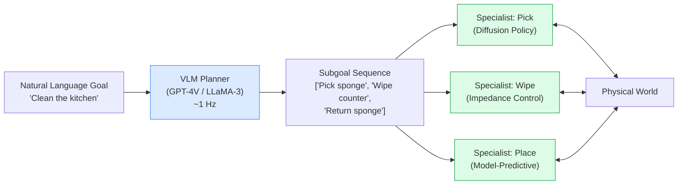

# Generalist vs. Specialist Robot Policies

> **Last Updated:** June 2026
> **Level:** Research Frontier
> **Related Sections:**
> - [../05_multimodal_vision_language/](../05_multimodal_vision_language/) — VLM foundations underpinning VLA models
> - [../12_research_frontier_2024_2026/07_future_trends.md](../12_research_frontier_2024_2026/07_future_trends.md) — Forward-looking embodied AI research agenda
> - [../04_3d_vision_and_scene/](../04_3d_vision_and_scene/) — 3D scene understanding for robot perception
> - [../09_efficiency_and_deployment/](../09_efficiency_and_deployment/) — Edge inference relevant to on-robot deployment

---

## Overview

One of the deepest open debates in embodied AI is architectural: should a robot be controlled by a single large "robot GPT" trained on all available data, or by a modular pipeline of specialist components each optimized for its particular subtask? The question mirrors debates from NLP (BERT/GPT versus ensemble methods), but with a critical physical twist — robots must act in real time, respect hard physical constraints, and fail safely in ways that text generators do not. Neither camp has won decisively as of mid-2026, and the emergent consensus is a *dual-system* or *hierarchical* hybrid that tries to capture the best of both paradigms.

This section structures the debate as an intellectual confrontation, surveys the strongest evidence on each side, and describes the hybrid architectures that are currently attracting the most investment from both academia and industry.

---

## The Case for Generalist Policies (Vision-Language-Action Models)

### Core Argument

The NLP analogy is the generalist camp's most compelling argument: GPT-style pre-training on internet-scale data, followed by fine-tuning, produced capabilities no task-specific system could match. VLA (Vision-Language-Action) models attempt the same program for robotics — pre-train a large transformer jointly on web images/video/text and robot demonstration data, then fine-tune for specific deployments.

**Key proponents:** Sergey Levine (BAIR/Physical Intelligence), Chelsea Finn (Stanford/Physical Intelligence), Pieter Abbeel (UC Berkeley/Covariant).

### Emergent Cross-Task Generalization

RT-2 [Zitkovich2023] demonstrated that a model pre-trained on internet data could execute novel instructions never seen in robot training — e.g., picking up an object described as "something that could be used as a hammer" — by drawing on semantic knowledge from web pre-training. In evaluation across 6,000 trials, RT-2-X (55B parameters, trained on Open X-Embodiment) achieved a 3× improvement in emergent-skill success over RT-1-X. The Open X-Embodiment dataset [Collaboration2023] assembled demonstrations from 22 different robots across 33 academic labs, spanning 527 skills, and showed that cross-embodiment training yields meaningful transfer: RT-1-X trained on all robots improved ~50% over a model trained only on a single robot's data.

OpenVLA [Kim2024], a 7B-parameter open-source VLA trained on 970,000 trajectories from Open X-Embodiment, outperformed RT-2-X (55B parameters) by 16.5% absolute success rate across 29 tasks, demonstrating that well-designed smaller generalists can beat much larger closed systems — echoing the Chinchilla finding in NLP that data-efficiency matters as much as scale.

### Web Pre-Training as a Force Multiplier

The key claim is that internet-scale pre-training gives robots commonsense physics, object semantics, and linguistic grounding that would be impossible to encode from robot data alone. π₀ [Black2024] from Physical Intelligence used a PaliGemma-2B backbone pre-trained on web data, combined with flow matching action generation, and trained on over 10,000 hours of in-house demonstration data across 68 tasks and 7 robot configurations. The resulting model demonstrated significantly better generalization to novel household tasks compared to models trained only on robot data.

### Simpler End-to-End Design

A single differentiable graph from perception to action allows gradients to flow through the entire system, which is architecturally elegant and removes the need to hand-engineer intermediate representations. The full system can be fine-tuned jointly on new task data, whereas modular systems face the "interface engineering" problem — one module's output format must match the next module's expected input.

### The NLP Scaling Precedent

```
Observation: In NLP, task-specific models (BERT fine-tuned per-task)
were eventually dominated by generalist GPT-style models.

Hypothesis: With sufficient data and scale, robot policies will follow
the same trajectory — a single large policy θ* will generalize better
than N specialized policies {θ_1, ..., θ_N}.
```

The relevant scaling question (see Section "The Chinchilla Question for Robotics" below) is whether this hypothesis holds given the physical constraints on robot data collection.

---

## The Case for Modular Specialist Systems

### Core Argument

Physical systems have hard constraints that language tokens do not. A sentence that is grammatically awkward is merely inelegant; a robot arm that exceeds its torque limits destroys itself. Modularity allows each component to be verified, bounded, and replaced independently.

**Key proponents:** Russ Tedrake (MIT/TRI), Dieter Fox (NVIDIA/UW), Marc Toussaint (TU Berlin).

### Physical Constraints Are Not in LLM Weights

Robot control requires:

```
Joint position:    q ∈ ℝ^n
Joint velocity:    q̇ ∈ ℝ^n,  ‖q̇‖ ≤ v_max
Joint torques:     τ = M(q)q̈ + C(q,q̇)q̇ + g(q)
Contact forces:    λ ∈ K   (friction cone constraint)
```

These constraints govern every motion a robot makes, yet they are nowhere in the training distribution of a language model pre-trained on internet text and images. A specialist low-level controller designed using model-based robotics (e.g., Drake [Tedrake2019]) can provide hard guarantees on these quantities; a VLA inference call cannot.

Marc Toussaint's work on factored task-and-motion planning [Toussaint2024] shows that when tasks can be decomposed into subproblems with known structure (geometric constraints, kinematics, logic preconditions), optimization-based planners achieve dramatically better sample efficiency and formal correctness guarantees than end-to-end learned policies.

### Control Loop Latency Is Incompatible with LLM Inference

High-performance robot control loops operate at:

| Control type | Typical frequency | Required latency |
|---|---|---|
| Force/impedance control | 1–4 kHz | 0.25–1 ms |
| Joint-level servo | 250–500 Hz | 2–4 ms |
| Cartesian control | 100–250 Hz | 4–10 ms |
| Task-level planning | 1–10 Hz | 100–1000 ms |

A 7B-parameter LLM inference call takes 50–200 ms on embedded GPU hardware. Running it in the inner control loop is physically impossible for force control, servo control, or Cartesian control. This is not an engineering limitation to be engineered away — it is a consequence of the physics of feedback control. Fast disturbance rejection (e.g., not dropping a glass when someone bumps the robot) requires kilohertz-rate feedback that no LLM can provide.

### Safety and Interpretability

In manufacturing and healthcare applications, a regulator or customer may require:
- Formal proofs that the robot cannot reach a forbidden region of configuration space
- Explanation of why a specific action was chosen
- Independent auditing of the planning logic

Modular pipelines support all three. A single neural network policy is opaque by construction. Russ Tedrake's Drake toolbox provides Lyapunov-based stability certificates and reachability analysis that are only meaningful if the control system is separated from the perception system. When the two are fused into a single network, the mathematical machinery of control theory becomes inapplicable.

### Sample Efficiency

Training a VLA from scratch on a new task typically requires thousands to tens of thousands of demonstrations. Specialist approaches (imitation learning + model-based refinement) routinely achieve expert performance with 50–200 demonstrations. For deployment in facilities where robot data collection is expensive or dangerous (e.g., surgical suites, nuclear environments), this is not a minor academic distinction.

---

## Hybrid Middle Ground: Dual-System and Hierarchical Architectures

The architectures attracting the most engineering investment in 2024–2026 are hybrids that assign fast, safety-critical, physically-grounded computation to a specialist module, and slow, language-grounded, semantic reasoning to a large model.

### The Dual-System Architecture

Inspired by Kahneman's System 1/System 2 framework from cognitive science:

```mermaid
graph TD
    subgraph Slow ["System 2 — Slow (VLM / LLM)"]
        S2[Vision-Language Model\n7B–70B params\n100ms inference\nScene understanding\nTask planning\nLanguage grounding]
    end

    subgraph Fast ["System 1 — Fast (Reactive Policy)"]
        S1[Visuo-Motor Controller\n10M–200M params\n5ms inference\nJoint-level control\nForce/impedance\nReactive correction]
    end

    subgraph Env ["Environment"]
        CAM[RGB Camera(s)]
        PROP[Proprioception\n(joint angles, torques)]
        ACT[Actuators]
    end

    CAM -->|High-res image| S2
    CAM -->|Current frame| S1
    PROP --> S1
    S2 -->|Semantic goal / subgoal tokens| S1
    S1 -->|Motor commands @ 200Hz| ACT
    ACT -->|State feedback| PROP

    style Slow fill:#dbeafe,stroke:#3b82f6
    style Fast fill:#dcfce7,stroke:#16a34a
    style Env fill:#fef9c3,stroke:#ca8a04
```

### Deployed Dual-System Implementations

**GR00T N1** [NVIDIA2025]: Released March 2025. System 2 is a 1.34B-parameter VLM; System 1 is a fast reactive policy. Total 2.2B parameters. Samples 16 actions in 63.9 ms on L40 GPU. Trained on 780,000 synthetic + real trajectories across Fourier GR-1 and 1X humanoid embodiments. Outperforms SOTA imitation learning baselines on simulation benchmarks across multiple embodiments.

**Helix** [Figure2025]: Developed by Figure AI, released February 2025. System 2 is a 7B-parameter VLM operating at 7–9 Hz; System 1 is an 80M-parameter visuo-motor controller at 200 Hz. Both run on onboard embedded GPUs with no cloud dependency. Demonstrated full 8-hour autonomous manufacturing shifts as of May 2026.

**π₀** [Black2024]: Physical Intelligence's generalist policy uses flow matching (continuous normalizing flow) as the action head, with PaliGemma as the language backbone. π₀-FAST [PhysicalIntelligence2024] further accelerates action generation using DCT-space (FAST) tokenization, achieving 7× compression of action sequences and 5× faster training convergence.

### Hierarchical Control

An alternative framing treats the large model as a task planner that decomposes goals into subgoals, each executed by a specialist:



In this framing the LLM is explicitly *not* a motor controller — it is an interface between language and a library of verified specialist skills. Toussaint's factored TAMP [Toussaint2024] formalizes this as a factor graph over task-mode variables, with specialist controllers handling each mode.

---

## The Chinchilla Question for Robotics

The NLP community's "Chinchilla" finding [Hoffmann2022] showed that most large language models were significantly *undertrained* relative to their parameter count — optimal compute allocation requires far more data than was used. This raises the key scaling question for robotics:

> **Do robot policies follow LLM-style scaling laws, and if so, what is the optimal data-to-parameter ratio?**

**Evidence for scaling laws in robot data:**
- RT-1-X → RT-2-X: adding cross-embodiment pre-training yielded ~50% improvement in success rates on held-out tasks [Collaboration2023]
- OpenVLA trained on 10× more data than RT-2 fine-tuning data, achieving better generalization with 7× fewer parameters [Kim2024]
- Generalist AI's GEN-0 reports first empirical scaling curves for robot manipulation, trained on 270,000 hours of data from 1,000s of real environments [GeneralistAI2025]

**Counter-evidence (the "robot data is different" argument):**

```
LLM data characteristics:
  Source: Internet text (scrapeable, free, near-infinite)
  Collection cost: ~$0 per token
  Diversity: All of human written knowledge
  Scale: ~10^13 tokens feasibly available

Robot data characteristics:
  Source: Physical robot demonstrations (requires hardware + time)
  Collection cost: ~$1–100 per trajectory
  Diversity: Limited by lab environments and robot morphologies
  Scale: ~10^7 trajectories feasibly available (Open X-Embodiment ~10^6)
```

The conclusion is that robot policies *do* show scaling improvements with data, but the data ceiling is orders of magnitude lower than for LLMs. This makes the generalist vs. specialist question fundamentally about how to allocate scarce data — a question that pure scaling cannot resolve.

**Simulation as a partial solution:** Genesis [Genesis2024] (43M FPS on a single RTX 4090, 430,000× faster than real-time) and Isaac Lab [NVIDIA2024] attempt to bridge the data gap by generating synthetic trajectories. NVIDIA generated 780,000 synthetic trajectories (equivalent of 9 months of human demonstrations) in 11 hours for GR00T N1 training, improving performance by 40% over real-data-only training [NVIDIA2025].

---

## Key Papers

| Paper | Authors | Year | Venue | Key Contribution |
|---|---|---|---|---|
| RT-2: Vision-Language-Action Models Transfer Web Knowledge | Zitkovich et al. (Google DeepMind) | 2023 | CoRL | First large-scale VLA; web pre-training → robot emergent skills; 6,000-trial eval |
| Open X-Embodiment: Robotic Learning Datasets and RT-X Models | Open X-Embodiment Collaboration (33 institutions) | 2023 | CoRL Workshop / ICRA 2024 | 22 robots, 527 skills, cross-embodiment scaling laws; RT-1-X +50% |
| OpenVLA: An Open-Source Vision-Language-Action Model | Kim, Pertsch, Karamcheti et al. | 2024 | arXiv / CoRL 2024 | 7B VLA on OXE; outperforms RT-2-X (55B) by 16.5% at 7× fewer params |
| π₀: A Vision-Language-Action Flow Model for General Robot Control | Black, Brown, Driess, Finn, Levine et al. | 2024 | arXiv | Flow matching action head; 68 tasks, 7 robot configs; 10k+ demo hours |
| GR00T N1: An Open Foundation Model for Generalist Humanoid Robots | NVIDIA Research (Fox et al.) | 2025 | arXiv | Dual-system 2.2B VLA; 780k synthetic trajectories; 63.9 ms inference on L40 |
| Octo: An Open-Source Generalist Robot Policy | Ghosh et al. (Berkeley, Stanford, CMU, Google DeepMind) | 2024 | RSS 2024 | 93M transformer-diffusion policy; 800k episodes; modular observation heads |
| Factored Task and Motion Planning with Combined Optimization, Sampling and Learning | Toussaint et al. | 2024 | ICRA 2024 | Factor-graph TAMP; specialist controllers per logic mode; formal guarantees |
| Helix: A Vision-Language-Action Model for Generalist Humanoid Control | Figure AI | 2025 | Technical Report | 7B S2 + 80M S1; 200 Hz reactive; no cloud; full 8-hour autonomous shifts |

---

## Benchmark Performance

| Model | Dataset / Eval | Metric | Score | Notes |
|---|---|---|---|---|
| RT-2-X (55B) | Open X-Embodiment emergent tasks | Success rate | ~62% emergent | 6,000 trials; emergent = tasks in LLM pretraining not robot data |
| RT-1-X | Open X-Embodiment | Success rate | ~50% relative improvement over single-robot RT-1 | Cross-embodiment training |
| OpenVLA (7B) | 29 tasks, multiple embodiments | Absolute success rate | 16.5% higher than RT-2-X | 7B vs. 55B; BridgeData V2 and Google Robot |
| Octo-Base (93M) | Language-conditioned manipulation | vs. RT-2-X | Comparable on language tasks | 800k training episodes |
| GR00T N1 (2.2B) | Fourier GR-1 + 1X humanoid tasks | vs. SOTA IL | Outperforms SOTA simulation benchmarks | 40% improvement from +synthetic data |
| π₀ | 9 benchmark categories, 5 embodiments | Task completion | State-of-the-art on deformable + long-horizon manipulation | Flow matching; 10k+ demo hours |
| Helix (Figure AI) | Factory manipulation | Deployment | 8-hour autonomous shifts | 200 Hz System 1; 7–9 Hz System 2 |

---

## Pros & Cons

| Aspect | Generalist VLA Pros | Specialist/Modular Pros |
|---|---|---|
| **Generalization** | Zero-shot to novel objects and language instructions via web pre-training; emergent cross-task transfer [Zitkovich2023] | Provable performance guarantees within task domain; no distribution shift from out-of-domain instructions |
| **Data efficiency** | Amortizes data cost across all tasks; pre-training reduces per-task fine-tuning requirement | Requires only ~50–200 demonstrations per task; factor of 100× improvement in sample efficiency for known tasks |
| **Control latency** | Dual-system architectures achieve 5–10 ms for fast path; full-speed LLM call is 50–200 ms which is incompatible with kHz force control | Model-based specialists run at 1–4 kHz with hard timing guarantees; composable with real-time OS schedulers |
| **Safety / verifiability** | Black-box neural network; no formal stability certificates; interpretability research ongoing | Lyapunov functions, reachability analysis, formal verification (Drake) applicable; regulatorily auditable |
| **Maintenance / extensibility** | Single model fine-tuned for new tasks; no interface engineering | New tasks require new specialists and interface specifications; combinatorial explosion with task count |
| **Failure mode** | Hallucination of physically impossible actions; graceful degradation unclear | Brittleness at task boundaries; performance cliff outside trained regime |

---

## Open Problems & Research Gaps

1. **Closing the control frequency gap without losing generality.** The 5 ms System 1 / 100 ms System 2 split in dual-system models remains a pragmatic engineering hack rather than a principled solution. Can System 2 be made to predict physical state well enough that System 1 can extrapolate across a full 100 ms gap without re-querying? Quantifying the compounding error over multi-step extrapolation is an open research problem.

2. **The robot Chinchilla problem.** No work has yet derived principled optimal compute allocation curves for robot policies of the form "given N real demonstrations and M simulation hours, what is the optimal policy size?" The Chinchilla methodology applied to robot data would likely yield qualitatively different results due to data ceiling effects.

3. **Contact physics in learned policies.** Current VLAs learn implicit contact models from demonstrations, which fails catastrophically in novel contact configurations. Embedding differentiable contact simulation (e.g., MJX, Drake) into the VLA's inner loop, or providing contact-aware auxiliary losses, is largely unexplored.

4. **Formal safety specifications from natural language.** Given a natural language safety constraint ("do not move faster than 0.5 m/s near a human"), translating this reliably into a formal constraint enforced at the System 1 level remains an open problem. LTL-based translation approaches [FormalMethods2026] show promise but have not been demonstrated at scale.

5. **Cross-morphology transfer.** Open X-Embodiment shows that training on diverse embodiments helps, but the mechanism of transfer remains poorly understood. A theoretical account of *why* a policy trained on a 6-DOF arm transfers to a 16-DOF humanoid would enable principled data mixing strategies.

6. **Sample efficiency with internet video.** Human internet video (Ego4D, HowTo100M) contains enormous amounts of task-relevant manipulation behavior but lacks action labels. The action label problem — recovering robot-executable actions from unlabeled video — is one of the central bottlenecks to scaling robot data. Latent Action Pre-Training (LAPT) [LAPT2024] is a promising direction but has not yet been demonstrated to match supervised demonstration quality.

7. **Evaluating generalization vs. memorization.** Current benchmarks conflate zero-shot generalization with performance on tasks that appear in pre-training web data. A clean benchmark that tests on tasks verifiably absent from web training distributions is needed to make the VLA generalization argument rigorous.

---

## Further Reading

- [RT-2 Paper (CoRL 2023)](https://proceedings.mlr.press/v229/zitkovich23a/zitkovich23a.pdf) — Original VLA paper with 6,000-trial evaluation
- [Open X-Embodiment arXiv](https://arxiv.org/abs/2310.08864) — Cross-embodiment dataset and RT-X scaling results
- [OpenVLA arXiv](https://arxiv.org/abs/2406.09246) — Open-source 7B VLA beating RT-2-X
- [GR00T N1 arXiv](https://arxiv.org/abs/2503.14734) — NVIDIA's dual-system humanoid foundation model
- [π₀ arXiv](https://arxiv.org/html/2410.24164v1) — Physical Intelligence's flow-matching VLA
- [Russ Tedrake's Underactuated Robotics Course](https://underactuated.csail.mit.edu/) — Canonical reference for model-based robot control theory
