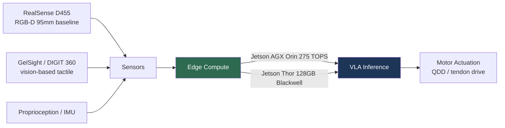

# Hardware & Robot Platforms

> **Last Updated:** June 2026
> **Level:** Advanced
> **Related Sections:**
> - [Embodied AI Overview & Roadmap](./00_overview_roadmap.md)
> - [Perception for Robotics](./08_perception_for_robotics.md)
> - [VLA Models](./01_vla_models.md)
> - [Pros, Cons & Roadmaps](./07_pros_cons_roadmaps.md)

---

## Overview

The 2024–2026 embodied-AI boom is as much a hardware story as an algorithms story. The convergence of low-cost actuators, capable edge compute (Jetson Thor), and vision-language-action models has produced an unprecedented wave of humanoid and manipulator platforms moving from lab curiosity to factory pilot. This file catalogs the hardware substrate on which the policies discussed elsewhere in this section actually run, with verified specifications and explicit disclosure-confidence flags—a necessary discipline because much "spec" data in the trade press is manufacturer marketing or third-party estimate rather than published datasheet.

Three hardware trends dominate. First, the **shift to electric quasi-direct-drive (QDD) actuation**, which trades peak torque for backdrivability, impact tolerance, and transparent force control—properties essential for contact-rich manipulation and safe human proximity. Second, **dexterous multi-fingered hands** (16–24 DoF) becoming standard, since the VLA dexterity frontier (laundry folding, articulated-object manipulation) demands them. Third, **edge compute catching up to model size**: NVIDIA's Jetson Thor (128 GB, Blackwell, up to ~2,070 FP4 TFLOPS) makes on-robot inference of multi-billion-parameter dual-system VLAs feasible, closing the loop between the models in [VLA Models](./01_vla_models.md) and the bodies that execute them.

A recurring theme is the **disclosure gap**: research-grade platforms (Unitree, Franka, Universal Robots) publish full datasheets, while flagship humanoids (Boston Dynamics electric Atlas, Figure 02, Apptronik Apollo) withhold key specs—total DoF, price, actuator detail—behind NDA. Specifications below are flagged accordingly.

---

## Humanoid Platforms

| Robot | Height | Weight | DoF | Payload | Speed | Price | Status (2025–26) |
|-------|--------|--------|-----|---------|-------|-------|------------------|
| Figure 02 | 168 cm | 70 kg | NDA (16/hand) | 25 kg | 1.2 m/s | ~\$150k est. | BMW Spartanburg pilot |
| Tesla Optimus Gen 2 | 173 cm | 57 kg | 28+ body, 11–22/hand | 20 kg | ~2.2 m/s | ~\$20–30k target | Internal Tesla factories |
| Unitree G1 | 127 cm | 35 kg | 43 (w/ hands) | 2–3 kg | 2 m/s | \$13.5k–\$73.9k | Mass production (5,500+ in 2025) |
| Unitree H1 | 180 cm | 47 kg | 19 (H1-2: 27) | 30 kg | 3.3 m/s | \$99.9k | Research / available |
| Boston Dynamics Atlas (electric) | ~150 cm est. | ~89 kg est. | NDA | NDA | NDA | Not for sale | Hyundai / Google DeepMind |
| Agility Digit v5 | 175 cm | 76 kg | 16+ | 16 kg | 1.5 m/s | ~\$250k | GXO warehouse (100k+ totes) |
| Apptronik Apollo | 173 cm | 72.5 kg | NDA | 25 kg | NDA | NDA | Factory pilots |
| Sanctuary Phoenix (Gen 7) | 170 cm | 70 kg | NDA (20–21/hand) | 25 kg | NDA | ~\$65k est. | Retail / mfg pilots |
| Fourier GR-2 | 175 cm | 65 kg | 53 (12/hand) | 3 kg/arm | NDA | ~\$150k+ | Research / enterprise |
| 1X NEO | ~168 cm | ~30 kg | 75 (22/hand) | ~25 kg carry | 1.4 m/s | \$20k / \$499 mo | Pre-order (sold out yr 1) |

**Figure 02** [FigureAI2024] runs the **Helix** VLA (System 2 VLM at 7–9 Hz + System 1 motor policy at 200 Hz, 35 DoF upper body) and assisted production of 30,000+ BMW X3s over a 10-month Spartanburg pilot—the most cited real-world humanoid deployment to date. **Tesla Optimus Gen 2** (57 kg, notably lighter than Gen 1's ~73 kg, 11 fingertip tactile sensors, custom actuators) is deployed internally for battery-cell sorting; Tesla targets ~\$20–30k at scale but no consumer price is set. **Unitree G1** (\$13.5k base) is the most accessible research humanoid and the de-facto academic standard, with 5,500+ units shipped in 2025; **H1** holds the Guinness record for fastest full-size electric humanoid (3.3 m/s). **Agility Digit** is the first humanoid in full-time commercial work (100,000+ totes at a GXO warehouse) but is deliberately low-dexterity—purpose-built for logistics, not manipulation. **1X NEO** is uniquely lightweight (~30 kg) using a patented **tendon-drive** actuator (~22 dB, head-injury-criterion < 250) for safe home use, paired with **Jetson Thor**.

> ⚠️ Boston Dynamics has not published an official spec sheet for the electric Atlas; height/weight/DoF figures above are third-party estimates. Confirmed: joints rotate beyond human range (360° at hip/waist/neck); fleets committed to Hyundai's RMAC and a Google DeepMind partnership.

---

## Manipulators & Dexterous Hands

| Platform | DoF | Payload | Reach | Repeatability | Torque sensing | Price |
|----------|-----|---------|-------|---------------|----------------|-------|
| Franka Research 3 (FR3) | 7 | 3 kg | 855 mm | ±0.1 mm | All 7 joints | ~\$25–30k |
| Universal Robots UR5e | 6 | 5 kg | 850 mm | ±0.03 mm | Optional wrist F/T | ~\$35k |
| Trossen WidowX 250 S | 6 | 250 g | 650 mm | — | No | ~\$3.1k |
| UFACTORY xArm 7 | 7 | 3.5 kg | 700 mm | ±0.02 mm | No | ~\$12k |
| Shadow Dexterous Hand | 24 (20 actuated) | 5 kg grasp | — | — | 100+ sensors | Quote |
| Allegro Hand v4 | 16 | ~1.5 kg | — | — | Per-joint torque | ~\$15k |

The **Franka Research 3** (successor to the Panda) is the dominant manipulation-research arm precisely because of its **per-joint torque sensors** and 1 kHz control loop, enabling external-force estimation for contact-rich tasks. The **WidowX 250 S** (\$3.1k, 250 g payload) is the workhorse of low-cost imitation-learning research and the arm behind BridgeData V2 and many ACT/Diffusion-Policy papers. For dexterity, the **Shadow Dexterous Hand** (24 DoF, tendon-driven, 100+ sensors at up to 1 kHz; its 3-finger **DEX-EE** variant co-developed with Google DeepMind adds stereo-camera tactile fingertips) and the **Allegro Hand** (16 DoF, current-controlled BLDC) are the research standards.

---

## Compute & Sensors

**Compute.** The **Jetson AGX Orin** (up to 275 INT8 TOPS, 64 GB) was the 2022–2025 reference robotics SoC (used in Apptronik Apollo). Its successor **Jetson Thor** (Blackwell GPU, 14-core Neoverse-V3AE, 128 GB, ~2,070 FP4 TFLOPS, 40–130 W; GA August 2025) delivers a claimed **7.5× performance and 3.5× efficiency** over Orin and is the on-robot brain of 1X NEO and the NVIDIA GR00T reference humanoid. Note that **GR00T is a software/AI platform**, not a chip: the GR00T N1 dual-system VLA *runs on* Thor while *trained on* H100/B100 clusters (see [VLA Models](./01_vla_models.md)).

**Sensors.** **Intel RealSense** D435/D455 remain ubiquitous RGB-D cameras (D455's 95 mm baseline and global-shutter RGB give better depth at range), despite Intel winding down the consumer line. **Vision-based tactile sensors**—**GelSight** (25–50 µm/pixel surface geometry) and **DIGIT** (320×240 @ 60 fps, open-sourced by Meta)—convert touch into image-like signals fusable with RGB-D; the 2024 **Digit 360** (GelSight + Meta) pushes to ~8.3 million taxels with omnidirectional, multimodal sensing. Their role in dexterous manipulation is developed in [Perception for Robotics](./08_perception_for_robotics.md).

**Actuators.** **Quasi-direct-drive (QDD)**—a BLDC motor with a low (≤10:1) planetary reduction—provides backdrivability, high control bandwidth (current = torque, no torque sensor needed), and impact tolerance, at the cost of lower peak torque than harmonic drives. Pioneered in the MIT Cheetah and now standard in Unitree quadrupeds/humanoids; 1X NEO's tendon drive is a related compliant variant. Typical torque density 7–20 N·m/kg (up to ~64 N·m/kg for cycloidal QDD).

---

## Key Papers / Technical References

| Reference | Author/Org | Year | Venue/Type | Key Contribution |
|-----------|-----------|------|------------|-----------------|
| Learning Fine-Grained Bimanual Manipulation (ALOHA) | Zhao, Kumar, Levine, Finn | 2023 | RSS | Low-cost bimanual hardware template |
| DIGIT: low-cost compact tactile sensor | Lambeta et al. (Meta) | 2020 | RA-L / arXiv:2005.14679 | Open-source vision-based fingertip tactile |
| MIT Cheetah 3 (QDD legged design) | Bledt et al. (MIT) | 2018 | IROS | Proprioceptive QDD actuation for legged robots |
| GR00T N1 | NVIDIA | 2025 | arXiv:2503.14734 | Dual-system VLA; 63.9 ms/16-action chunk on L40 |
| Jetson Thor platform | NVIDIA | 2025 | Product (Aug 2025 GA) | 128 GB Blackwell edge compute for humanoids |
| Open-TeleVision | Cheng, Li, Yang, Yang, Wang | 2024 | CoRL | Apple Vision Pro immersive humanoid teleop |

---

## Benchmark / Spec Comparisons

| Platform | Metric | Value | Confidence |
|----------|--------|-------|-----------|
| Unitree H1 | Max speed | 3.3 m/s (record) | High (official) |
| Jetson Thor vs Orin | Perf / efficiency | 7.5× / 3.5× | High (NVIDIA) |
| Franka FR3 | Repeatability / control rate | ±0.1 mm / 1 kHz | High (official) |
| Shadow Hand | DoF / sensor rate | 24 / up to 1 kHz | High (Dec 2024 datasheet) |
| Digit 360 tactile | Taxels | ~8.3 million | High (GelSight/Meta) |
| Agility Digit | Commercial throughput | 100,000+ totes (GXO) | High (reported) |

---

## Pros & Cons

| Aspect | Pros | Cons |
|--------|------|------|
| Electric QDD actuation | Backdrivable, impact-tolerant, transparent force control | Lower peak torque than harmonic drives |
| Dexterous multi-finger hands | Enables fine manipulation (folding, articulation) | Costly, fragile, high-DoF control burden |
| Edge compute (Jetson Thor) | On-robot multi-B-param VLA inference | 40–130 W power/thermal budget on a mobile platform |
| Research humanoids (Unitree) | Affordable, full datasheets, reproducible | Lower payload/dexterity than flagship platforms |
| Flagship humanoids (Figure/Atlas) | High capability, real deployments | NDA specs, no public price, limited availability |

---

## Open Problems & Research Gaps

- **Actuator energy density & runtime.** Most humanoids manage only 1.5–5 h per charge; energy density, not intelligence, often caps deployment duration.
- **Affordable dexterity.** High-DoF hands (Shadow, Allegro) remain \$15k+ and fragile; a cheap, robust dexterous hand is a gating technology for home robots.
- **Tactile standardization.** Vision-based tactile sensors lack a common data format or large-scale datasets, impeding tactile foundation models (see [Future Trends](../12_research_frontier_2024_2026/07_future_trends.md)).
- **Spec transparency.** The NDA culture around flagship humanoids impedes reproducible benchmarking and fair cross-platform comparison.
- **Thermal/power for on-robot VLAs.** Running large dual-system models on Jetson Thor within a mobile thermal envelope forces accuracy/latency trade-offs not yet well characterized.
- **Sim-to-real for new hardware.** Each new embodiment requires re-tuning policies; hardware-agnostic control (cf. UMI, see [Robot Data & Teleoperation](./09_robot_data_and_teleoperation.md)) is immature.
- **Safety certification.** No accepted standard yet certifies a learned policy on a given hardware platform for human-proximate operation.

---

## Further Reading

- [NVIDIA Jetson Thor announcement (Aug 2025)](https://developer.nvidia.com/blog/introducing-nvidia-jetson-thor-the-ultimate-platform-for-physical-ai/) — edge compute for humanoids
- [Figure Helix / BMW deployment](https://www.figure.ai/news/helix) — System 1/2 humanoid control in production
- [DIGIT tactile sensor (arXiv:2005.14679)](https://arxiv.org/abs/2005.14679) — open-source vision-based touch
- [Shadow Dexterous Hand technical spec (Dec 2024)](https://shadowrobot.com/) — 24-DoF tendon-driven hand
- [Unitree G1 / H1 official specs](https://www.unitree.com/g1/) — accessible research humanoids
- [GR00T N1 (arXiv:2503.14734)](https://arxiv.org/abs/2503.14734) — dual-system VLA on humanoid hardware
