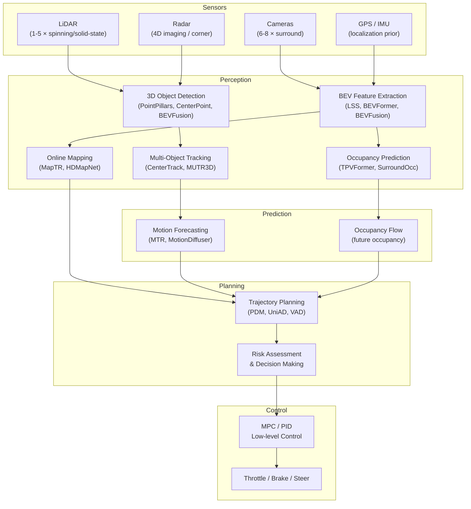

# Autonomous Driving: Stack Overview, Levels of Autonomy, and Key Players

> **Last Updated:** June 2026
> **Level:** Advanced
> **Related Sections:** [Perception Stack](./01_perception_stack.md) · [End-to-End Driving](./03_end_to_end_driving.md) · [Simulation & Data](./04_simulation_and_data.md) · [Robotics World Models](../06_robotics_and_embodied_ai/02_world_models.md)

---

## Overview

Autonomous driving (AD) is the grand integration challenge of modern computer vision, combining real-time perception, structured prediction, motion planning, and low-level vehicle control under extreme safety requirements. The canonical decomposition of the stack—perception → prediction → planning → control—emerged from the DARPA Urban Challenge era [Thrun2006] and remains the dominant engineering philosophy in deployed systems at Waymo, Mobileye, and Cruise. Each module solves a well-scoped sub-problem: perception answers *what is around me*, prediction answers *where will it go*, planning answers *what should I do*, and control answers *how do I actuate it*. The principal attraction of modular stacks is interpretability and safety certifiability; each component can be independently tested, logged, and formally verified to a bounded error specification.

The last five years have witnessed sustained pressure against the modular paradigm from *end-to-end* (E2E) approaches that collapse the entire chain into a single differentiable network trained from raw sensors to control outputs [Chen2023UniAD, Hu2023GAIA1]. The theoretical advantage is joint optimization—gradient information from planning failures back-propagates directly to perceptual representations, eliminating the information-theoretic bottleneck of hand-designed intermediate representations such as 3D bounding boxes or HD map polygons. Tesla's Full Self-Driving v12 (released 2024) is the highest-profile production example: FSD v12 replaced approximately 300,000 lines of C++ rule-based code with a single neural network processing eight camera streams and outputting steering, throttle, and brake torques directly [Elon2024FSD]. The empirical performance uplift was immediate and visible, yet formal safety guarantees remain an open research challenge.

A critical architectural tension also exists along the sensor axis. Camera-only systems (Tesla, Wayve) rely on monocular depth estimation and BEV lifting operators, offering cost scalability and dense semantic texture but lacking metric depth precision. LiDAR-centric systems (Waymo, Cruise) provide sub-centimeter range accuracy and weather-degraded operation but carry cost and mechanical complexity. Radar is underutilized relative to its all-weather range capability; emerging 4D imaging radar (e.g., Arbe Robotics, Continental ARS 548) may close the gap. Multi-modal fusion—particularly LiDAR-camera BEV fusion as in BEVFusion [Liu2022BEVFusion]—currently provides the best overall accuracy on public benchmarks.

---

## The AV Stack: Modules and Data Flow

The BEV (Bird's-Eye View) representation has become the lingua franca of the modern perception stack because it provides a unified coordinate frame amenable to downstream planning, free of the perspective distortions of image-space representations [Li2022BEVFormer]. Temporal fusion over BEV features allows the network to exploit the static structure of the environment across multiple frames, effectively increasing the effective range of camera-based systems without explicit depth sensors.

---

## SAE Levels of Driving Automation

The Society of Automotive Engineers standard **SAE J 3016-2021** defines six levels of driving automation [SAE2021]:

| Level | Name | Human Role | Example |
|-------|------|-----------|---------|
| 0 | No Automation | Full control at all times | Standard vehicle |
| 1 | Driver Assistance | Monitors driving environment; controls one function | Adaptive cruise control |
| 2 | Partial Automation | Monitors environment; system controls steering + speed | Tesla Autopilot, GM Super Cruise |
| 3 | Conditional Automation | Must intervene on request | Mercedes Drive Pilot (limited ODD) |
| 4 | High Automation | No intervention within ODD | Waymo One (geo-fenced), Cruise Origin |
| 5 | Full Automation | No human needed ever | Not yet deployed at scale |

The distinction between L2 and L3 is legally and liability-critical: at L3 the system (not the driver) assumes primary responsibility within its Operational Design Domain (ODD), while L2 keeps the human in the loop at all times. As of June 2026, only Mercedes-Benz has achieved certified L3 deployment in limited jurisdictions (Germany, Nevada).

---

## Sensor Suites

### Camera

Surround-view camera systems (typically 6–8 cameras, 60°–120° FOV, 8 MP) provide dense semantic texture, object recognition, and lane-level scene understanding. The principal challenge is metric depth recovery, which requires either explicit depth estimation (BEVDepth [Li2022BEVDepth]) or probabilistic view lifting (LSS [Philion2020LSS]). Cameras are low-cost, do not degrade with speed, but performance degrades in rain, fog, and direct sunlight.

### LiDAR

Spinning LiDARs (Velodyne HDL-64E, Hesai QT128) produce dense 3D point clouds at 10–20 Hz with centimeter-level range accuracy up to 200 m. Solid-state LiDARs (Livox, Ouster OS2) are emerging as cost-reduced alternatives. LiDAR is robust to lighting but sensitive to retroreflective and transparent surfaces, and exhibits degradation in heavy precipitation.

### Radar

Corner radars (4 × automotive radar, 77 GHz) provide velocity-resolved detections through rain, fog, and darkness with $\lesssim 0.1\,\text{m/s}$ Doppler precision. Traditional radar resolution is coarse (~5° azimuth), but 4D imaging radar (Arbe Phoenix: 0.7° azimuth, 1.6° elevation) approaches LiDAR point density. Radar is underexploited in published perception literature relative to its production importance.

### HD Maps vs. Sensor-Only

First-generation AV stacks assumed pre-built, centimeter-accurate HD maps for localization and lane-level planning. Online mapping research (MapTR [Liao2023MapTR], HDMapNet) aims to eliminate offline map dependency, increasing operational flexibility and reducing maintenance cost. A fully map-free stack is a key open problem.

---

## Key Players

| Company | Approach | Sensor Suite | Deployment Status (Jun 2026) |
|---------|----------|-------------|-------------------------------|
| Waymo | Modular, LiDAR-primary | LiDAR + Camera + Radar | L4 robotaxi: Phoenix, SF, LA |
| Tesla | End-to-end neural, camera-only | 8 × Camera | L2/L2+ FSD v12; no L4 |
| Mobileye | Modular + RSS safety layer | Camera + LiDAR + Radar | L2+ ADAS; L4 pilot (Moovit) |
| Cruise (GM) | Modular, LiDAR-primary | LiDAR + Camera + Radar | Suspended ops (2023 incident); restructuring |
| Wayve | End-to-end, camera-first | Camera + Radar | L2 UK trials; GAIA-1 research |
| Baidu Apollo | Modular hybrid | Full suite | L4 robotaxi Wuhan, Shenzhen |
| NVIDIA DRIVE | Platform provider | Full suite | Supplier to OEMs |

---

## Modular vs. End-to-End: Architectural Trade-offs

The modular stack dominates production deployments primarily because **interpretability** and **independent validation** are tractable. Safety engineers can write formal specifications for each module and test them in isolation. Regulatory bodies (UNECE WP.29, NHTSA) currently favor modular architectures with interpretable decision logs.

End-to-end systems offer three structural advantages: **(1) joint optimization** removes the information bottleneck between stages; **(2) implicit world modeling** allows the network to retain information not captured by explicit representations (e.g., soft occlusions, sensor uncertainty); **(3) scalability with data**—E2E systems improve smoothly with more training data, while modular systems require per-module annotation pipelines.

The hybrid approach—exemplified by UniAD [Hu2023UniAD]—uses structured intermediate representations (BEV queries, object queries, map queries) as soft interfaces between sub-networks, retaining interpretability while enabling E2E training. This hybrid paradigm is likely the production trajectory for the next generation of deployed systems.

Formally, the modular stack factors the driving policy as:

$$\pi(a \mid o) = \pi_c(a \mid p) \cdot \pi_p(p \mid f) \cdot \pi_f(f \mid o)$$

where $o$ is the raw sensor observation, $f$ the perceptual features, $p$ the prediction output, and $a$ the control action. Each factor is optimized independently, breaking the joint Bayesian optimal policy. E2E collapses this to a direct $\pi(a \mid o)$ mapping optimized with a single objective.

---

## Key Papers

| Paper | Authors | Year | Venue | Key Contribution |
|-------|---------|------|-------|-----------------|
| DARPA Urban Challenge overview | Thrun et al. | 2006 | DARPA Technical Report | Established modular AV stack architecture |
| BEVFormer | Li et al. | 2022 | ECCV | Spatial-temporal BEV via deformable attention; 56.9% NDS camera-only on nuScenes |
| BEVFusion | Liu et al. | 2022 | ICRA 2023 | Unified BEV for LiDAR-camera fusion; SOTA nuScenes detection |
| UniAD | Hu et al. | 2023 | CVPR (Best Paper) | Planning-oriented E2E: detection→tracking→mapping→motion→planning in one network |
| GAIA-1 | Hu et al. | 2023 | arXiv 2309.17080 | Generative world model for AV; video token prediction; 9B parameter scaling |
| Lift, Splat, Shoot | Philion & Fidler | 2020 | ECCV | Learned depth distribution for BEV projection; foundational camera-BEV method |
| PointPillars | Lang et al. | 2019 | CVPR | Fast LiDAR detection via pillar-based encoding; real-time 3D detection baseline |
| CenterPoint | Yin et al. | 2021 | CVPR | Center-based heatmap detection; 71.9 mAPH on Waymo |

---

## Benchmark Performance

| Model | Dataset | Metric | Score | Notes |
|-------|---------|--------|-------|-------|
| BEVFormer v2 | nuScenes test | NDS | 56.9% | Camera-only; ECCV 2022 |
| BEVFusion (MIT) | nuScenes test | NDS | 73.4% | LiDAR-camera; ICRA 2023 |
| CenterPoint | Waymo val | mAPH L2 | ~66.4% | LiDAR-only; 2021 |
| UniAD | nuScenes val | Planning L2 (3s) | 0.71 m | Full E2E stack; CVPR 2023 Best Paper |
| VAD | nuScenes val | Avg Collision Rate | 0.22% | Vectorized E2E; ICCV 2023 |

---

## Pros & Cons

| Aspect | Modular Stack | End-to-End Stack |
|--------|--------------|-----------------|
| Interpretability | High — each module has explicit outputs | Low — latent representations opaque |
| Joint optimization | No — sequential error propagation | Yes — single gradient through full stack |
| Annotation cost | High — per-module labels required | Moderate — can use driving logs |
| Regulatory acceptance | Favored by current frameworks | Immature safety case methodology |
| Data scalability | Limited by annotation bottleneck | Scales with raw driving video |
| Edge case handling | Explicit rules cover known cases | Better generalization; unknown failures |

---

## Open Problems & Research Gaps

- **Long-tail safety**: Neural stacks fail on rare distributions (construction zones, adversarial pedestrians) that are under-represented in training data. How to achieve $10^{-9}$ failure-per-mile safety targets with learned models remains unresolved.
- **Sensor fusion in adverse weather**: Rain, snow, and fog degrade all modalities differently; robust multi-modal fusion under sensor degradation lacks principled treatment.
- **Map-free localization at scale**: Eliminating HD map dependency while maintaining centimeter-level ego-localization in GPS-denied environments (tunnels, urban canyons) is unsolved.
- **Causal reasoning vs. statistical correlation**: Current models implicitly conflate correlation with causal structure in driving scenarios; they may fail when environment statistics shift (new city, new country).
- **Closed-loop evaluation at scale**: Open-loop metrics (L2, mAP) are poor proxies for real-world safety; scalable, photorealistic closed-loop benchmarks that test full sensor stacks are nascent.
- **Formal verification of neural policies**: Methods for bounding worst-case behavior of large neural networks in the state space relevant to driving remain largely theoretical.
- **V2X and cooperative perception**: Infrastructure-to-vehicle communication and cooperative perception between vehicles is underexplored in deployed systems despite clear safety benefits.

---

## Further Reading

- [Waymo Safety Report (2023)](https://waymo.com/safety/) — industry safety methodology reference
- [Tesla AI Day 2022 technical presentation](https://www.youtube.com/watch?v=ODSJsviD_SU) — occupancy networks, Dojo supercomputer
- [OpenDriveLab/UniAD GitHub](https://github.com/OpenDriveLab/UniAD) — official implementation, CVPR 2023 Best Paper
- [arXiv:2401.08658 — End-to-End Planning of AV in Industry and Academia 2022-2023](https://arxiv.org/abs/2401.08658) — comprehensive survey
- [SAE J 3016-2021 taxonomy](https://blog.ansi.org/ansi/sae-levels-driving-automation-j-3016-2021/) — official levels definition
- [nuScenes benchmark leaderboard](https://nuscenes.org/object-detection) — live performance tracking
