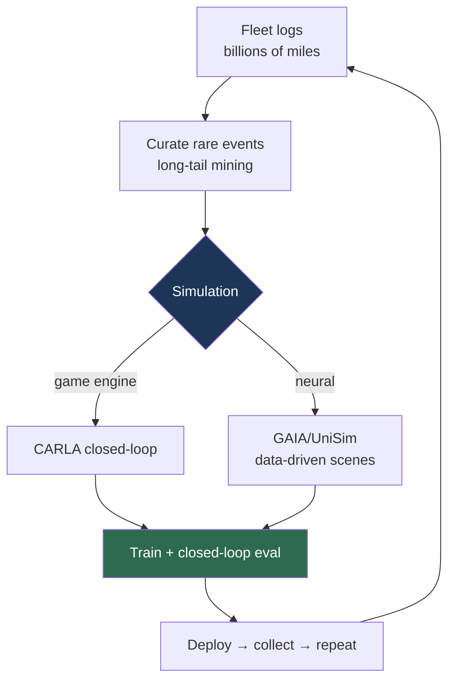

# Simulation & Data for Autonomous Driving

> **Last Updated:** June 2026
> **Level:** Advanced
> **Related Sections:**
> - [End-to-End Driving](./03_end_to_end_driving.md)
> - [Perception Stack](./01_perception_stack.md)
> - [3D & Robotics Datasets](../11_datasets_and_benchmarks/02_3d_and_robotics_datasets.md)
> - [World Models](../06_robotics_and_embodied_ai/02_world_models.md)

---

## Overview

Data and simulation are the binding constraint on autonomous-driving progress, even more than model architecture. The fundamental problem is the **long tail**: safe driving requires handling rare, safety-critical events (a child darting into the road, unusual debris, sensor-blinding glare) that occur perhaps once in millions of miles, making them nearly impossible to collect at sufficient density from real fleets. This drives a dual strategy: massive **real-world data collection** (Waymo's and Tesla's fleets logging billions of miles) paired with **simulation** to generate, augment, and stress-test against rare scenarios in a controlled, reproducible, and safe manner. The shift toward end-to-end learned driving (see [End-to-End Driving](./03_end_to_end_driving.md)) intensifies the data hunger, since these models learn directly from demonstrations rather than hand-coded rules.

Simulation in AV has itself evolved from **hand-built game-engine environments** (CARLA) toward **neural/data-driven simulation** (GAIA, UniSim) that learns to generate photorealistic, physically plausible driving scenes from logged data—closely related to the world models in [World Models](../06_robotics_and_embodied_ai/02_world_models.md). The central methodological question is **closed-loop evaluation**: a model that imitates logged trajectories well (open-loop) may still fail when its own actions change the future state (the distribution-shift / compounding-error problem), so the field has moved toward closed-loop simulators (nuPlan, CARLA leaderboards) that test policies reactively. This file surveys the key datasets, simulators, and the sim-to-real and evaluation challenges.

---

## Real-World Datasets

- **KITTI** [Geiger2012] — the pioneering AV benchmark (stereo, flow, detection, odometry); small by modern standards but foundational.
- **nuScenes** [Caesar2020] — 1000 scenes, full 360° sensor suite (6 cameras, LiDAR, 5 radar), 3D boxes; the standard multimodal AV perception benchmark (NDS/mAP).
- **Waymo Open Dataset** — large-scale, high-quality LiDAR+camera with 3D labels; perception and motion-prediction benchmarks.
- **nuPlan** — the first large-scale **closed-loop planning** benchmark (~1500 h), shifting evaluation from open-loop imitation to reactive simulation.
- **Argoverse 1/2, Lyft Level 5, ONCE** — additional perception/forecasting datasets (see [3D & Robotics Datasets](../11_datasets_and_benchmarks/02_3d_and_robotics_datasets.md)).

## Simulators

- **CARLA** [Dosovitskiy2017] — the open-source Unreal-Engine driving simulator; standard for closed-loop policy evaluation (CARLA Leaderboard) and sensor simulation.
- **MetaDrive, SUMMIT, LGSVL** — lightweight/procedural or traffic-focused simulators.
- **Neural simulation**: **GAIA-1** [Hu2023] (Wayve) — a generative world model producing realistic driving video from video/text/action prompts; **UniSim** (NVIDIA/Waabi) — a data-driven, neural closed-loop sensor simulator that reconstructs and edits real scenes. These blur the line between simulation and world models (see [World Models](../06_robotics_and_embodied_ai/02_world_models.md)).

---

## Key Papers / Resources

| Name | Authors/Org | Year | Venue | Key Contribution |
|------|-------------|------|-------|-----------------|
| KITTI | Geiger, Lenz, Urtasun | 2012 | CVPR | Pioneering AV benchmark suite |
| nuScenes | Caesar et al. | 2020 | CVPR | 360° multimodal AV perception dataset |
| Waymo Open Dataset | Sun et al. | 2020 | CVPR | Large-scale LiDAR+camera with 3D labels |
| nuPlan | Caesar et al. (Motional) | 2021 | CVPR WS | First closed-loop planning benchmark |
| CARLA | Dosovitskiy et al. | 2017 | CoRL | Open-source driving simulator |
| GAIA-1 | Hu et al. (Wayve) | 2023 | arXiv | Generative world model for driving |

---

## Benchmark Snapshot

| Benchmark | Task | Metric | Notes |
|-----------|------|--------|-------|
| nuScenes | 3D detection | NDS / mAP | Standard perception leaderboard |
| Waymo Open | Detection/forecast | mAP / mAPH | Large-scale, high-quality |
| nuPlan | Planning | closed-loop score | Reactive evaluation |
| CARLA Leaderboard | Driving | route/infraction score | Closed-loop in sim |

---

## Pros & Cons (real vs. simulated data)

| Aspect | Real-world data | Simulation |
|--------|-----------------|-----------|
| Realism | Ground truth realism | Sim-to-real gap |
| Rare events | Hard to collect | Can be generated on demand |
| Safety | Risky to collect edge cases | Safe, unlimited |
| Closed-loop eval | Impossible offline | Native (reactive) |
| Cost | High (fleets, labeling) | Lower per-scenario |

---

## Open Problems & Research Gaps

- **Sim-to-real gap.** Game-engine sensors and dynamics differ from reality; neural simulation (GAIA/UniSim) narrows but doesn't close it.
- **Long-tail coverage.** Generating *realistic and relevant* rare safety-critical scenarios remains hard.
- **Closed-loop fidelity.** Reactive agents and self-influenced futures are hard to simulate faithfully (the open-loop/closed-loop gap).
- **Evaluation–safety correlation.** Benchmark scores do not reliably predict real-world safety; validation methodology is unsolved.
- **Neural-sim controllability.** World-model simulators (GAIA) trade controllability for realism (see [World Models](../06_robotics_and_embodied_ai/02_world_models.md)).
- **Data governance & privacy.** Fleet data raises privacy, consent, and regulatory issues.

---

## Further Reading

- [nuScenes (arXiv:1903.11027)](https://arxiv.org/abs/1903.11027) — multimodal AV dataset
- [Waymo Open Dataset](https://waymo.com/open/) — large-scale AV data
- [CARLA (arXiv:1711.03938)](https://arxiv.org/abs/1711.03938) — open driving simulator
- [nuPlan](https://www.nuscenes.org/nuplan) — closed-loop planning benchmark
- [GAIA-1 (arXiv:2309.17080)](https://arxiv.org/abs/2309.17080) — generative driving world model
