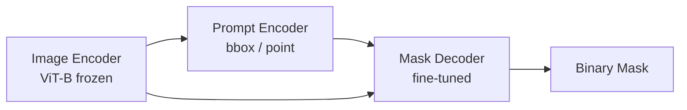

# Foundation Models in Medical Imaging

> **Last Updated:** June 2026
> **Level:** Advanced
> **Related Sections:**
> - [Medical Imaging Modalities](./00_medical_imaging.md)
> - [Any-Model / Generalist Vision Paradigm](../12_research_frontier_2024_2026/02_any_model_paradigm.md)
> - [Multimodal Vision-Language Models](../05_multimodal_vision_language/00_vision_language_models.md)
> - [Scientific Imaging](./02_scientific_imaging.md)

---

## Overview

Foundation models—large neural networks pretrained on broad data distributions and subsequently adapted to downstream tasks—have reshaped medical imaging research since 2022. The central thesis is that self-supervised or weakly supervised pretraining on the vast archives of clinical images (many institutions hold millions of radiology studies and gigapixels of digitized pathology) can produce representations transferable to diverse downstream tasks with dramatically fewer labeled examples than training from scratch. This mirrors the successes of BERT and GPT in NLP and CLIP/DINO in natural images, but medical data introduces unique constraints: patient privacy limits data pooling, image–text pairing is available through radiology reports (creating a natural contrastive pretraining signal), and clinical semantic concepts are not well-described by generic web-crawled image–caption pairs.

Two pretraining paradigms dominate the literature. **Contrastive image–text pretraining** (analogous to CLIP [Radford2021]) aligns paired image and text representations such that matching pairs are closer in embedding space than non-matching pairs. Applied to chest X-ray/report pairs, this yields models (CheXzero [Tiu2022], BioViL [Bannur2023]) capable of zero-shot pathology classification without any labeled images. **Self-supervised visual pretraining** (MAE, DINO, iBOT) applied to pathology patches (UNI [Chen2024], CONCH [Lu2024], PLIP [Huang2023]) produces patch encoders that rival or surpass supervised baselines on slide-level classification, survival prediction, and gene expression estimation, while being pretraining-data-scalable.

The arrival of SAM (Segment Anything Model) [Kirillov2023] opened a third trajectory: adapting interactive, promptable segmentation foundations to medical imaging. MedSAM [Ma2024] fine-tuned SAM on a dataset of 1,570,263 image–mask pairs spanning 10 imaging modalities and 30+ cancer types, yielding the first general-purpose interactive medical segmentation model. However, naive SAM adaptation reveals that the model's original training on natural images does not transfer well to CT/MRI volumetric data without explicit 3D adaptation. Subsequent work (SAM-Med3D, Rep-MedSAM) has addressed efficiency and volumetric generalization.

---

## Contrastive Image–Text Models

### CheXzero [Tiu2022]

CheXzero demonstrated that a CLIP-style model pretrained on 227,827 chest X-ray/report pairs from MIMIC-CXR can achieve zero-shot multi-label pathology classification competitive with fully supervised baselines, without using any labeled images at inference. The key insight is that radiology reports contain structured, clinically validated natural language that acts as a rich supervision signal. CheXzero achieved the highest mean AUC among self-supervised models evaluated, with strong performance on pathologies such as Edema (AUC 0.880), Cardiomegaly (AUC 0.825), and Pneumothorax (AUC 0.764) using 0% labeled data.

### BioViL / BioViL-T [Bannur2023]

BioViL extended contrastive pretraining with local-alignment objectives that associate phrases in radiology reports with spatial regions in X-rays, enabling phrase grounding. BioViL-T additionally models temporal change across serial imaging studies, predicting whether findings have improved, worsened, or are unchanged—a clinically essential capability unaddressed by earlier static models.

### MaCon / KAD and the Report Encoding Challenge

A persistent challenge in chest X-ray pretraining is that radiology reports describe findings negatively ("no pleural effusion"), requiring negation-aware text encoders. ClinicalBERT and specialized encoders handle this better than general-purpose BERT variants.

---

## Pathology Foundation Models

### UNI [Chen2024]

UNI (Universal Histopathology Encoder) is a general-purpose self-supervised vision encoder for computational pathology, pretrained using DINOv2-style training on over 100,000 whole-slide images (WSI) from The Cancer Genome Atlas (TCGA) and other sources—encompassing 20+ cancer types. UNI demonstrated state-of-the-art performance across 34 computational pathology tasks including patch classification, slide-level classification, survival prediction, and mutation prediction, published in Nature Medicine 2024.

### CONCH [Lu2024]

CONCH (CONtrastive learning from Captions for Histopathology) is a vision–language model for pathology trained contrastively on 1.17 million histopathology image–caption pairs derived from textbook figures, PubMed articles, and social media. CONCH supports zero-shot slide-level classification and retrieval from natural language queries. Published in Nature Medicine 2024, it achieves state-of-the-art zero-shot pathology classification across multiple datasets.

### PLIP [Huang2023]

PLIP (Pathology Language and Image Pre-training) was trained on ~208,000 pathology image–text pairs scraped from Twitter (#pathology, #pathologyTwitter), demonstrating that even noisy social media data contains sufficient signal for useful medical representations. PLIP appeared in Nature Medicine 2023.

---

## Retinal and Ophthalmic Models

### RETFound [Zhou2023]

RETFound is a self-supervised foundation model for retinal images pretrained on 1.6 million unlabeled fundus photographs using MAE-style reconstruction. It was published in Nature 2023 (one of the first medical foundation models in Nature). RETFound demonstrated strong few-shot and fine-tuned performance across diabetic retinopathy grading, age-related macular degeneration staging, and systemic disease prediction (cardiovascular disease, Parkinson's disease) from retinal images—the latter enabled by the retina's role as a window to systemic vascular health.

The pretraining objective in RETFound follows the masked autoencoder (MAE) formulation:

$$\mathcal{L}_{MAE} = \frac{1}{|\mathcal{M}|} \sum_{i \in \mathcal{M}} \|x_i - \hat{x}_i\|^2$$

where $\mathcal{M}$ is the set of masked patch indices and $\hat{x}_i$ is the decoder reconstruction.

---

## SAM Adaptation to Medical Imaging

### MedSAM [Ma2024]

MedSAM fine-tuned SAM's mask decoder on 1,570,263 image–mask pairs across 10 modalities (CT, MRI, X-ray, ultrasound, endoscopy, microscopy, dermoscopy, OCT, fundus, mammography) and over 30 cancer types. The image encoder (ViT-B) was kept frozen during fine-tuning to preserve generalist visual features; only the mask decoder was updated. MedSAM supports bounding box and point prompts, enabling interactive segmentation without task-specific model retraining. Published in Nature Communications 2024.

**Key limitation**: MedSAM processes 2D slices independently and does not natively model 3D context, leading to inconsistent inter-slice predictions in volumetric CT/MRI without post-processing.

### SAM-Med3D

SAM-Med3D extends MedSAM by replacing the 2D ViT encoder with a 3D Swin Transformer and adapting the prompt encoder to accept 3D point prompts, enabling spatially coherent volumetric segmentation without slice-by-slice processing.

### Architecture Sketch

---

## Medical Vision-Language Models (Med-VLMs)

### LLaVA-Med [Li2023]

LLaVA-Med fine-tuned LLaVA (Large Language and Vision Assistant) on biomedical instruction-following data constructed via GPT-4 from PMC-15M image–caption pairs. It achieved 74.2% accuracy on VQA-RAD (radiology visual question answering) and strong performance on PathVQA, enabling conversational interaction with medical images. Published at NeurIPS 2023.

### Med-Flamingo [Moor2023]

Med-Flamingo adapted the Flamingo few-shot multimodal model to medicine by continued pretraining on paired medical image–text data. It demonstrated best performance on 4 out of 7 evaluation metrics including retinal classification and VQA-RAD under few-shot settings (1–4 shots), making it the first medical few-shot learner for multimodal clinical reasoning.

### Med-Gemini [Yang2024]

Med-Gemini, announced by Google in 2024, integrates long-context reasoning (1M token context window) with access to medical knowledge retrieval, enabling multi-image analysis across multiple imaging timepoints or modalities in a single inference call. Med-Gemini-L 1.0 surpassed GPT-4V on MedQA (USMLE-style) and multiple medical VQA benchmarks as of its publication. Specific benchmark scores for individual imaging tasks are not all publicly reported.

---

## Self-Supervised Pretraining Strategies for Medical Data

| Strategy | Approach | Key Benefit | Medical Application |
|----------|----------|------------|---------------------|
| MAE (masked autoencoders) | Reconstruct masked patches | Label-efficient; scalable | RETFound, SAM-Med3D |
| DINO / DINOv2 | Self-distillation, momentum encoder | Strong patch features | UNI, pathology |
| SimCLR / MoCo | Instance contrastive | Good image-level representations | Radiology classification |
| CLIP-style | Image–text contrastive | Zero-shot transfer | CheXzero, CONCH, BioViL |
| iBOT | Masked image modeling + self-distillation | Combines local+global | UNI pretraining |

---

## Key Papers

| Paper | Authors | Year | Venue | Key Contribution |
|-------|---------|------|-------|-----------------|
| CheXzero: Expert-level Detection of Pathologies from Chest Radiographs with Zero-labeled Data | Tiu et al. | 2022 | Nature Biomedical Engineering | CLIP for chest X-ray; zero-shot competitive with supervised models |
| RETFound: A Foundation Model for Generalizable Disease Detection from Retinal Images | Zhou et al. | 2023 | Nature | MAE pretraining on 1.6M fundus photos; multi-disease foundation |
| A General-Purpose Self-Supervised Model for Computational Pathology (UNI) | Chen et al. | 2024 | Nature Medicine | DINOv2-style on 100K+ WSI; SOTA on 34 pathology tasks |
| A Visual-Language Foundation Model for Pathology Image Analysis (CONCH) | Lu et al. | 2024 | Nature Medicine | 1.17M histopathology image–text pairs; zero-shot pathology classification |
| Segment Anything in Medical Images (MedSAM) | Ma et al. | 2024 | Nature Communications | Fine-tuned SAM on 1.57M medical image–mask pairs; interactive multi-modal segmentation |
| LLaVA-Med: Training a Large Language-and-Vision Assistant for Biomedicine | Li et al. | 2023 | NeurIPS | GPT-4-generated instruction tuning on PMC-15M; 74.2% VQA-RAD accuracy |
| Med-Flamingo: A Multimodal Medical Few-shot Learner | Moor et al. | 2023 | arXiv/ML4H | First medical few-shot multimodal model; retinal and VQA benchmarks |

---

## Benchmark Performance

| Model | Dataset | Metric | Score | Notes |
|-------|---------|--------|-------|-------|
| CheXzero | CheXpert (Edema) | AUC | 0.880 | Zero-shot, 0% labeled training data |
| CheXzero | CheXpert (Cardiomegaly) | AUC | 0.825 | Zero-shot |
| CheXzero | CheXpert (Pneumothorax) | AUC | 0.764 | Zero-shot; highest mean AUC among self-supervised |
| UNI | TCGA 18-cancer classification | AUC (avg) | Not publicly reported (SOTA at pub.) | Slide-level via ABMIL aggregation |
| CONCH | 14 pathology tasks | AUC/Acc avg | SOTA vs. prior methods at publication | Zero-shot and few-shot |
| LLaVA-Med | VQA-RAD | Accuracy | 74.2% | Fine-tuned; conversational medical VQA |
| MedSAM | 10 modalities (avg Dice) | Dice | Not publicly reported as single avg | Modality-specific results in paper |

---

## Pros & Cons

| Approach | Pros | Cons |
|----------|------|------|
| Contrastive image–text (CheXzero, CONCH) | Zero-shot transfer; no manual labels at inference; leverages free-text reports | Requires large paired image–text corpora; negation in clinical text causes errors |
| Self-supervised visual (UNI, RETFound) | Scalable; strong patch-level features; no text needed | Does not encode semantic clinical vocabulary; supervised fine-tuning still needed for new tasks |
| SAM adaptation (MedSAM, SAM-Med3D) | Interactive; modality-agnostic; no per-task retraining | 2D-only in base form; prompt engineering burden on radiologist; 3D extension requires significant re-architecture |
| Med-VLMs (LLaVA-Med, Med-Gemini) | Conversational, multi-task; generalizes across modalities via language | Hallucination risk in clinical settings; computationally expensive; limited spatial grounding |

---

## Open Problems & Research Gaps

- **Privacy-preserving pretraining at scale**: federated learning and differential privacy for aggregating multi-site medical image corpora without centralizing protected health information remains computationally and statistically costly.
- **Grounding and faithfulness in Med-VLMs**: models like LLaVA-Med generate fluent but occasionally hallucinated clinical descriptions; robust grounding of language outputs to image evidence is an unsolved alignment problem.
- **3D-native foundation models**: almost all current medical foundation models process 2D slices; true 3D volumetric pretraining at scale (CT and MRI are inherently 3D) with efficient attention mechanisms is an open challenge.
- **Rare disease and low-prevalence pathology**: foundation models pretrained on common diseases underperform on rare conditions (<100 training examples); compositional generalization and meta-learning approaches for rare medical imaging tasks are largely unexplored.
- **Multi-modal clinical fusion**: patients generate text, imaging, genomics, and structured EHR data simultaneously; unifying these heterogeneous modalities in a single foundation model without catastrophic forgetting is unsolved.
- **Prospective clinical validation and regulatory approval**: benchmark performance does not guarantee clinical utility; rigorous prospective trials for AI-assisted diagnosis remain rare and methodologically challenging.
- **Temporal and longitudinal modeling**: most models treat each study independently; modeling disease progression across serial imaging timepoints (beyond BioViL-T's binary change detection) requires new architectural and training paradigms.

---

## Further Reading

- [MedSAM Nature Communications 2024](https://www.nature.com/articles/s41467-024-44824-z)
- [UNI / CONCH Nature Medicine 2024 — Mass General Brigham press release](https://www.massgeneralbrigham.org/en/about/newsroom/press-releases/mass-general-brigham-researchers-develop-ai-foundation-models-to-advance-pathology)
- [Foundation Models in Medical Image Analysis: Systematic Review (arXiv 2025)](https://arxiv.org/pdf/2510.16973)
- [Toward Clinically Ready Foundation Models (arXiv 2026)](https://arxiv.org/pdf/2603.14271)
- [MONAI: Medical Open Network for AI](https://monai.io/)
- [PMC-15M dataset for biomedical image–text pretraining](https://huggingface.co/datasets/axiong/pmc_oa)
