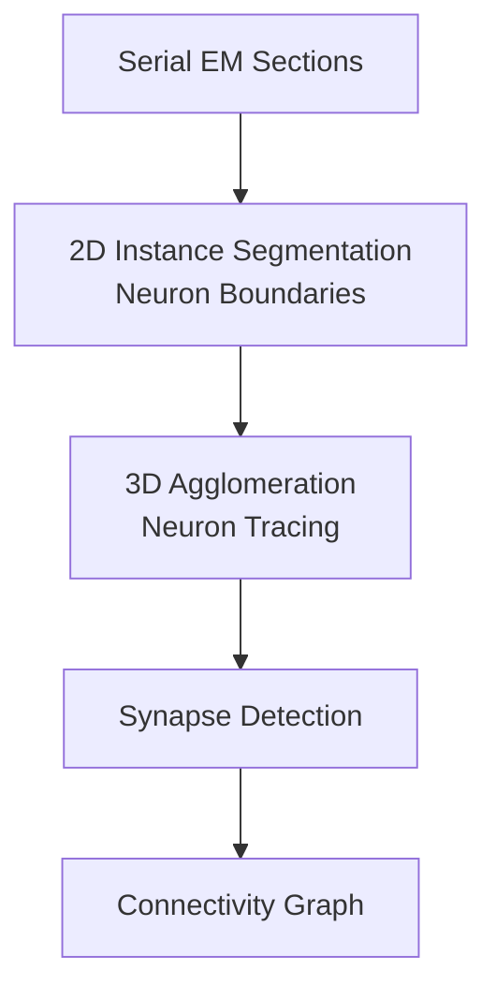
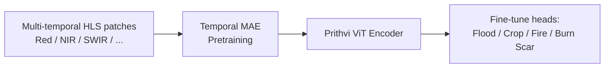

# Scientific Imaging: Microscopy, Connectomics, Cryo-EM, Remote Sensing, and Beyond

> **Last Updated:** June 2026
> **Level:** Advanced
> **Related Sections:**
> - [Medical Imaging Modalities](./00_medical_imaging.md)
> - [Foundation Models in Medical Imaging](./01_foundation_models_medical.md)
> - [3D Vision and Scene Understanding](../04_3d_vision_and_scene/00_3d_representations.md)
> - [Datasets and Benchmarks](../11_datasets_and_benchmarks/00_image_classification_benchmarks.md)

---

## Overview

Beyond clinical medicine, computer vision increasingly drives discovery across the physical and life sciences—from mapping individual synapses in cubic millimeters of brain tissue to detecting crop stress across continents from orbit. These domains share several structural properties that distinguish them from natural image tasks: images are acquired with domain-specific physical instruments (electron microscopes, radio telescopes, multispectral satellite sensors), ground truth labels are generated by domain experts under strict ontologies, and the scale of data ranges from single gigapixel micrographs to petabyte remote sensing archives. Unlike natural images, scientific imaging typically requires quantitative precision—the exact count of mitotic figures per high-power field is a prognostic biomarker, not an approximate visual quantity.

Fluorescence microscopy, the workhorse of cell biology, quantifies protein distributions, organelle morphology, and dynamic processes in living cells and tissues. Instance segmentation of individual cells or nuclei is the core CV task, enabling downstream quantification of morphological and molecular phenotypes in high-content screening. Electron microscopy (EM), both conventional (SEM/TEM) and cryo-EM, operates at sub-nanometer resolution and is used to reconstruct 3D ultrastructure—from synaptic vesicle arrangement in neural tissue to protein complex architecture. **Connectomics**—reconstructing the complete wiring diagram of a neural circuit from serial EM volumes—is perhaps the most computationally demanding CV task in biology, requiring petabyte-scale 3D dense segmentation with sub-voxel accuracy. Remote sensing CV processes multi-spectral, hyperspectral, SAR, and LiDAR data from satellites and airborne sensors to monitor land cover, disasters, agriculture, and climate-relevant phenomena at planetary scale.

The cross-cutting theme is that domain-specific pretraining and specialized architectures consistently outperform generic ImageNet-initialized models. The most successful paradigm is to pretrain a foundation model on a large domain corpus (millions of microscopy patches, thousands of satellite image tiles) using self-supervised objectives (MAE, DINO, contrastive), then fine-tune with modest task-specific labels.

---

## Fluorescence Microscopy: Cell and Nucleus Segmentation

### Cellpose [Stringer2021]

Cellpose introduced a biologically motivated representation for instance segmentation of cells: rather than predicting bounding boxes or watershed energy, the network predicts a **gradient flow field** that, when integrated, converges particles to cell centers. This representation handles highly irregular cell shapes and crowded arrangements that confound standard instance segmentation methods.

The gradient field $\mathbf{g}(\mathbf{x})$ at pixel $\mathbf{x}$ points toward the centroid of the cell containing $\mathbf{x}$, encoding direction (not magnitude). Instance segmentation proceeds by:
1. Predict per-pixel gradient vectors $\hat{\mathbf{g}}$.
2. Simulate particle advection: $\mathbf{x}_{t+1} = \mathbf{x}_t + \hat{\mathbf{g}}(\mathbf{x}_t)$.
3. Cluster converged particle positions as cell instances.

Cellpose was trained on a curated dataset of 608 manually annotated images spanning 70+ cell types, and generalizes across fluorescence channels, brightfield, and phase-contrast microscopy without retraining. Cellpose 2.0 [Pachitariu2022] introduced human-in-the-loop fine-tuning workflows, further improving accuracy on new cell types.

**Performance**: On a systematic benchmark of 18 instance segmentation methods for microscopy, Cellpose (tuned) achieved Dice coefficient of 0.76 ± 0.03 with 80% training data, versus StarDist (tuned) at 0.72 ± 0.07 under the same conditions.

### StarDist [Schmidt2018, Weigert2022]

StarDist represents nuclei as **star-convex polygons** (2D) or star-convex polyhedra (3D), parameterized by radial distances from the object center in $K$ uniformly sampled directions. A single network predicts both the object probability map and $K$ radial distances per pixel:

$$\hat{\mathbf{r}}(\mathbf{x}) = (r_1, r_2, \ldots, r_K), \quad r_k = \text{distance to boundary in direction } \theta_k$$

Non-maximum suppression in the polygon space resolves overlapping predictions. StarDist is particularly well-suited to tightly packed nuclei where watershed-based methods over-segment. StarDist 3D extends this to volumetric fluorescence imaging.

### Deep Learning in High-Content Screening

High-content screening (HCS) applies automated fluorescence microscopy at scale—often thousands of wells per plate, millions of cells per experiment. **CellProfiler** couples classical image processing with feature extraction; **DeepProfiler** applies CNN-based feature extraction (ResNet50, EfficientNet) to the same images and feeds features to machine learning classifiers. The **Recursion Phenomics** RxRx datasets provided large-scale benchmarks for morphological profiling.

---

## Connectomics: Petabyte-Scale 3D Neural Circuit Reconstruction

Connectomics aims to reconstruct the **connectome**—the complete synaptic connectivity graph of a neural circuit—from serial electron microscopy (SEM) stacks. Current volumes include portions of mouse, fly, and human cortex.

### Scale and Challenge

The IARPA MICrONS program (Machine Intelligence from Cortical Networks) produced the largest publicly available mammalian connectomics dataset: a 1.4 mm × 0.87 mm × 0.84 mm volume of mouse visual cortex imaged at 8 nm × 8 nm × 40 nm resolution, containing >200,000 cells, ~120,000 neurons, and >523 million automatically detected synapses. Reconstruction involved two-photon microscopy for functional imaging, microCT for alignment, and serial EM for ultrastructure, all registered to a common coordinate frame.

### Core CV Tasks in Connectomics

**Neuron segmentation** is treated as instance segmentation of mitochondria, axons, dendrites, and cell bodies in densely packed neuropil. Methods based on U-Net-style architectures predict **affinities** (probability that adjacent voxels belong to the same neuron), followed by graph-based agglomeration (MALIS, GASP). **Human proofreading** remains essential for correcting merge errors (two neurons incorrectly joined) and split errors (one neuron fragmented into multiple pieces).

**Synapse detection** localizes pre- and post-synaptic densities: SynEM [Staffler2017] formulated this as border classification, achieving automated detection of ~500 million synapses in the MICrONS dataset.

---

## Cryo-Electron Microscopy: Structure Determination

Cryo-EM determines the 3D structure of proteins and macromolecular complexes at near-atomic resolution by computationally averaging many 2D projection images of flash-frozen particles in random orientations.

### Deep Learning in Cryo-EM Workflows

1. **Particle picking**: identifying candidate particle images in micrographs. TOPAZ [Bepler2019] combined a CNN classifier with a generative model for noise, achieving strong recall on sparse particles. CryoSegNet [Ding2024] framed picking as image segmentation (U-Net encoder–decoder) and integrated SAM-based prompting for improved generalization.

2. **2D class averaging**: clustering particle images by conformation and view orientation. Convolutional autoencoders and variational autoencoders (cryoDRGN [Zhong2021]) model continuous conformational heterogeneity—revealing multiple structural states of dynamic complexes that classical discrete averaging misses.

3. **3D reconstruction refinement**: modern packages (RELION, cryoSPARC) incorporate neural-network-based pose refinement and contrast transfer function (CTF) correction.

### AlphaFold2 Context [Jumper2021]

AlphaFold2 (DeepMind, 2021) achieved a landmark in structural biology by predicting protein 3D structure from sequence with near-crystallographic accuracy, winning the CASP14 competition with a median GDT_TS score of 92.4 versus the previous best of ~76. AlphaFold2 uses an Evoformer module that processes multiple sequence alignments (MSA) through attention mechanisms, followed by structure module with invariant point attention (IPA) to produce 3D atomic coordinates. AlphaFold2 is not a traditional CV task (it operates on sequence, not images), but its predictions are increasingly used to initialize or validate cryo-EM-derived structures—exemplifying the blurring boundary between structural biology and learned representations.

---

## Remote Sensing and Satellite Imagery

### Scale and Modality Characteristics

Satellite imagery is multispectral (Sentinel-2: 13 bands, 10–60 m resolution), hyperspectral (AVIRIS: 224 bands), or synthetic aperture radar (SAR: Sentinel-1), with temporal revisit periods enabling change detection. Unlike natural images, satellite data includes non-visible spectral bands (NIR, SWIR, thermal), requires atmospheric correction, and covers enormous geographic extents.

### Foundation Models for Earth Observation

**SatMAE [Cong2022]** extended masked autoencoders (MAE) to multispectral satellite imagery by grouping spectral bands into independent channel groups and masking patches independently per group, enabling pretraining on temporal sequences from the fMoW-Sentinel dataset. SatMAE demonstrated strong transfer to land cover classification, flood mapping, and crop type detection.

**Prithvi-EO-1.0 [Jakubik2023]** (IBM and NASA) was released in August 2023 as a 100M-parameter ViT-based geospatial foundation model pretrained on 1M+ time-series patches of Harmonized Landsat Sentinel-2 (HLS) data using an MAE objective over temporal sequences. For flood mapping, Prithvi achieves ~4% higher mIoU than SatMAE on unseen geographic regions and outperforms transformer baselines trained from scratch. Pretraining required only 93.3 GPU-hours versus 768 GPU-hours for SatMAE (a 8.2× efficiency gain), with correspondingly lower carbon footprint (13.3 vs. 109.44 kg CO₂).

**Prithvi-EO-2.0 [Jakubik2024]** scaled to 600M parameters (6× larger than v1), incorporating multi-temporal encoding, and demonstrated improved performance across wildfire mapping, crop type classification, and multi-hazard assessment.

### Downstream Tasks

| Task | Primary Data | Core CV Challenge |
|------|-------------|------------------|
| Land cover / LULC classification | Sentinel-2, Landsat | Multi-class pixel-wise; class imbalance |
| Flood / disaster mapping | SAR, multispectral | Temporal change; cloudy conditions |
| Crop type mapping | Time-series Sentinel-2 | Phenological variation; fragmented fields |
| Building footprint extraction | Very high resolution (VHR) | Dense instance segmentation |
| Road network extraction | VHR optical / SAR | Thin structures; connectivity |
| Object detection (ships, aircraft) | VHR optical | Small objects; orientation sensitivity |

---

## Astronomy and Materials Science

### Astronomical Image Analysis

Optical and radio telescope surveys (SDSS, DES, Euclid, SKA) generate surveys of billions of objects. Key CV tasks include: galaxy morphology classification (GalaxyZoo; CNNs match human volunteer accuracy at >10× throughput), strong gravitational lens detection (residual networks on difference imaging), transient event detection (supernovae, gamma-ray bursts), and source separation in radio interferometric images. **Zoobot** [Walmsley2023] combined citizen science labels with active learning to train scalable galaxy morphology classifiers across multiple surveys.

### Materials Characterization

Scanning transmission electron microscopy (STEM) and atomic force microscopy (AFM) image material microstructure at atomic resolution. CV tasks include defect detection (vacancies, grain boundaries), phase segmentation in polycrystalline materials, and automated characterization of nanoparticle size distributions. Foundation models for materials microscopy are nascent; transfer from Cellpose/nnU-Net is common but domain gap remains large.

---

## Key Papers

| Paper | Authors | Year | Venue | Key Contribution |
|-------|---------|------|-------|-----------------|
| Cellpose: A Generalist Algorithm for Cellular Segmentation | Stringer, Wang, Michaelos, Pachitariu | 2021 | Nature Methods | Gradient flow field for cell instance segmentation; generalist across cell types |
| StarDist: Object Detection with Star-Convex Polygons | Schmidt, Weigert, Broaddus, Myers | 2018 | MICCAI | Star-convex polygon representation for nucleus detection |
| TOPAZ: Positive-Unlabeled CNN for Particle Picking in Cryo-EM | Bepler et al. | 2019 | Nature Methods | PU-learning for sparse cryo-EM particle picking |
| Highly Accurate Protein Structure Prediction with AlphaFold2 | Jumper et al. | 2021 | Nature | CASP14 winner; GDT_TS 92.4; Evoformer + IPA modules |
| SatMAE: Pre-training Transformers for Temporal and Multi-Spectral Satellite Imagery | Cong et al. | 2022 | NeurIPS | MAE adapted for multi-spectral temporal satellite data |
| Prithvi-EO-1.0: A Geospatial Foundation Model | Jakubik et al. | 2023 | arXiv/HuggingFace | 100M ViT MAE on HLS; flood/crop SOTA; NASA-IBM collaboration |
| MICrONS: Large-Scale Cortical Connectomics Dataset | MICrONS Consortium | 2021 | Zenodo / bioRxiv | 1.4mm³ mouse visual cortex; 523M+ synapses; largest public connectome |

---

## Benchmark Performance

| Model | Dataset | Metric | Score | Notes |
|-------|---------|--------|-------|-------|
| Cellpose (tuned) | Multi-cell benchmark (80% train) | Dice | 0.76 ± 0.03 | Vs. StarDist (tuned) 0.72 ± 0.07 |
| StarDist (tuned) | Multi-cell benchmark (10% train) | Dice | 0.69 ± 0.02 | More robust under low-data than Cellpose (0.32 ± 0.4) |
| AlphaFold2 | CASP14 | GDT_TS | 92.4 | Median across free modelling targets; prior best ~76 |
| Prithvi-EO-1.0 | Flood mapping (unseen regions) | mIoU | ~4% better than SatMAE | Prithvi trained in 93.3 GPU-h vs. SatMAE 768 GPU-h |
| SatMAE | fMoW-Sentinel (land use) | Top-1 Accuracy | Not publicly reported as single number | Outperforms ImageNet-pretrained ViT at submission |
| Zoobot | GalaxyZoo morphology | Agreement with volunteers | ~94% (not publicly reported as single metric) | Matches human volunteer accuracy |

---

## Pros & Cons

| Approach | Pros | Cons |
|----------|------|------|
| Cellpose (gradient flow) | Handles irregular shapes; works without fine-tuning on many cell types | Computationally heavier than StarDist; 2D by default |
| StarDist (star-convex) | Analytically constrained, avoids irregular artifacts; fast NMS | Assumes convex-ish shapes; struggles with elongated or highly non-convex cells |
| MAE pretraining (SatMAE, Prithvi) | Label-efficient; leverages large unlabeled archive; temporal modeling | Does not capture multi-scale objects well; patch resolution mismatch |
| cryo-EM deep learning (TOPAZ, CryoSegNet) | Avoids laborious manual picking; generalizes across particle types | Requires representative training micrographs; false-positive particles degrade downstream 3D reconstruction |

---

## Open Problems & Research Gaps

- **Cross-modality generalization in microscopy**: a single model that handles phase contrast, brightfield, electron, and fluorescence microscopy without retraining remains elusive; Cellpose 2.0's fine-tuning UI partially addresses this but the fundamental domain gap persists.
- **Petabyte-scale connectomics**: full reconstruction of even a cubic millimeter of cortex requires years of expert proofreading; automation of merge/split error correction at scale without introducing systematic biases is unsolved.
- **Continuous conformational heterogeneity in cryo-EM**: cryoDRGN and its successors model heterogeneity in latent space but convergence and interpretability of learned conformational landscapes remain challenging for large complexes with high-dimensional flexibility.
- **Multi-temporal and multi-sensor fusion in remote sensing**: fusing optical, SAR, and LiDAR under missing-modality conditions (cloud cover, sensor failures) with physically consistent representations is an active and underexplored area.
- **Sub-grid and physically constrained prediction**: satellite-based crop yield or biomass estimation requires integrating vegetation indices, climate time-series, and soil data; hybrid physics-informed neural networks for Earth observation are nascent.
- **Annotation bottleneck in materials and astronomy**: for defect detection in materials and rare event detection in astronomy, labeled examples are inherently scarce; one-shot and self-supervised detection without task-specific labels remains largely unsolved at production quality.
- **Uncertainty-aware scientific inference**: predictions from CV models are fed into downstream scientific analyses; propagating model uncertainty through the scientific inference pipeline (e.g., uncertainty in synapse count → uncertainty in connectivity graph properties) requires new statistical frameworks.

---

## Further Reading

- [Cellpose 2.0 (Nature Methods 2022)](https://www.nature.com/articles/s41592-022-01663-4)
- [AlphaFold2 (Nature 2021)](https://www.nature.com/articles/s41586-021-03819-2)
- [Prithvi-EO-2.0 (arXiv 2024)](https://arxiv.org/html/2412.02732v3)
- [MICrONS Explorer](https://www.microns-explorer.org/cortical-mm3)
- [SatMAE (NeurIPS 2022)](https://arxiv.org/abs/2207.08051)
- [CryoSegNet / SAM-based cryo-EM picking (PMC 2024)](https://www.ncbi.nlm.nih.gov/pmc/articles/PMC11165428/)
