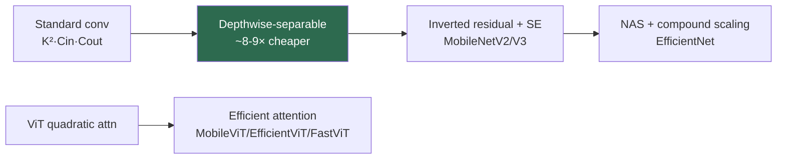

# Efficient Architectures

> **Last Updated:** June 2026
> **Level:** Advanced
> **Related Sections:**
> - [Model Compression](./00_model_compression.md)
> - [Hardware Acceleration](./02_hardware_acceleration.md)
> - [Hybrid Architectures](../03_architectures/02_hybrid_architectures.md)
> - [Edge Deployment](./03_edge_deployment.md)

---

## Overview

Efficient architectures are neural networks designed from the ground up to maximize accuracy per unit of compute, memory, or latency—as opposed to compressing an existing large model (covered in [Model Compression](./00_model_compression.md)). The distinction matters: compression starts from a heavy model and removes capacity, whereas efficient-architecture design bakes parsimony into the operators and topology themselves. The field is driven by the deployment reality that most inference happens not in data centers but on phones, cameras, cars, and robots, where power, memory bandwidth, and real-time latency are hard constraints (see [Edge Deployment](./03_edge_deployment.md) and [Hardware Robot Platforms](../06_robotics_and_embodied_ai/12_hardware_robot_platforms.md)).

The central design lever is replacing dense, expensive operators with cheaper approximations that preserve representational power. The seminal idea is the **depthwise-separable convolution** (MobileNet), which factorizes a standard convolution into a per-channel spatial filter plus a 1×1 pointwise mixing, cutting cost by roughly the kernel area. Subsequent work added inverted residuals (MobileNetV2), squeeze-and-excitation and neural architecture search (MobileNetV3, EfficientNet), channel shuffling (ShuffleNet), and efficient attention for ViTs (MobileViT, EfficientViT, FastViT). A recurring lesson is that **FLOPs are a poor proxy for latency**: memory access patterns, operator support, and parallelism often dominate wall-clock time, so efficient design must target real hardware, not just theoretical compute.

---

## Core Techniques

### Depthwise-Separable Convolution

A standard convolution with `K×K` kernel, `C_in` input and `C_out` output channels costs `K²·C_in·C_out·H·W`. **MobileNet** [Howard2017] factorizes it:

```
# Depthwise: one K×K filter per input channel
cost_dw = K² · C_in · H · W
# Pointwise: 1×1 conv mixing channels
cost_pw = C_in · C_out · H · W
# Speedup ≈ 1/C_out + 1/K²  (≈ 8-9× for K=3)
```

**MobileNetV2** [Sandler2018] added **inverted residuals** (expand → depthwise → project) with linear bottlenecks; **MobileNetV3** [Howard2019] combined NAS, squeeze-and-excitation, and hardware-aware tuning. **ShuffleNet** used grouped 1×1 convolutions with channel shuffle; **SqueezeNet** targeted parameter count with fire modules.

### Compound Scaling and NAS

**EfficientNet** [Tan2019] (ICML 2019) used **compound scaling**—jointly scaling depth, width, and resolution by a single coefficient `φ`—atop a NAS-found baseline (EfficientNet-B0), reaching strong accuracy/FLOP trade-offs (B7: 84.4% top-1). Neural architecture search (DARTS, MnasNet, Once-for-All) automated the discovery of efficient topologies under latency constraints.

### Efficient Vision Transformers

ViTs are costly at high resolution (quadratic attention). **MobileViT** [Mehta2022] interleaves MBConv with lightweight global attention; **EfficientViT** uses linear/cascaded attention for high throughput; **FastViT** uses structural reparameterization and a token-mixer hybrid. These bring Transformer accuracy to mobile latency budgets (see [Hybrid Architectures](../03_architectures/02_hybrid_architectures.md)).



---

## Key Papers

| Paper | Authors | Year | Venue | Key Contribution |
|-------|---------|------|-------|-----------------|
| MobileNet | Howard et al. | 2017 | arXiv | Depthwise-separable convolutions |
| MobileNetV2 | Sandler et al. | 2018 | CVPR | Inverted residuals, linear bottlenecks |
| MobileNetV3 | Howard et al. | 2019 | ICCV | NAS + SE + hardware-aware design |
| EfficientNet | Tan, Le | 2019 | ICML | Compound scaling |
| ShuffleNet | Zhang et al. | 2018 | CVPR | Grouped conv + channel shuffle |
| MobileViT | Mehta, Rastegari | 2022 | ICLR | Mobile-friendly vision transformer |

---

## Benchmark Performance

| Model | Params | FLOPs | ImageNet top-1 | Notes |
|-------|--------|-------|----------------|-------|
| MobileNetV2 | 3.4M | 300M | 72.0% | Inverted residuals |
| MobileNetV3-Large | 5.4M | 219M | ~75.2% | NAS + SE |
| EfficientNet-B0 | 5.3M | 390M | 77.1% | NAS baseline |
| EfficientNet-B7 | 66M | 37G | 84.4% | Compound scaling |
| MobileViT-S | 5.6M | 1.1G | 78.4% | Beats MobileNetV3-L |

---

## Pros & Cons

| Aspect | Pros | Cons |
|--------|------|------|
| Depthwise-separable | ~8–9× cheaper convs | Lower per-op arithmetic intensity (memory-bound) |
| NAS-designed | Optimal under constraints | Search cost; hardware-specific |
| Compound scaling | Principled accuracy/FLOP trade-off | FLOPs ≠ latency on all hardware |
| Efficient ViTs | Transformer accuracy at mobile latency | More complex; less mature than CNNs |

---

## Open Problems & Research Gaps

- **FLOPs–latency mismatch.** Theoretical compute poorly predicts real latency; hardware-in-the-loop design is essential but expensive.
- **Memory-bound regimes.** Depthwise ops are memory-bandwidth-limited, underutilizing compute units.
- **Efficient attention at high resolution.** Sub-quadratic attention with no accuracy loss is unsolved (see [State Space Models](../03_architectures/05_state_space_models.md)).
- **Tiny foundation/VLA models.** Compressing multimodal/VLA capability to sub-1B on-device models is an open frontier (see [Future Trends](../12_research_frontier_2024_2026/07_future_trends.md)).
- **NAS cost.** Architecture search remains compute-intensive and hardware-specific.
- **Accuracy ceiling.** Efficient models still trail large models on hard tasks; the Pareto frontier keeps moving.

---

## Further Reading

- [MobileNetV2 (arXiv:1801.04381)](https://arxiv.org/abs/1801.04381) — inverted residuals
- [EfficientNet (arXiv:1905.11946)](https://arxiv.org/abs/1905.11946) — compound scaling
- [MobileViT (arXiv:2110.02178)](https://arxiv.org/abs/2110.02178) — efficient vision transformer
- [Once-for-All (arXiv:1908.09791)](https://arxiv.org/abs/1908.09791) — train once, specialize
- [FastViT (arXiv:2303.14189)](https://arxiv.org/abs/2303.14189) — reparameterized efficient ViT
