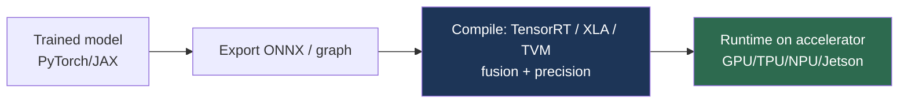

# Hardware Acceleration

> **Last Updated:** June 2026
> **Level:** Advanced
> **Related Sections:**
> - [Edge Deployment](./03_edge_deployment.md)
> - [Model Compression](./00_model_compression.md)
> - [Efficient Architectures](./01_efficient_architectures.md)
> - [Hardware Robot Platforms](../06_robotics_and_embodied_ai/12_hardware_robot_platforms.md)

---

## Overview

Hardware acceleration is the substrate on which all of modern computer vision runs: the dramatic capability gains of the past decade are inseparable from the parallel-compute hardware (GPUs, then TPUs and NPUs) that made training and inference of large neural networks economical. For a researcher, hardware literacy is not optional—it determines what models are trainable, what batch sizes and resolutions are feasible, and crucially what can be deployed within a target latency and power envelope. The field spans a hierarchy from data-center training accelerators (NVIDIA H100/B200, Google TPU) to edge inference chips (Jetson, Coral, Hailo) embedded in cameras, cars, and robots (see [Hardware Robot Platforms](../06_robotics_and_embodied_ai/12_hardware_robot_platforms.md)).

The central performance principle is the **roofline model**: a kernel is either *compute-bound* (limited by arithmetic throughput, FLOPS) or *memory-bound* (limited by memory bandwidth, GB/s), and which regime it falls in determines how to optimize it. Modern accelerators provide enormous compute (tensor cores doing fused matrix-multiply-accumulate at low precision) but comparatively scarce memory bandwidth, so many vision workloads—especially depthwise convolutions and attention—are memory-bound, and the dominant optimization techniques (operator fusion, quantization, mixed precision) target *data movement* as much as arithmetic. This file surveys the accelerator landscape, the software stack that maps models onto it (TensorRT, ONNX, XLA), and the bottlenecks that govern real performance.

---

## Accelerator Landscape

- **GPUs** — the workhorse. NVIDIA GPUs dominate via CUDA and **Tensor Cores** (mixed-precision matrix units supporting FP16/BF16/FP8/INT8). Data-center: A100/H100/B200 (Hopper/Blackwell); workstation: RTX 4090/5090. High throughput + flexibility.
- **TPUs** (Google) — systolic-array ASICs optimized for large matrix multiplies; excellent for large-scale training (ViT-22B) via JAX/XLA; pod-scale interconnect.
- **NPUs / AI accelerators** — Apple Neural Engine, Qualcomm Hexagon, mobile NPUs; integrated into SoCs for on-device inference.
- **Edge accelerators** — NVIDIA Jetson (Orin: up to 275 INT8 TOPS; Thor: Blackwell, 128 GB), Google Coral (Edge TPU), Hailo-8/15, Intel Movidius. Power-constrained inference for robotics/cameras (see [Edge Deployment](./03_edge_deployment.md)).
- **FPGAs** — reconfigurable; low-latency, deterministic inference for specialized pipelines; harder to program.

## The Roofline & Precision

```
# Roofline: attainable performance
P = min( Peak_FLOPS,  Bandwidth × Arithmetic_Intensity )
# Arithmetic Intensity = FLOPs / Bytes moved
# Low AI (depthwise conv, attention) → memory-bound
```

**Reduced precision** is the primary throughput lever: FP32 → FP16/BF16 (training), → INT8/FP8/INT4 (inference). Tensor Cores deliver multiplicative speedups at lower precision, and quantization (see [Model Compression](./00_model_compression.md)) both reduces memory traffic and unlocks these units.

## The Software Stack

Mapping a model to hardware efficiently requires a compilation/runtime stack:

- **TensorRT** (NVIDIA) — graph optimization, layer/operator fusion, precision calibration, kernel auto-tuning for GPU/Jetson inference.
- **ONNX / ONNX Runtime** — interchange format + cross-platform runtime with execution providers.
- **XLA** (TensorFlow/JAX) and **torch.compile / TorchInductor** — graph compilers that fuse operators and generate optimized kernels.
- **TVM**, **OpenVINO** (Intel), vendor SDKs — hardware-specific compilation.

**Operator fusion** (combining elementwise/normalization ops into one kernel to avoid round-trips to HBM) and **kernel auto-tuning** are the highest-leverage optimizations, attacking the memory-bound bottleneck directly.



---

## Key References

| Reference | Org/Authors | Year | Type | Key Contribution |
|-----------|-------------|------|------|-----------------|
| Roofline Model | Williams, Waterman, Patterson | 2009 | CACM | Compute- vs memory-bound analysis |
| Tensor Cores / Mixed Precision | Micikevicius et al. (NVIDIA) | 2018 | ICLR | FP16 training at scale |
| TPU | Jouppi et al. (Google) | 2017 | ISCA | In-datacenter systolic-array accelerator |
| FlashAttention | Dao et al. | 2022 | NeurIPS | IO-aware exact attention; memory-bound fix |
| Jetson Thor | NVIDIA | 2025 | Product | Blackwell edge compute for robotics |

---

## Pros & Cons (accelerator choice)

| Aspect | GPU | TPU | Edge NPU/Jetson |
|--------|-----|-----|-----------------|
| Flexibility | High (CUDA ecosystem) | Lower (XLA-bound) | Limited operator support |
| Throughput | Very high | Very high (large MM) | Power-bounded |
| Deployment | Data center/workstation | Data center (Google) | On-device, robotics |
| Precision support | FP16/FP8/INT8 | BF16/INT8 | INT8/INT4 emphasis |

---

## Open Problems & Research Gaps

- **Memory wall.** Bandwidth scales slower than compute; many vision/attention kernels are memory-bound (FlashAttention-style IO-aware design is partial).
- **Operator coverage on edge.** Edge accelerators support a limited operator set, forcing model redesign (see [Edge Deployment](./03_edge_deployment.md)).
- **Compiler maturity.** Auto-tuning/fusion (TVM, Inductor) still leaves performance on the table vs. hand-tuned kernels.
- **Precision robustness.** INT4/FP8 inference can degrade accuracy unpredictably for some vision models.
- **Energy efficiency.** Power, not FLOPS, increasingly bounds deployment (robotics runtime; data-center cost).
- **Heterogeneous scheduling.** Efficiently partitioning models across CPU/GPU/NPU on SoCs is unsolved.

---

## Further Reading

- [FlashAttention (arXiv:2205.14135)](https://arxiv.org/abs/2205.14135) — IO-aware attention
- [Mixed Precision Training (arXiv:1710.03740)](https://arxiv.org/abs/1710.03740) — FP16 training
- [TensorRT documentation](https://developer.nvidia.com/tensorrt) — inference optimization
- [In-Datacenter TPU (arXiv:1704.04760)](https://arxiv.org/abs/1704.04760) — TPU architecture
- [Roofline Model (CACM 2009)](https://dl.acm.org/doi/10.1145/1498765.1498785) — performance analysis
