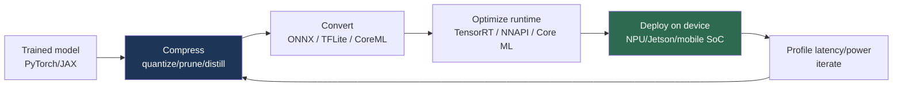

# Edge Deployment

> **Last Updated:** June 2026
> **Level:** Advanced
> **Related Sections:**
> - [Hardware Acceleration](./02_hardware_acceleration.md)
> - [Model Compression](./00_model_compression.md)
> - [Efficient Architectures](./01_efficient_architectures.md)
> - [Hardware Robot Platforms](../06_robotics_and_embodied_ai/12_hardware_robot_platforms.md)

---

## Overview

Edge deployment is the practice of running vision models *on-device*—on phones, cameras, vehicles, drones, and robots—rather than in the cloud. It is where the rubber meets the road for applied computer vision: latency, power, memory, privacy, and connectivity constraints that are irrelevant in a data center become binding, and a model that achieves SOTA accuracy is useless if it cannot meet a 30 ms real-time budget within a few watts. Edge deployment is increasingly central to the field because the highest-value applications—autonomous driving, robotics, AR, smart cameras—are inherently embedded and often safety-critical, demanding deterministic, offline-capable inference (see [Hardware Robot Platforms](../06_robotics_and_embodied_ai/12_hardware_robot_platforms.md) and [Autonomous Driving](../07_autonomous_driving/00_overview.md)).

The discipline combines the three pillars covered in this section: **efficient architectures** (designing cheap models; see [Efficient Architectures](./01_efficient_architectures.md)), **model compression** (quantization, pruning, distillation; see [Model Compression](./00_model_compression.md)), and **hardware acceleration** (mapping to NPUs/Jetson via optimized runtimes; see [Hardware Acceleration](./02_hardware_acceleration.md)). The defining 2024–2026 challenge is deploying *foundation-scale* models—VLMs and VLAs with billions of parameters—on edge hardware, which has driven a wave of "tiny" multimodal and embodied models (MobileVLM, distilled VLAs) and motivated capable edge SoCs like the NVIDIA Jetson Thor that can host multi-billion-parameter dual-system policies on a robot.

---

## The Edge Deployment Pipeline

A model travels from a training framework to an on-device runtime through a chain of conversions and optimizations:

### On-Device Runtimes

- **TensorFlow Lite (LiteRT)** — the dominant mobile runtime; INT8/INT4 quantization, delegate APIs (GPU, NNAPI, Core ML, Hexagon).
- **Core ML** (Apple) — runs on the Apple Neural Engine; tight iOS integration.
- **ONNX Runtime Mobile**, **NCNN / MNN** (Tencent/Alibaba; popular in mobile vision), **TVM**, **ExecuTorch** (PyTorch's on-device runtime).
- **TensorRT** (Jetson) — the standard for NVIDIA edge robotics inference.

### Optimization Levers

Edge deployment leans heavily on **INT8/INT4 quantization** (often post-training with calibration), **operator fusion**, **static shapes** (avoiding dynamic-shape overhead), and **hardware-aware architecture choices** (operators the target NPU supports natively). A model frequently must be *redesigned*, not just compressed, because edge accelerators support a limited operator set.

---

## Foundation Models at the Edge

The frontier challenge is shrinking VLMs/VLAs to edge budgets. **MobileVLM** and similar compact multimodal models target sub-3B parameters with lightweight projectors; **distilled/efficient VLAs** aim to run policies on Jetson Orin/Thor for on-robot inference (see [Future Trends](../12_research_frontier_2024_2026/07_future_trends.md)). OpenVLA-OFT's 26× inference speedup (to ~110 Hz) exemplifies the latency engineering required to make a 7B VLA real-time on constrained hardware (see [VLA & Embodied 2025–2026](../12_research_frontier_2024_2026/04_vla_embodied_2025_2026.md)).

---

## Key References

| Reference | Org/Authors | Year | Type | Key Contribution |
|-----------|-------------|------|------|-----------------|
| TensorFlow Lite | Google | 2017 | Framework | Mobile inference runtime |
| MCUNet | Lin et al. | 2020 | NeurIPS | Deep learning on microcontrollers (TinyML) |
| MobileVLM | Chu et al. | 2023 | arXiv | Compact VLM for mobile/edge |
| OpenVLA-OFT | Kim, Pertsch, et al. | 2025 | arXiv | 26× VLA inference speedup |
| Jetson Thor | NVIDIA | 2025 | Product | Edge compute for on-robot foundation models |

---

## Benchmark / Constraint Comparison

| Target | Compute | Power | Typical budget | Use case |
|--------|---------|-------|----------------|----------|
| Mobile SoC (NPU) | ~5–50 TOPS | 1–5 W | 10–30 ms | Phone vision, AR |
| Jetson Orin | up to 275 TOPS | 15–60 W | real-time | Robotics, cameras |
| Jetson Thor | ~2,070 FP4 TFLOPS | 40–130 W | real-time VLA | Humanoid on-robot inference |
| Microcontroller (TinyML) | <1 TOPS | <0.1 W | event-driven | Always-on sensing |

---

## Pros & Cons (edge vs. cloud inference)

| Aspect | Edge | Cloud |
|--------|------|-------|
| Latency | Low, deterministic | Network-dependent |
| Privacy | Data stays on-device | Data leaves device |
| Connectivity | Offline-capable | Requires network |
| Model size | Constrained | Effectively unbounded |
| Cost | Per-device hardware | Per-query compute |

---

## Open Problems & Research Gaps

- **Foundation models on-device.** Running multi-billion-parameter VLMs/VLAs within edge power/thermal budgets is largely unsolved (see [Future Trends](../12_research_frontier_2024_2026/07_future_trends.md)).
- **Accuracy under aggressive quantization.** INT4/lower quantization can degrade vision models unpredictably.
- **Operator-set fragmentation.** Diverse NPUs support different operators, forcing per-target redesign and re-validation.
- **Thermal throttling.** Sustained inference on passively cooled devices triggers throttling not captured by peak-TOPS specs.
- **Safety certification.** Deploying learned models in safety-critical edge systems (cars, robots) lacks accepted verification standards.
- **On-device adaptation.** Efficient continual/personalized learning at the edge remains immature.

---

## Further Reading

- [LiteRT / TensorFlow Lite](https://ai.google.dev/edge/litert) — mobile/edge runtime
- [MCUNet (arXiv:2007.10319)](https://arxiv.org/abs/2007.10319) — TinyML on microcontrollers
- [ExecuTorch](https://pytorch.org/executorch/) — PyTorch on-device runtime
- [MobileVLM (arXiv:2312.16886)](https://arxiv.org/abs/2312.16886) — compact vision-language model
- [NVIDIA Jetson](https://developer.nvidia.com/embedded-computing) — edge robotics platforms
