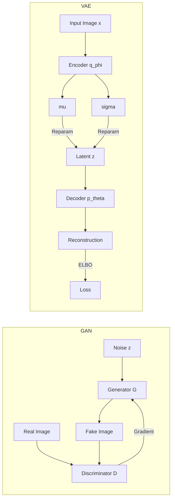

# GANs and VAEs: Foundations of Deep Generative Vision

> **Last Updated:** June 2026
> **Level:** Advanced
> **Related Sections:** [Diffusion Models](./01_diffusion_models.md) | [3D Generation](./03_3d_generation.md) | [Evaluation and Safety](./04_evaluation_and_safety.md) | [Video Generation](./02_video_generation.md)

---

## Overview

Generative Adversarial Networks (GANs) and Variational Autoencoders (VAEs) represent the two foundational paradigms of learned generative modeling that preceded the diffusion era. Introduced within a year of each other — VAEs by [KingmaWelling2013] and GANs by [Goodfellow2014] — they encode fundamentally different inductive biases: VAEs ground generation in Bayesian inference and explicit latent structure, while GANs frame generation as an adversarial game between a generator and a discriminator. Together they drove a decade of progress in image synthesis, compression, video prediction, and representation learning.

The GAN framework produces photorealistic outputs by training a generator network $G$ to produce samples indistinguishable from real data under a discriminator $D$. The theoretical underpinning of the original minimax objective, combined with architectures such as DCGAN [Radford2015], progressive growing [KarrasLaine2018], and style-based generation [Karras2019], pushed GAN outputs from blurry 64×64 digits to near-photographic 1024×1024 faces by 2019. WGAN-GP [Gulrajani2017] resolved catastrophic training instabilities by replacing the Jensen–Shannon divergence with a Wasserstein distance and enforcing a Lipschitz constraint via gradient penalty, enabling stable training without mode collapse. The BigGAN [Brock2019] scaling experiment established that class-conditional ImageNet generation was tractable with careful truncation tricks. Conditional image-to-image translation (pix2pix [IsolaZhu2017]) and unpaired domain adaptation (CycleGAN [ZhuPark2017]) extended GANs to structured vision tasks with broad practical impact.

VAEs take a probabilistic view: the encoder learns to approximate the true posterior $q_\phi(\mathbf{z}|\mathbf{x})$, and the decoder learns $p_\theta(\mathbf{x}|\mathbf{z})$. Optimizing the Evidence Lower BOund (ELBO) trains the model end-to-end. Crucially, the reparameterization trick makes the stochastic sampling node differentiable. While early VAEs produced blurry reconstructions (attributed to the mean-seeking behavior of KL-diverged Gaussians), the VQ-VAE line [vanDenOord2017; Razavi2019] replaced the continuous bottleneck with a discrete codebook, enabling high-fidelity reconstruction and pairing naturally with autoregressive priors. VQGAN [Esser2021] fused VQ-VAE with a patch-discriminator, delivering the high-quality discrete tokenizer that underpins the Latent Diffusion / Stable Diffusion family.

---

## GAN: Minimax Objective

The original GAN game [Goodfellow2014] is defined by the following minimax value function:

```
V(D, G) = E_{x ~ p_data(x)} [log D(x)]
         + E_{z ~ p_z(z)} [log(1 - D(G(z)))]

Discriminator maximizes V(D, G)
Generator     minimizes V(D, G)

Optimal discriminator: D*(x) = p_data(x) / (p_data(x) + p_g(x))

At equilibrium (p_g = p_data):
  V(D*, G) = -log(4)
  C(G) = 2 * JSD(p_data || p_g) - log(4)
```

The minimax problem has a global minimum when $p_g = p_{data}$, corresponding to the generator perfectly capturing the data distribution. In practice, the non-saturating variant replaces the generator objective with maximizing $\log D(G(z))$ to avoid vanishing gradients at the start of training.

---

## WGAN-GP Gradient Penalty

Wasserstein-1 distance provides more stable gradients but requires the discriminator (called a "critic") to be 1-Lipschitz. WGAN-GP enforces this via:

```
L = E_{x~p_g}[D(x)] - E_{x~p_r}[D(x)]
  + lambda * E_{x~p_hat}[(||grad_x D(x)||_2 - 1)^2]

where x_hat = epsilon * x_real + (1 - epsilon) * x_fake,
      epsilon ~ U[0,1], lambda = 10 (recommended)

Critic trained for n_critic = 5 steps per generator step.
```

This gradient penalty replaces weight clipping and dramatically reduces sensitivity to hyperparameters [Gulrajani2017].

---

## StyleGAN Architecture Family

StyleGAN [Karras2019] introduced a **mapping network** that transforms the input noise $z \in \mathcal{Z}$ to an intermediate latent space $w \in \mathcal{W}$, which is then injected at each resolution level via adaptive instance normalization (AdaIN):

```
AdaIN(x_i, y) = y_{s,i} * (x_i - mu(x_i)) / sigma(x_i) + y_{b,i}

where y = (y_s, y_b) are affine transforms of w,
      x_i is the i-th feature map activation
```

StyleGAN2 [Karras2020] replaced AdaIN with weight demodulation to eliminate blob artifacts, and removed progressive growing in favor of a skip-generator / residual-discriminator architecture. StyleGAN3 [Karras2021] addressed texture sticking by enforcing continuous equivariance to translation and rotation, using sinc-filtered convolutions — important for video and animation applications.

---

## Pix2Pix and CycleGAN

Conditional image-to-image translation was formalized by pix2pix [IsolaZhu2017] as a cGAN with a paired dataset, PatchGAN discriminator, and L1 reconstruction loss. The PatchGAN discriminator classifies overlapping 70×70 image patches rather than the full image, encouraging high-frequency sharpness. CycleGAN [ZhuPark2017] extended this to unpaired data by introducing a cycle-consistency loss:

```
L_cyc(G, F) = E_{x~p(x)} [||F(G(x)) - x||_1]
             + E_{y~p(y)} [||G(F(y)) - y||_1]
```

where $G: X \to Y$ and $F: Y \to X$ are the two generators. This constraint prevents mode collapse and is sufficient to learn many structured mappings (horse→zebra, summer→winter, photo→painting).

---

## VAE: ELBO Derivation

The Variational Autoencoder [KingmaWelling2013] maximizes a lower bound on the log-likelihood:

```
log p(x) >= E_{q_phi(z|x)} [log p_theta(x|z)]
           - KL(q_phi(z|x) || p(z))
          = ELBO(x; phi, theta)

Reparameterization trick:
  z = mu_phi(x) + sigma_phi(x) * epsilon,  epsilon ~ N(0, I)
  => gradients flow through z back to phi

KL term (Gaussian prior, diagonal posterior):
  KL = -0.5 * sum_j (1 + log sigma_j^2 - mu_j^2 - sigma_j^2)
```

The reconstruction term encourages the decoder to faithfully reproduce $x$, while the KL term regularizes the posterior toward the prior $\mathcal{N}(0, I)$, ensuring smooth latent interpolation.

---

## VQ-VAE, VQ-VAE-2, and VQGAN

Vector-Quantized VAE [vanDenOord2017] replaces the continuous Gaussian bottleneck with a discrete codebook $\{e_k\}_{k=1}^K$:

```
z_q = e_k,   k = argmin_j ||z_e - e_j||_2

Loss = ||x - decoder(z_q)||^2
     + ||sg[z_e] - e_k||^2       (codebook loss)
     + beta * ||z_e - sg[e_k]||^2  (commitment loss, beta=0.25)

Straight-through gradient: partial L / partial z_e
  approximated by copying gradient from z_q to z_e.
```

VQ-VAE-2 [Razavi2019] stacks two levels of quantization (bottom: 32×32, top: 8×8 for 256px images) capturing local and global structure separately, then fits PixelSnail autoregressive priors at both scales to achieve FID competitive with BigGAN at the time.

VQGAN [Esser2021] adds a patch-based discriminator and perceptual loss to VQ-VAE training, dramatically improving reconstruction sharpness. The resulting tokenizer encodes images into 16×16 or 32×32 discrete maps — the representation later used as the "perceptual compression" stage in Latent Diffusion Models [Rombach2022].

---

## Why Diffusion Models Overtook GANs

By 2021–2022, diffusion models surpassed GANs on most image generation benchmarks, driven by several structural advantages:

1. **Training stability**: No adversarial game; the denoising objective is a simple MSE/L2 regression that scales reliably with data and compute.
2. **Mode coverage**: GANs suffer from mode collapse — dropping entire semantic categories. Diffusion models optimize a likelihood-based objective and demonstrate better coverage.
3. **Conditioning flexibility**: Classifier-free guidance [Ho2022] enabled zero-shot conditioning on arbitrary text without retraining the discriminator. GANs require architecture changes per conditioning type.
4. **Diversity-fidelity tradeoff**: The guidance scale knob gives continuous control over this tradeoff; GANs require the truncation trick, which cuts the tails of $\mathcal{W}$.
5. **Scalability**: DDPM→LDM→SDXL demonstrated consistent quality gains by scaling model size and training compute, following patterns similar to LLM scaling. GANs showed training instability at very large scale.
6. **Editability**: DDIM inversion [Song2021] provides near-exact latent inversion for real images, enabling precise text-guided editing. GAN inversion is harder and less faithful at high resolution.

GANs retain advantages in inference speed (single forward pass vs. 20–1000 NFE for diffusion) and in structured generation tasks where paired data enables stable discriminator training (medical image synthesis, video super-resolution). GAN-derived components — especially VQGAN tokenizers — remain central to the latent diffusion pipeline.

---

## Mermaid: GAN vs. VAE Topology



---

## Key Papers

| Paper | Authors | Year | Venue | Key Contribution |
|-------|---------|------|-------|-----------------|
| Generative Adversarial Nets | Goodfellow et al. | 2014 | NeurIPS | Minimax adversarial framework; proved Nash equilibrium at $p_g=p_{data}$ |
| Unsupervised Representation Learning with DCGANs | Radford, Metz, Chintala | 2015 | arXiv/ICLR 2016 | All-convolutional architecture with BN; stable large-scale GAN training |
| Improved Training of WGANs | Gulrajani et al. | 2017 | NeurIPS | Gradient penalty Lipschitz constraint; replaced weight clipping |
| Large Scale GAN Training (BigGAN) | Brock et al. | 2019 | ICLR | Class-conditional 512px ImageNet; truncation trick; orthogonal regularization |
| A Style-Based Generator Architecture (StyleGAN) | Karras et al. | 2019 | CVPR | Mapping network, AdaIN injection, per-layer noise; FID 4.40 on FFHQ |
| Analyzing and Improving the Image Quality (StyleGAN2) | Karras et al. | 2020 | CVPR | Weight demodulation, path-length regularization; removed artifacts |
| Alias-Free GAN (StyleGAN3) | Karras et al. | 2021 | NeurIPS | Sinc-filtered convolutions; translation/rotation equivariance |
| Image-to-Image Translation with cGANs (pix2pix) | Isola et al. | 2017 | CVPR | PatchGAN discriminator; L1 + adversarial loss for paired translation |
| Unpaired Image-to-Image Translation (CycleGAN) | Zhu et al. | 2017 | ICCV | Cycle-consistency loss; unsupervised domain transfer |
| Auto-Encoding Variational Bayes | Kingma, Welling | 2013 | ICLR 2014 | VAE; ELBO; reparameterization trick |
| Neural Discrete Representation Learning (VQ-VAE) | van den Oord et al. | 2017 | NeurIPS | Discrete codebook bottleneck; straight-through estimator |
| Generating Diverse High-Fidelity Images (VQ-VAE-2) | Razavi et al. | 2019 | NeurIPS | Hierarchical two-level quantization; PixelSnail prior |
| Taming Transformers (VQGAN) | Esser et al. | 2021 | CVPR | Patch discriminator + perceptual loss on VQ-VAE; discrete tokens for transformers |

---

## Benchmark Performance

| Model | Dataset | Metric | Score | Notes |
|-------|---------|--------|-------|-------|
| StyleGAN2 | FFHQ 1024px | FID | 2.84 | Truncation ψ=0.5 |
| StyleGAN3-T | FFHQ 1024px | FID | 2.79 | Translation equivariant |
| BigGAN-deep | ImageNet 512px | FID | 3.24 | Truncation threshold 0.5 |
| BigGAN-deep | ImageNet 128px | IS | 232.5 | Best reported IS at time |
| VQ-VAE-2 | ImageNet 256px | FID | 31.11 | Autoregressive prior |
| VQGAN | ImageNet 256px | FID | 7.94 | Transformer prior (GPT-style) |
| CycleGAN | Horse→Zebra | AMT fool rate | 25.5% | Human perceptual evaluation |
| DCGAN | CelebA 64px | FID | ~37 | Baseline; modern implementations vary |

---

## Pros & Cons

| Aspect | Pros | Cons |
|--------|------|------|
| **Training dynamics** | Fast single-step inference; mature tooling | Adversarial instability; mode collapse; sensitive to hyperparameters |
| **Sample quality (GANs)** | Sharp, high-frequency details; state-of-art portraits at 1024px+ | Coverage issues; hallucination of consistent 3D structure |
| **Latent structure (VAEs)** | Smooth, interpretable latent space; stable likelihood-based training | Blurry reconstructions in standard VAEs; posterior collapse in deep models |
| **Conditioning** | pix2pix/CycleGAN allow strong spatial conditioning | Arbitrary text conditioning requires architecture redesign vs. CFG in diffusion |
| **Computational cost** | Generator is a single forward pass; trivially fast at inference | GAN discriminator doubles training memory; VQ-VAE tokenizer training expensive |
| **Discrete tokenization (VQ)** | Natural for transformer priors; compresses $256^2$ images to $16^2$ tokens | Codebook collapse; commitment loss tuning required |

---

## Open Problems & Research Gaps

- **GAN scaling**: Despite BigGAN, no GAN architecture has matched the quality-diversity tradeoff of diffusion at equivalent parameter counts on diverse datasets beyond face/bedroom domains. Understanding whether this reflects inductive bias or data curriculum is open.
- **VAE sharpness**: The blurriness of VAE reconstructions under pixel-space likelihood is theoretically understood (mean-seeking vs. mode-seeking behavior) but practical solutions — perceptual losses, VQ bottlenecks, flow decoders — each introduce their own approximations.
- **Codebook utilization**: VQ-VAE codebooks frequently exhibit collapse (many codes unused). Entropy-constrained codebook learning, EMA updates, and residual quantization are active research directions.
- **Hybrid GAN-diffusion**: Using GAN discriminators as learned perceptual losses for diffusion fine-tuning (e.g., Consistency Models with adversarial training) or combining flow-matching with adversarial objectives remains largely unexplored at scale.
- **Inversion quality**: GAN inversion (projecting real images into $\mathcal{W}$ or $\mathcal{W+}$ space) still struggles with rare faces, complex backgrounds, and accessories. No inversion method achieves both reconstruction fidelity and editability simultaneously.
- **Equivariance in generation**: StyleGAN3's equivariance result suggests rethinking convolution as the core operator in generators. Whether equivariant architectures generalize to video, 3D, and multimodal settings is open.
- **Theoretical analysis of ELBO tightness**: The gap between the ELBO and the true log-likelihood in VAEs is poorly characterized for high-dimensional image distributions; importance-weighted bounds improve estimates but the practical implications for generation quality are not fully understood.

---

## Further Reading

- [Goodfellow et al. (2014), "Generative Adversarial Nets," NeurIPS 2014](https://arxiv.org/abs/1406.2661)
- [Karras et al. (2020), "Analyzing and Improving the Image Quality of StyleGAN," CVPR 2020](https://arxiv.org/abs/1912.04958)
- [Kingma & Welling (2013), "Auto-Encoding Variational Bayes," ICLR 2014](https://arxiv.org/abs/1312.6114)
- [Esser et al. (2021), "Taming Transformers for High-Resolution Image Synthesis," CVPR 2021](https://arxiv.org/abs/2012.09841)
- [Rombach et al. (2022), "High-Resolution Image Synthesis with Latent Diffusion Models," CVPR 2022](https://arxiv.org/abs/2112.10752)
- [Bond-Taylor et al. (2021), "Deep Generative Modelling: A Comparative Review of VAEs, GANs, Normalizing Flows, Energy-Based and Autoregressive Models," TPAMI](https://arxiv.org/abs/2103.04922)
