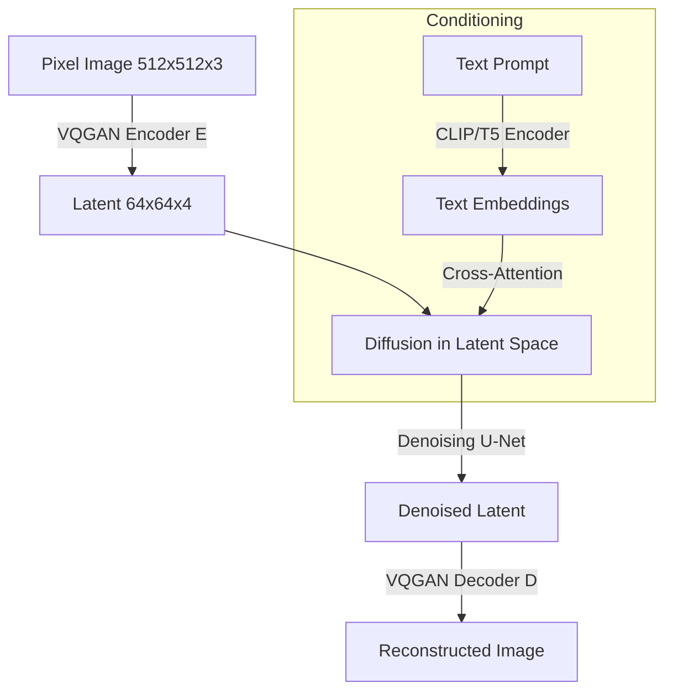

# Diffusion Models: DDPM to Flow Matching and Stable Diffusion

> **Last Updated:** June 2026
> **Level:** Advanced
> **Related Sections:** [GANs and VAEs](./00_gans_and_vaes.md) | [Video Generation](./02_video_generation.md) | [Evaluation and Safety](./04_evaluation_and_safety.md) | [3D Generation](./03_3d_generation.md)

---

## Overview

Diffusion probabilistic models define a generative process by learning to reverse a fixed Markov chain that gradually corrupts data with Gaussian noise. The foundational work of Ho et al. [Ho2020] recast the score-matching perspective of [Sohl-Dickstein2015] into a tractable training objective — a weighted MSE on the predicted noise — and demonstrated that DDPM could generate images competitive with GANs while training stably and without mode collapse. Within two years, diffusion models became the dominant paradigm for image, audio, video, and 3D generation.

The trajectory from DDPM to modern systems involves three major transitions. First, DDIM [Song2021] showed that the same trained DDPM model could be sampled deterministically in as few as 20–50 steps (vs. 1000), making inference practical. Second, Classifier-Free Guidance (CFG) [Ho2022] enabled high-quality text-conditional generation by jointly training a conditional and unconditional model and combining their score estimates at inference. Third, the Latent Diffusion Model (LDM) framework [Rombach2022] moved the diffusion process into the latent space of a pre-trained VQGAN tokenizer, reducing pixel-space compute by ~4–16× while preserving perceptual quality. This last step produced Stable Diffusion — the first open-source billion-parameter text-to-image model — and launched an ecosystem of fine-tuning methods (LoRA, DreamBooth, ControlNet) that democratized generative image production.

The most recent wave (2023–2025) replaces the score-matching / DDPM framework with **flow matching** [Lipman2022; Liu2022], which defines a straight-line ODE between noise and data rather than a curved diffusion path, enabling faster sampling and better scaling. Stable Diffusion 3 [Esser2024] and FLUX.1 [BlackForest2024] adopt Multiflow Matching (MM-DiT) on top of a Transformer backbone, establishing the current state of the art in open text-to-image generation.

---

## Forward and Reverse Process (DDPM)

The forward process gradually adds Gaussian noise over $T$ steps (typically $T=1000$):

```
q(x_t | x_{t-1}) = N(x_t; sqrt(1 - beta_t) * x_{t-1}, beta_t * I)

Closed-form marginal (reparameterized):
  q(x_t | x_0) = N(x_t; sqrt(alpha_bar_t) * x_0, (1 - alpha_bar_t) * I)

where:
  alpha_t = 1 - beta_t
  alpha_bar_t = prod_{s=1}^{t} alpha_s

Sampling shortcut:
  x_t = sqrt(alpha_bar_t) * x_0 + sqrt(1 - alpha_bar_t) * epsilon,
  epsilon ~ N(0, I)
```

The simplified training objective of [Ho2020] (derived from the ELBO by dropping weighting terms) is:

```
L_simple = E_{t, x_0, epsilon} [|| epsilon - epsilon_theta(x_t, t) ||^2]

where:
  t ~ U{1, ..., T}
  x_0 ~ q(x_0)
  epsilon ~ N(0, I)
  x_t = sqrt(alpha_bar_t) * x_0 + sqrt(1 - alpha_bar_t) * epsilon
```

At inference, the learned reverse process is:

```
p_theta(x_{t-1} | x_t) = N(x_{t-1}; mu_theta(x_t, t), sigma_t^2 * I)

mu_theta(x_t, t) = (1 / sqrt(alpha_t)) *
                   (x_t - (beta_t / sqrt(1 - alpha_bar_t)) * epsilon_theta(x_t, t))
```

---

## DDIM: Deterministic Sampling

Song et al. [Song2021] derived a non-Markovian generalization of the forward process that yields the same marginals as DDPM but admits a deterministic reverse ODE:

```
x_{t-1} = sqrt(alpha_bar_{t-1}) *
           ( (x_t - sqrt(1 - alpha_bar_t) * epsilon_theta(x_t, t))
             / sqrt(alpha_bar_t) )
         + sqrt(1 - alpha_bar_{t-1} - sigma_t^2) * epsilon_theta(x_t, t)
         + sigma_t * epsilon_t

With sigma_t = 0 (DDIM): fully deterministic, supports inversion.
With sigma_t = sqrt(beta_t): recovers DDPM.

Key result: DDIM with 50 steps achieves comparable FID to DDPM with 1000 steps.
DDIM inversion: run forward ODE to get x_T from x_0 (near-lossless for real images).
```

---

## Classifier-Free Guidance

[Ho2022] proposed training a single model that is simultaneously conditional ($\epsilon_\theta(x_t, c)$) and unconditional ($\epsilon_\theta(x_t, \emptyset)$) by randomly dropping the conditioning $c$ with probability $p_{uncond}$ (typically 0.1–0.2). At inference:

```
epsilon_hat(x_t, c) = epsilon_theta(x_t, null)
                     + w * (epsilon_theta(x_t, c) - epsilon_theta(x_t, null))

where w = guidance_scale (typically 7.5 for SD1.5, 3.5-5.0 for SDXL)

w = 0: unconditional sample
w = 1: standard conditional sample
w > 1: high-fidelity, low-diversity "sharpened" samples
```

CFG became the universal mechanism for text-to-image alignment. It effectively implements a form of implicit classifier guidance without requiring a separate classifier, and its guidance scale serves as the primary quality-diversity dial in all deployed text-to-image systems.

---

## Latent Diffusion Models (Stable Diffusion)

[Rombach2022] decoupled perceptual compression from diffusion learning:



The latent space compresses $512 \times 512 \times 3$ images to $64 \times 64 \times 4$ features (8× spatial downscaling, with a small regularization KL penalty or VQ). The diffusion U-Net operates on these latents, using cross-attention to inject text conditioning at multiple resolution levels. The result is that training and inference run at 1/64th the pixel-space cost while maintaining full perceptual quality after decoding.

**Stable Diffusion 1.5** (Runway / CompVis, 2022): 860M U-Net, CLIP ViT-L/14 text encoder, trained on LAION-5B.

**SDXL** (Stability AI, 2023): 3.5B dual-stream U-Net, dual text encoders (CLIP ViT-L and OpenCLIP ViT-bigG), 1024px native resolution, two-stage pipeline with refiner.

**Stable Diffusion 3** (Esser et al., 2024): Replaces U-Net with a Multimodal Diffusion Transformer (MM-DiT); uses flow matching instead of DDPM; 16-channel latent space; scales from 800M to 8B parameters.

---

## ControlNet

Zhang & Agrawala [Zhang2023] proposed ControlNet, which adds spatial conditioning (edges, depth maps, poses, segmentation masks) to frozen diffusion U-Nets by cloning the encoder blocks and connecting them via zero-initialized 1×1 convolutions:

```
c_f = trainable_conv_zero(c_raw)      # Zero init -> no-op at start
y = frozen_unet(x) + c_f             # Additive injection

Training: freeze original U-Net weights, train only the cloned encoder.
Supported conditions: Canny edges, HED, depth, normal, pose (OpenPose),
  segmentation (ADE20K), line art, scribble, reference image.
```

Zero initialization ensures that ControlNet starts as an identity and only gradually learns to steer generation, preventing gradient explosion. ControlNet enabled precise spatial layout control that CFG alone cannot provide.

---

## DreamBooth and LoRA

**DreamBooth** [Ruiz2023] fine-tunes the entire diffusion U-Net to associate a rare text token with a specific subject concept, using a prior-preservation loss to prevent language drift:

```
L = E[||epsilon - epsilon_theta(x_t, f("a [V] dog"))||^2]
  + lambda * E[||epsilon - epsilon_theta(x'^_t, f("a dog"))||^2]

where [V] is the rare identifier token (e.g., "sks"),
      x = subject images (~3-25 photos),
      x' = class images generated by the original model.
```

**LoRA** (Low-Rank Adaptation) [Hu2022] injects trainable low-rank decompositions into weight matrices without storing full fine-tuned weights:

```
W' = W_0 + delta_W = W_0 + B * A,
  B in R^{d x r}, A in R^{r x k}, rank r << min(d, k)

Typical: r = 4-64, reducing trainable parameters by 100-10000x.
LoRA + diffusion: applied to Q, K, V, Out projections of cross-attention.
File size: ~4-144MB vs. ~4GB for full model.
```

---

## Flow Matching (FLUX.1 and SD3)

Flow matching [Lipman2022; Liu2022] defines a conditional ODE from noise $p_0 = \mathcal{N}(0,I)$ to data $p_1 = p_{data}$ with straight-line paths, yielding a simpler loss than DDPM:

```
Conditional Flow Matching (CFM) loss:
  L_CFM = E_{t, x_0, x_1} [|| v_theta(x_t, t) - (x_1 - x_0) ||^2]

where:
  x_t = t * x_1 + (1 - t) * x_0,   t ~ U[0, 1]
  x_0 ~ N(0, I),  x_1 ~ p_data

Inference ODE:
  dx = v_theta(x, t) dt
  Solved by Euler / Heun / DPM-Solver with as few as 4-8 function evaluations.
```

Flow matching achieves more uniform loss weighting across noise levels (compared to DDPM's quadratic weighting toward low-noise steps), and straight paths reduce truncation error in ODE solvers. **FLUX.1** [BlackForestLabs2024] extends this with a dual-stream MM-DiT architecture (separate transformer streams for text and image tokens that interact via attention), achieving state-of-the-art text faithfulness and photorealism.

---

## DPM-Solver

DPM-Solver [Lu2022] provides high-order ODE solvers tailored to the semi-linear structure of diffusion model ODEs, achieving 10–20× speed improvement over naive Euler sampling:

```
Semi-linear ODE:
  dx = [f(t)*x - g^2(t)*score(x,t)/2] dt

DPM-Solver-2 update (2nd order):
  x_{t-h} = (alpha_{t-h}/alpha_t) * x_t
           - sigma_{t-h} * (e^h - 1) * D_theta(x_t, t)
           + sigma_{t-h} * (e^h - 1 - h) * (D1_theta) / h

Typical: 10-20 steps with DPM-Solver++ achieves quality comparable
         to 1000-step DDPM.
```

---

## Key Papers

| Paper | Authors | Year | Venue | Key Contribution |
|-------|---------|------|-------|-----------------|
| Denoising Diffusion Probabilistic Models (DDPM) | Ho et al. | 2020 | NeurIPS | Simplified noise prediction loss; cosine schedule; FID 3.17 on CIFAR-10 |
| Denoising Diffusion Implicit Models (DDIM) | Song et al. | 2021 | ICLR | Deterministic non-Markovian sampling; 50-step inference; lossless inversion |
| Diffusion Models Beat GANs on Image Synthesis | Dhariwal & Nichol | 2021 | NeurIPS | Classifier guidance; U-Net improvements; FID 3.94 ImageNet 256px |
| Classifier-Free Diffusion Guidance | Ho & Salimans | 2022 | NeurIPS Workshop | CFG; joint conditional/unconditional training; guidance scale |
| High-Resolution Image Synthesis with LDMs | Rombach et al. | 2022 | CVPR | Latent diffusion; cross-attention conditioning; Stable Diffusion |
| Adding Conditional Control (ControlNet) | Zhang & Agrawala | 2023 | ICCV | Spatial conditioning via zero-init cloned encoder; pluggable control |
| DreamBooth | Ruiz et al. | 2023 | CVPR | Few-shot subject-specific fine-tuning; prior-preservation loss |
| LoRA | Hu et al. | 2022 | ICLR | Low-rank weight adaptation; 100–10000× parameter reduction |
| Flow Matching for Generative Modeling | Lipman et al. | 2022 | ICLR 2023 | CFM loss; straight-line ODE paths; fast sampling |
| Scaling Rectified Flow (SD3) | Esser et al. | 2024 | ICML | MM-DiT + flow matching; 800M–8B params; multi-aspect training |
| DPM-Solver | Lu et al. | 2022 | NeurIPS | High-order ODE solvers for DDPM; 10-step generation |
| SDXL | Podell et al. | 2023 | ICLR 2024 | 3.5B dual U-Net; 1024px; two-stage refiner; CLIP+OpenCLIP |

---

## Benchmark Performance

| Model | Dataset | Metric | Score | Notes |
|-------|---------|--------|-------|-------|
| DDPM | CIFAR-10 | FID | 3.17 | 1000 NFE; unconditional |
| DDIM | CIFAR-10 | FID | 3.24 | 50 NFE; deterministic |
| ADM-G (Dhariwal) | ImageNet 256px | FID | 3.94 | Classifier guidance |
| LDM-8 | ImageNet 256px | FID | 7.76 | Latent diffusion, 8× compression |
| SD 1.5 | MS-COCO 30K | FID | ~14 | CLIP ViT-L; open weights |
| SDXL | MS-COCO 30K | FID | ~11 | 1024px native; refiner |
| DALL-E 3 | GenEval overall | Accuracy | 0.67 | Compositional generation benchmark |
| FLUX.1-dev | GenEval overall | Accuracy | 0.66 | Flow matching; open weights |
| SD3-Medium | T2I-CompBench overall | Score | not publicly reported | 8-channel latent; MM-DiT |
| FLUX.1-schnell | MS-COCO 30K | FID | ~8.5 | 4-step distilled model |

---

## Pros & Cons

| Aspect | Pros | Cons |
|--------|------|------|
| **Training stability** | Simple MSE loss; no adversarial instability; scales cleanly with data/compute | Very slow training (1000+ denoising steps per gradient); large datasets required |
| **Sample quality & diversity** | State-of-the-art FID, IS, human preference; full coverage of training distribution | Classifier-free guidance trades diversity for fidelity; high-guidance samples are "over-polished" |
| **Inference speed** | DDIM/DPM-Solver enable 10–50 NFE; distillation (LCM, SDXL-Turbo) achieves 1–4 steps | Still 10–100× slower than GAN single-pass; latency matters for interactive applications |
| **Conditioning flexibility** | CFG works zero-shot for any text/class; ControlNet adds spatial control without retraining | Complex multi-concept compositions still challenging; attribute binding errors common |
| **Ecosystem & fine-tuning** | Huge open ecosystem (LoRA, DreamBooth, ControlNet, IP-Adapter); Hugging Face Diffusers | Fine-tuning can cause catastrophic forgetting; LoRA merging can degrade base quality |

---

## Open Problems & Research Gaps

- **Inference efficiency**: Despite DPM-Solver and consistency distillation, achieving single-step diffusion at the quality of 20-step sampling without FID degradation remains unsolved; current distillation methods trade tail diversity for speed.
- **Compositional generation**: Text-to-image models still fail at counting, precise spatial relations (left/right), and multi-subject attribute binding — tasks humans find trivially easy. T2I-CompBench scores plateau well below human performance.
- **Video consistency**: Extending diffusion to video (temporal coherence, camera motion, physics) requires architectural innovations beyond frame-by-frame generation; see [Video Generation](./02_video_generation.md).
- **Training data efficiency**: State-of-the-art models require LAION-scale (billions of images) pretraining. Few-shot fine-tuning (DreamBooth with 3 images) works but generalizes poorly; data-efficient pretraining is unexplored.
- **Inversion faithfulness**: DDIM inversion works near-exactly only for the null-text case; real text-guided editing via inversion introduces semantic drift. Null-text inversion [Mokady2022] and its successors partially address this but remain fragile.
- **Flow matching vs. score matching**: The theoretical equivalence under specific parameterizations is established, but empirical advantages of flow matching (fewer NFE, better scaling) lack a complete theoretical account; the design space of ODE paths, schedules, and loss weighting is actively explored.
- **Memorization and privacy**: Diffusion models memorize training examples at measurable rates, raising copyright and privacy concerns. Mitigating memorization without hurting generation quality is an active open problem; see [Evaluation and Safety](./04_evaluation_and_safety.md).

---

## Further Reading

- [Ho et al. (2020), "Denoising Diffusion Probabilistic Models," NeurIPS 2020](https://arxiv.org/abs/2006.11239)
- [Song et al. (2021), "Denoising Diffusion Implicit Models," ICLR 2021](https://arxiv.org/abs/2010.02502)
- [Rombach et al. (2022), "High-Resolution Image Synthesis with Latent Diffusion Models," CVPR 2022](https://arxiv.org/abs/2112.10752)
- [Ho & Salimans (2022), "Classifier-Free Diffusion Guidance," NeurIPS 2022 Workshop](https://arxiv.org/abs/2207.12598)
- [Lipman et al. (2022), "Flow Matching for Generative Modeling," ICLR 2023](https://arxiv.org/abs/2210.02747)
- [Esser et al. (2024), "Scaling Rectified Flow Transformers for High-Resolution Image Synthesis," ICML 2024](https://arxiv.org/abs/2403.03206)
