# 3D Generation: From Score Distillation to Feed-Forward Reconstruction

> **Last Updated:** June 2026
> **Level:** Advanced
> **Related Sections:** [Diffusion Models](./01_diffusion_models.md) | [3D Vision and Scene Generation](../04_3d_vision_and_scene/04_3d_generation.md) | [Video Generation](./02_video_generation.md) | [GANs and VAEs](./00_gans_and_vaes.md)

---

## Overview

Generating 3D objects and scenes from text or images is significantly harder than 2D generation because ground-truth 3D supervision is scarce and expensive, the output space (meshes, point clouds, NeRFs, Gaussian splats) is high-dimensional and non-Euclidean, and evaluation of 3D quality requires multi-view consistency rather than a single-image FID score. The field bifurcated into two major paradigms: **optimization-based** methods that use 2D diffusion priors to guide iterative 3D optimization (DreamFusion, Magic3D), and **feed-forward** methods that train a large model to directly regress 3D structure from one or more images in a single forward pass (LRM, TripoSR).

The optimization-based paradigm was inaugurated by DreamFusion [Poole2022], which introduced Score Distillation Sampling (SDS) — using a frozen 2D diffusion model as a differentiable score function to update a NeRF representation. SDS is slow (hours per object) and suffers from over-saturation and the "Janus problem" (multi-face objects), but it requires no 3D training data. Subsequent work (Magic3D [Lin2023], ProlificDreamer [Wang2023], Fantasia3D) incrementally addressed these issues through coarse-to-fine strategies, variational distillation, and decoupled geometry-appearance optimization.

The feed-forward paradigm emerged from the Large Reconstruction Model (LRM) [Hong2023], which demonstrated that a transformer trained on Objaverse could reconstruct a NeRF or triplane representation from a single image in ~5 seconds. TripoSR [Tochilkin2024], an improved LRM trained with better data curation, reduced this to under 0.5 seconds. DreamGaussian [Tang2023] bridged the two paradigms by using 2D diffusion for image generation and a fast Gaussian splatting optimization for 3D lift, achieving minutes-per-object speed.

---

## Score Distillation Sampling (SDS)

DreamFusion [Poole2022] introduced SDS to distill knowledge from a 2D diffusion model $\epsilon_\phi$ into a 3D representation $\theta$ (NeRF parameters) without 3D supervision:

```
SDS Loss:
  grad_theta L_SDS = E_{t, epsilon, c} [
    w(t) * (epsilon_phi(z_t; y, t) - epsilon) * (partial z / partial theta)
  ]

where:
  z = g(theta)        -- render image from current NeRF parameters
  z_t = alpha_t*z + sigma_t*epsilon  -- noisy version
  epsilon_phi(z_t; y, t) -- diffusion model noise prediction given text y
  w(t)                -- weighting function (SNR-dependent)

Interpretation:
  Pushes rendered images toward high-probability regions of p(x|y)
  as defined by the diffusion model's score function.

Problems:
  1. Oversaturation: predicted noise != added noise -> oversmoothed colors
  2. Janus problem: each view independently maximizes p(x|y) -> multi-faced objects
  3. Speed: ~30-60 min per object on A100
```

Variational Score Distillation (VSD, ProlificDreamer [Wang2023]) addresses oversaturation by using a LoRA-fine-tuned diffusion model as a variational posterior rather than the fixed base model, treating the 3D representation as a particle in the variational distribution.

---

## The Janus Problem

The Janus problem is the defining failure mode of optimization-based 3D generation: because SDS renders the 3D object from random viewpoints and each view is independently evaluated by a 2D diffusion model, the model tends to place a "frontal" appearance (e.g., a face with two eyes, a frontal body) on every side of the object, producing multi-headed or multi-faced artifacts named after the two-faced Roman god Janus.

```
Root cause:
  2D diffusion model p(x|"a dog") -- agnostic to 3D camera pose context
  Rendered back: optimized for p(x|y) from all azimuths independently
  => Each 90-degree view converges to the "most likely" frontal appearance

Mitigations:
  1. View-dependent prompting: "front view of a dog" / "side view of a dog"
     injected as part of the conditioning text (DreamFusion)
  2. Zero-1-to-3 [Liu2023]: View-conditioned diffusion model trained on
     Objaverse; provides consistent multi-view prior
  3. MVDiffusion / SyncDreamer: Jointly generate N consistent views
     with explicit cross-view attention before 3D optimization
  4. Feed-forward models: Sidestep optimization entirely
```

---

## Magic3D and the Coarse-to-Fine Pipeline

Magic3D [Lin2023] (CVPR 2023) established a two-stage coarse-to-fine pipeline:
1. **Coarse stage**: Fast SDS optimization of a NeRF at low resolution (64³ grid) to obtain overall shape.
2. **Fine stage**: Extract an explicit mesh (marching cubes) and refine with a high-resolution diffusion model, using a differentiable mesh renderer (nvdiffrast) for gradient flow through triangle rasterization.

```
Stage 1: NeRF theta <- SDS with fast low-res diffusion model (Imagen)
  ~45 min on A100

Stage 2: theta -> mesh M via marching cubes
  M <- SDS with high-res diffusion (DeepFloyd IF)
  Differentiable render: L = LSDS(render(M)) + Lreg
  ~25 min on A100

Result: 8x higher resolution than DreamFusion; sharper texture details.
```

---

## Zero-1-to-3: View-Conditioned Diffusion

Zero-1-to-3 [Liu2023] (ICCV 2023) fine-tuned Stable Diffusion to synthesize a novel view of an object given a reference image and a camera transformation $(R, T)$:

```
Input:  (x, R, T)  -- reference image x, relative camera extrinsics (R, T)
Output: x'         -- novel view of the same object

Conditioning: CLIP image features of x + (R, T) encoded as tokens
Model: SD1.5 fine-tuned on Objaverse renderings + real objects (CO3D)

Inference for 3D generation:
  1. Synthesize N=8-64 views using Zero-1-to-3
  2. Optimize a NeRF using multi-view reconstruction loss on synthetic views
```

The key contribution is that a 2D diffusion model trained on synthetic multi-view data retains strong zero-shot generalization to real-world objects, enabling SDS-free 3D generation from a single image.

---

## LRM and TripoSR: Feed-Forward Reconstruction

The Large Reconstruction Model [Hong2023] trains a transformer to map a single image to a triplane NeRF representation:

```
Input:  single RGB image (x)
Encoder: ViT image encoder -> image tokens [N_img tokens]
Decoder: Transformer cross-attends image tokens -> triplane features
  Triplane: 3x (H x W) feature planes (XY, XZ, YZ) ~ 64x64 resolution
Output: NeRF queried via triplane interpolation -> volume render

Training: ~1M 3D objects (Objaverse); rendered 32 views/object
Loss: L2 render loss + LPIPS
Inference: ~5s on V100

TripoSR [Tochilkin2024]: LRM with:
  - Better data curation (higher quality Objaverse subset + filtering)
  - Improved renderer (volume render with masked background)
  - Faster inference: <0.5s on A100 (batch=1)
  - Open weights (MIT license)
```

---

## DreamGaussian

DreamGaussian [Tang2023] uses 3D Gaussian Splatting (3DGS) as the representation, enabling ~3-minute text/image-to-3D generation:

```
Stage 1: Generative Gaussian Splatting
  - Initialize 3DGS from point cloud (CLIP-guided or random)
  - SDS optimization on rendered views from 3DGS
  - 3DGS allows faster rendering than NeRF (rasterization vs. ray marching)

Stage 2: Mesh extraction and UV texture refinement
  - Convert 3DGS -> mesh via alpha-blended marching cubes
  - Refine texture in UV space using diffusion inpainting
  - Output: mesh + UV texture map (exportable .obj/.glb)

Speed: ~3 min (vs. 30-60 min for DreamFusion)
```

---

## Shap-E and Point-E (OpenAI)

**Point-E** [Nichol2022] generates a colored 3D point cloud from text or image input using a two-stage pipeline: (1) generate a single rendered view of the object, (2) use a diffusion model conditioned on the rendered view to generate a 4096-point RGB point cloud. Fast (~1-2 min) but produces coarse geometry.

**Shap-E** [Jun2023] improves on Point-E by directly generating the parameters of an implicit function (NeRF or SDF) rather than a point cloud. A transformer encoder-decoder maps 3D assets to implicit function parameters; a diffusion model is trained over these latents. Shap-E can produce meshes, point clouds, and NeRF representations from text or image conditioning. Both are open-source OpenAI models.

---

## MeshGPT

MeshGPT [Siddiqui2024] (CVPR 2024) directly generates triangle meshes using an autoregressive decoder-only Transformer, treating mesh generation as a sequence prediction task:

```
Tokenization:
  - Sort mesh faces by vertex position (z-first Morton ordering)
  - Each triangle -> 9 coordinate values (3 vertices x 3D)
  - Quantize to K-bit integers (K=7, 128 levels per axis)
  - Each face = 3 tokens (each encoding x,y,z of one vertex)
  - Codebook learned via VQ-VAE on face sequences

Autoregressive generation:
  p(mesh) = prod_{i=1}^{N} p(face_i | face_{1..i-1}, class_token)

Conditional on ShapeNet-Core class labels.
Produces valid, compact, non-watertight meshes; no NeRF rendering needed.
```

---

## Mermaid: 3D Generation Paradigm Map

```mermaid
graph TD
    subgraph Optimization-Based
        T1[Text Prompt] --> SDS[Score Distillation Sampling]
        I1[Single Image] --> Zero123[Zero-1-to-3 Views]
        SDS --> NeRF[NeRF Optimization]
        Zero123 --> NeRF
        NeRF --> Mesh[Mesh Extraction]
    end

    subgraph Feed-Forward
        I2[Single Image] --> LRM[LRM / TripoSR Transformer]
        LRM --> Triplane[Triplane NeRF]
        Triplane --> Render[Volume Render]
    end

    subgraph Hybrid
        I3[Image/Text] --> DG[DreamGaussian SDS]
        DG --> 3DGS[3D Gaussian Splats]
        3DGS --> Mesh2[Mesh + UV Texture]
    end

    subgraph Discrete
        T2[Text/Class] --> MeshGPT[MeshGPT Autoregressive]
        MeshGPT --> TriMesh[Triangle Mesh Tokens]
    end
```



---

## Key Papers

| Paper | Authors | Year | Venue | Key Contribution |
|-------|---------|------|-------|-----------------|
| DreamFusion | Poole et al. | 2022 | ICLR 2023 | Score Distillation Sampling; text-to-NeRF without 3D data |
| Magic3D | Lin et al. | 2023 | CVPR | Coarse-to-fine NeRF→mesh; 8× higher resolution than DreamFusion |
| Zero-1-to-3 | Liu et al. | 2023 | ICCV | View-conditioned diffusion on Objaverse; zero-shot image-to-3D |
| Large Reconstruction Model (LRM) | Hong et al. | 2023 | ICLR 2024 | Feed-forward transformer; single image → triplane NeRF in 5s |
| TripoSR | Tochilkin et al. | 2024 | arXiv | LRM variant; <0.5s inference; open weights (MIT license) |
| DreamGaussian | Tang et al. | 2023 | ICLR 2024 | 3DGS as optimization target; mesh extraction; 3 min/object |
| Point-E | Nichol et al. | 2022 | arXiv | Two-stage point cloud generation; fast but coarse |
| Shap-E | Jun & Nichol | 2023 | arXiv | Implicit function parameter generation; text/image to mesh/NeRF |
| MeshGPT | Siddiqui et al. | 2024 | CVPR | Autoregressive triangle mesh generation; VQ tokenization |
| SyncDreamer | Liu et al. | 2023 | ICLR 2024 | Joint multi-view diffusion with cross-view attention; Janus mitigation |

---

## Benchmark Performance

| Model | Dataset | Metric | Score | Notes |
|-------|---------|--------|-------|-------|
| DreamFusion | COCO (text prompts) | CLIP R-Precision | 74.9% | Rendered views vs. text |
| Magic3D | COCO | CLIP R-Precision | 79.1% | Higher quality than DreamFusion |
| Zero-1-to-3 | GSO | PSNR | 21.3 | Novel view synthesis; Google Scanned Objects |
| LRM | GSO | PSNR | 22.6 | Single-image reconstruction |
| TripoSR | GSO | CD (Chamfer) | 0.041 | Lower is better; <0.5s inference |
| Shap-E | ShapeNet-Core | FID (renders) | not publicly reported | OpenAI internal evaluation |
| MeshGPT | ShapeNet-Core | Coverage (COV) | 56.8% | Autoregressive mesh generation |
| DreamGaussian | T3Bench | Quality Score | 28.1 | Human evaluation on T3Bench |

---

## Pros & Cons

| Aspect | Pros | Cons |
|--------|------|------|
| **Optimization-based (SDS)** | No 3D training data needed; generalizes to arbitrary text prompts; produces smooth geometry | Very slow (30–60 min/object); Janus problem; over-saturation artifacts; NeRF to mesh conversion lossy |
| **Feed-forward (LRM/TripoSR)** | Near real-time (<0.5s); consistent 3D structure; no per-object optimization | Requires large-scale 3D training data (Objaverse); limited to reconstruction, poor extrapolation beyond training distribution |
| **Gaussian splatting (DreamGaussian)** | Faster than NeRF-based optimization; direct mesh export; good for asset pipelines | Gaussian-to-mesh conversion still imperfect; floaters and discontinuities in exported meshes |
| **Discrete mesh (MeshGPT)** | CAD-quality topology; directly useful for downstream 3D applications | Limited to single-category training domains; does not handle open-vocabulary text prompts |

---

## Open Problems & Research Gaps

- **Janus problem at scale**: Despite mitigation strategies (view-conditioned diffusion, multi-view joint generation), the Janus problem resurfaces at fine-grained detail levels when the 2D prior is strongly opinionated about appearance. A principled solution based on 3D-aware diffusion is still lacking.
- **Open-vocabulary text-to-3D generalization**: Feed-forward models overfit to Objaverse categories (toys, household objects). Generalizing to rare objects, complex scene compositions, or abstract 3D concepts requires either larger datasets or better compositional representations.
- **Dynamic 3D generation**: Generating animatable 3D assets (rigged characters, physics-animated objects) remains largely unsolved. Current methods produce static geometry; 4D generation (3D + time) is emerging but far from practical.
- **Scene-level 3D generation**: Most methods generate single isolated objects. Generating coherent multi-object 3D scenes from text prompts (with correct spatial relationships, occlusion handling, and lighting) is an open problem.
- **Efficient 3D representations**: NeRF representations are compact but slow to render; 3DGS is fast but mesh export is lossy; meshes are application-friendly but hard to generate directly. No single representation satisfies all downstream use-case requirements simultaneously.
- **Evaluation gap**: No widely-adopted benchmark equivalent to FID exists for 3D generation that jointly measures geometry accuracy, texture quality, 3D consistency, and diversity. T3Bench, ULIP-2 evaluations, and human preference studies are inconsistent across papers.
- **Material and lighting separation**: Most generated 3D assets bake illumination into texture, producing wrong appearance under novel lighting conditions. Disentangled material/lighting representation (PBR material generation) remains an active research frontier.

---

## Further Reading

- [Poole et al. (2022), "DreamFusion: Text-to-3D using 2D Diffusion," ICLR 2023](https://arxiv.org/abs/2209.14988)
- [Liu et al. (2023), "Zero-1-to-3: Zero-shot One Image to 3D Object," ICCV 2023](https://arxiv.org/abs/2303.11328)
- [Hong et al. (2023), "LRM: Large Reconstruction Model for Single Image to 3D," ICLR 2024](https://arxiv.org/abs/2311.04400)
- [Tochilkin et al. (2024), "TripoSR: Fast 3D Object Reconstruction from a Single Image"](https://arxiv.org/abs/2403.02151)
- [Tang et al. (2023), "DreamGaussian: Generative Gaussian Splatting for Efficient 3D Content Creation," ICLR 2024](https://arxiv.org/abs/2309.16653)
- [Siddiqui et al. (2024), "MeshGPT: Generating Triangle Meshes with Decoder-Only Transformers," CVPR 2024](https://arxiv.org/abs/2311.15475)
