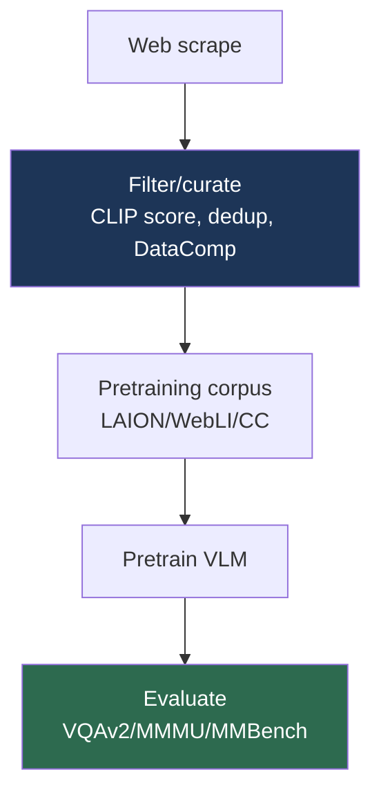

# Multimodal Datasets

> **Last Updated:** June 2026
> **Level:** Intermediate
> **Related Sections:**
> - [Large Vision-Language Models](../05_multimodal_vision_language/02_large_vision_language_models.md)
> - [Core Datasets](./00_core_datasets.md)
> - [Evaluation Metrics](./04_evaluation_metrics.md)
> - [Scaling Laws in Vision](../12_research_frontier_2024_2026/01_scaling_laws_vision.md)

---

## Overview

Multimodal datasets—paired image-text (and increasingly video-text and interleaved) corpora—are the fuel of the vision-language era. Their scale and quality determine the capabilities of every model from CLIP to GPT-4o (see [Large Vision-Language Models](../05_multimodal_vision_language/02_large_vision_language_models.md)). Two distinct dataset categories serve different stages: **web-scale pretraining corpora** (LAION-5B, WebLI, DataComp) provide the billions of noisy image-text pairs needed for contrastive and generative pretraining, while **curated benchmark datasets** (VQAv2, GQA, MMMU, MMBench) provide the cleaner, annotated evaluations that measure progress. The defining tension of this subfield—established empirically by DataComp and MetaCLIP—is that **data quality and curation often matter more than raw quantity** (see [Scaling Laws in Vision](../12_research_frontier_2024_2026/01_scaling_laws_vision.md)).

A critical, often-underappreciated issue is that the largest pretraining corpora are web-scraped and therefore carry noise, bias, duplication, NSFW content, and copyright/privacy concerns. LAION-5B's temporary withdrawal over problematic content underscored that dataset governance is now a first-order research and ethical concern, not an afterthought. This file surveys the major pretraining corpora and evaluation benchmarks, their scale and construction, and the open problems of curation, contamination, and governance.

---

## Web-Scale Pretraining Corpora

- **LAION-400M / LAION-5B** [Schuhmann2022] — open CLIP-filtered image-text pairs (400M / 5.85B); the corpus behind open CLIP and Stable Diffusion. Influential but raised content-governance issues (temporarily taken down for re-filtering).
- **Conceptual Captions (CC3M / CC12M)** — Google's cleaned, alt-text-derived image-caption pairs (3M / 12M); higher quality, smaller scale.
- **WebLI** (Google) — ~10B+ multilingual image-text pairs behind PaLI/SigLIP (not public).
- **DataComp** [Gadre2023] — not a fixed dataset but a *benchmark for data curation*: a fixed candidate pool with filtering tracks, demonstrating curation beats scale.
- **WebVid / HowTo100M / VideoCC** — large video-text corpora for video-language pretraining (see [Video Datasets](./01_video_datasets.md)).

## Evaluation Benchmarks

- **VQAv2** [Goyal2017] — visual question answering with balanced answer pairs to counter language priors; the standard VQA benchmark.
- **GQA** — compositional VQA from scene graphs, testing reasoning over relations.
- **Visual Genome** — dense annotations: objects, attributes, relationships, region captions; basis for scene-graph and grounding work.
- **COCO Captions** — 5 captions per image over MS-COCO; the captioning/retrieval standard.
- **MMMU** [Yue2024] — massive multi-discipline multimodal understanding (college-level), the hard reasoning benchmark for modern LMMs.
- **MMBench** — systematically constructed multiple-choice multimodal benchmark with circular evaluation; **MathVista** (visual math), **DocVQA** (documents), **TextVQA** (scene text), **POPE** (hallucination) round out the LMM evaluation suite.

---

## Key Datasets

| Dataset | Authors/Org | Year | Scale | Purpose |
|---------|-------------|------|-------|---------|
| LAION-5B | Schuhmann et al. | 2022 | 5.85B pairs | Open CLIP/diffusion pretraining |
| Conceptual Captions | Sharma et al. | 2018 | 3M/12M | Cleaner caption pretraining |
| DataComp | Gadre et al. | 2023 | benchmark | Data-curation evaluation |
| VQAv2 | Goyal et al. | 2017 | 1.1M QA | Balanced VQA |
| Visual Genome | Krishna et al. | 2017 | 108K images | Dense scene-graph annotations |
| MMMU | Yue et al. | 2024 | 11.5K Q | College-level multimodal reasoning |

---

## Benchmark Snapshot (indicative LMM scores)

| Benchmark | What it tests | Strong model (approx.) |
|-----------|---------------|------------------------|
| MMMU | Expert reasoning | ~70 (InternVL2.5 / GPT-4o) |
| MMBench | Broad perception | ~85–88 |
| MathVista | Visual math | ~63–72 |
| DocVQA | Document reading | ~92–96 |
| POPE | Hallucination | high but imperfect |

*Scores approximate, version- and protocol-dependent.*

---

## Pros & Cons

| Aspect | Pros | Cons |
|--------|------|------|
| Web-scale corpora | Enable foundation-scale pretraining | Noise, bias, NSFW, copyright/privacy |
| Curated benchmarks | Clean, comparable evaluation | Saturation, contamination, format-overfit |
| Compositional benchmarks (GQA/MMMU) | Test reasoning, not memorization | Costly to build; still gameable |

---

## Open Problems & Research Gaps

- **Data governance.** Consent, copyright, privacy, and harmful content in web-scale corpora are unresolved (LAION withdrawal).
- **Curation theory.** DataComp shows curation matters but lacks a predictive theory of *what* to keep (see [Scaling Laws in Vision](../12_research_frontier_2024_2026/01_scaling_laws_vision.md)).
- **Benchmark contamination.** Test data leaking into pretraining inflates scores; clean held-out evaluation is hard.
- **Saturation.** VQAv2/COCO are near-saturated; harder, robust benchmarks (MMMU) age quickly too.
- **Cultural/linguistic bias.** English- and Western-centric data skews model behavior.
- **Multimodal coverage.** Beyond image-text, paired video/audio/3D-text data remains scarce (see [3D & Robotics Datasets](./02_3d_and_robotics_datasets.md)).
- **Synthetic data quality.** As model-generated captions and images increasingly enter training corpora, controlling for model-collapse effects and verifying synthetic-data fidelity is an emerging, unsolved concern.
- **Dynamic benchmarks.** Static leaderboards age quickly against fast-improving models; live, contamination-resistant, periodically-refreshed evaluation remains an open infrastructure problem.

---

## Further Reading

- [LAION-5B (arXiv:2210.08402)](https://arxiv.org/abs/2210.08402) — open web-scale image-text
- [DataComp (arXiv:2304.14108)](https://arxiv.org/abs/2304.14108) — data curation benchmark
- [VQAv2 (arXiv:1612.00837)](https://arxiv.org/abs/1612.00837) — balanced visual QA
- [MMMU (arXiv:2311.16502)](https://arxiv.org/abs/2311.16502) — multi-discipline multimodal benchmark
- [Visual Genome (arXiv:1602.07332)](https://arxiv.org/abs/1602.07332) — dense annotations
