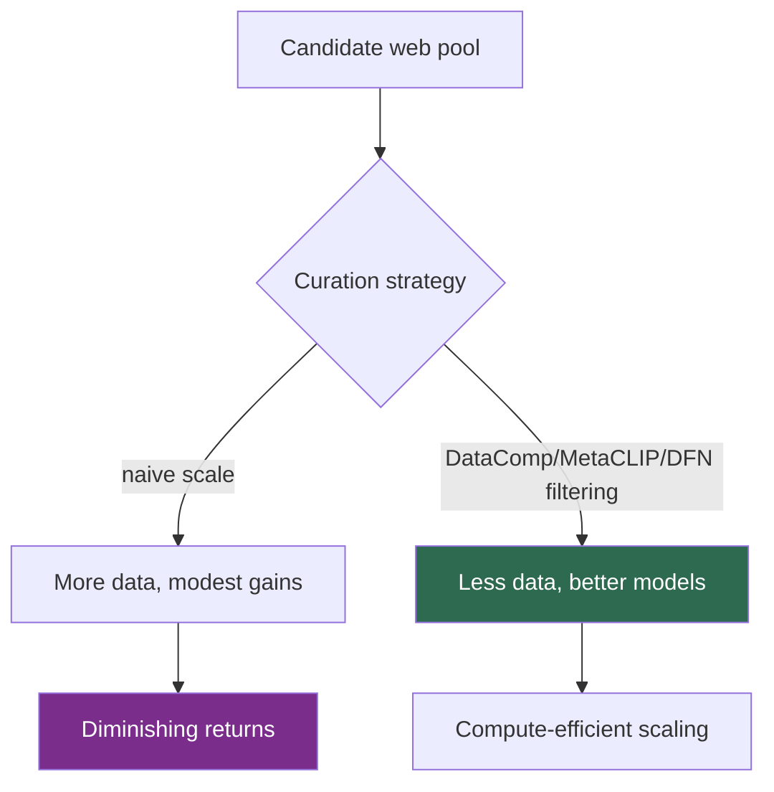

# Scaling Laws in Vision

> **Last Updated:** June 2026
> **Level:** Research Frontier
> **Related Sections:**
> - [Vision Transformers](../03_architectures/01_vision_transformers.md)
> - [Self-Supervised Learning](../03_architectures/03_self_supervised_learning.md)
> - [Multimodal Architectures](../03_architectures/04_multimodal_architectures.md)
> - [Overview: Latest](./00_overview_latest.md)

---

## Overview

Scaling laws—empirical power-law relationships between model performance and the resources of parameters, data, and compute—reshaped language modeling via Kaplan et al. (2020) and the Chinchilla compute-optimal analysis (Hoffmann et al., 2022). The central question for vision is whether these laws transfer: do bigger vision backbones, more data, and more compute yield the same smooth, predictable returns, and is there a compute-optimal parameter/data ratio analogous to Chinchilla's? The 2022–2026 evidence is nuanced: vision models *do* scale, but generally **more slowly and with stronger diminishing returns** than language models, and **data quality dominates raw quantity** to a degree not seen in text.

The canonical demonstrations are ViT-22B [Dehghani2023], which scaled a plain Vision Transformer to 22 billion parameters and showed continued but sublinear gains; the contrastive-vision-language scaling of CLIP/EVA-CLIP/SigLIP; and the data-curation results from DataComp and MetaCLIP showing that *which* image-text pairs you train on can matter more than how many. This file formalizes the scaling relationships, surveys the empirical evidence, and explains why vision's scaling behavior diverges from language's—a divergence with direct consequences for the embodied-AI scaling debate in [Pros, Cons & Roadmaps](../06_robotics_and_embodied_ai/07_pros_cons_roadmaps.md).

---

## The Mathematics of Scaling

A scaling law expresses test loss `L` as a power law in a resource. For a resource `X` (parameters `N`, data `D`, or compute `C`):

```
L(X) ≈ L_inf + (X_0 / X)^alpha
  L_inf : irreducible loss (Bayes error / entropy floor)
  alpha : scaling exponent (larger ⇒ faster returns)
```

Chinchilla's compute-optimal result for language minimizes loss under a compute budget `C ≈ 6·N·D`, yielding `N_opt ∝ C^a`, `D_opt ∝ C^b` with `a ≈ b ≈ 0.5`—i.e., parameters and tokens should grow roughly *equally*. The empirical finding for vision is that the exponents `alpha` tend to be **smaller** (slower returns) and that `L_inf` is reached sooner on saturated benchmarks (ImageNet top-1 plateaus near human-level), so additional scale buys progressively less on classification while still helping transfer and robustness.

---

## Empirical Evidence in Vision

### Scaling the Backbone: ViT-22B and ViT scaling laws

Zhai et al. (2022), *Scaling Vision Transformers*, mapped ViT performance across model and data scale and characterized a saturating power law; **ViT-22B** [Dehghani2023] then pushed to 22B parameters, improving fairness, robustness, and transfer but with clearly diminishing per-FLOP returns on ImageNet. The lesson: vision benefits from scale most on *transfer and robustness*, less on saturated in-distribution accuracy.

### Contrastive Vision-Language: CLIP, EVA-CLIP, SigLIP

CLIP [Radford2021] established that contrastive image-text pretraining scales with data and model size for zero-shot transfer. **EVA-CLIP** scaled masked-image-modeling-initialized CLIP efficiently to billions of parameters; **SigLIP** [Zhai2023] replaced the softmax contrastive loss with a **sigmoid loss** that decouples batch size from the loss normalization, improving scaling efficiency at small and large batch sizes alike. These show that *objective design* materially changes the scaling constant.

### Data Quality over Quantity: DataComp, MetaCLIP, DFN

The strongest vision-specific finding is that **data curation rivals or beats scale**. **DataComp** (Gadre et al., 2023) framed dataset design as the experimental variable and showed that aggressive filtering of a fixed candidate pool yields better models than naively using more data. **MetaCLIP** reverse-engineered CLIP's curation to make it reproducible, and **DFN (Data Filtering Networks)** trained a network to select high-quality pairs, producing DFN-2B/5B that outperform much larger uncurated sets. This is the vision analogue of the "quality tokens" lesson in language, but more pronounced because web image-text alignment is noisier than text.



---

## Key Papers

| Paper | Authors | Year | Venue | Key Contribution |
|-------|---------|------|-------|-----------------|
| Scaling Vision Transformers | Zhai, Kolesnikov, Houlsby, Beyer | 2022 | CVPR | Empirical saturating scaling law for ViTs |
| ViT-22B | Dehghani, Djolonga, Mustafa, et al. | 2023 | ICML | 22B-param ViT; gains in robustness/transfer, sublinear |
| SigLIP (Sigmoid loss) | Zhai, Mustafa, Kolesnikov, Beyer | 2023 | ICCV | Sigmoid contrastive loss for efficient scaling |
| DataComp | Gadre, Ilharco, Fang, et al. | 2023 | NeurIPS | Dataset design as the scaling variable; curation > scale |
| Data Filtering Networks (DFN) | Fang, Jose, Jain, et al. | 2023 | arXiv→ICLR | Learned data filtering yields DFN-2B/5B |

---

## Benchmark Performance

| Model | Params | Setting | Result | Notes |
|-------|--------|---------|--------|-------|
| ViT-22B | 22B | ImageNet transfer | SOTA robustness/fairness | Sublinear per-FLOP gains [Dehghani2023] |
| SigLIP | ~400M–1B | Zero-shot ImageNet | Strong, batch-efficient | Sigmoid loss [Zhai2023] |
| DFN-5B-CLIP | ViT-scale | Zero-shot ImageNet | Beats larger uncurated sets | Learned filtering |
| CLIP ViT-L/14 | ~300M | Zero-shot ImageNet | 75–76% top-1 | Baseline contrastive scaling |

---

## Pros & Cons

| Aspect | Pros | Cons |
|--------|------|------|
| Scaling backbones | Predictable gains in transfer/robustness | Strong diminishing returns on saturated benchmarks |
| Contrastive scaling (CLIP/SigLIP) | Zero-shot transfer scales with data | Sensitive to objective and batch design |
| Data curation (DataComp/DFN) | Compute-efficient; quality beats quantity | Curation pipelines complex; risk of distribution narrowing |
| Chinchilla-style compute-optimality | Principled budget allocation | Vision exponents differ; recipe not directly portable |

---

## Open Problems & Research Gaps

- **A vision Chinchilla.** No agreed compute-optimal `N`/`D` law for vision backbones exists; exponents vary by objective and benchmark.
- **Benchmark saturation.** ImageNet top-1 is near `L_inf`; scaling research lacks unsaturated, transfer-relevant metrics.
- **Quality vs. quantity formalization.** DataComp/DFN are empirical; a predictive theory of data quality's effect on the scaling constant is missing.
- **Self-supervised scaling.** Whether MIM/contrastive SSL (see [Self-Supervised Learning](../03_architectures/03_self_supervised_learning.md)) scales like supervised/contrastive-VL is under-characterized—DINOv2 suggests curation again dominates.
- **Multimodal joint scaling.** Optimal allocation across vision encoder, connector, and LLM in VLMs (see [Large Vision-Language Models](../05_multimodal_vision_language/02_large_vision_language_models.md)) is unsolved.
- **Embodied scaling laws.** Whether robot policies follow analogous laws is actively debated (see [Pros, Cons & Roadmaps](../06_robotics_and_embodied_ai/07_pros_cons_roadmaps.md)).
- **Energy/efficiency frontiers.** Scaling laws ignore the rising marginal energy cost that increasingly bounds practical scale.

---

## Further Reading

- [Scaling Vision Transformers (arXiv:2106.04560)](https://arxiv.org/abs/2106.04560) — ViT scaling behavior
- [ViT-22B (arXiv:2302.05442)](https://arxiv.org/abs/2302.05442) — scaling ViTs to 22B parameters
- [SigLIP (arXiv:2303.15343)](https://arxiv.org/abs/2303.15343) — sigmoid loss for language-image pretraining
- [DataComp (arXiv:2304.14108)](https://arxiv.org/abs/2304.14108) — dataset design as the scaling variable
- [Chinchilla (arXiv:2203.15556)](https://arxiv.org/abs/2203.15556) — compute-optimal scaling (language reference)
