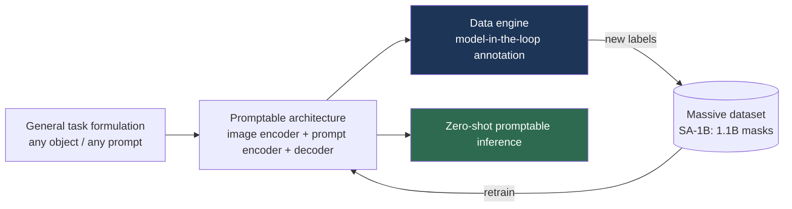

# The "Anything" Model Paradigm

> **Last Updated:** June 2026
> **Level:** Research Frontier
> **Related Sections:**
> - [Semantic Segmentation](../02_core_tasks/02_semantic_segmentation.md)
> - [Depth Estimation](../02_core_tasks/05_depth_estimation.md)
> - [Open-Vocabulary Detection](../05_multimodal_vision_language/03_open_vocabulary_detection.md)
> - [Overview: Latest](./00_overview_latest.md)

---

## Overview

The "Segment Anything"-style paradigm is the most consequential structural shift in computer vision of 2023–2024: the replacement of narrow, dataset-specific models with **single foundation models that solve a task universally via promptable inference**. The template, established by SAM [Kirillov2023], has three reproducible ingredients: (1) a **task formulation general enough to span a whole problem class** (any object, any prompt, any image); (2) a **data engine** that bootstraps a massive labeled dataset by iterating model-in-the-loop annotation; and (3) a **promptable architecture** that performs zero-shot inference on new inputs without retraining. The same recipe was rapidly transplanted to depth (Depth Anything), recognition (Recognize Anything), and tracking (Track Anything), producing a family of "X-Anything" models that now serve as off-the-shelf perceptual primitives—including for robotics, where they supply scene representations (see [Perception for Robotics](../06_robotics_and_embodied_ai/08_perception_for_robotics.md)).

What makes a model genuinely "universal" rather than merely large is the combination of **task generality** and **prompt-based zero-shot transfer**. SAM does not classify; it segments *whatever it is pointed at*, decoupling the geometric task (find the mask) from the semantic task (name it). This separation is the paradigm's conceptual core and the reason these models compose so well with open-vocabulary semantics (Grounded-SAM = Grounding DINO + SAM). This file dissects the recipe, surveys the major instances, and examines the limits of universality.

---

## The Recipe

### Segment Anything (SAM, SAM2)

**SAM** [Kirillov2023] (ICCV 2023, Meta) consists of a heavy ViT image encoder, a lightweight prompt encoder (points, boxes, masks), and a fast mask decoder, trained on **SA-1B: 1.1 billion masks over 11 million images**, built by a three-stage data engine (assisted-manual → semi-automatic → fully automatic). It performs **zero-shot promptable segmentation** on unseen distributions. **SAM 2** [Ravi2024] (Meta, 2024) extends this to **video** with a streaming memory module enabling promptable segmentation and tracking across frames in real time, trained with the SA-V data engine on a far larger and more diverse video corpus (see [Semantic Segmentation](../02_core_tasks/02_semantic_segmentation.md)).

### Depth Anything

**Depth Anything** [Yang2024a] (CVPR 2024) and **Depth Anything V2** [Yang2024b] apply the recipe to **monocular depth estimation**, scaling to ~62M+ images by leveraging large-scale *unlabeled* data with pseudo-labels from a teacher, plus semantic priors. V2 trains on synthetic labeled + pseudo-labeled real data to produce sharp, robust relative depth that is now a default perceptual primitive—including for the spatial-data pipelines of [Spatial Intelligence](./06_spatial_intelligence.md) (see [Depth Estimation](../02_core_tasks/05_depth_estimation.md)).

### Recognize / Track / Grounded Anything

**Recognize Anything (RAM, RAM++)** [Zhang2023] provides strong open-set image tagging. **Track Anything** couples SAM with video trackers for interactive video object segmentation. **Grounded-SAM** composes **Grounding DINO** (open-vocabulary detection, see [Open-Vocabulary Detection](../05_multimodal_vision_language/03_open_vocabulary_detection.md)) with SAM to achieve text-prompted "detect-and-segment anything," exemplifying the paradigm's compositionality.

---

## Key Papers

| Paper | Authors | Year | Venue | Key Contribution |
|-------|---------|------|-------|-----------------|
| Segment Anything (SAM) | Kirillov, Mintun, Ravi, et al. | 2023 | ICCV | Promptable segmentation + SA-1B (1.1B masks) data engine |
| SAM 2 | Ravi, Gabeur, Hu, et al. | 2024 | Meta / arXiv | Promptable segmentation & tracking in video w/ memory |
| Depth Anything | Yang, Kang, Huang, et al. | 2024 | CVPR | Monocular depth foundation via large unlabeled data |
| Depth Anything V2 | Yang, Kang, Huang, et al. | 2024 | NeurIPS | Sharper, robust depth via synthetic + pseudo-labels |
| Recognize Anything (RAM) | Zhang, Huang, Ma, et al. | 2023 | arXiv→CVPRW | Strong open-set image tagging foundation model |

---

## Benchmark Performance

| Model | Task | Dataset/Metric | Result | Notes |
|-------|------|----------------|--------|-------|
| SAM | Zero-shot seg | 23 datasets | Strong zero-shot mIoU/AR | Promptable, no fine-tuning [Kirillov2023] |
| SAM 2 | Video seg | SA-V / J&F | SOTA interactive VOS, real-time | Streaming memory [Ravi2024] |
| Depth Anything V2 | Mono depth | Zero-shot rel. depth | Robust, sharp edges | 62M+ images incl. unlabeled |
| Grounded-SAM | Text→mask | Open-vocab seg | Compositional zero-shot | Grounding DINO + SAM |

---

## Pros & Cons

| Aspect | Pros | Cons |
|--------|------|------|
| Promptable universality | Zero-shot on new distributions; no per-task training | Geometric task only—SAM segments but doesn't name |
| Data engine | Bootstraps billion-scale labels cheaply | Pseudo-label noise; teacher bias propagation |
| Compositionality | Plugs into open-vocab/LLM pipelines | Error compounding across composed modules |
| Off-the-shelf primitive | Reusable across robotics/AV/medical | Heavy encoders; latency for real-time/edge use |

---

## Open Problems & Research Gaps

- **Semantic universality.** SAM is geometrically universal but semantically blank; truly universal *recognition* (open-world naming at SAM's coverage) is unsolved.
- **Efficiency.** The ViT encoders are heavy; distilling "Anything" models to edge/real-time budgets (MobileSAM, EfficientSAM) trades accuracy for speed.
- **3D and 4D "Anything."** Extending the recipe to promptable 3D/4D scene understanding (cf. [4D & Dynamic Scenes](./05_4d_and_dynamic_scenes.md)) is nematic and early.
- **Data-engine bias.** Automatic annotation inherits and amplifies teacher-model biases and failure modes.
- **Metric grounding.** Depth Anything yields *relative* depth; universal *metric* depth remains harder.
- **Evaluation of universality.** No agreed protocol measures how "universal" a model truly is versus benchmark-distribution overfitting.
- **Composability guarantees.** Pipelines like Grounded-SAM lack error bounds when modules are chained.

---

## Further Reading

- [Segment Anything (arXiv:2304.02643)](https://arxiv.org/abs/2304.02643) — the founding paper and SA-1B
- [SAM 2 (arXiv:2408.00714)](https://arxiv.org/abs/2408.00714) — segment anything in images and video
- [Depth Anything V2 (arXiv:2406.09414)](https://arxiv.org/abs/2406.09414) — robust monocular depth foundation
- [Grounded-SAM (arXiv:2401.14159)](https://arxiv.org/abs/2401.14159) — open-vocabulary detect-and-segment
- [Recognize Anything (arXiv:2306.03514)](https://arxiv.org/abs/2306.03514) — open-set tagging
