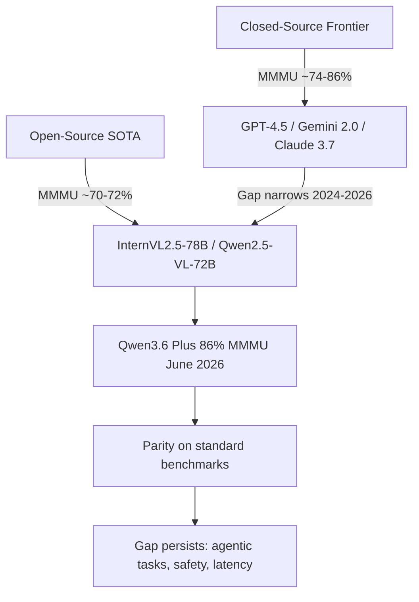

# Multimodal LLMs: State of the Art 2025–2026

> **Last Updated:** June 2026
> **Level:** Research Frontier
> **Related Sections:**
> - [Large Vision-Language Models](../05_multimodal_vision_language/02_large_vision_language_models.md)
> - [VLA & Embodied AI Frontier](./04_vla_embodied_2025_2026.md)
> - [Future Trends](./07_future_trends.md)

---

## Overview

The period from 2024 to 2026 has witnessed a decisive maturation of multimodal large language models (MLLMs), transitioning from add-on vision adapters bolted onto frozen language models toward natively multimodal architectures trained end-to-end across text, image, audio, and video. The competitive frontier is now defined by four axes: (1) perceptual breadth — how many modalities and resolutions a single model handles natively; (2) context length — from 32 K tokens to 1 M+ tokens unlocking hour-long video understanding; (3) reasoning depth — mathematical and scientific problem-solving over visual evidence; and (4) the open/closed gap — the degree to which the open-source community can reproduce closed-model performance.

Closed-source models led strongly through 2024. GPT-4o (May 2024) established a new reference point by unifying text, vision, and audio into a single end-to-end omni-modal decoder, achieving 69.1% on MMMU and significantly outpacing its predecessor GPT-4V. Google's Gemini 1.5 Pro broke ground with a sparse mixture-of-experts architecture that supports up to 1 M tokens of mixed-modality context — enough to ingest and reason over full feature-length films. By early 2025 Gemini 2.0 Flash extended that lineage with 70.7% on MMMU at lower inference cost, while Anthropic's Claude 3.5/3.7 Sonnet vision variants pushed document understanding close to 96% on DocVQA.

The open-source landscape underwent a parallel revolution. InternVL2.5-78B became the first open model to surpass 70% on MMMU (70.1% with chain-of-thought), and Qwen2.5-VL-72B matched or exceeded many closed baselines across MathVista (74.8), MMBench (88.6), and DocVQA (96.4). By mid-2026, the functional gap between leading open and closed models on standard benchmarks has narrowed substantially, though closed models retain advantages on agentic, long-horizon, and safety-sensitive tasks.

---

## Architecture Families

### End-to-End Omni-Modal (GPT-4o, Gemini)

GPT-4o processes text, vision, and audio through a unified decoder-only Transformer trained end-to-end. The architecture avoids separate frozen vision encoders; instead, visual tokens are projected into the same token space as text and jointly attended across all Transformer layers. This enables real-time speech-vision interaction with reported latencies under 300 ms. Details remain proprietary, but the key advance over GPT-4V is the removal of the two-stage pipeline (frozen vision encoder + adapter) in favour of joint pre-training.

Gemini 1.5 Pro uses a sparse Mixture-of-Experts (MoE) Transformer. A learned routing function activates only a subset of expert parameters for each token, keeping per-token FLOPs constant as total parameter count scales. Multi-modal inputs — image frames, audio spectrograms, text — are each encoded by modality-specific front-ends before entering the MoE backbone. The 1 M token context window is achieved through modifications to the attention mechanism (ring attention / linear attention variants) combined with aggressive KV-cache management.

### CLIP-Adapter Pipeline (LLaVA, InstructBLIP)

Earlier paradigms — still highly competitive at smaller scales — attach a lightweight MLP or Q-Former bridge between a frozen CLIP-style vision encoder and a frozen or partially-frozen LLM. The projector translates dense spatial visual features into a sequence of soft visual tokens that the LLM processes alongside text. InternVL2 refines this paradigm with a 6B-parameter vision encoder (InternViT-6B) trained from scratch at high resolution, dramatically reducing the information bottleneck inherent in smaller ViT-L/14 encoders.

### Native Multimodal with Dynamic Resolution (Qwen2-VL, InternVL2.5)

A key 2024–2025 innovation is **dynamic resolution processing**: rather than resizing all images to a fixed 336 × 336 grid, models like Qwen2-VL use a Naive Dynamic Resolution mechanism that tiles images into variable-length patch sequences. Qwen2-VL's **Multimodal Rotary Position Embedding (M-RoPE)** encodes 2-D spatial positions and temporal position for video independently, enabling the same model to handle still images and multi-frame videos with a single unified attention stack. InternVL2.5 combines InternViT-6B (448 px tiles) with dynamic high-resolution mode — up to 4K resolution for document images — by decomposing the image into overlapping tiles.

---

## Benchmark Overview

Key benchmarks used to track frontier progress:

- **MMMU** (Yue et al., 2023): 11.5 K college-level questions spanning 6 disciplines. Requires genuine reasoning over image + text.
- **MathVista** (Lu et al., 2023): 6 141 math-intensive visual QA problems.
- **MMBench** (Liu et al., 2023): ~3 000 structured VQA items across 20 skill dimensions.
- **DocVQA** (Mathew et al., 2021): Document image question answering; tests OCR and layout understanding.
- **RefCOCO/+/g** (Yu et al., 2016): Referring expression comprehension; tests grounding.

```
Benchmark difficulty (approximate human ceiling):
MMMU: ~83%  |  MathVista: ~60%  |  MMBench: ~89%  |  DocVQA: ~98%
```

---

## Closed vs. Open-Source Gap Analysis



The gap on static benchmarks has effectively closed for the largest open models by mid-2026. Qwen3.6 Plus achieves 86% on MMMU, matching or exceeding earlier closed-source results. However, frontier closed models push further on multi-step agentic evaluation, real-world video understanding at 1 M+ tokens, and low-latency deployment — areas where open models still trail.

---

## Model Profiles

### GPT-4o (OpenAI, May 2024)
End-to-end omni-modal Transformer. Native voice, vision, and text with sub-300 ms latency. MMMU: 69.1%. MathVista: 63.8%. DocVQA: ~92.8% (as of early 2025). The "o" suffix denotes true omni training rather than a cascaded pipeline.

### Gemini 1.5 Pro / 2.0 Flash (Google DeepMind, 2024–2025)
Gemini 1.5 Pro: sparse MoE, 1 M token context, near-perfect needle-in-a-haystack recall on long video. MMMU: 65.8%. Gemini 2.0 Flash: lighter, faster successor with MMMU 70.7%, DocVQA 96.4%, strong cost/performance ratio for production use.

### Claude 3.5 / 3.7 Sonnet Vision (Anthropic, 2024–2025)
Strong document and chart understanding. MMMU: 68.3% (Claude 3.5 Sonnet). DocVQA: ~96.1% (Claude Opus 4.6). Emphasis on safety, tool use, and agentic workflows.

### InternVL2 / InternVL2.5 (OpenGVLab, CVPR 2024 Oral → Dec 2024)
Open-source SOTA. InternViT-6B vision encoder + MLP projector + InternLM2 or Llama-3 LLM. Three progressive training stages: contrastive alignment, generative training, supervised fine-tuning. InternVL2.5-78B: MMMU 70.1% (CoT), MMBench-EN 88.3%, RefCOCO val 90.3%.

### Qwen2-VL / Qwen2.5-VL (Alibaba DAMO, Sep 2024 → Feb 2025)
Dynamic resolution + M-RoPE. Qwen2.5-VL-72B: MMMU 70.2%, MathVista 74.8%, MMBench-EN 88.6%, DocVQA 96.4%. Leads open-source leaderboards on document understanding as of early 2025.

### LLaVA-OneVision (Haotian Liu et al., 2024)
LLaVA lineage capstone. Single model handles single-image, multi-image, and video with 0.5B/7B/72B variants. LLaVA-OV-72B achieves competitive results on 47 benchmarks. LLaVA-OV-1.5-8B achieves 76.0% mean accuracy vs 74.2% for Qwen2.5-VL-7B.

---

## Key Papers

| Paper | Authors | Year | Venue | Key Contribution |
|---|---|---|---|---|
| GPT-4V System Card | OpenAI | 2023 | Technical Report | First GPT-4-class model with vision; set new VQA/reasoning baselines |
| Gemini 1.5: Unlocking multimodal understanding across millions of tokens of context | Team Gemini | 2024 | arXiv 2403.05530 | Sparse MoE + 1M-token multimodal context window |
| InternVL: Scaling up Vision Foundation Models and Aligning for Generic Visual-Linguistic Tasks | Chen et al. | 2024 | CVPR (Oral) | InternViT-6B; three-stage training pipeline for open-source VLMs |
| Expanding Performance Boundaries of Open-Source Multimodal Models with Model, Data, and Test-Time Scaling | Chen et al. | 2024 | arXiv 2412.05271 | InternVL2.5; first open model >70% MMMU; test-time scaling for VLMs |
| Qwen2-VL: Enhancing Vision-Language Model's Perception of the World at Any Resolution | Wang et al. | 2024 | arXiv 2409.12191 | Dynamic resolution + M-RoPE; strong grounding and video understanding |
| Qwen2.5-VL Technical Report | Bai et al. | 2025 | arXiv 2502.13923 | 72B model matches closed-source on DocVQA; Qwen2.5-VL series overview |
| LLaVA-OneVision: Easy Visual Task Transfer | Li et al. | 2024 | arXiv | Unified single/multi-image/video model across 47 benchmarks |
| LLaVA-OneVision-1.5 | Li et al. | 2025 | arXiv 2509.23661 | Fully open training framework; 3.5× GPU utilisation via offline parallel packing |

---

## Benchmark Performance

| Model | MMMU (val) | MathVista | MMBench-EN | DocVQA | Notes |
|---|---|---|---|---|---|
| GPT-4o (0513) | 69.1 | 63.8 | ~83 | ~92.8 | Closed; omni-modal |
| GPT-4.5 | 74.4 | not publicly reported | not publicly reported | not publicly reported | Closed; 2025 |
| Gemini 1.5 Pro | 65.8 | not publicly reported | not publicly reported | not publicly reported | 1M token context |
| Gemini 2.0 Flash | 70.7 | not publicly reported | not publicly reported | 96.4 | Cost-efficient closed |
| Claude 3.5 Sonnet | 68.3 | not publicly reported | not publicly reported | ~95+ | Strong document OCR |
| InternVL2.5-78B | 70.1 (CoT) | not publicly reported | 88.3 | not publicly reported | Open-source SOTA Dec 2024 |
| InternVL2.5-8B | ~65 | not publicly reported | 84.6 | not publicly reported | Open; efficient size |
| Qwen2.5-VL-72B | 70.2 | 74.8 | 88.6 | 96.4 | Open-source SOTA Feb 2025 |
| Qwen2.5-VL-7B | ~68 | ~70 | ~85 | 95.7 | Efficient open model |
| LLaVA-OV-1.5-8B | not publicly reported | not publicly reported | 76.0 (mean) | not publicly reported | Fully open training |
| Qwen3.6 Plus | 86.0 | not publicly reported | not publicly reported | not publicly reported | MMMU SOTA June 2026 |

---

## Pros & Cons

| Aspect | Pros | Cons |
|---|---|---|
| Closed models (GPT-4o, Gemini 2.0) | Highest absolute performance; long-context video; real-time omni-modal; enterprise SLAs | No weights; API cost; no fine-tuning control; privacy concerns; opaque architecture |
| Open-source VLMs (InternVL2.5, Qwen2.5-VL) | Full weight access; fine-tunable for domain tasks; reproducible research; on-premise deployment | Slightly behind closed models on long-context/agentic tasks; high VRAM for 70B+ models |
| Dynamic resolution (M-RoPE, tile-based) | Handles arbitrary image sizes; strong OCR on high-res documents | Increased token count; variable inference latency; complex batching |
| Long-context (1M+ token) models | Full-movie QA; multi-document reasoning; longitudinal video | Quadratic attention cost without MoE/ring-attention; large KV cache memory |
| CoT / test-time scaling | Significant accuracy gains on reasoning benchmarks (+3–7 MMMU pts) | Higher latency; increased token consumption; instability on simple tasks |

---

## Open Problems & Research Gaps

1. **Spatial and 3-D reasoning**: Current models excel at 2-D recognition and OCR but struggle with 3-D scene understanding, depth ordering, and physical reasoning. Benchmarks like MMStar and SpatialBench expose consistent weaknesses.

2. **Long-video grounding**: While Gemini 1.5 achieves near-perfect retrieval on synthetic long-video tasks, dense temporal grounding (e.g., localising a 3-second event in a 2-hour video) remains unsolved at high precision.

3. **Compositional instruction following**: Multi-step, clause-heavy instructions that require simultaneous satisfaction of spatial, relational, and semantic constraints remain a systematic failure mode for all current VLMs.

4. **Hallucination in visual QA**: Models frequently confabulate object attributes, relationships, or counts that are not present in the image. POPE and HallusionBench quantify this; mitigation is still an active research area.

5. **Efficient long-context open models**: Open models with 1 M+ token multimodal context are absent as of mid-2026; enabling this without the compute of MoE is an open engineering and research challenge.

6. **Benchmark saturation and overfitting**: Rapid MMMU score inflation (from 65% to 86% in ~2 years) raises concerns about training data contamination and the benchmark's continued discriminative power.

7. **Cross-modal grounding at fine granularity**: Pixel-level grounding (referring segmentation, part-level attributes) tied to natural language remains significantly weaker than coarse bounding-box grounding, especially in open-vocabulary settings.

---

## Further Reading

- [InternVL GitHub & Technical Blog](https://github.com/OpenGVLab/InternVL)
- [Qwen2.5-VL Technical Report — arXiv 2502.13923](https://arxiv.org/abs/2502.13923)
- [Gemini 1.5 Technical Report — arXiv 2403.05530](https://arxiv.org/abs/2403.05530)
- [MMMU Benchmark Leaderboard](https://mmmu-benchmark.github.io/)
- [MathVista Leaderboard — llm-stats.com](https://llm-stats.com/benchmarks/mathvista)
- [LLaVA-OneVision-1.5 — arXiv 2509.23661](https://arxiv.org/abs/2509.23661)
