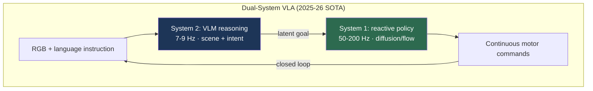

# VLA & Embodied AI: 2025–2026 State of the Art

> **Last Updated:** June 2026
> **Level:** Research Frontier
> **Related Sections:**
> - [VLA Models (foundations)](../06_robotics_and_embodied_ai/01_vla_models.md)
> - [Pros, Cons & Roadmaps](../06_robotics_and_embodied_ai/07_pros_cons_roadmaps.md)
> - [Generalist vs. Specialist](../06_robotics_and_embodied_ai/11_generalist_vs_specialist.md)
> - [Future Trends](./07_future_trends.md)

---

## Overview

Where [VLA Models](../06_robotics_and_embodied_ai/01_vla_models.md) traces the architectural lineage from RT-1 to GR00T N1, this file captures the **deployment-grade state of the art as of mid-2026**—the models that moved from research demos to real-world pilots, the benchmark numbers that define the current frontier, and the capabilities that remain unsolved. The defining shift of 2025 was the maturation of **dual-system architectures** (slow VLM reasoning + fast reactive control) into shipping products, and the arrival of VLAs from frontier-model labs (Google DeepMind's Gemini Robotics) that inherit the full capability of a flagship multimodal LLM.

Three quantitative themes characterize 2025–2026. First, **inference efficiency caught up to capability**: OpenVLA-OFT's 26× speedup (3–5 Hz → ~110 Hz) and π₀'s 50 Hz flow-matching control resolved the latency objection that dogged the first VLA generation. Second, **long-horizon dexterity became measurable**: Gemini Robotics reported 100% success on a 2-minute lunch-box-packing task and 79% average on a dexterous specialist suite. Third, **real-world deployment hours accumulated**: Figure's Helix assisted production of 30,000+ BMW X3s; 1X NEO and Unitree shipped thousands of units, beginning a genuine data flywheel (see [Pros, Cons & Roadmaps](../06_robotics_and_embodied_ai/07_pros_cons_roadmaps.md)).

These results are recent and partly reported via technical reports and company blogs rather than peer-reviewed venues; where appropriate they should be treated as **preliminary / subject to independent replication**.

---

## The Current Frontier Models

### Gemini Robotics (Google DeepMind, 2025)

**Gemini Robotics** [GeminiRobotics2025] (arXiv:2503.20020, March 2025) is the most capable VLA reported to date, built on the **Gemini 2.0** backbone—the first VLA to inherit a full frontier multimodal LLM rather than a smaller specialized VLM. Reported results: it **more than doubles** generalization-benchmark performance versus prior VLAs; specialist variants average **79% success** on a dexterous task suite; and a long-horizon lunch-box packing task (2+ minutes) reaches **100%**. It supports ALOHA 2, bi-arm Franka, and the Apptronik Apollo humanoid. A companion **Gemini Robotics-ER** (Embodied Reasoning) model targets spatial reasoning and achieves **2–3× the success rate** of the Gemini 2.0 baseline for end-to-end control. **Gemini Robotics 1.5** (arXiv:2510.03342, Oct 2025) added advanced embodied reasoning and cross-embodiment motion transfer.

### π₀.5 (Physical Intelligence, 2025)

**π₀.5** [PI2025] (arXiv:2504.16054) extends the flow-matching π₀ (PaliGemma backbone + continuous flow-matching action expert at 50 Hz) to **open-world generalization**—deployment in *novel homes never seen in training*, with improved language conditioning and longer-horizon mobile manipulation (cleaning a kitchen, making a bed). It is the strongest public evidence that VLA generalization is reaching Level 3–4 (environment and task transfer) of the framework in [Pros, Cons & Roadmaps](../06_robotics_and_embodied_ai/07_pros_cons_roadmaps.md).

### GR00T N1 / N1.5 (NVIDIA, 2025)

**GR00T N1** [GR00T2025] (arXiv:2503.14734) is the open-weights humanoid dual-system VLA: an Eagle-2-based VLM (System 2) plus a diffusion-transformer action expert (System 1) running at **120 Hz**, with a full 16-action chunk computed in **63.9 ms on an L40 GPU**. Evaluated on RoboCasa Kitchen (24 tasks), DexMimicGen (9 cross-embodiment tasks), and real Fourier GR-1 hardware. **GR00T N1.5** (mid-2025) broadened training data across bimanual and humanoid embodiments and is distributed via GitHub and Hugging Face.

### Helix (Figure AI, 2025)

**Helix** [Figure2025] is the production dual-system controller for the Figure 02 humanoid: an internet-pretrained VLM (System 2) at **7–9 Hz** feeding latent goals to a **200 Hz** visuomotor policy (System 1) controlling 35 upper-body DoF. Deployed at BMW Spartanburg, it assisted production of **30,000+ X3s** over a 10-month pilot—the most extensive real-world humanoid-VLA deployment publicly documented.

### OpenVLA-OFT (2025)

**OpenVLA-OFT** (Optimized Fine-Tuning) addressed the base OpenVLA's principal weakness—**3–5 Hz autoregressive latency**—via parallel decoding and 8-step action chunking, reaching **109.7 Hz** (0.073 s/chunk, a **26× speedup**) and **97.1% average on LIBERO** (Spatial 97.6 / Object 98.4 / Goal 97.9 / Long 94.5). It remains the leading *open-source* VLA for accessibility and fine-tunability.

---

## Key Papers

| Paper | Authors | Year | Venue | Key Contribution |
|-------|---------|------|-------|-----------------|
| Gemini Robotics | Gemini Robotics Team (DeepMind) | 2025 | arXiv:2503.20020 | Frontier-LLM-backed VLA; 79% specialist, 100% lunch-box |
| Gemini Robotics 1.5 | Gemini Robotics Team | 2025 | arXiv:2510.03342 | Embodied reasoning + motion transfer |
| π₀.5 | Physical Intelligence | 2025 | arXiv:2504.16054 | Open-world generalization to novel homes |
| GR00T N1 | NVIDIA | 2025 | arXiv:2503.14734 | Open dual-system humanoid VLA; 120 Hz System 1 |
| OpenVLA-OFT | Kim, Pertsch, et al. | 2025 | arXiv:2502.19645 | 26× inference speedup; 97.1% LIBERO |

---

## Benchmark Performance

| Model | Benchmark | Metric | Score | Notes |
|-------|-----------|--------|-------|-------|
| Gemini Robotics | Dexterous specialist suite | Avg success | 79% | Preliminary [GeminiRobotics2025] |
| Gemini Robotics | Lunch-box packing (2 min) | Success | 100% | Long-horizon |
| Gemini Robotics-ER | End-to-end control | vs Gemini 2.0 | 2–3× | Embodied reasoning variant |
| OpenVLA-OFT | LIBERO (avg) | Success | 97.1% | Spatial/Object/Goal/Long |
| OpenVLA-OFT | Inference | Control rate | 109.7 Hz | 0.073 s / 8-action chunk |
| GR00T N1 | Inference (L40) | Latency | 63.9 ms / 16 actions | System 1 at 120 Hz |
| π₀ | Real dexterous tasks | Control rate | 50 Hz | Flow-matching, smooth |
| Helix | BMW Spartanburg pilot | Vehicles assisted | 30,000+ X3s | 10-month deployment |

---

## Pros & Cons

| Aspect | Pros | Cons |
|--------|------|------|
| Frontier-LLM VLAs (Gemini Robotics) | Inherit full multimodal reasoning; SOTA generalization | Closed weights; massive compute; replication hard |
| Open dual-system (GR00T N1) | Open weights, humanoid-optimized, fast System 1 | Platform-specific tuning; partial openness |
| Flow-matching (π₀/π₀.5) | Smooth high-frequency dexterity; open-world generalization | Data-hungry; closed for π₀.5 |
| Open-source (OpenVLA-OFT) | Accessible, fine-tunable, now fast | Lower dexterity ceiling than π₀/Gemini |

---

## Open Problems & Research Gaps

- **Level-5 compositional reasoning** (multi-step plans needing world knowledge) is still largely unsolved; reported successes are mostly L1–L4 (see the generalization framework in [Pros, Cons & Roadmaps](../06_robotics_and_embodied_ai/07_pros_cons_roadmaps.md)).
- **Replication of company-reported numbers.** Gemini Robotics, π₀.5, and Helix results come from non-peer-reviewed reports on proprietary hardware; independent replication is scarce.
- **Spatial grounding.** Even SOTA VLAs inherit the spatial-reasoning failures of their VLM backbones (see [Spatial Intelligence](./06_spatial_intelligence.md)).
- **On-device deployment.** Frontier VLAs require server-class GPUs; compressing them to Jetson-Thor budgets without large accuracy loss is open (see [Future Trends](./07_future_trends.md)).
- **Failure recovery and safety.** Long-horizon deployments expose compounding errors; robust recovery and certified safety remain immature.
- **The dexterity–generality trade-off.** No single model yet matches π₀'s dexterity *and* Gemini's broad reasoning—convergence is anticipated but unproven.
- **Evaluation standardization.** The field lacks a common real-world benchmark; LIBERO/RoboCasa are simulation-biased and saturating.

---

## Further Reading

- [Gemini Robotics (arXiv:2503.20020)](https://arxiv.org/abs/2503.20020) — frontier-LLM-backed VLA
- [π₀.5 (arXiv:2504.16054)](https://arxiv.org/abs/2504.16054) — open-world generalization
- [GR00T N1 (arXiv:2503.14734)](https://arxiv.org/abs/2503.14734) — open dual-system humanoid VLA
- [OpenVLA-OFT (arXiv:2502.19645)](https://arxiv.org/abs/2502.19645) — efficient open-source VLA
- [Figure Helix](https://www.figure.ai/news/helix) — production dual-system humanoid control
