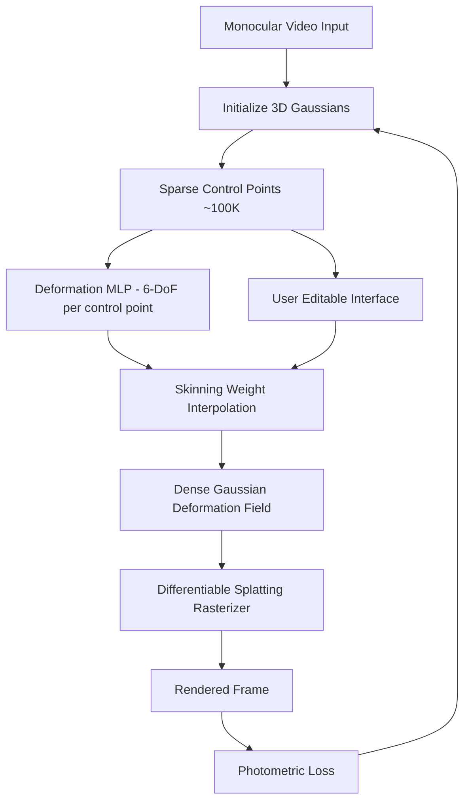

# 4D and Dynamic Scene Reconstruction

> **Last Updated:** June 2026
> **Level:** Research Frontier
> **Related Sections:**
> - [3D Gaussian Splatting](../04_3d_vision_and_scene/02_gaussian_splatting.md)
> - [World Models for Robotics](../06_robotics_and_embodied_ai/02_world_models.md)
> - [Perception for Robotics](../06_robotics_and_embodied_ai/08_perception_for_robotics.md)
> - [Future Trends](./07_future_trends.md)

---

## Overview

Dynamic scene reconstruction — recovering both geometry and motion from video — is one of the central unsolved problems in computer vision. For decades, solutions were either limited to controlled multi-camera capture rigs (e.g., the Technicolor light-stage or professional volumetric video studios) or to rigid scenes where the world can be modeled as a static radiance field. The advent of Neural Radiance Fields (NeRF) for dynamic content [ParkNerfies21, PumarolaD-NeRF21] and its successor, Gaussian Splatting, fundamentally changed the complexity/quality tradeoff, making it possible to reconstruct non-rigid, deformable, and articulated objects from sparse or even monocular video streams.

The "4D" framing unifies the three spatial dimensions with time as a fourth axis, demanding that representations be both spatially continuous and temporally coherent. Two broad families have emerged: (1) **deformation-field methods**, which learn a canonical 3D representation plus a time-conditioned warp field mapping observations into a shared canonical space, and (2) **native 4D representations**, which model all four dimensions jointly, typically via 4D neural voxel grids or 4D Gaussian primitives. The former achieves high fidelity but can struggle with topological changes (e.g., hands separating); the latter handles topology changes more gracefully but requires careful regularization to avoid degenerate solutions.

The connection to robotics and world models is direct and high-stakes: a robot manipulating objects, navigating a crowd, or planning over a dynamic environment must model how the world changes — both from external dynamics and from the robot's own actions [SzegedyWorldModel23]. Differentiable 4D representations that can be queried for future states, edited, or composed with physics simulators represent the natural bridge between passive scene reconstruction and active world modeling. As of 2025–2026, this intersection — neural 4D representations that are physically grounded, real-time capable, and robotics-deployable — is the dominant open frontier.

---

## Background: Dynamic NeRF Lineage

### NeRFies [ParkNerfies21]

**Nerfies: Deformable Neural Radiance Fields** (Park et al., ICCV 2021) introduced the canonical-deformation paradigm. A single NeRF is trained in a canonical coordinate frame; a second network learns a per-timestep SE(3) deformation field mapping observed rays back into canonical space. The method was demonstrated on selfie videos captured with a handheld phone, handling non-rigid face and hair deformations. Key limitation: the deformation field is assumed to be smooth and does not handle large topological changes.

### HyperNeRF [ParkHyperNeRF21]

**HyperNeRF** (Park et al., ACM TOG / SIGGRAPH Asia 2021) extended Nerfies by lifting the canonical NeRF into a higher-dimensional "hyper-space." Each point in 3D is mapped to a higher-dimensional slice; the network learns which slice corresponds to each timestep, allowing representation of topologically varying content (e.g., a mouth opening) that a single 3D manifold cannot represent. This came at the cost of increased memory and slower rendering.

### D-NeRF [PumarolaD-NeRF21]

**D-NeRF: Neural Radiance Fields for Dynamic Scenes** (Pumarola et al., CVPR 2021) independently proposed a two-network architecture — a deformation MLP plus a canonical NeRF — trained entirely from a single moving camera. D-NeRF became the standard benchmark dataset provider for subsequent dynamic methods, offering eight synthetic monocular sequences (jumping jacks, stand-up, hook, etc.) with known ground truth camera poses.

---

## 4D Gaussian Splatting (4D-GS) [Wu2024]

**4D Gaussian Splatting for Real-Time Dynamic Scene Rendering** (Wu et al., CVPR 2024, pp. 20310–20320) is the foundational paper that extended 3D Gaussian Splatting [Kerbl3DGS23] to the temporal domain. The core insight is that instead of applying independent 3D-GS per frame (which is storage-expensive and temporally incoherent), one should maintain a **shared set of 4D Gaussian primitives** whose spatial properties are modulated by a compact temporal encoding.

**Architecture.** The method introduces a joint representation: (1) a set of 3D Gaussians whose base attributes (position, opacity, covariance, color) are stored explicitly, and (2) a 4D neural voxel grid inspired by HexPlane [CaoHexPlane23] that encodes time-varying features. A lightweight MLP reads features from the 4D voxel grid and predicts per-Gaussian deformations (position offset, rotation delta, scale delta) at any query timestamp. Rendering proceeds via the standard differentiable splatting rasterizer, yielding real-time performance.

```
Mathematical formulation:

For Gaussian i at time t:
  μ_i(t) = μ_i^0 + Δμ_i(t)         # position deformation
  R_i(t) = R_i^0 · ΔR_i(t)          # rotation deformation
  s_i(t) = s_i^0 ⊙ Δs_i(t)          # scale deformation

where [Δμ_i(t), ΔR_i(t), Δs_i(t)] = MLP(F_4D(μ_i^0, t))

F_4D encodes joint (x,y,z,t) features via factored planes:
  F_4D(x,y,z,t) = F_XY(x,y) ⊗ F_ZT(z,t) ⊕ F_XT(x,t) ⊗ F_YZ(y,z) ⊕ ...
```

**Training.** Training on D-NeRF sequences takes approximately 8 minutes on a single GPU, and 30 minutes on HyperNeRF sequences. Real-time rendering at 30+ fps is achieved after training.

**Full author list:** Guanjun Wu, Taoran Yi, Jiemin Fang, Lingxi Xie, Xiaopeng Zhang, Wei Wei, Wenyu Liu, Qi Tian, Xinggang Wang.

---

## Deformable 3D Gaussians [Yang2024]

**Deformable 3D Gaussians for High-Fidelity Monocular Dynamic Scene Reconstruction** (Yang et al., CVPR 2024) approaches the same problem with a cleaner deformation-field framing. A canonical 3D-GS scene is maintained; a deformation network — conditioned on time via sinusoidal positional encoding — predicts per-Gaussian offset vectors in position, rotation quaternion, and scale. The canonical scene is initialized from the first frame's SfM reconstruction, providing stable geometry before optimization begins.

Key design choices that distinguish it from 4D-GS include: (1) direct temporal embeddings rather than neural voxel grids, making the model lighter and faster to train on short sequences; (2) an annealing schedule for the deformation loss that encourages rigidity early in training; and (3) an explicit regularization term penalizing implausibly large deformations. On the D-NeRF benchmark, the method reports 39.31 dB PSNR, the highest published result on that dataset as of mid-2025, outperforming prior NeRF-based approaches by a substantial margin.

**Authors:** Ziyi Yang, Xinyu Gao, Wen Zhou, Shaohui Jiao, Yuqing Zhang, Xiaogang Jin.

---

## SC-GS: Sparse-Controlled Gaussian Splatting [Huang2024]

**SC-GS: Sparse-Controlled Gaussian Splatting for Editable Dynamic Scenes** (Huang et al., CVPR 2024, arXiv:2312.14937) addresses a key limitation of per-Gaussian deformation fields: they are dense, high-dimensional, and cannot be easily edited by a human or downstream controller. SC-GS decomposes scene dynamics into a small set of **sparse control points** (~100K) and a large set of **dense Gaussians**. The control points learn compact 6-DoF SE(3) transformation bases that are locally interpolated (via learned skinning weights) to produce the motion field for all Gaussians.

This architecture is motivated by the physical observation that real-world motions tend to be **locally rigid** and **spatially continuous** — the same prior exploited in blend-shape models for human bodies. The learned control-point representation directly exposes an editable, semantically meaningful motion parameterization: a user can grab a control point and drag it to produce plausible novel motions, enabling downstream applications in content editing, re-targeting, and animation synthesis.



**Authors:** Yi-Hua Huang, Yang-Tian Sun, Ziyi Yang, Xiaolong Jia, Xiaolong Wang, and Xiaojuan Qi.

---

## 4D Generation: From Text and Video

Beyond reconstruction from real captured video, a parallel line of work addresses **generative 4D synthesis** — producing plausible dynamic 3D scenes from text prompts or monocular video inputs without any multi-view supervision.

**Make-A-Video3D / Text-to-4D** (Singer et al., 2023) pioneered score distillation from a video diffusion model (Make-A-Video) to optimize a dynamic NeRF, generating short animated 3D scenes from text descriptions.

**4Dynamic** (2024) introduced hybrid priors, combining image diffusion and video diffusion models to achieve more coherent geometry while maintaining temporal consistency.

**4Real** (NeurIPS 2024) discards multi-view generative priors entirely, relying solely on video diffusion models trained on large real-world video corpora to guide dynamic 4D reconstruction. This yields more photorealistic results by grounding generation in natural video statistics.

**PaintScene4D** (December 2024) targets full scene generation rather than single-object animation, producing backgrounds and foreground objects jointly from text prompts.

**Vidu4D / Sync4D** (2024) explore single-video-to-4D pipelines where a generated monocular video from a video diffusion model is "lifted" into dynamic 3D using Gaussian surfels, closing the loop between 2D video generation and 3D reconstruction.

The emerging consensus (2025–2026) is that **video diffusion models are the preferred 4D prior**: they are trained on far more diverse real-world dynamics than any 3D-specific model and naturally encode physics and temporal coherence.

---

## Monocular Dynamic Reconstruction: Challenges and Advances

Monocular reconstruction — a single camera, no depth sensor, no multi-view rig — is the hardest setting and the most practically relevant for robotics and mobile capture. Key challenges include:

1. **Depth-motion ambiguity**: a point moving toward the camera is indistinguishable from a stationary point with changing depth under monocular perspective without additional cues.
2. **Initialization sensitivity**: dynamic Gaussian methods require reasonable initial geometry; poor initialization causes local minima or "floater" artifacts.
3. **Thin and fast-moving objects**: small, fast structures (fingers, hair strands) are under-sampled in video and tend to collapse during optimization.
4. **Long sequences**: most methods assume short clips; temporal drift accumulates over minutes-long captures.

Recent advances (2025) include **Prior-Enhanced Gaussian Splatting** (SIGGRAPH Asia 2025), which injects monocular depth priors from pretrained depth estimators (e.g., Depth Anything V2) and optical flow to constrain the deformation field, achieving measurable gains on the DyCheck dataset. **ProDyG** (2025) introduces progressive reconstruction, building the scene incrementally over time to reduce the initialization bottleneck.

---

## Key Papers

| Paper | Authors | Year | Venue | Key Contribution |
|-------|---------|------|-------|-----------------|
| D-NeRF: Neural Radiance Fields for Dynamic Scenes | Pumarola, Corona, Pons-Moll, Moreno-Noguer | 2021 | CVPR | First canonical-deformation NeRF; introduced D-NeRF benchmark dataset |
| Nerfies: Deformable Neural Radiance Fields | Park, Sinha, Barron, Bouaziz, Goldman, Seitz, Martin-Brualla | 2021 | ICCV | SE(3) deformation field for casual handheld capture |
| HyperNeRF | Park, Sinha, Hedman, Barron, Bouaziz, Goldman, Martin-Brualla, Seitz | 2021 | ACM TOG (SIGGRAPH Asia) | Higher-dimensional NeRF slice for topology-varying scenes |
| 4D Gaussian Splatting for Real-Time Dynamic Scene Rendering [Wu2024] | Wu, Yi, Fang, Xie, Zhang, Wei, Liu, Tian, Wang | 2024 | CVPR | 4D neural voxel + Gaussian deformation; real-time rendering |
| Deformable 3D Gaussians [Yang2024] | Yang, Gao, Zhou, Jiao, Zhang, Jin | 2024 | CVPR | Per-Gaussian deformation MLP; 39.31 dB PSNR on D-NeRF |
| SC-GS: Sparse-Controlled Gaussian Splatting [Huang2024] | Huang, Sun, Yang, Jia, Wang, Qi | 2024 | CVPR | Sparse control points + skinning; supports interactive editing |
| 4Real: Towards Photorealistic 4D Scene Generation [Yang4Real24] | (4Real team) | 2024 | NeurIPS | Video diffusion prior for text-to-4D; no multi-view model needed |
| Prior-Enhanced Gaussian Splatting for Dynamic Scene Reconstruction | (SIGGRAPH Asia team) | 2025 | SIGGRAPH Asia | Depth and flow priors for monocular dynamic GS; gains on DyCheck |

---

## Benchmark Performance

| Model | Dataset | Metric | Score | Notes |
|-------|---------|--------|-------|-------|
| Deformable 3D Gaussians [Yang2024] | D-NeRF (synthetic) | PSNR (dB) | 39.31 | Highest published on D-NeRF as of 2025 |
| 4D-Rotor Gaussian Splatting | D-NeRF (synthetic) | PSNR (dB) | 34.26 | 2024, real-time capable |
| 4D-GS [Wu2024] | Plenoptic Video (multi-view) | PSNR (dB) | 32.01 | 30+ fps real-time rendering |
| SC-GS [Huang2024] | D-NeRF + HyperNeRF | PSNR/SSIM | Not publicly reported as single number | Competitive with 4D-GS; editability is primary gain |
| HyperNeRF | HyperNeRF dataset | PSNR (dB) | ~23–26 (scene-dependent) | Slower than GS methods; handles topology |
| D-NeRF | D-NeRF (synthetic) | PSNR (dB) | ~29–31 | Original baseline; NeRF-based |
| Prior-Enhanced GS | DyCheck (monocular real) | PSNR (dB) | Not publicly reported as final number | Gains over prior monocular DGS systems |

---

## Pros & Cons

| Aspect | Pros | Cons |
|--------|------|------|
| **Gaussian Splatting Representations** | Real-time rendering (30–120 fps); explicit geometry; fast training (minutes vs. hours for NeRF) | Initialization-sensitive; Gaussians can produce floaters in occluded or fast-moving regions |
| **Deformation-Field Methods (canonical space)** | Compact canonical representation; naturally handles object identity over time; supports scene editing | Fails on topological changes (object splitting/merging); deformation network can overfit to training timestamps |
| **Native 4D Representations (joint space-time)** | Handles topology changes; single unified model; no explicit canonical assumption | Larger memory footprint; training harder to converge; temporal regularization critical to avoid overfitting |
| **4D Generation (text/video prior)** | No multi-view capture required; leverages large pre-trained video models; high diversity | Lacks metric accuracy; no ground-truth geometry supervision; prone to temporal inconsistencies |
| **Monocular Reconstruction** | Practical (single camera); applicable to legacy and consumer footage | Severe depth-motion ambiguity; requires depth/flow auxiliary networks for quality results |

---

## Open Problems & Research Gaps

1. **Scalable long-sequence reconstruction.** Current methods assume clips of seconds to tens of seconds. Scene-level reconstruction over minutes or hours of video — where objects appear, disappear, deform, and interact — remains unsolved. Temporal drift in deformation fields is a key bottleneck.

2. **Physics-grounded dynamics.** Learned deformation fields are purely data-driven and do not respect physical constraints (Newton's laws, contact, inertia). Integrating differentiable physics simulators (e.g., MPM, position-based dynamics) with Gaussian primitives is an active area but not yet production-quality.

3. **Open-vocabulary articulation understanding.** SC-GS and similar methods learn motion structure unsupervisedly, but cannot yet map control points to semantic joints (elbow, wrist, hip). Connecting articulated part discovery to language-grounded body models remains open.

4. **4D generation quality and consistency.** Text-to-4D methods produce plausible motion but lack temporal consistency over more than ~2 seconds and often exhibit geometric collapse under camera motion. Achieving video-diffusion-quality dynamic NeRFs with geometric integrity is an unsolved problem.

5. **Efficiency for robotics deployment.** Real-time reconstruction from a single onboard camera with embedded compute (Jetson-class hardware) is not yet demonstrated at meaningful scene complexity. Compression and streaming of dynamic Gaussian scenes for robot perception is largely unexplored.

6. **Interaction and counterfactual modeling.** Robots need not just to observe dynamics but to predict how a scene would change under a novel action. Learning action-conditioned dynamic scene models (i.e., 4D representations conditioned on robot end-effector pose) is at the intersection of this field and world models for embodied AI.

7. **Evaluation benchmarks for real-world dynamic scenes.** The D-NeRF benchmark is synthetic; HyperNeRF and DyCheck are small-scale. Large-scale, diverse, real-world benchmarks with accurate ground-truth geometry and motion — comparable to ScanNet for static scenes — do not yet exist for dynamic scenes.

---

## Further Reading

- [4D Gaussian Splatting project page (Wu et al., CVPR 2024)](https://guanjunwu.github.io/4dgs/)
- [SC-GS repository and paper (CVPR 2024)](https://github.com/CVMI-Lab/SC-GS)
- [Awesome Dynamic NeRF: curated list of dynamic scene papers](https://github.com/pdaicode/awesome-dynamic-NeRF)
- [Text-To-4D Dynamic Scene Generation (Make-A-Video3D)](https://make-a-video3d.github.io/)
- [HyperNeRF: project page and dataset](https://hypernerf.github.io/)
- [4DGaussians GitHub repository (Wu et al.)](https://github.com/hustvl/4DGaussians)
